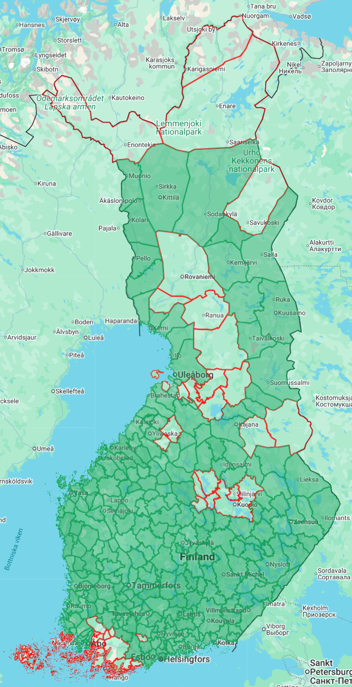

Mitt långsiktiga mål är att tillsammans med Lilla Blue besöka alla kommuner i Finland. Det finns just nu 308 kommuner i Finland, varav 16 i landskapet Åland.

<!--more-->

### Status
_Status den 22. augusti 2026_

Lilla Blue och jag har tillsammans besökt 239 av 308 kommuner i Finland. Så många kommuner har vi besökt för första gången, per år:
* 2023 - 10 kommuner
* 2024 - 43 kommuner
* 2025 - 108 kommuner
* 2026 - 78 kommuner

Vi har besökt alla kommuner i de följande landskapen:
* Österbotten - 14 kommuner (8.8.2024)
* Södra Österbotten - 18 kommuner (13.4.2025)
* Mellersta Österbotten - 8 kommuner (22.6.2025)
* Norra Karelen - 13 kommuner (14.7.2026)
* Södra Karelen - 9 kommuner (14.7.2026)
* Kymmenedalen - 6 kommuner (15.7.2026)
* Södra Savolax - 11 kommuner (16.7.2026)
* Mellersta Finland - 22 kommuner (16.7.2026)
* Satakunda - 16 kommuner (8.8.2026)
* Birkaland - 23 kommuner (20.8.2026)
* Päijänne-Tavastland - 10 kommuner (21.8.2026)
* Egentliga Tavastland - 11 kommuner (22.8.2026)

Vi har besökt minst en kommun i följande landskap:
* Egentliga Finland - 3/27 kommuner
* Kajanaland - 5/8 kommuner
* Lappland - 14/21 kommuner
* Norra Savolax - 13/19 kommuner
* Norra Österbotten - 21/30 kommuner
* Nyland - 22/26 kommuner

Det enda landskap vi inte alls har besökt är:
* Åland - 0/16 kommuner

### Vad räknas som besök?

Här räknas allt! Har vi kört en meter över kommungränsen så bockar vi mer än gärna av den!

Skämt åsido så försöker jag besöka kommunens centrum eller åtmonstone någon betydande stadsdel eller by. Helst vill jag ha något minne från orten i fråga. Sedan 2026 ser jag till att fota minst en kyrka i varje kommun jag besöker. Men tills vidare räknar jag det redan som ett besök fast jag bara kört över kommungränsen längs en kort bit landsväg.

Mina syndabekännelser:
* Riksvägen går i utkanten av Taivalkoski - jag stannade aldrig.
* Riksvägen går i utkanten av Posio - jag stannade aldrig.
* Jag blåste genom hela Uleåborg på motorvägen - jag stannade först i Kempele.
* och säkert flera till

Men jag skall nog försöka besöka dessa kommuner på nytt, vad det lider.

### Kommunsammanslagningar

Det är en tydlig trend att Finlands kommuner slås ihop och blir allt större och allt färre. I skrivandes stund känner jag inte till några kommande sammanslagningar, men säkert är fler på kommande. Att verkligen hinna besöka 308 kommuner blir samtidigt en tävling mot kalendern - hinner vi dit innan kommunen upphör existera?

Som en liten fotnot kan nämnas att kartan ovan visar Pertunmaa som en egen kommun, fast den gick upp i Mäntyharju i början av 2025. Jag har inte hunnit uppdatera mitt (stulna) kartmaterial. Jag hann inte på besök innan Pertunmaa försvann som egen kommun.
