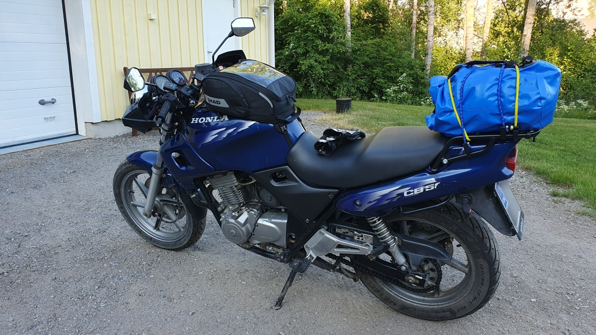
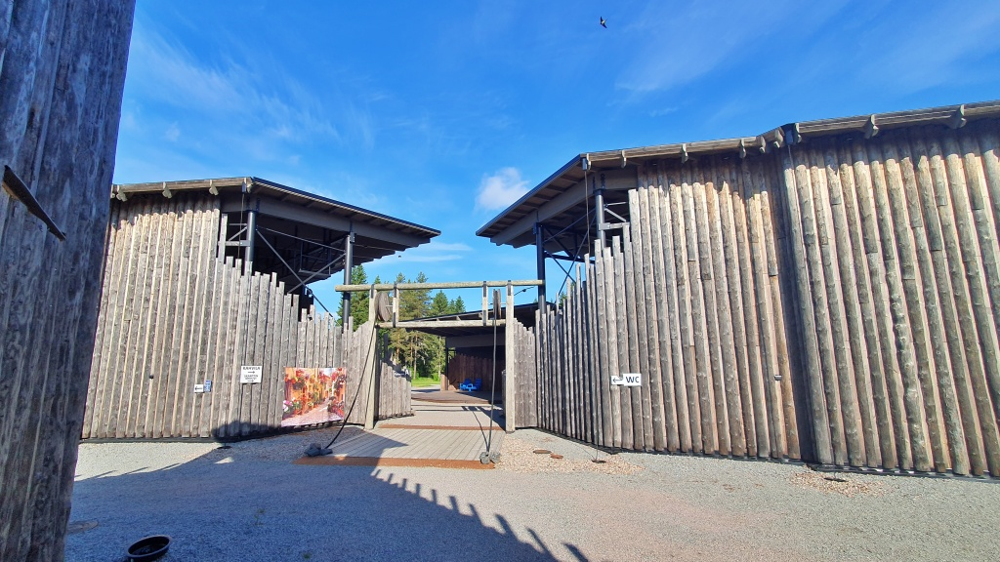
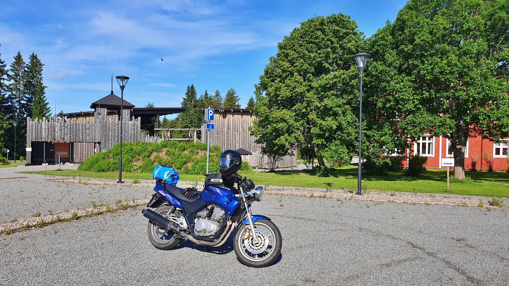
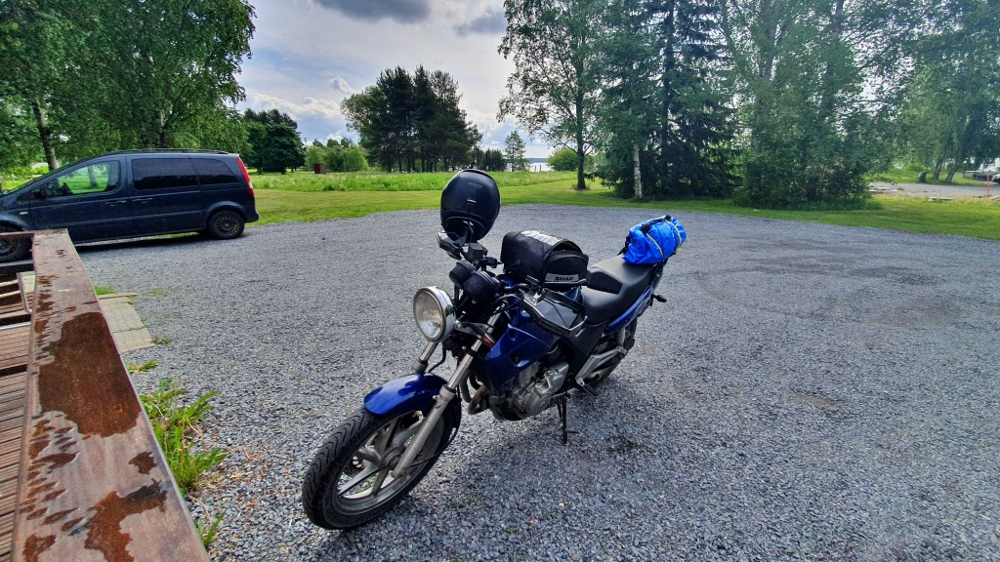
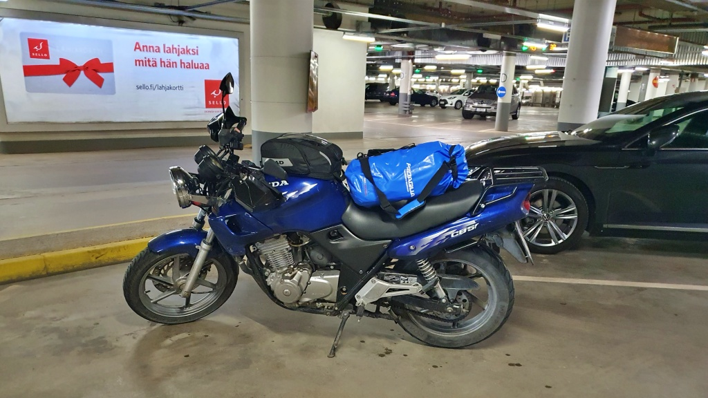
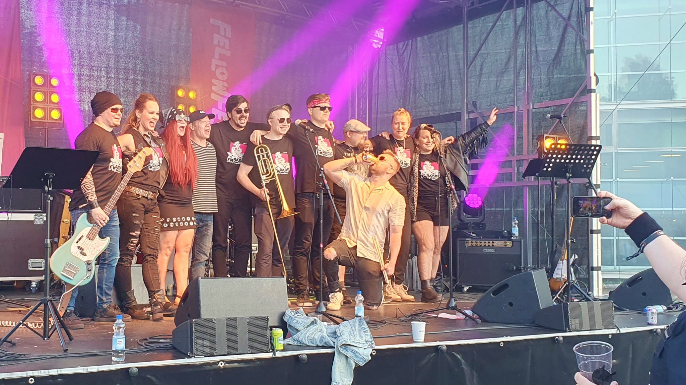
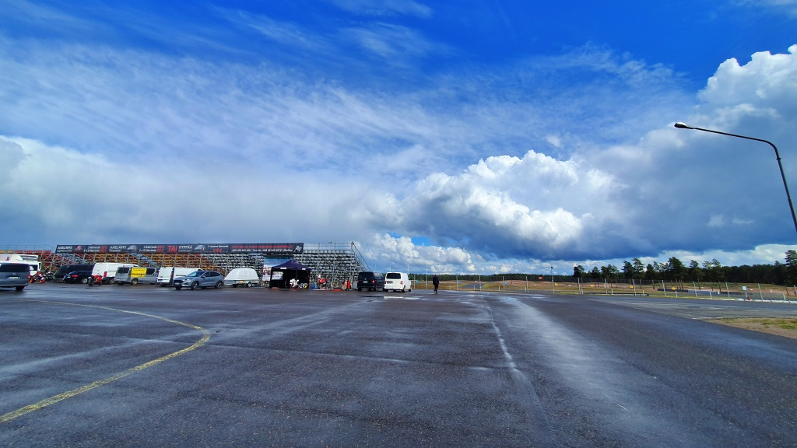
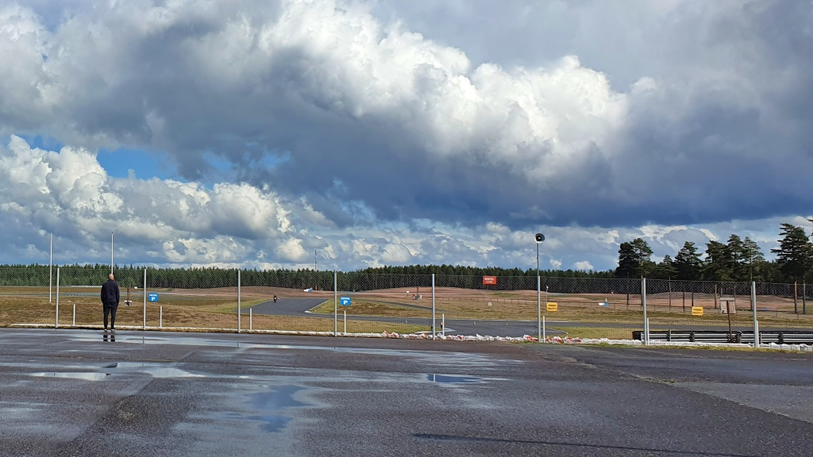
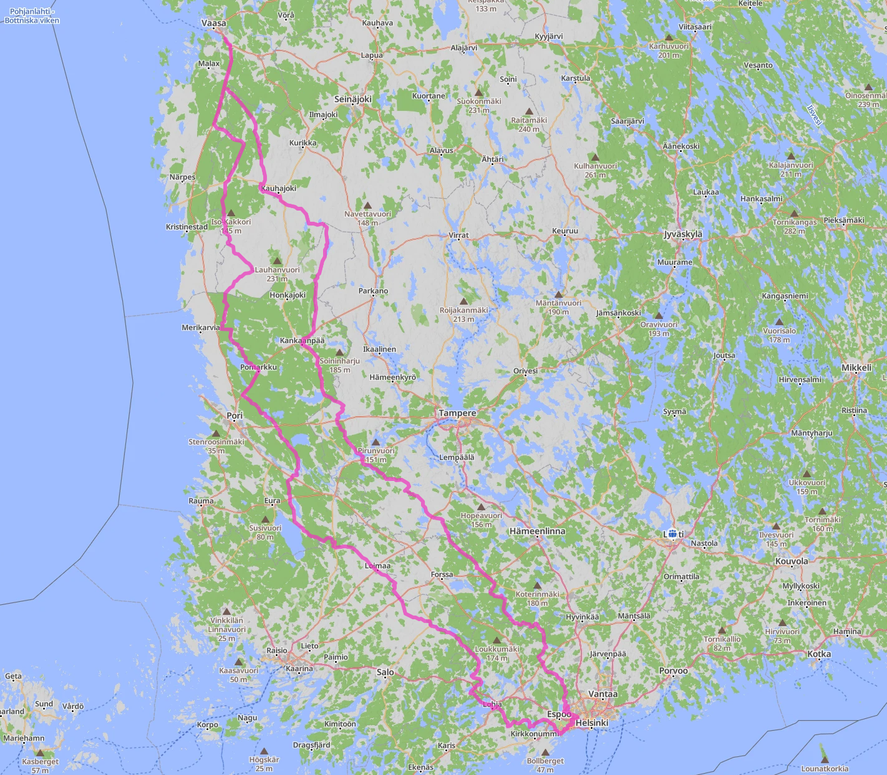

# Första långturen

I skrivande stund är det mer än två år sedan jag gjorde denna resa, men eftersom det var min allra första långa resa på två hjul är den kanske värd att minnas. Min arbetsgivare arrangerade sommarfest i Helsingfors och jag tog tillfället i akt att åka mc ner till huvudstaden. Saken blev aktuell i och med att jag just nu sitter och planerar en liknande resa till ett liknande evenemang i Helsingfors.

<!--more-->

## Dag 1: Österbotten till Esbo och Helsingfors

Jag minns inte exakt hur jag resonerade när jag beslöt mig för att åka mc ner. Även om man åker kortaste vägen är det en resa på cirka 900 km. Före denna resa var den längsta tur jag kört knappt 250 km, alltid med start och mål hemma. Totalt hade jag väl kört ca 2500 km, så lite förtroende för att cykeln skulle hålla ihop hade jag. Det utlovades regn, och det hade jag förberett mig på: regnställ, "vattentäta" stövlar och Gore-Tex-vinterhandskar, som jag också trodde var vattentäta. Jag hade packat mina grejer i en vattentät påse och jag hade ett regnskydd till tankväskan.

Första pausen tog jag vid [kulturcentret Skantz](https://fi.wikipedia.org/wiki/Kulttuurikeskus_Skantz) (fi) i Karvia. Där drack jag termoskaffe och åt smörgåsar. Vid det laget var jag redan ganska kall och kunde konstatera att jag inte hade tillräckligt varma kläder med mig. Tokigt nog hade jag inte vinterfodret i jackan! Man lever och lär.

I Vammala, Sastamala tog jag matpaus vid restaurang Turkin Pippuri. Körningen gick bra, men det var fortfarande lite småkallt. Vattenpölarna visade att det hade regnat tidigare på dagen, men tills vidare var det uppehåll.

Jag körde vidare längs vägar jag aldrig tidigare färdats på, genom södra Birkaland och genom Egentliga Tavastland. När jag sedan kom till norra Nyland, kanske i Nurmijärvi, började det regna. Eftersom jag var lite frusen välkomnade jag tillfället att ta på mig regnkläderna för att kanske få det lite varmare. Och det hjälpte nog, jag slutade frysa. Däremot fick jag ett annat problem. Jag navigerade med hjälp av telefonen, och telefonen hade jag under den genomskinliga plastfickan på tankväskan. Det var lite krångligt att följa kartan på det sättet, men det gick. Men när regnet kom satte jag på regnskyddet på tankväskan, som genast immade igen. Jag såg nu ingenting av telefonens skärm.

Kaxigt tänkte jag att det här inte var något stort problem, jag har ju bott i Nyland... Det visade sig vara lättare sagt än gjort att navigera rätt längs småvägarna i Nurmijärvi och norra Esbo, och inte heller bjöd minnet på alla de detaljer om omgivningarna jag skulle ha behövt. Det tog några felkörningar och återvändsgränder innan jag hittade till kända platser. Till slut kom jag i varje fall fram till hotellet, beläget vid [Sello köpcenter](https://sv.wikipedia.org/wiki/Sello) i Alberga i Esbo.

Mina så kallade vattentäta handskar var väl lite fuktiga, men annars var jag rätt torr. Inte hade resan slitit så mycket på orken i övrigt heller. Så efter incheckning och ett snabbt klädbyte på hotellrummet tog jag och några arbetskamrater kollektivtrafiken till festplatsen i Helsingfors. Sedan var det party natten lång. Fast om jag minns rätt tog jag det rätt lugnt.

## Dag 2: hemåt igen

När jag startade hemåt igen var det ihållande regn. För det mesta ganska lätt regn, men i varje fall ihållande. Jag körde först genom mellersta och södra Esbo via platser som förut varit bekanta, där jag bott eller jobbat och där vänner har bott. Väldigt mycket har förändrats sedan jag senast rörde mig i dessa områden för 13 år sedan. Nya vägar och broar har byggts, gamla vägar har ändrats, hela stadsdelar har uppstått där det förut bara var skog eller åker. Visst kunde jag orientera mig på ett ungefär, men jag var faktiskt lite vilse på något ställe.

När sightseeingen var avklarad började jag söka mig bort från huvudstaden, hela tiden längs mindre vägar. Med regnskyddet på tankväskan hade jag fortfarande problem att följa navigatorns anvisningar, så jag var nog tvungen att stanna både en och annan gång. I Lojo var jag tvungen att söka skydd från ett skyfall under något slags privat garage intill vägen. När skyfallet var över tankade jag och åkte vidare i riktning mot Somero. Regnet började småningom lätta och någonstans i gränstrakterna mellan Nyland och Egentliga Finland upphörde det slutligen. Vid det här laget var jag ordentligt våt om händer och fötter. De "vattentäta" stövlarna var inte vattentäta. Gore-Tex-handskarna var definitivt inte vattentäta. Och det var ganska kallt. Jag behöll regnkläderna på hela vägen hem för att hålla kvar lite varm luft kring kroppen.

Vid [motorbanan i Alastaro](https://fi.wikipedia.org/wiki/Alastaron_moottorirata) (fi) tog jag en kort kaffepaus på caféet. Trots vattenpölarna och trots de tunga molnen var det hela tiden motorcyklar ute på banan. Det är ju på sätt och vis lite tröstande - kan de så kan väl jag.

Jag tankade i Säkylä och fortsatte sedan hemåt via Kumo (Kokemäki), Norrmark (Noormarkku), Påmark (Pomarkku), Siikais (Siikainen), Storå (Isojoki) och Östermark (Teuva). Ända till Pörtom undvek jag stora vägen. Jag var till och med tvungen att åka en kort bit grusväg mellan Siikais och Storå. Vägarna hade vid det här laget torkat upp, men det var fortfarande småkallt. Vad jag minns stannade jag inte en enda gång på vägen.

## Lärdomar

Varje resa ger nya lärdomar, små och stora. Några saker som jag minns att jag tog med mig från min första långresa:

* Det blir kallt när man sitter länge på hojen, så man skall klä sig tjockare än man kanske tror att man behöver.
* Mc-stövlar är inte vattentäta om det regnar i timtal.
* Handskar, Gore-Tex eller inte, är definitivt inte vattentäta om det regnar i timtal. I och för sig hade jag handvärmarna på, vilket försämrar fukttåligheten, men jag har också vid senare tillfällen konstaterat att de ändå blir våta när det regnar tillräckligt mycket.
* Däremot hölls kroppen i övrigt i stort sett torr, tack vare regnstället.
* Det är tungt att köra med mitt regnställ, som fladdrar i vinden och orsakar mera luftmotstånd. Under denna resa hade jag ännu inte någon vindruta.
* Trots regnet var jag förvånansvärt pigg när jag kom fram. Det verkar gå bra att åka rätt långa sträckor på Lilla Blue.
* Telefonnavigering kräver nog att man ser telefonen. Jag beslutade att skaffa en telefonhållare.

På det hela taget gick resan väldigt bra. Inga stora problem, bara några lärdomar om hur man klär sig. Hojen höll, även om jag tror att det var något strul med en blinkers (redan då).

Jag använde mobilappen [Kurviger](https://kurviger.com) för första gången och blev förtjust i upplägget att planera resan i detalj på förhand. Numera ser jag planeringen som en intressant del av resan. Jag försöker hitta alla intressanta besöksmål längs färdvägen, väljer de mest relevanta (de som tidsbudgeten medger) och optimerar rutten. Ofta gör jag flera versioner av rutten innan jag väljer den slutgiltiga.

## Resrutten

Det blev en resa på totalt 1021 kilometer, fördelat på två dagar. Ett ganska stort steg från att jag dittills hållit mig inom en radie på 100 km hemifrån. Men det gick ju bra.

Jag bestämde mig för att ta mig an [Finland/308](../../finland308/)-projektet först året därpå, men då räknade jag ju med alla kommuner jag redan hade besökt. Mitt långsiktiga mål är alltså att köra min mc Lilla Blue genom alla Finlands 308 kommuner. I år (2026) har jag lagt till ytterligare kriterier för besöket: jag skall försöka köra genom centrum (eller åtminstone ett delcentrum) av kommunen eller staden, och jag skall fota en kyrka eller liknande i varje kommun jag besöker. Det gjorde jag ju inte på denna resa, så jag får väl lov att besöka dessa ställen igen vad det lider. Många har jag redan besökt på nytt, men en del inte. Orterna längs rutten från Tavastehus till Esbo till Oripää har jag inte återbesökt, medan jag senare nog åkt genom centrum på alla de andra. Också de som jag bara kört genom i utkanten är i varje fall med på listan över besökta kommuner tills vidare.

Denna resa gick genom 29 nya kommuner. 

Dag 1:
* Kauhajoki
* Karvia
* Kankaanpää
* Björneborg (körde genom Lavia och senare genom Norrmark på hemresan)
* Sastamala
* Urdiala (Urjala)
* Forssa (körde bara längs väg 283)
* Tammela (körde bara längs väg 283)
* Tavastehus (en riktigt kort bit längs väg 54)
* Loppis (genom byarna Räyskylä och Läyliäinen)
* Vichtis (en kort bit längs väg 132)
* Nurmijärvi (längs småvägar)
* Esbo

Dag 2:
* Kyrkslätt (norra delarna, bl.a. byn Evitskog)
* Sjundeå
* Lojo
* Somero
* Ypäjä (körde bara längs väg 213)
* Loimaa
* Oripää (längs väg 213 genom en slags exklav mellan Loimaa och Säkylä)
* Säkylä
* Kumo (Kokemäki)
* Ulvsby (Ulvila; åkte genom Kulla och Palus byar)
* Påmark (Pomarkku)
* Siikais (Siikainen; åkte inte in till kyrkbyn)
* Sastmola (Merikarvia; bara längs småvägar i utkanten)
* Storå (Isojoki)
* Kristinestad (åkte bara en kort bit i östra Dagsmark)
* Bötom (Karijoki)

