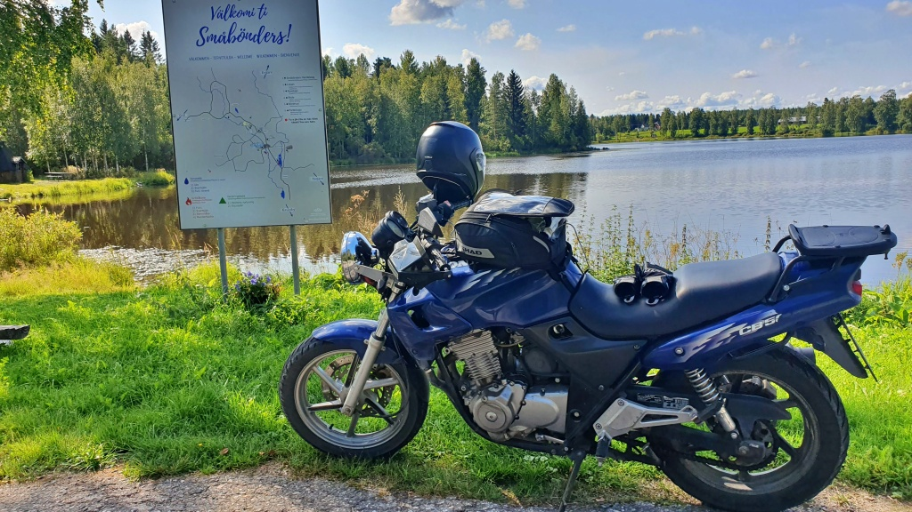
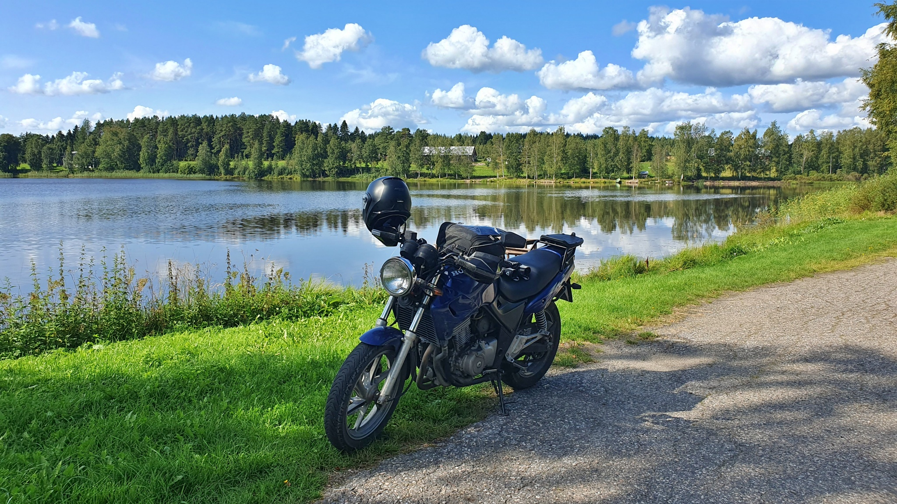

# Första gången genom Småbönders

Från arkivet: ett par foton från en av mina första längre turer.

<!--more-->

Egentligen blev det en rätt lång dagstur via Laihela - Kauhava - Kortesjärvi - Evijärvi - Ena - Småbönders - Vetil - Kaustby - Terjärv - Kållby - Bennäs - Sundby - Nykarleby - Munsala - Hirvlax - Kantlax - Kimo - Röukas - Kalapää - Vörå - Lillkyro. Totalt 431 km. Dessutom stannade jag några timmar för ett födelsedagskalas längs vägen. Tyvärr tog jag bara ett par foton.

### Småbönders

Det var första gången jag körde genom den här byn. Den till största delen svenskspråkiga byn [Småbönders](https://sv.wikipedia.org/wiki/Sm%C3%A5b%C3%B6nders) i Kronoby sticker ut ganska långt österut mellan de helt finskspråkiga kommunerna Evijärvi, Vetil och Kaustby. Det känns på något sätt som den avlägsnaste punkten i svenska Österbotten – kanske tillsammans med Sideby i söder. Småbönders är åtminstone den svenskspråkiga by som ligger allra längst från kusten.

### Vörå

Från Röukas träsk till Kalapää träsk i Vörå finns egentligen inga allmänna vägar. Det blev en del skogsvägar med förbudsskyltar. Men när man har planerat rutten på förhand och plötsligt kommer till en förbudsskylt som skulle innebära en omväg på 30–40 minuter känns det lite onödigt. Den här gången körde jag rakt igenom, men till nästa gång vet jag att det är förbjudet. Jag ber om ursäkt till alla som tog illa vid sig – jag mötte absolut ingen längs vägen.

### Nya kommuner

Under denna tur besökte Lilla Blue och jag för första gången tillsammans kommunerna Lappo, Evijärvi och Vetil. Det var egentligen innan projektet [Finland/308](/finland308/) hade startat (Lilla Blue och jag skall försöka besöka alla Finlands kommuner), men eftersom vi har varit där så räknar vi med besöken.
