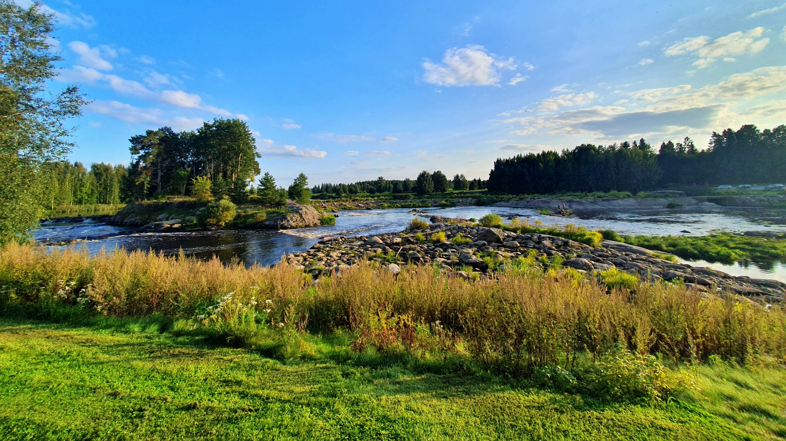
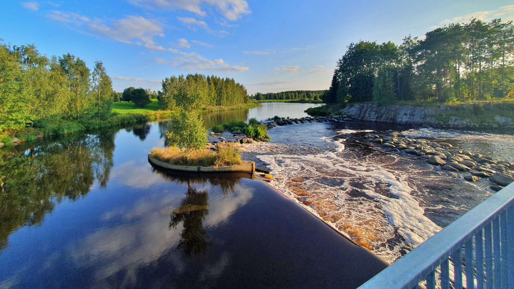
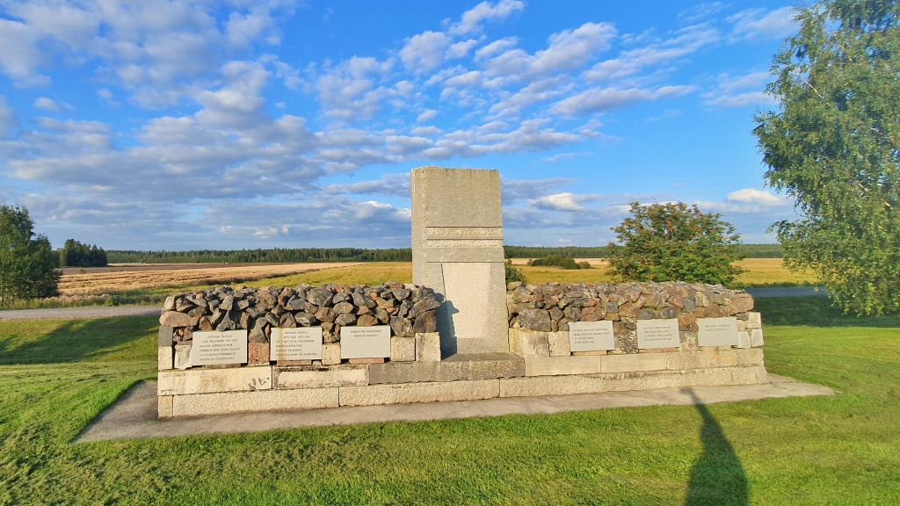
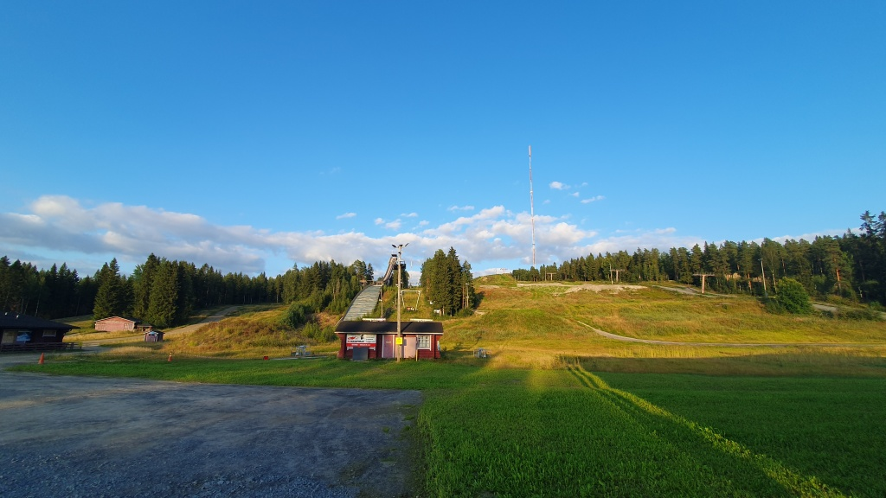
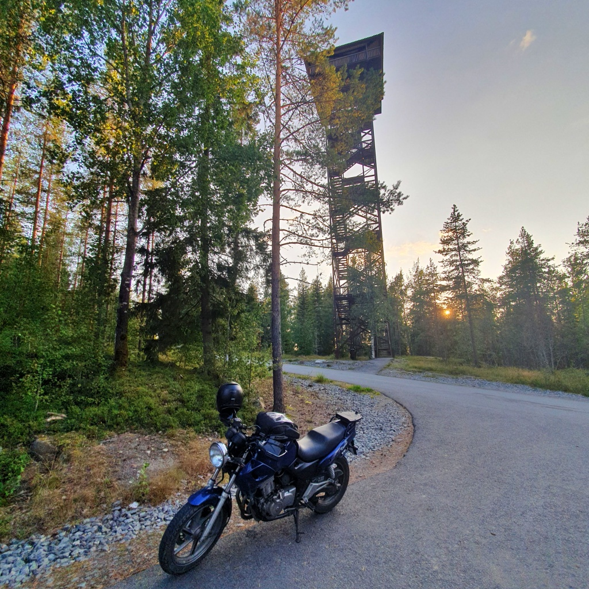
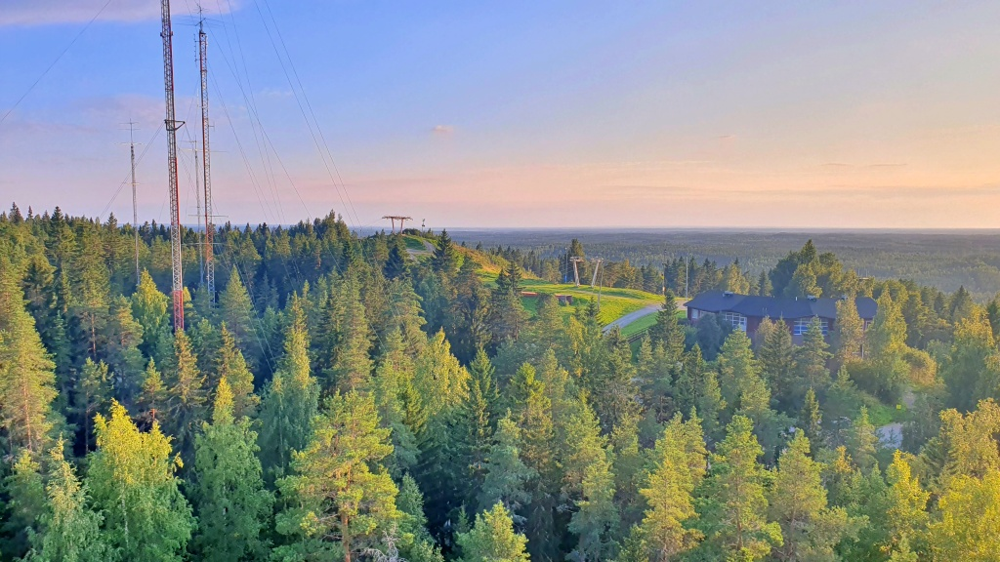
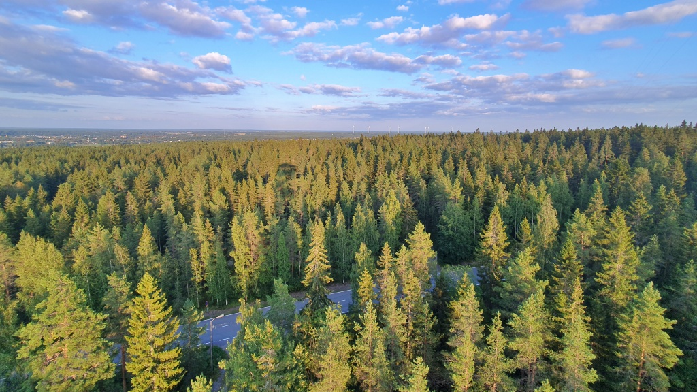
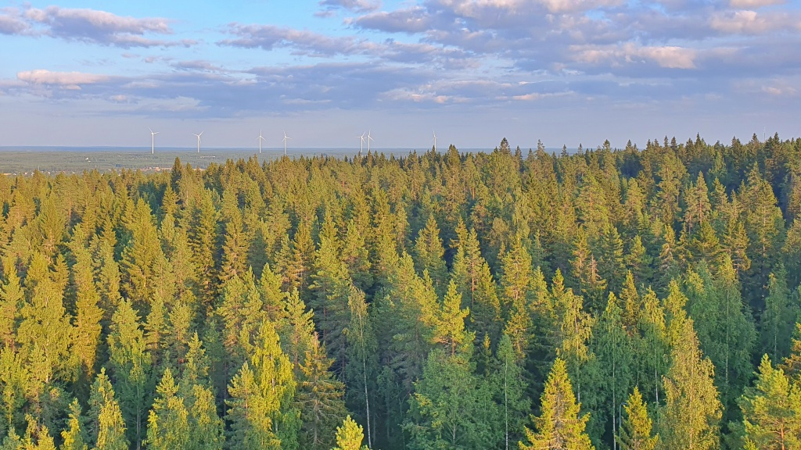

# Malkakoski och Simpsiö

Från arkivet: några foton från en tur till Malkakoski och Simpsiö.

<!--more-->

### Malkakoski

Malkakoski i Ylistaro (Seinäjoki) lär vara Finlands största konstgjorda fors. Ett mecka för kanotister. Den anlades för att motverka översvämningar. Dammen kan höjas och sänkas för att reglera vattenflödet.

### Simpsiö

Simpsiö i Lappo erbjuder Södra Österbottens längsta skidbackar.

Utsiktstornet uppe på Simpsiöberget ger en fin utsikt över omgivningarna. Utsiktsplattformen ligger omkring 100 m över de omgivande slätterna. Enligt mina anteckningar från utfärden märktes det tydligt att tornet svajade, trots den ganska svaga vinden.

Anteckningarna berättar att det var en skön kvällstur på 205 km, via Jurva - Ilmajoki - Malkakoski - Simpsiö - Ylistaro - Laihela.
