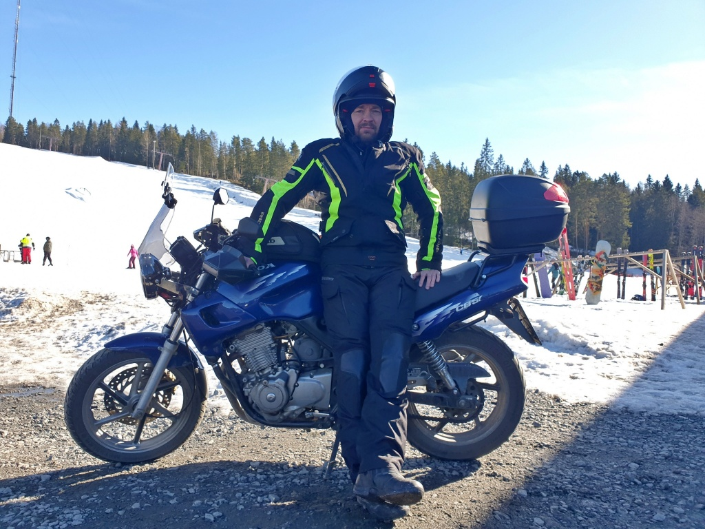
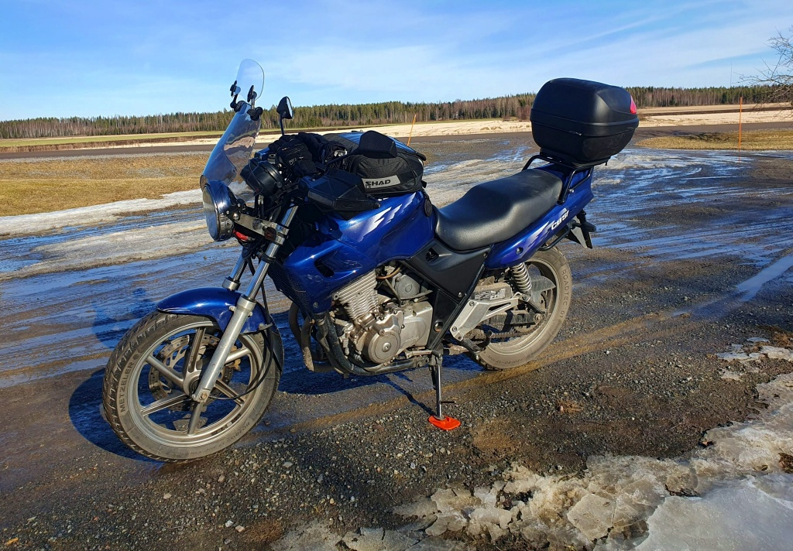
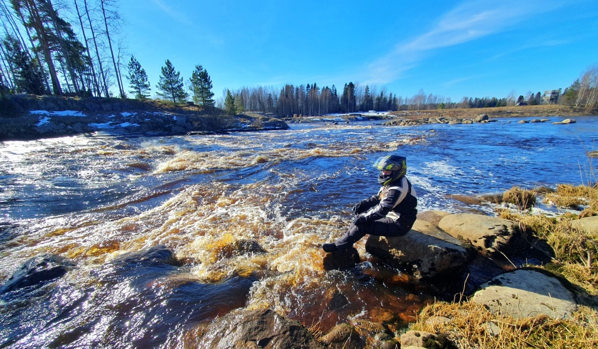

+++
title = 'Säsongens första tur'
date = '2025-03-22'
featured_image = 'simpsio.jpg'
+++

# Med hojen till slalombacken

Dags för årets första tur med Lilla Blue. Egentligen inte den allra första, en liten provtur hade jag hunnit med tidigare. Oberoende, det känns alldeles vansinnigt tidigt att börja åka hoj i mitten av mars, men vad gör man när solen skiner och de större vägarna redan är torra? Med på resan på bönpallen sitter min dotter. Hon lider också av lite motorcykel-feber, men som femtonåring får man ännu inte köra själv.

<!--more-->

Nytt för dagen var en liten extra spoiler på vindrutan – för trots solskenet blir det nog snabbt kallt av fartvinden så länge temperaturen är under +10. Spoilerns viktigaste uppgift är att minska lite på turbulensen kring hjälmen och således minska oljudet. Jag tyckte nog att det gjorde situationen lite bättre, om än inte en jättestor förbättring.

Färden gick på norra sidan av Kyro älv från Golkas till Ylistaro – min favorit-sträcka för en kortare tur. Från Ylistaro åkte vi stora vägen mot Lappo och sedan svängde vi av mot Simpsiö. Vi stannade och tog en kaffe vid [Simpsiö skidcenter](https://www.simpsio.com/sv/). Den nya restaurangen nedanför skidbacken är fräsch! Och så passade vi på att ta lite bilder. Lite knasigt med motorcykeln framför alla ivriga utförsåkare i backen. Jag bytte några ord med en mc-åkare emeritus som tyckte vi är modiga/tokiga som är ute på två hjul vid denna tid på året.

Efter fikapausen åkte vi vidare längs den asfalterade vägen i riktning mot Kyro älv och Malkamäki. Trots att det var eftermiddag och över +5 grader, verkade det finnas aningen av is kvar på vägytan, så det blev att ta det lugnt.

Vi stannade vid [Malkakoski](https://retkeilelakeuksilla.fi/retkikohteet/seinajoki/malkakoski/), Kyro älv, och beundrade smältvattnets brusande färd mot havet. Älven är inte isfri ännu, men i forsarna är det full fart. Naturens kraft är imponerande – trots att själva forsen är konstgjord.

Sedan bar det av hemåt. Först till Ylistaro längs asfalterade vägar och sedan längs södra sidan av Kyro älv denna gång. Vi undvek stora vägen och försökte följa älven så nära som möjligt. Måste dock säga att Alapääntie/Vainionraitti från Ylistaro till Valtaala var rätt risig. Med jämna mellanrum finns rejäla gupp i asfalten. Inte roligt om man är två på Lilla Blue. Vi åkte också genom Storkyro centrum och förbi gamla kyrkan. Sedan en bit på stora vägen innan vi svängde av mot Lillkyro. Sist och slutligen via Toby och hemåt.

Totalt blev det 180 km. Trots att temperaturen var kring +5 fick jag inte särskilt kallt. Dottern hade rätt tunna handskar och frös lite om händerna, men i övrigt gick det fint. 
