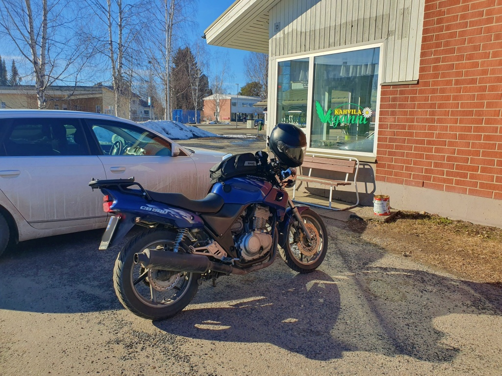
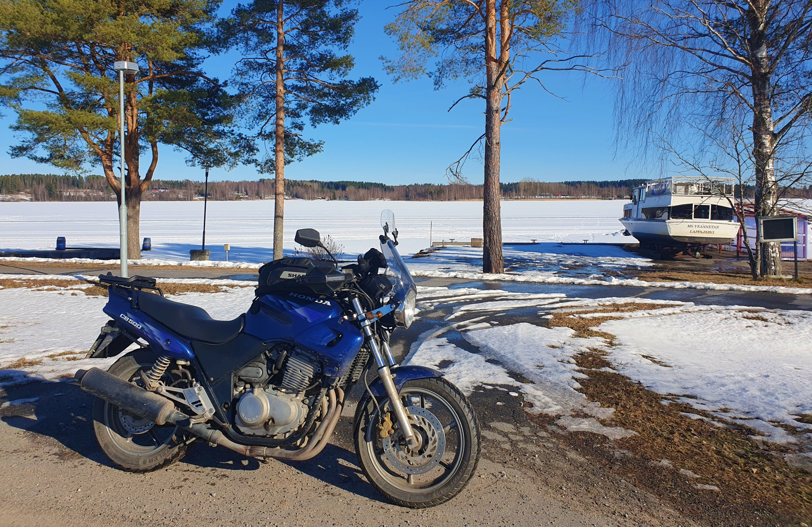

# Ett isigt äventyr

Efter gårdagens lyckade premiär var det dags för en lite längre tur.  Denna söndag i Mars sken solen och temperaturen närmade sig redan +10 när jag gav mig av lite före kl. 12. De stora vägarna var helt torra och jag tänkte mig att alla asfalterade vägar nog är bara vid det här laget. Inte riktigt helt så, skulle det visa sig. Det här skulle komma att bli ett betydligt isigare äventyr än vad jag hade tänkt mig.

<!--more-->

Först åkte jag till Tervajoki med planen att åter följa Kyro älvs norra strand. Väl borta från stora vägen märkte jag snabbt att nattens frost ännu inte släppt helt utan hade lämnat ett tunnt lager is på asfalten. Så det blev att ta nästa möjliga bro över älven och sedan följa stora vägen mot Lappo. Visserligen innehåll resplanen flera vägar av motsvarande storlek, men jag tänkte att med lufttemperatur på över +10 måste det ju isen snart vara bortsmält.

Jag åkte genom Lappo centrum för att sedan ta väg 6991 mot Kuortane. Redan här gjorde jag mitt första lilla orienteringsfel och missade ett avtag. Jag försökte följa telefonens navigator-app genom det genomskinliga locket på tankväskan. Visserligen visade nog telefonen rätt, men aningen smått och utan röstnavigering glömde jag helt enkelt att titta. Ingen fara, en snabb U-sväng och saken var fixad. Vägen mot Kuortane var sedan helt snö- och isfri, bara att blåsa på.

Nästa navigerismiss gjorde jag i vägkorsningen i Vasunmäki. Jag följde skyltarna mot Kuortane och svängde vänster. Istället hade jag planerat att svänga höger och runda Kuortane-sjön på södra sidan. Denna gång gjorde jag ingen U-sväng, den missade vägstumpen får jag utforska en annan gång. Jag kurvade i varje fall i via Kuortane centrum och körde också via idrottsinstitutet - imponerande anläggningar på en liten ort!

Därefter styrde jag mot Alajärvi och här började resan bli spännande. Först svängde jag in på väg 711 i riktning mot Lappajärvi och direkt efter på den betydlig mindre Haarajärventie (väg 17519). Vägen börjar med en ganska brant uppförsbacke - som var nästan helt istäckt. Bara två djupa hjulspår blottade lite blöt asfalt. Kanske vägen ligger i skuggan, tänkte jag, med förhoppningen att resten av vägen skulle vara isfri. Försiktigt tog jag mig uppför backen, bara för att upptäcka att istäcket fortsatte. Tydligen hade vägen plogats dåligt under vintern så det hade bildats ett tjockt, tillpackat lager is. Det visade sig att hela denna väg fram till Saukonkylä hade samma väglag. På öppnare platsen var halva vägen bar men ställvis fanns bara två smala hjuspår genom den nära 10 cm tjocka, mer eller mindre hårda isen, kryddat med lite halvsmält issörja ovanpå. En förnuftig mänska skulle ha vänt i första backen. Jag åkte 18 km och hoppades att det snart skulle bli bättre... Turligt nog var trafiken mycket gles. Jag körde åt sidan och släppte förbi en bil och jag mötte två bilar, båda två på avsnitt med tillräckligt med bar väg för att inte tvingas upp på iskanten. Sakta gick det, men till sist kom jag helskinnad ut till bar och i det närmaste torr asfalt på andra sidan.

Jag åkte vidare genom Alajärvi och sedan vidare mot Vindala. Nu höll jag mig till lite större vägar, ett tag, väglaget var utmärkt med torr asfalt och dagstemparaturen var nu över +10. I Vindala centrum visade en termometer +14, men det torde nog ha varit något av en glädjemätare. I Vindala tog jag välförtjänt fikapaus på café Veganni.

 Med lite kaffe i blodet återvände modet och nu var det återigen dags för mera småvägar. Först genom Rantakylä och sedan Itäkylä. I Itäkylä på vägen Ammesmäentie kom jag till en utförsbacke som mestadels är i skuggan av höga träd - och denna backe var åter täckt av is. Denna gång fanns inte ens hjulspår till asfalten, så det var bara åka och hoppas på det bästa. Isen var i varje fall rätt mjuk, så den gav ett viss fäste, samtidigt som den var tillräckligt hård för att inte mosas under däcken. Fint gick det även denna gång.

Sedan ut på stora vägen igen i riktning mot Lappajärvi. Först åkte jag ut till Kivitippu resort och beudrade den islagda sjön. Känslan är lite samma som i till exempel Vuokatti. Landskapet är kuperat och mestadels skogbeklätt, en hel del mänskor i rörelse, och folk som skidar på isen. Kontrasten mellan motorcykel och isbelagd sjö är också rätt häftig. Efter en kort fotosession fortsatte jag in till Lappajärvi centrum och förbi kyrkan.

Sedan fick jag för mig, säkert eftersom föret varit så bra hittills, att köra en sväng längs småvägarna på Kärnäsaari, rakt söder om Lappajärvi kyrkbyn. Vägen blev smalare och smalare och samtigt blötare, som tecken på att isen smält bort för inte alltför länge sedan. Och här längs vägen Kärnänlenkki kom så en uppförsbacke och en brant kurva, vaktad av höga furor på båda sidor. Här var vägen naturligtvis helt istäckt, med 10 cm djupa hjulspår som inte nådde asfalten. Isen var fast men våt, rejält hal och samtidigt ojämn. Ett möte skulle ha varit omöjligt och i själva verket är det inte heller säkert att en eventuellt mötande bil skulle lyckas stanna på detta underlag. Medan jag stod nedanför backen och velade tittade jag också på vägdikena - om hojen landade där skulle det vara näst intill omöjligt att hala upp den på vägen igen utan hjälp. Så här var det nog bara att försiktigt köra med båda fötterna i backen och hoppas på det bästa. Däckena åkte nere i de djupa hjulspåren, medan stövlarna skurrade på det omgivande istäcket, så jag hade bra kraft att korrigera med benen vid behov. Som tur var kom ingen emot och jag lyckades hålla momentum och att hålla hojen upprätt på den ca. 250 meter stöcka som var istäckt. Men kanske inte med alltför stor marginal.

Nu fick det vara nog med is, från och med nu tänkte jag undvika riktigt små vägar. Från Lappajärvi fortsatte jag till Kauhava, sedan Ylihärmä och mot Vörå. Här någonstans stängde mina värmehandtag av sig och vägrade värma mer. Det visade sig senare att den röda lampan betyder att batteriets spänning är för låg. Det blev lite kallt om fingrarna på hemvägen. Från Vörå åkte jag till Lillkyro, sedan längs älvens norra strand till Golkas. Vid det här laget var vägarna helt torra. Sedan till ABC för tankning och så hem.

Dagens tur blev 354 km. Den tog betydligt längre än planerat på grund av det ställvis utmanande föret. Jag hann i varje fall hem innan skymning. Det blev lite kallt på slutet, dels p.g.a strulet med värmehandtagen men dels för att solen började försvinna bakom träden. Det blev nog lite mera äventyr än planerat och kanske lite mera risk än vad man borde ha när man åker hoj. Denna gång kände jag mig tacksam att komma hem helskinnad.

## Nya kommuner

Mitt långsiktiga mål är att ta min mc Lilla Blue till alla Finlands kommuner. Under denna resa tillkom dessa nya kommuner:
* Kuortane
* Alajärvi
* Vindala
* Lappajärvi

Nu har Lilla Blue rullat genom 57 av Finlands 308 kommuner.
