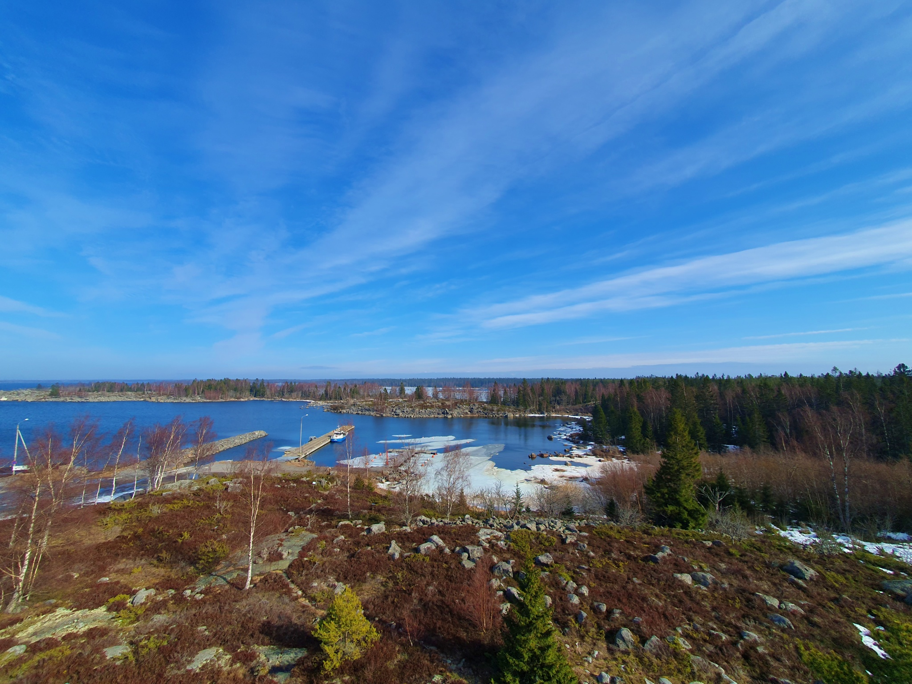
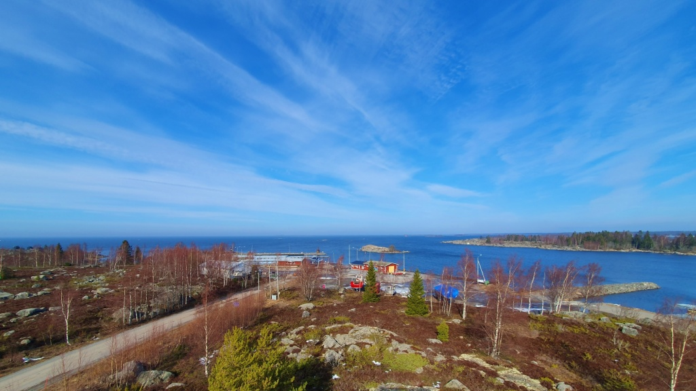
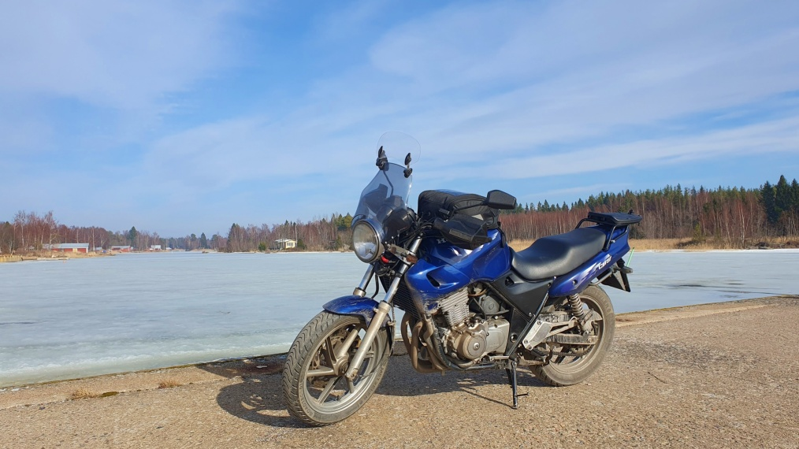
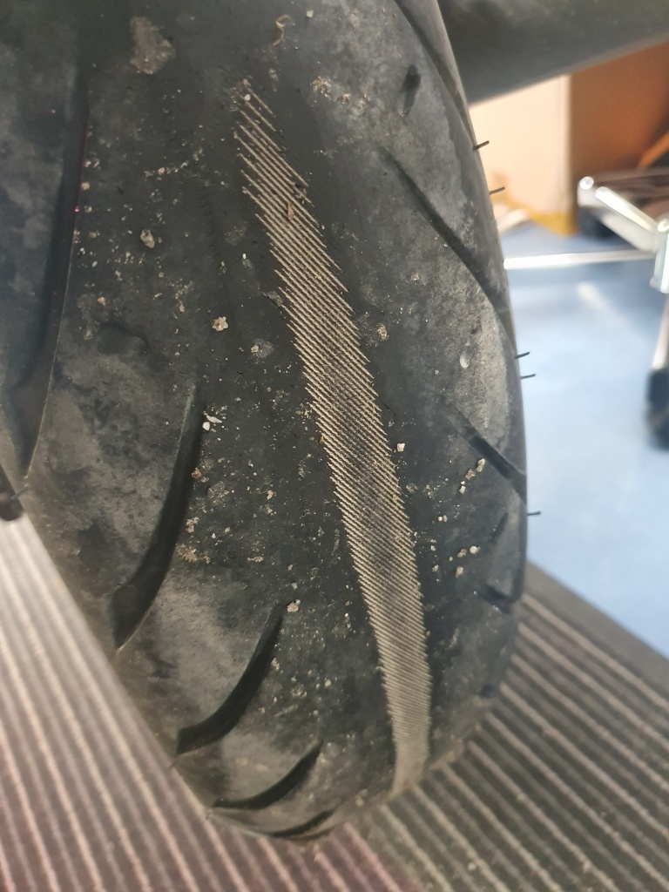

+++
title = 'Klobbskat och Sommarösund'
date = '2025-03-29'
featured_image = 'klobbskat1.jpg'
+++

# Utsikt över havet

Den förra ackun, endast ett år gammal, djupurladdade efter att nån klant glömt på strömmen med körljusen på. Nu tar den inte längre emot laddning. Så det blev att inhandla en ny acku. Oc för att provköra den och kolla att allt är i skick blev det en liten tur ut till skärgården.

<!--more-->

Jag körde ut till Klobbskat. Där klättrade jag upp i utsiktstornet. Vackert, men ganska kallt. Sedan en kaffe med bulle på [Cafe & Restaurant Compass](https://www.facebook.com/CafeCompass/).

Sedan blev det en kort extra tur genom Södra Vallgrund ut till Sommarö Sund också. Därefter hem tillbaks via Jungsund, Karperö, Smedsby, Korsnäståget och Runsor.

Det blev en liten tur på 172 km. Visserligen fungerar den nya ackun, men den tappar ändå laddning under en relativt kort tur. Något är fel med Lilla Blues elsystem.

Vidare kunde jag konstatera att nu är det dags att byta bakdäck. Efter bara 10 000 km är mitt Roadtec 01 bakdäck helt, totalt utslitet! DDäcket var i det närmaste helt nytt när jag köpte hojen, hade knappast rullat många hundra kilometer. Känns som väldigt kort livslängd på ett däck, speciellt som hojen inte är speciellt tung och som jag inte direkt misshandlat dem med att bränna däck eller så.

