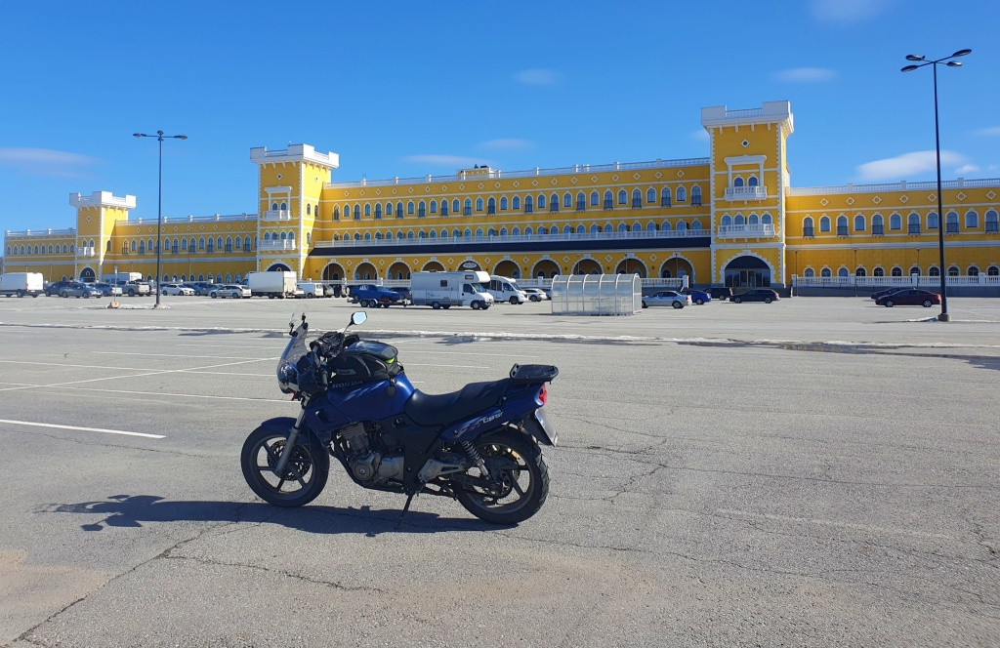
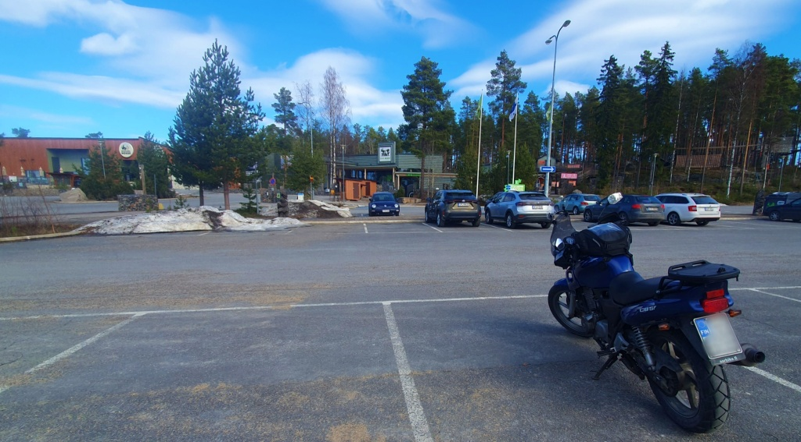
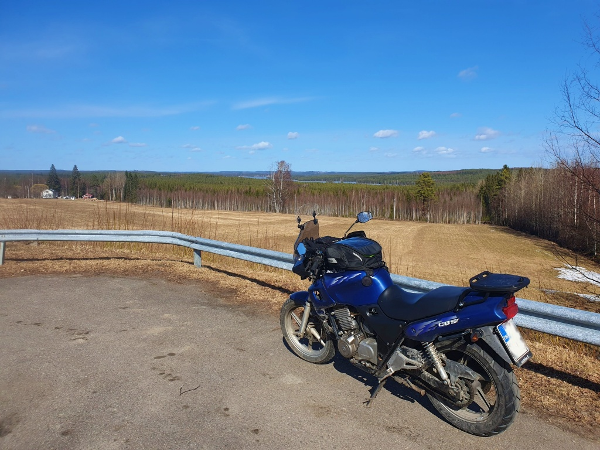
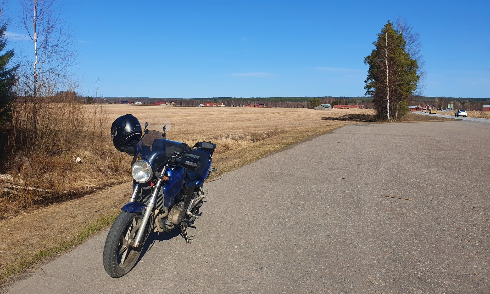

# Panda-kaffe?

Nu är det vår på riktigt och inte längre is på vägarna. Men trots att det nu är nästan en månad sedan premiären, är kör-vädret knappast mycket varmare. Det är frost på nätterna och dagstemperaturerna hålls fortfarande mestandels kring +10 och tyvärr har de soliga och klara dagarna varit rätt få. Denna dag var vädret rätt hyfsat med temperatur upp mot +14. Dags för en tur, alltså. Idag var det dags att utforska några nya ställen, som Lilla Blue inte har besökt och också en del där jag själv aldrig varit.

<!--more-->

På utrustningssidan fanns flera nyheter. Dels har Lilla Blue fått nytt bakdäck, en Metzler Tourance. Sedan, installerad så sent som igår, ny bromsrotor bak och nya bromsbelägg. Och sist men inte minst, min julklapp till mig själv, ett Bluetooth headset i hjälmen, var äntligen installerat och funktionsklar. Nu får jag navigationsinstruktioner i lurarna, så denna gång borde det inte bli några navigeringsmissar.

Färden startade genom Jurva, sedan Kurikka och därefter nästan ner till Jalasjärvi innan framhjulet vände mot Peräseinäjoki. Efter en kort rundtur i Peräseinäjoki city, fortsatte jag österut mot Alavo. Det blev en kort tur genom Alavo centrum och sedan vidare till Tuuri för att beskåda Tuurin kyläkauppa - men enbart utifrån! Därefter rundtur i Töysä centrum, via kyrkan, skolan, butiken, brandstationen och ungdomslokalen. Byn har således allt en Österbottnisk by skall ha.

Därefter en kort tur genom centrum av Etseri, varefter jag fortsatte till Etseri djurpark. Tyvärr var denna tur tidsmässigt inramad av andra evenemang, jag hade lovat hämta sonen med kompis från bio på eftermiddagen, så jag tog mig inte tid att gå och hälsa på pandorna. Istället blev det bara en kopp kaffe på Hotell Mesikämmen. De hade inte ens bulla att erbjuda. Inte mycket till Panda-kaffe om man frågar mig.

Efter pausen åkte jag vidare mot Karstula. På vägen passerade jag Väätäiskylä i Muldia kommun och sedan Pylkönmäki i Saarijärvi kommun. Pylkönmäki, om än en liten by, har tidigare varit centrum i en egen kommun och bjöd inte minst på en vacker utsikt över vackert böljande landskap. I övrigt var vägen nog bland de tråkigaste jag åkt. Många kilometer av när nog spikrak väg, skog följer skog och knappt någon bebyggelse.

Efter Pylkönmäki är vägen mera underhållande. Karstula var inte heller det något stort ställe. Trots att staden är vackert belägen mellan flera sjöar, ser man knappast något av detta när man kör genom längs huvudvägen. Sedan åkte jag vidare till Soini och därefter en avvikare via Lehtimäki. Här var det dags att tanka. Jag började nu få ont om tid så sedan bar det av hemåt. En liten avstickare unnade jag mig. Istället för att åka längs huvudleden genom Seinäjoki följde jag Isokoskentie till Nurmo centrum och därifrån fortsatte jag i riktning mot Ylistaro. Och sedan från Ylistaro längs Kyro älv till Golkas och hem. Jag hann precis i tid för att hämta barnen från bion.

Denna dag blev det 476 km. Till största delen var resan tämligen händelselös och vägarna bjöd inte på några överraskningar. Men vädret var bra, bakdäck och bromsar fungerade fint och även annars en helt lyckad tur.

## Nya kommuner

Mitt långsiktiga mål är att ta min mc Lilla Blue till alla Finlands kommuner. Under denna resa besökte vi dessa nya kommuner:
* Alavo
* Etseri
* Multia
* Saarijärvi
* Karstula
* Soini

Nu har Lilla Blue rullat genom 63 av Finlands 308 kommuner.

