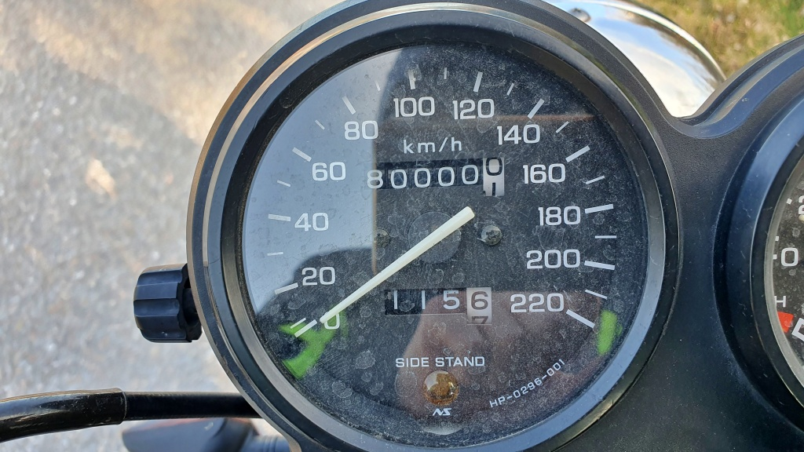
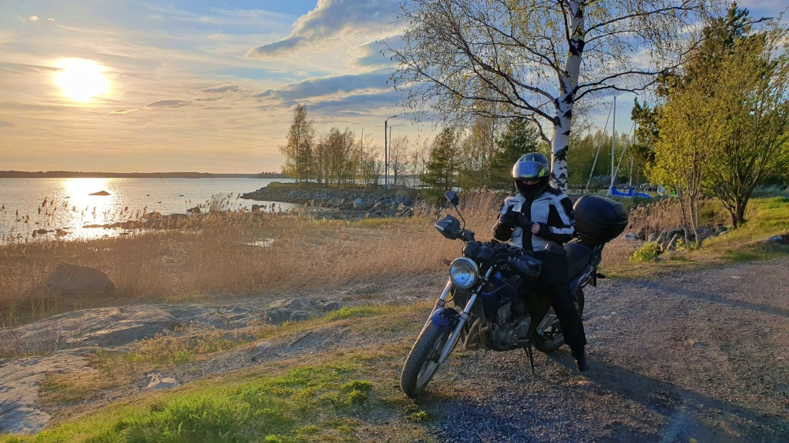

+++
title = '80 000 km'
date = '2025-05-19'
featured_image = '80k.jpg'
+++

# Kvällstur med litet jubileum

Ikväll förde jag dottern till fotbollsmatch med hojen. Medan hon tittade på matchen tog jag en liten tur. Nytt för dagen är att jag monterat bort den fula vindrutan. Nu har jag en riktig naken-motorcykel igen, redo för den varma sommaren! Får se hur det känns, det var ett tag sen.

<!--more-->

Denna gång styrde vi söderut, Blue och jag. Tanken var att bekanta oss med byn Korsbäck, dit vi väl aldrig förut hade förirrat oss. Och där mitt i allt, precis som vi vänt in från Strandvägen mot Korsbäck, fyllde Blue jämt 10k-tal. Grattis till *80&nbsp;000&nbsp;km* Lilla Blue!

Sedan blev det också en liten extra tur med dottern på bönpallen.

Denna kväll 154 km. Och hur kändes det utan vindruta då? Rätt blåsigt faktiskt och egentligen inte tystare pga. mindre turbulens heller. Jag tror nog att rutan åker på igen, åtminstone inför lite längre resor. Dels tror jag att jag orkar bättre med mindre fartvind mot kroppen och dels skyddar rutan en del mot insekter och delvis också mot regn. 
