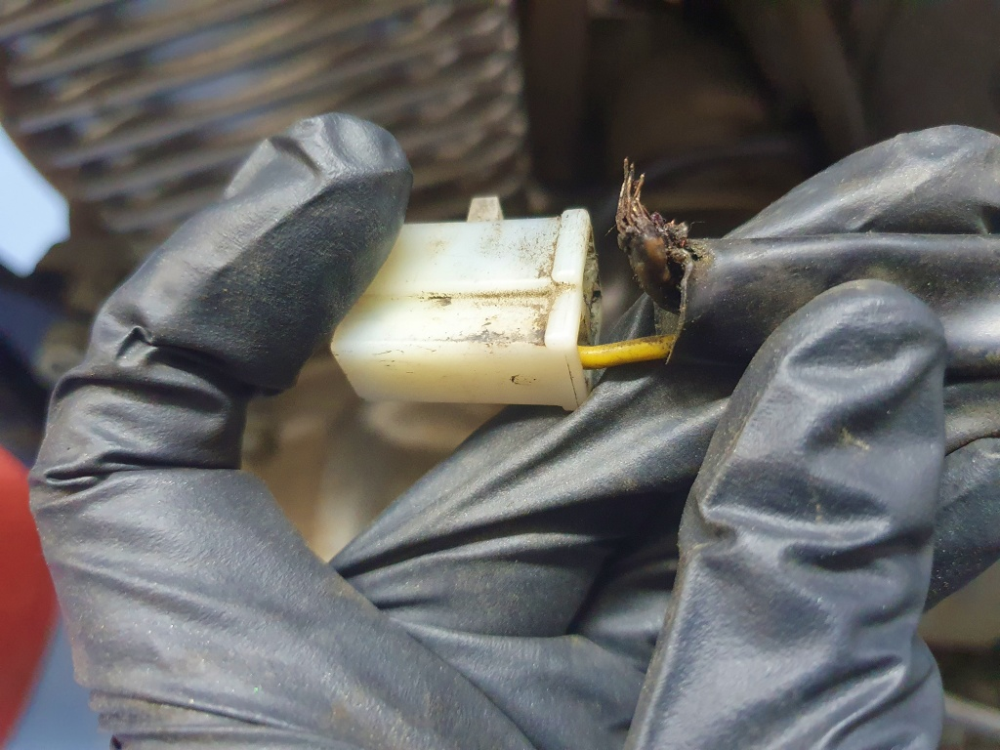
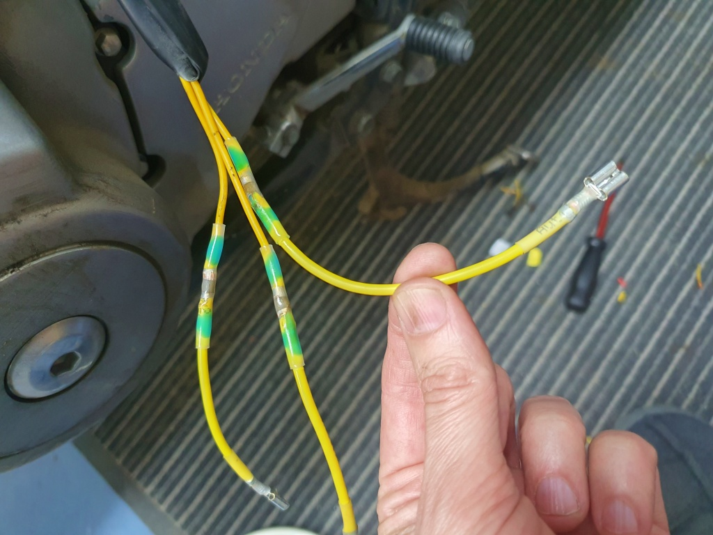
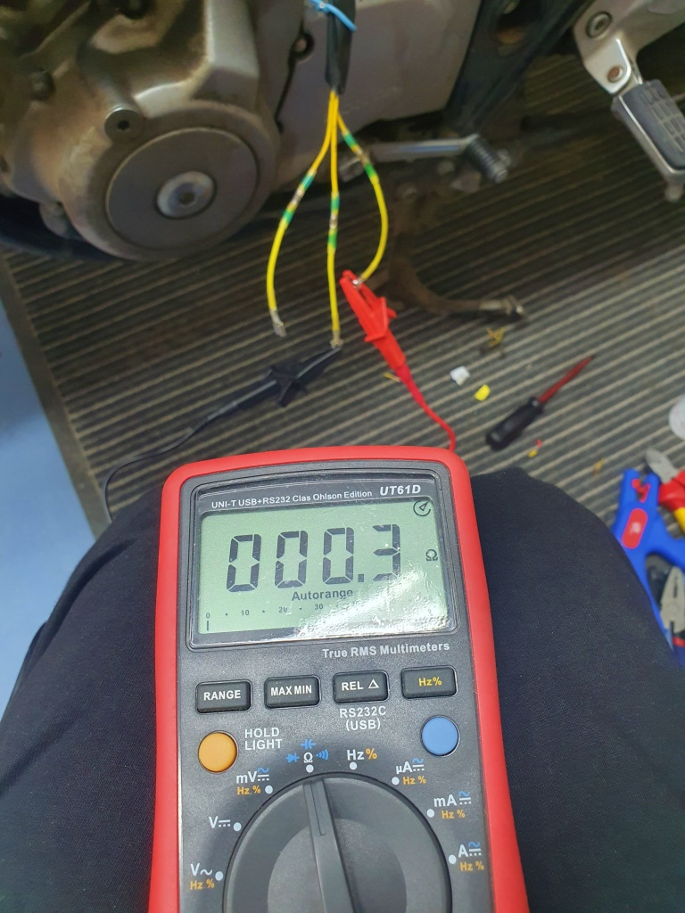
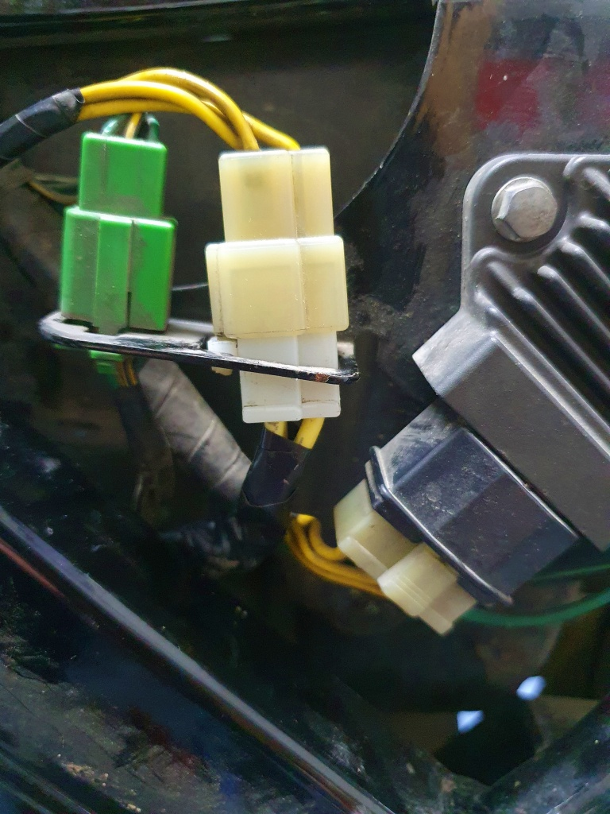

# Lösningen på laddningproblemen?

Hela våren har Lilla Blue små-krånglat. Batteriet har sakta laddats ur under körning, med påföljd att värmehandtagen slagit av och till sist börjar motorn gå dåligt. Några timmar med CTek laddaren och sedan har allt varit bra igen - några hundra kilometer. Som bi-effekt lyckades jag dessutom döda en fullständigt frisk acku, genom att djup-urladda den till bortom all räddning, när jag glömde på strömmen över natten. 

<!--more-->

Med multimetern kom jag fram till att problemet måste vara statorn. En av tre trådar gav ingen kontakt alls, en hade alldeles för hög resistans och endast en var ens i närheten av specificerade värden. Däremot verkade likriktaren/regulatorn var i skick, såvitt mätaren kunde utläsa. Så jag köpte en renoverad stator, levererades per post från Storbrittannien och kostade i runda slängar 100 €. Suck, det är dyrt mer motorcyklar. Jag väl ha kunnat svälja den utgiften, om det inte varit för att - problemet inte alls var statorn.

Idag satte jag igång projektet med att byta statorn. Jag började med att koppla loss kontakten och... vänta lite. Om kontakten ser ut såhär kan det ju knappast funka!

Fram med lödkolven. Lite lödtenn senare visade alla tre poler på den gamla statorn acceptabel resistans (inte helt enligt specifikation, men nära nog). Så på med tejp, fast med kontakten och sedan var det bara att köra igen.

Vad kan man nu lära sig av detta? För det första kan jag inte förstå att jag lyckats köra nära 500 km med en motorcykel där bara en en av tre poler i statorn är kopplad - dessutom med handtagsvärmarna påslagna. Lyckades likriktaren/regulatorn ändå ladda batteriet?

Eventuellt kunde man lära sig att man borde skruva isär grejerna och undersöka dem ordentligt före man beställer dyra reservdelar? Kanske det, men samtigt så gick det ju behjälpligt att köra - och jag ville ju inte vara utan hoj medan jag väntar på reservdelar. Den enda vettiga slutledningen är alltså att man behöver två hojar (åtminstone), så att man har en att köra med medan den andra står i verkstaden. Återstår bara att sälja in den iden åt familjen...

PS. Om någon behöver en stator till en CB 500, har jag en till salu.