# Kärnkaffe och fläkt från medeltiden

Att besöka Raumo har länge varit på önskelistan. Idag var det äntligen dags. Vädret var fint på när jag startade kl. 8 på morgonen, men tyvärr utlovades regn på kvällskvisten. En ny leksak hade jag också med, en Aoocci C3 pekskärm med Android Auto stöd. Nu hade jag alltså både röstnavigering via headsettet och visuell navigering som inte grundar sig i att jag tar ögonen från vägen och kikar ner på telefonen i tankväskan. Jag hade också tagit med systemkameran för att testa hur det fungerar när man rör sig på två hjul.

<!--more-->

### Transportsträcka

Först följde jag riksväg 8 söderut. Ganska tråkigt, men eftersom jag hade en lång dag framför mig gällde det att spara tid. Jag gjorde en liten avstickare in till Lappfjärd, sedan ut på rixen igen. Men från Härkmeri var planen att undvika riksvägen. Jag åkte genom Härkmeri och tog sedan en kort paus i Kilen. En segelbåt med besättning låg i hamnen, i övrigt var det fullständigt öde. Sommarsäsongen har väl inte kommit igång ännu.

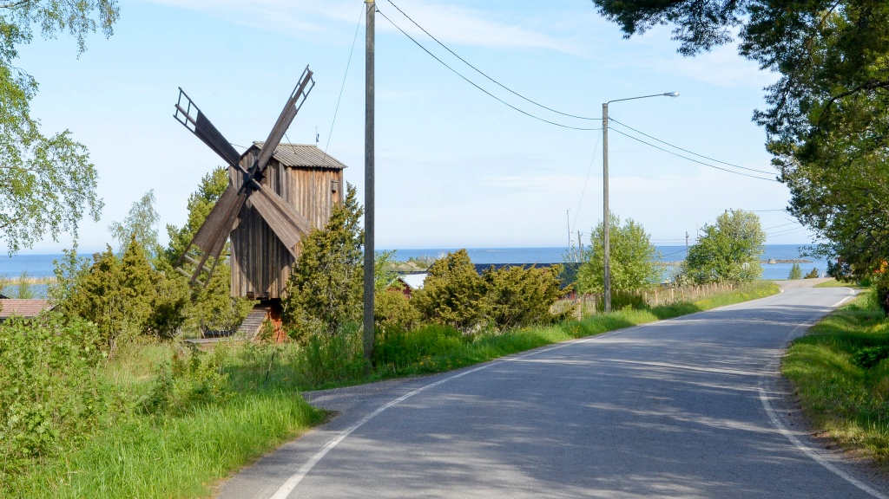

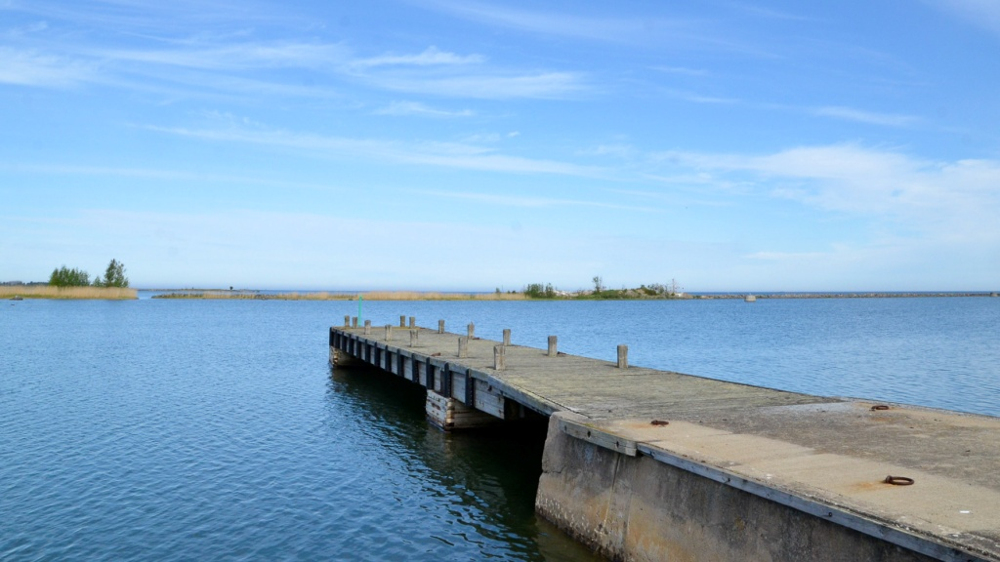

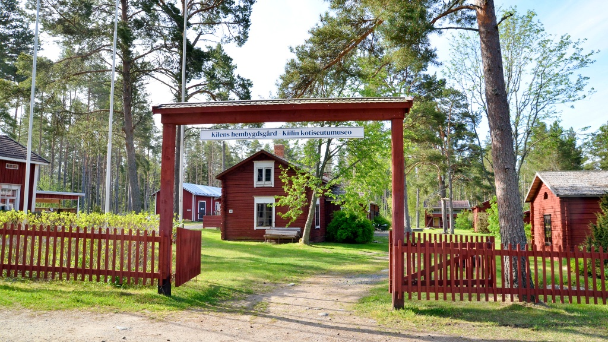

### Satakundas kustregion

Sedan åkte jag vidare söderut och korsade snart gränsen till Satakunda. Denna gräns är samtigt en ganska skarp språkgräns. Sideby är tvåspråkigt, antagligen med svensk majoritet medan Sastmola är helt finskspråkigt. Så var det inte alltid och ett stort antal svenska eller från svenskan översatta ortnamn vittnar om att det för bara dryga hundra år sedan fanns svenskspråkig bosättning ändå ner mot Raumo. Jag passerade genom orter som Kasaböle (Kasala), Risby (Riispyy), Sastmola (Merikarvia), Ytterby (Alakylä), Norrsågen (Pohjansaha) för att sedan köra en bit ut mot Sandö genom Vittisbofjärd (Ahlainen). Ahlainen verkade för övrigt som ett mysigt ställe, säkert värt ett nytt besök vid senare tillfälle. Vägen var för övrigt väldigt trevlig. Hela vägen från Sideby ner till Ämtö bestod av ganska smal, slingrande asfaltsväg. Ställvis var den nog lappad, men på det hela taget rätt bra i skick. Inte var det mycket trafik heller.

I Ämtö anslöt jag sedan till väg 272 ut mot Räfsö (Reposaari) och Mäntyluoto. Jag tog en tur genom Räfsö och kikade på omgivningarna. Jag hade som plan att eventuellt käka lunch där, men det kändes lite tidigt när klockan var strax före 11. Istället åkte jag vidare. Jag skippade Kallo fyr och den lilla stadsdelen Uniluoto, med tanken att jag får komma tillbaks en annan gång. För att spara tid körde jag också rakt förbi Ytterös (Yyteri) badstrand - jag har varit där förut och hade fortfarande många kilometer körning framför mig denna dag.

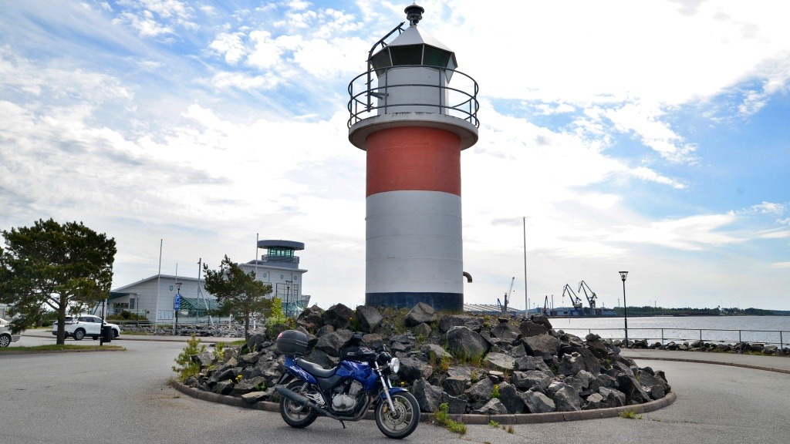

Nu blev det i varje fall några kilometer längs riksväg 2 in mot Björneborg. Jag svängde av mot Bredvik (Preiviikki) för att nu ta mig "bakvägen" till Euraåminne och Raumo, utan att åka ut på riksvägen igen. Nu följde sedan en hel räcka med vägkorsningar och olika vägar som jag omöjligt hade kunnat memorera utan navigator. Och hade navigatorn gett upp hade jag knappast ens vetat var jag befann mig. Jag åkte i varje fall genom ställen som Maggholm (Makolma) och Södersund (Sunti) innan jag kom till Luvia. Vid Luvia kyrka vände jag igen söderut genom Norrby (Luodonkylä), Lemlax och Kvivlax (Kuivalahti). Här blev det en kort bit grusväg, men i övrigt hade vägen varit asfalterad, till största delen dock ganska lappad och gropig.

Nu kom jag till Vuojoki herrgård. Herrgården verkar vara i Euraåminne stads ägo, men hyrs tydligen ut till Areva och kanske andra. Kärnkraftsbyggare och operatörer, helt enkelt. Byggnaden var låst men till trädgården hade man fritt tillträde. Mycket stilig herrgård och den verkade vara i rätt bra skick. Jag passade på att slå mig ned i solskenet och äta den medhavda matsäcken och dricka termoskaffe.

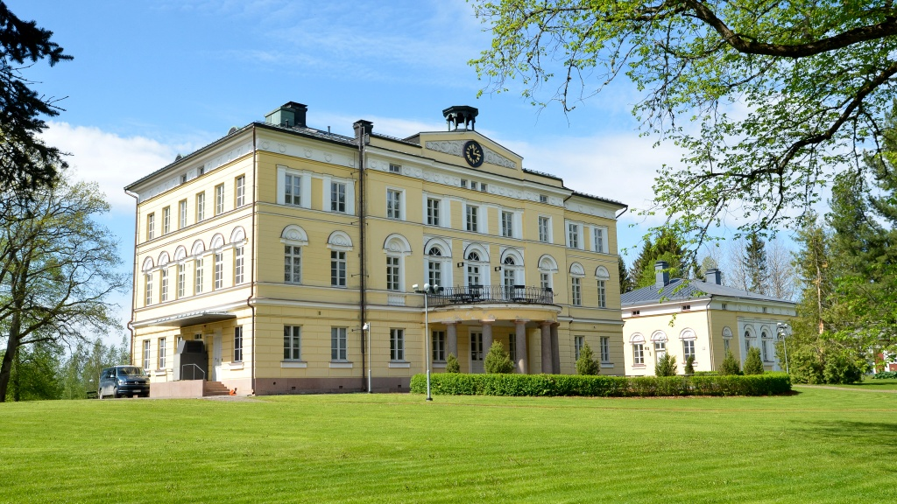

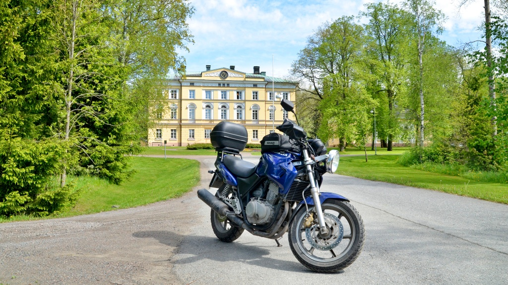

### Olkiluoto

Från Vuojoki herrgård fortsatte jag sedan till ett av dagens huvudmål, nämligen Olkiluoto kärnkraftverk, specifikt till besökscentret. Ett fint och imponerande ställe, om än Själva utställningen var rätt tråkig. Visst fanns det en del att läsa om och peta på, men kanske inget väldigt överraskande och spännande. Det skulle inte vara lönt att ta barnen hit, jag tror att stället lämpar sig bättre för gymnasie- eller högskolestuderande. Men, det jag åtminstone uppskattade var gratis automatkaffe, säkert bryggt med närproducerad el. Kärnkaffet avnjöts dessutom på terrassen med utsikt över de tre kärnreaktorerna.

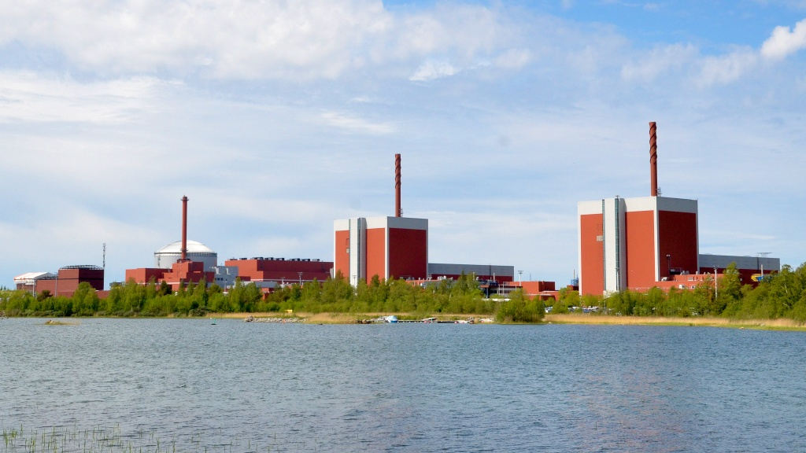

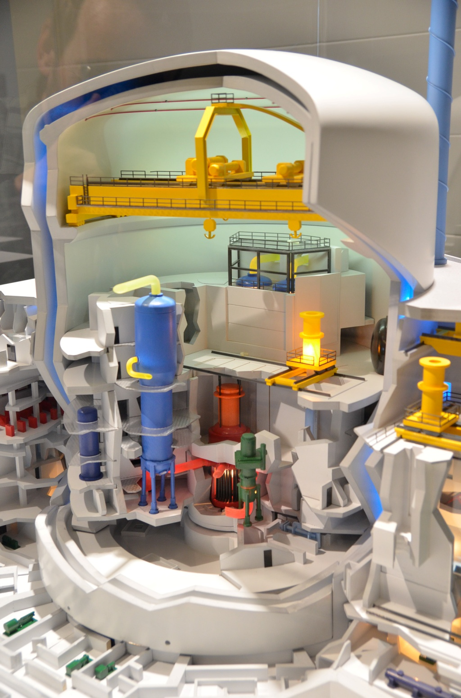

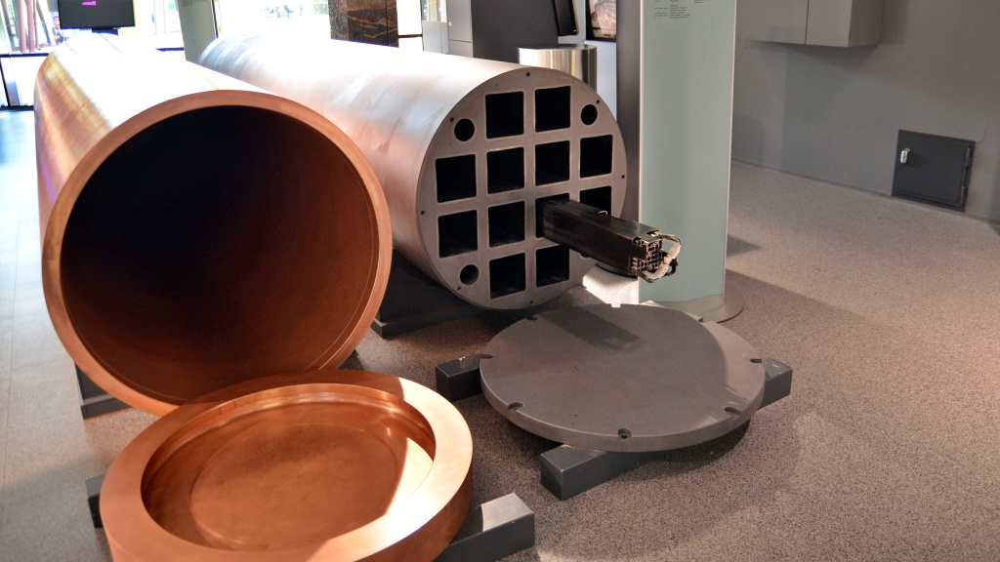

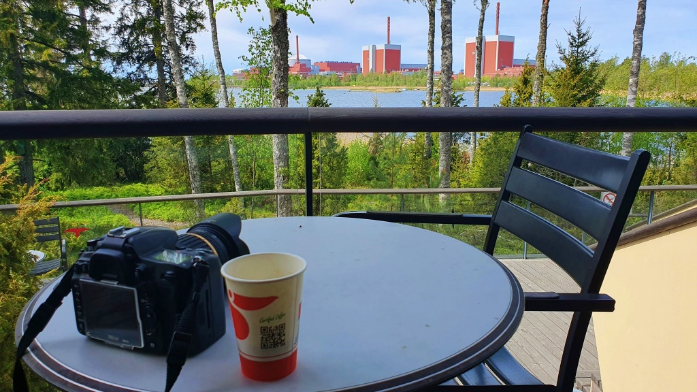

Intill vägen till besökscentret och kraftverkets huvudport ligger också ett annat omtalat ställe, nämligen ingången till Onkalo, lagerutrymmet för kärnavfall som är insprängt i berggrunden. Själva "ingången" bestod i själva verket av en rejält stor byggnad som förutom hissar och ventilation och sånt säkert också inhyser omlastningsmaskiner för kärnavfallsbehållarna.

### Raumo

Från Olkiluotovägen var det sedan bara en kort bit tills Raumo tätort börjar. Jag avvek avsiktligt från rutten för att få se mer av staden och hamnade vid Kikartornet, vilket jag inte hade lyckats scouta på förhand. Helt värt ett kort besök. 

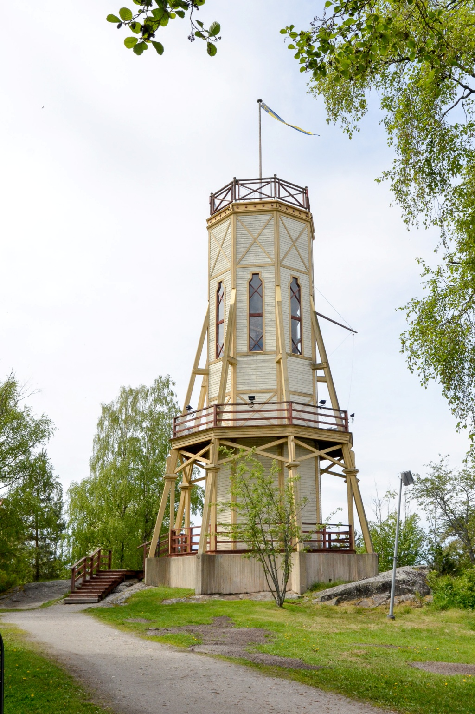

Sedan tog jag mig in till Gamla Raumo, parkerade nära torget och strosade runt en stund. Nu var vädret nog i det varmare laget för mina vinterfordrade mc-brallor, så jag sökte mig ganska snart in på en lokal pizzeria för att äta lunch. 

_UPPDATERING 2026:_ Tyckte i efterhand att det var värt att infoga att [Gamla Raumo](https://www.maailmanperinto.fi/sv/gamla-raumo/) är ett av Finlands världsarv på Unescos lista. Det är Nordens största sammanhängande bevarade trästadsområde. De äldsta husen är från början av 1700-talet. Inga gråa höghus i betong från sjuttiotalet eller liknande förfular den enhetliga miljön.

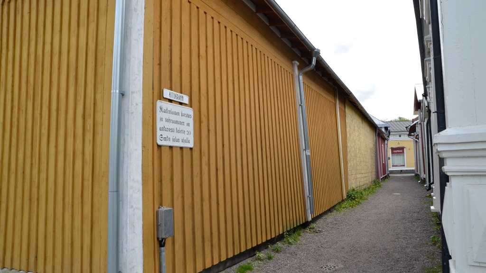

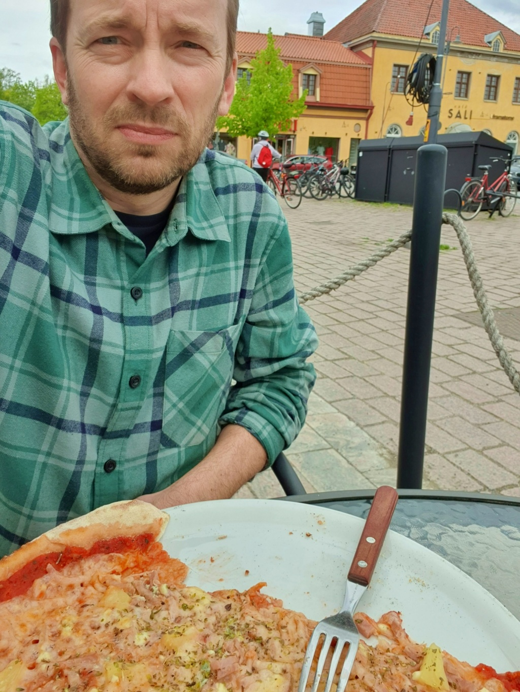

När lunchen var avklarat återvände jag till motorcykeln. Jag hade låst fast hjälmen på en krok under sätet - och jag hade tydligen lämnat startnyckeln kvar i sätets lås. Nå ja, mest bara ärligt folk i Raumo! Jag grenslade åter springaren och letade mig i sakta mak ut från gamla stan, nu i riktning mot Euraåminne (Eurajoki) centrum. 

### Satakundas inland

Längs små och trevliga vägar kom jag sedan till byn Panelia. Förutom det lustiga namnet har byn en hel hop med gamla, vackra byggnader. Sedan styrde jag mot Harjavalta, återigen så att jag undvek stora riksväg 43 och istället tog mig fram på mindre vägar.

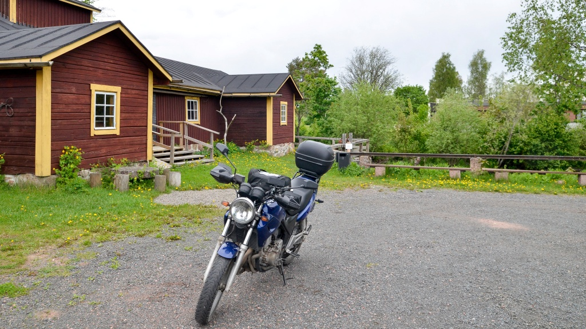

I Harjavalta lät jag bli att åka och titta på Bolidens monstruösa koppar- och nickelfabrik. Istället for jag och beundrade Harjavaltas vattenkraftverk som dammar av Kumo älv med sin imponerande 26 meters fallhöjd. Ja egentligen ligger väl kraftverket precis på andra sidan av kommungränsen, i Nakkila kommun. Ovanpå kraftverket finns en enfilig väg öppen för biltrafik. Lustigt hur det kan fungera, utan mötesplatser eller trafikljus.

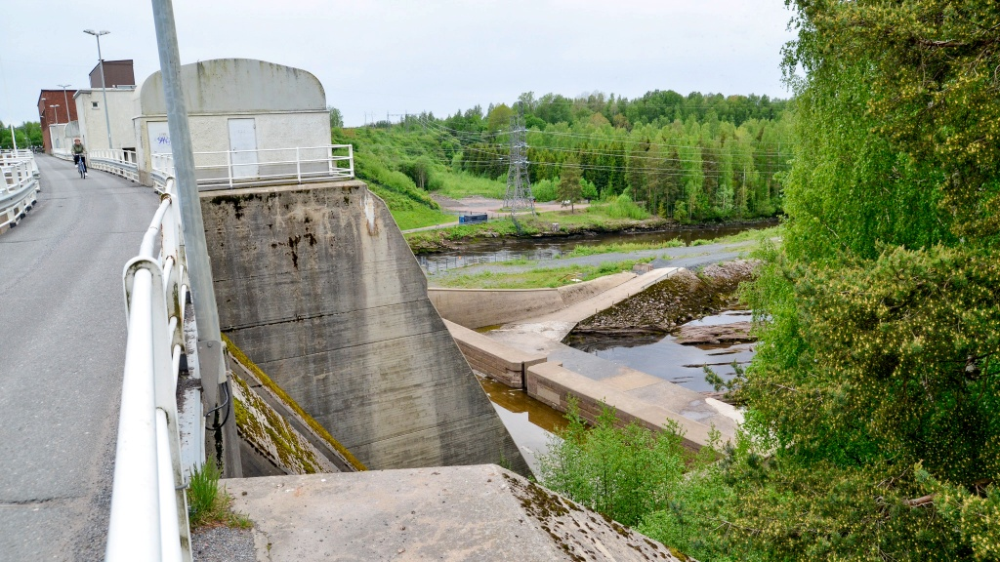
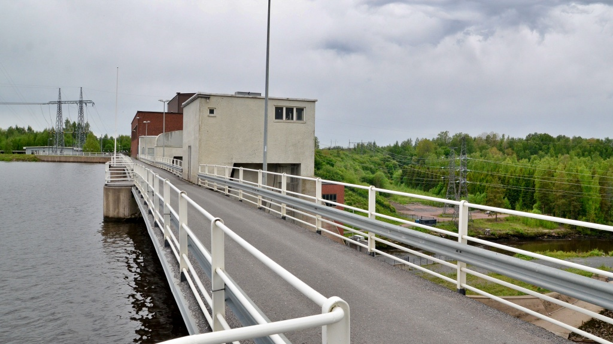

I Nakkila (Nackeby på svenska) började det regna. Jag tänkte att det nog bara blir en kort skur, regnet skulle ju inte börja förrän sent på kvällen. Men som så ofta denna sommar har regnväder bråttom att börja men ingen större stress att sluta. I Ulvsby (Ulvila) tankade jag. Regnet bara fortsatte, så vid Ulvsby gamla kyrka, St. Olofs kyrka som den heter, stannade jag och drog på mig regnstället med stövelskydd och allt. Kyrkan var tyvärr låst, annars hade det varit ett intressant besöksmål.

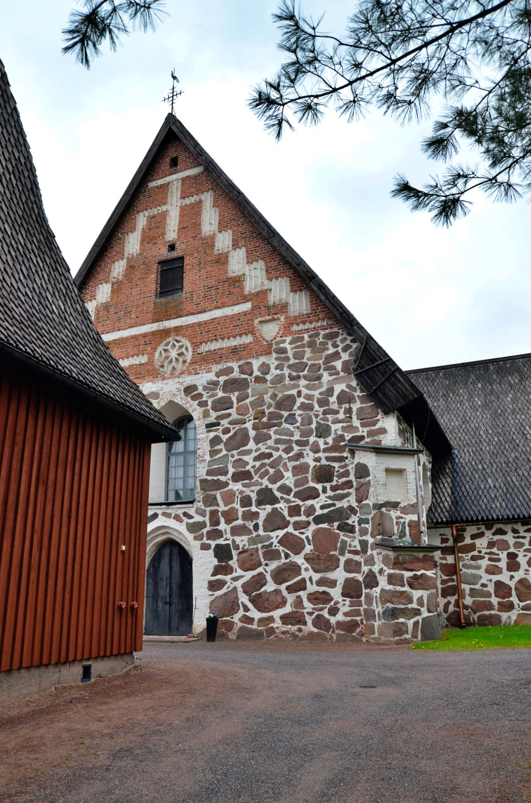

Nästa mål på färden var Norrmark (Noormarkku) och Norrmarks bruksområde. Trots att jag otaliga gånger med bil kört förbi skyltarna mot Norrmark, hade jag aldrig tidigare besökt stället, det var en miss. Förutom själva bruksbyggnaderna finns ett flertal gamla, storstilade bostadsbyggnader som släkten Ahlström byggt åt sig kring Norrmarks å. Jag strosade runt en stund i duggregnet. Hit kommer jag gärna igen, någon dag då solen skiner.

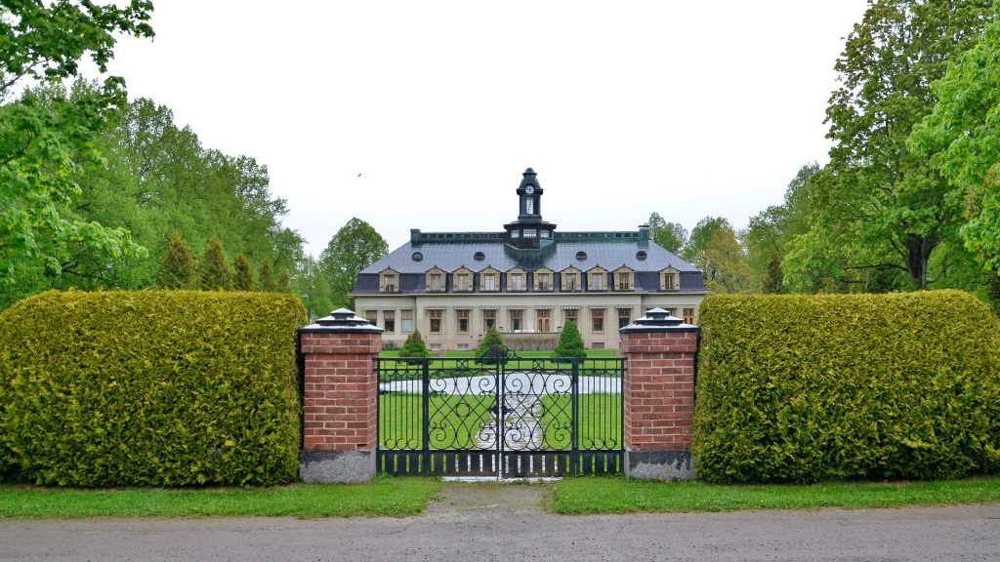

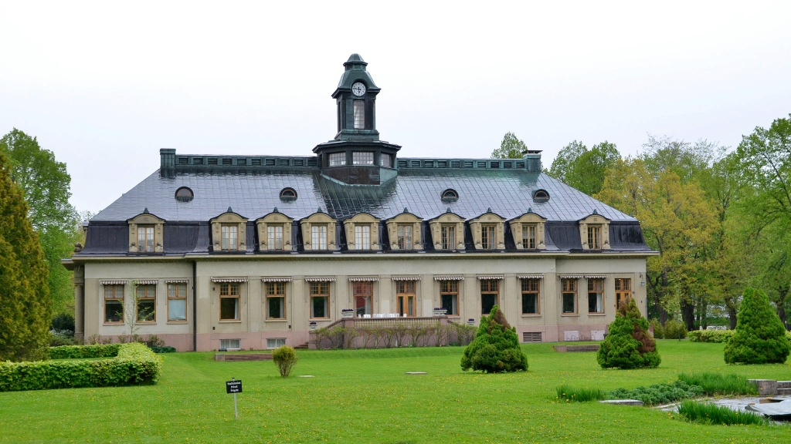

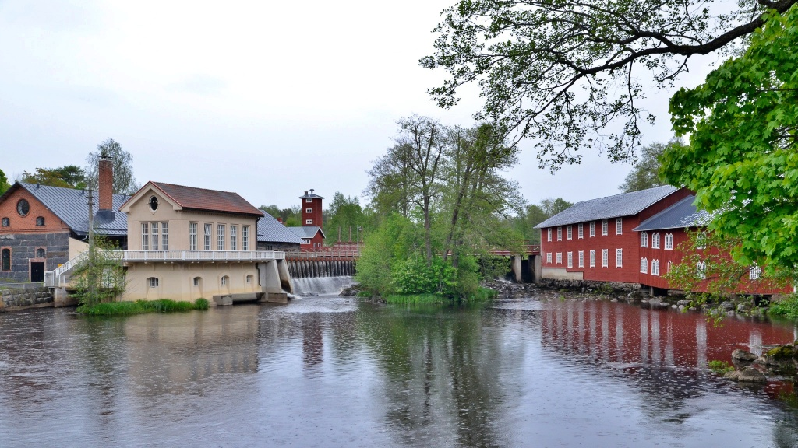

Trots regnet bestämde jag mig för att fortsätta enligt planerad rutt. Jag åkte längs riksväg 23 i riktning mot Kankaanpää. Jag tog en avstickare genom Påmark (Pomarkku) för att titta på de två kyrkorna, den gamla och den nya, som ligger helt intill varandra. Jag åkte sedan genom Kankaanpää och tog mig längs slingriga småvägar till Jämi flygfält. Flygfältet var väl inte så intressant, men kul att se den omtalade skidtunneln.

### Hemåt

Därefter vidare genom Jämijärvi centrum till Niinisalo, där jag vände norrut mot Karvia. I Karvia bestämde jag mig för att ta en lite annan rutt än den planerade och åka till Kauhajärvi och därifrån vidare in till Kauhajoki. Men eftersom det regnade och mina handskar var genomvåta (Gore-Tex!) och svåra att dra av och på, struntade jag i att mata in den nya rutten i navigatorn. Jag hittar nog, tänkte jag. Och givetvis åkte jag fel. Istället kom jag att åka mot Nummijärvi. Men kanske lika bra så, båda rutterna innehöll en del grusväg - ett uselt val i ihållande regn. Vägen var rätt hal och det kändes som om den var mycket lång (egentligen bara 10 km), innan asfalten började igen. När jag kom till Kauhajoki var jag smutsig, våt och trött och dessutom gjorde det tjocka molntäcket att det började bli ganska mörkt också. Så jag tog en fika på ABC innan den återstående biten. Kaffet piggade upp och jag kom välbehållen hem via Jurva.

Denna tur blev 685 km lång. Jag startade tidigt och kom hem sent. Skall man åka mycket längre en så här på en dag får man nog följa större vägar eller skippa en del stopp - men var är det roliga med det?

### Vad lärde jag mig denna gång

Den nya skärmen, Aoocci C3 fungerade rätt bra. Tyvärr lyckades jag inte vinkla den rakt mot mig. I starkt ljus räcker inte skärmens intensitet till, jag måste luta mig fram över skärmen för att se. Jag funderar på att bygga en hållare åt den så att den kan sitta ovanför mätar-tavlan riktad rakt mot mig. Pekskärmen är svår att använda med handskar, med mina vinterhandskar (utan "pekskärmsstöd") är det omöjligt. Men själva Android Auto fungerar klanderfritt, jag följde hela resan med min Kurviger app, utan problem.

Jag testade också att ta med min gamla systemkamera på resan. Det funkade väl sådär att ha den i tankväskan, ganska krångligt att hala fram den. Inte heller var det möjligt att använda med handskarna på, så på det viset samma som med mobilkameran. När regnet började orkade jag i varje fall inte rota fram den under tankväskans regnskydd. Och sist och slutligen blir väl inte bilderna speciellt mycket bättre med systemkamera än med mobilen - det är ju ändå samma fotograf.

Denna gång fungerade regnekläderna rätt bra. Bålen, armarna, benen och fötterna hölls någotsånär torra, kändes bara lite fuktigt. Inga större mängde vatten kom in någonstans, inte ens kring halsen. Jag borde bara ha på mig regnstället genast det började regna, så hade jag kanske undvikit en del av den fuktiga känslan. Mina "regntåliga" Richa Gore-Tex handskar var däremot i stort sett genomvåta. Pinlock-visiret hölls i det närmaste rent, lite imma dök upp i kanterna mot slutet, men inte så att det helt skulle hindra sikten.

Jag höll i stort sett fast vid min planerade rutt, trots att det började regna mycket tidigare än prognosen lovade. Det gick ju bra, men körningen blir ju nog tråkigare i regn. Dels måste man vara försiktigare och kan inte njuta av kurviga vägar på samma sätt och dels ser man mindre av omgivningen. Framförallt hindrar regnet genom att det blir så krångligt att ta av och på handskar och annan utrustning att man helt enkelt låter bli att ta ett kort stopp när någonting intressant dyker upp. Och blir det ett stopp orkar man inte rota fram kameran. 

När man kommit i "följ navigatorn" -mode är det helt hopplöst att tro att man mitt i allt skall kunna navigera själv ur minnet. När man har studerat kartan på förhand har man visserligen en grundide om hur vägarna går, men att minnas alla korsningar och vart man skall svänga verkar vara för mycket begärt - åtminstone för mig. Därav orienteringsmissen. Och så kanske det löns att försöka undvika grusvägar i regn. Det går långsamt, blir smutsigt och ställvis kan det också vara rätt halt.

## Nya kommuner

Mitt långsiktiga mål är att ta Lilla Blue till alla Finlands kommuner. På denna resa fick hon besöka några nya:

* Euraåminne (Eurajoki)
* Raumo (Rauma)
* Eura
* Harjavalta
* Nakkila
* Jämijärvi

Lilla Blue har nu besökt 69 av Finlands 308 kommuner.

