## Till Koli nationalpark

_Dag ett av min tre dagars färd i Österled._

### Inledning

Då var det äntligen dags för resan som jag planerat redan för ett år sedan. I fjol blev inte resan av. Redan då hann jag skaffa en del kritisk utrustning, såsom sadelväskor och ett mindre tält. Men frun meddelade att jag inte alls hade tid att åka och så blev det den gången. I år förhandlade jag fram en tre dagars respit för motorcykelresa.

<!--more-->

### Tidig start

Väderleksprognosen var rätt dyster läsning, men med endast dessa tre specifika dagar öronmärkta för mc-äventyr fanns det inte så många alternativ – packa regnkläderna eller stanna hemma.

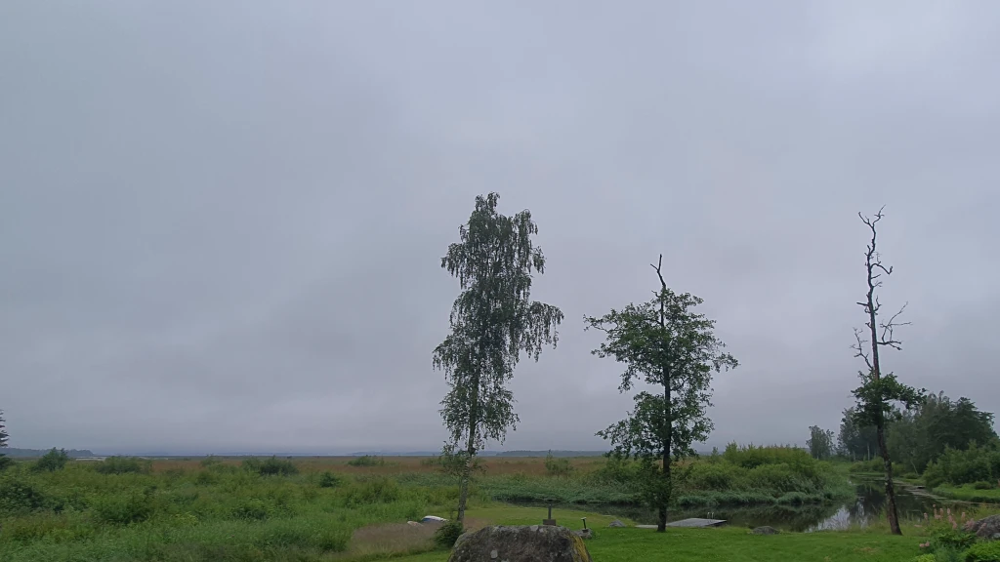

För att få lite sömn och orka upp i ottan flydde jag redan dagen innan till stugan – barnen har för vana att hålla hela huset vaket fram till efter midnatt. Väckarklockan ringde 5:15, sedan en kort biltur hem till garaget där hojen väntade, färdigpackad. Första dagens etappmål var Lakkala lägerplats i Koli nationalpark och inte kortaste vägen heller. För att klara av den sträckan på nästan 700 km och också hinna göra några små utflykter på vägen, gällde det att ge seg i väg i tid. 
Väderleksrapporten utlovad nu faktiskt uppehåll i några timmar så jag drog inte på mig regnstället genast. Nå, redan i Lappo började det regna. Jag antog att det var en kort skur, så jag tänkte att jag pressar igenom – det var ju inte det bästa beslutet. Halvvägs mellan Lappo och Alajärvi fick jag ändå dra på mig regnställ och stövelöverdrag, ovanpå färdigt våta kläder.

Någonstans där, innan jag ännu dragit på mig regnstället såg jag en räv på en åker, nos mot näbb med ett par tranor. Kanske de hade ungar i närheten. Med regnet ösande ner och trafik bakom mig stannade jag inte till för att se hur det hela utspelade sig. Efterhand ångrar jag mig lite, skulle ha varit spännande att se.

### Mellersta Finland

En bit efter Alajärvi kom jag så in på nytt territorium (för mig, alltså). Visst har jag färdats denna väg någon gång förut, men knappast som chaufför och definitivt inte med motorcykel. Kyyjärvi i mellersta Finland var resans första kommun jag inte besökt. Kyyjärvi centrum är ganska typisk för små kommuner i Finland. Det finns en huvudgata, längs vilken det finns en skola, en kyrka, en brandstation, en närbutik och kanske en bensinmack och kanske ett café eller en pub. Ortens största och mest kända arbetsgivare torde vara betongelement-tillverkaren Betset. Deras fabrik så ganska mycket ut just som en betong-elementfabrik. Inte heller i övrigt lämnade ett regnigt Kyyjärvi några starkare intryck på mig. Synd att man knappt såg av själva sjön som gett orten sitt namn.

Här någonstans mellan Kyyjärvi och Kannonkoski känns det som om landskapet ändras och kustens slättlandskap övergår till insjö-Finland. I Piispala, Kannonkoski, på en naturskön rastplats intill en sjö och en bro tog jag en kort paus och slukade den medhavda frukost-smörgåsen med termos-kaffe. Precis här på Piispala deltog jag för en gång i tiden i Finlands Scouters storläger [Tervas 90](https://fi.scoutwiki.org/Tervas). De 35 åren som förflutit, kanske i kombination med att en tonåring lägger märke till lite andra saker, gjorde not att jag egentligen inte kände igen mig alls. Den enda plats jag lyckades identifiera var ett gammalt grustag som fungerade som en slags amfi-teater för alla deltagare på en gång under scoutlägret. Sedan var själva byn Kannonkoski inte mycket mera speciell än Kyyjärvi – trots att all service inte ligger längs med samma huvudgata här.

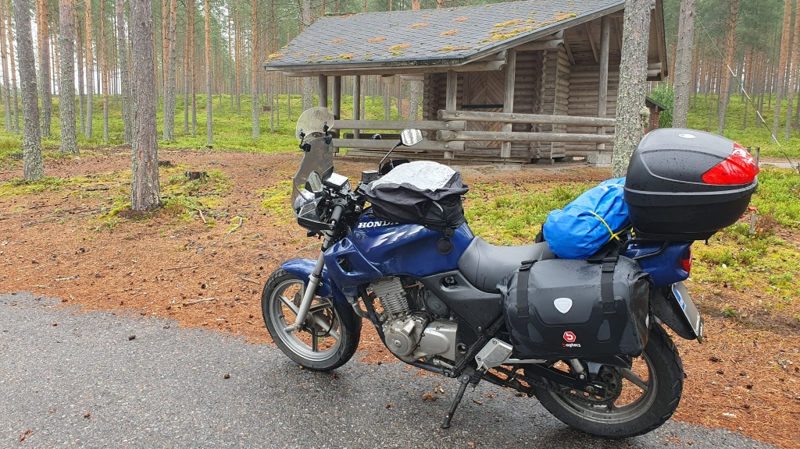
Piispala, Kannonkoski. Blue har full packning.

På väg ut ur Kannonkoski blev jag tvungen att byta till reserven på bensinkran. Och det var ju bekymmersamt av flera orsaker. Dels hade jag bara strax under 290 km på tripp-mätaren – normalt brukar jag byt till reserven någonstans mellan 320 km och 340 km. Det här tydde alltså på nytt rekord i bränsleförbrukning. Dels hade jag över 30 km kvar till Viitasaari och nästa bensinmack och jag har i själva verket aldrig testat hur många kilometer jag kan köra på reserven. Efter en stunds resonemang och överläggningar med mig själv kom jag i varje fall fram till att bränslet borde räcka, jag lät bli att vända om till SEO i Kannonkoski. Men åtminstone drog jag ned på hastigheten för att inte utmana ödet i onödan.

Visst räckte bränslet, jag kom fram utan problem till ABC i Viitasaari. Jag skippade i varje fall stads-ön med Viitasaari kyrka och åkte rakt till ABC. Inte orkade jag vända om i regnet heller, så Viitasaari fick bara ett kort besök genom centrum, eller vad det skall kallas. Vackert belägen är staden, säkert värt ett nytt besök någon gång när det inte regnar.

Efter Viitasaari fortsatte jag norrut mot Pihtipudas. Kortaste rutten till Koli skulle nog ha varit att svänga av mot Keitele och Siilinjärvi, men mc-resor brukar ju ändå inte handla om att komma fram så snabbt som möjligt? Strax söder om Pihtipudas går en liten sidoväg längs en hög grus-ås, omgiven av vatten på båda sidor. Mycket vackert. Också själva centrum är vackert beläget, med en ström flytande genom staden.

### Norra Österbotten

Nästa ort norröver är Pyhäjärvi i landskapet Norra Österbotten. Jag svängde in strax söder om centralorten mot den gamla kyrkbyn - en lugn liten by på en udde. Tyvärr såg man inget av den omgivande sjön från byvägen. Efter en kort färd längs byvägar kom jag till kommunens huvudort Pyhäsalmi. Där tog jag en kopp kaffe på café Karnevaali.

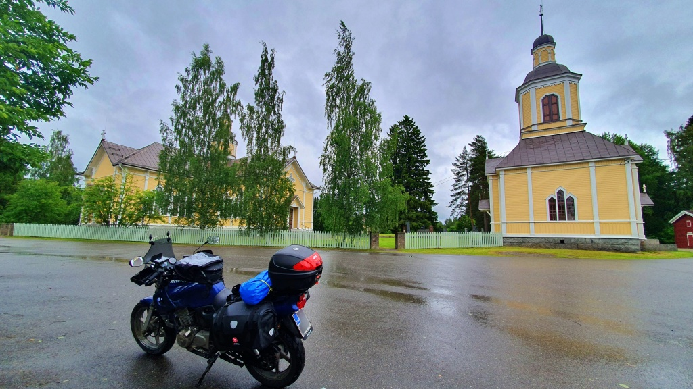
Pyhäjärvi kyrka.

### Norra Savolax

Därfter vände jag österut mot Kiuruvesi. Vid infarten till själva staden Kiuruvesi ligger en ortodox [vägikon](https://kiuruvesi.fi/palvelut/matkailu/nahtavyydet/tieikonikappeli/), som påminnelse om att vi nu nått landskapet Norra Savolax och den del av Finland där en betydande del av befolkningen bekänner sig till den ortodoxa tron. En kort tur genom staden avslöjade i övrigt inget specifik intressant, så jag lämnade staden med känslan att Kiuruvesi kanske gömmer sina bästa sidor för den flyktige besökaren.

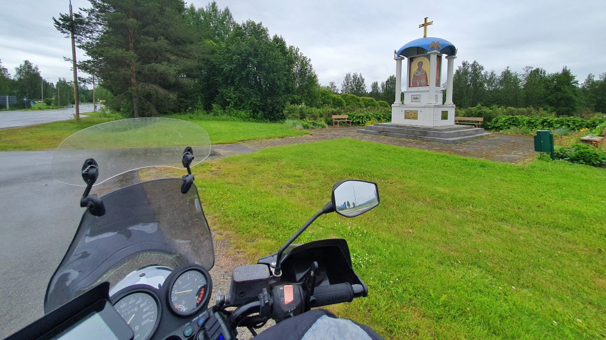
Kiuruvesis vägikon.

Från Kiuruvesi styrde jag åt nordöst mot Vieremä istället för rakt mot Idensalmi. I Vieremä kunde jag ju inte låta bli att ta en sväng förbi skogsmaskintillverkaren [Ponsses](https://www.ponsse.com/sv/) huvudkontor. Sedan bar det söderut i riktning mot Idensalmi. På vägen stannade jag vid ett minnesmärke för [slaget vid Virta bro](https://sv.wikipedia.org/wiki/Slaget_vid_Virta_bro). Detta slag är berömt som Sverige-Finlands sista stora seger över Ryssland under 1808-09 års krig. Den retirerande Svensk-Finska hären lyckades här slå den betydligt större ryska anfallsstyrkan. Detta slag sägs ha inspirerat [Runeberg](https://sv.wikipedia.org/wiki/Johan_Ludvig_Runeberg) till dikten om [Sven Duva](https://runeberg.org/fstal/1g.html).

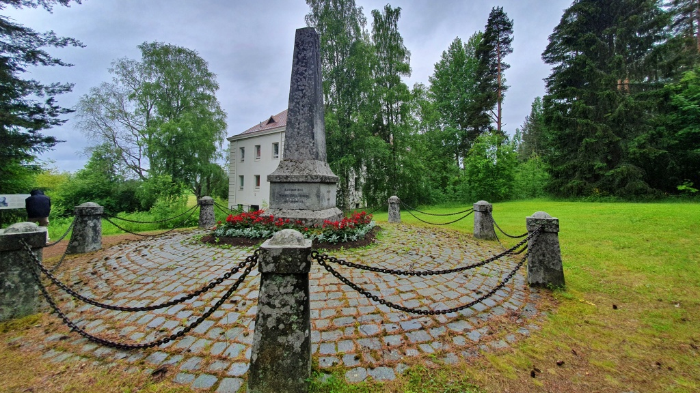
Monument över slaget vid Virta bro. I bakgrunden det nedlagda Koljonvirta mentalsjukhus - spökar det någonstans så är det där.

I Idensalmi blev det lunch-paus på lunchrestaurangen Olvi-oluthalli och sedan besök på bryggeriet [Olvis fabriksmuseum](https://www.olvisaatio.fi/panimomuseo/). Någon dansk-inspirerad lunch-öl blev det däremot inte och ej heller fanns det någon spännande special-öl till salu. Men, när jag kom ut från museet hade faktiskt regnet upphört för en stund. Jag behöll ändå regnkläderna på, för jag litade inte riktigt på de mörka molnen vid horisonten.

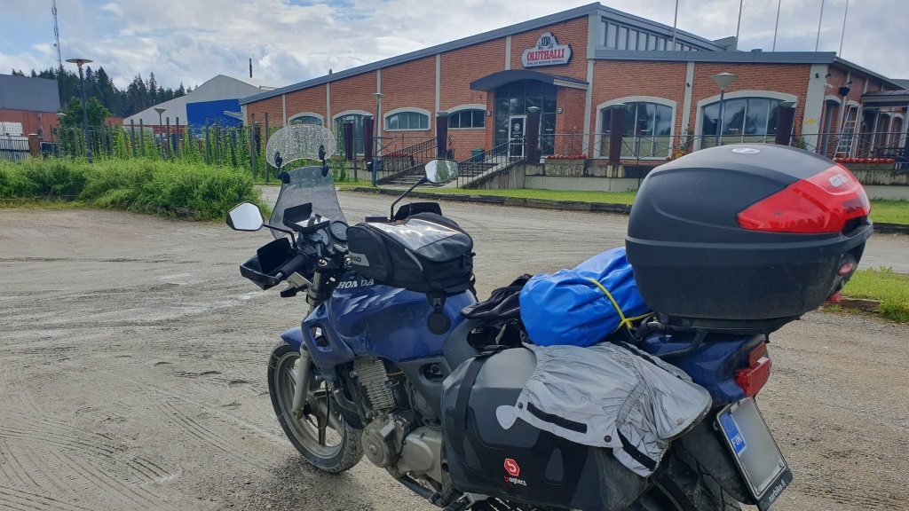
Restaurang Oluthalli. I samma byggnad är Olvis fabriksmuseum inhyst.

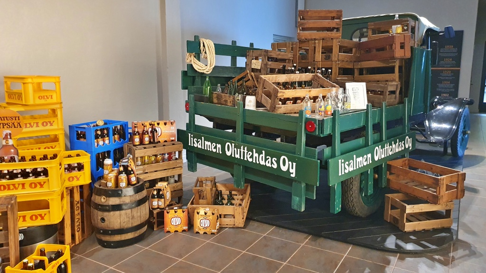
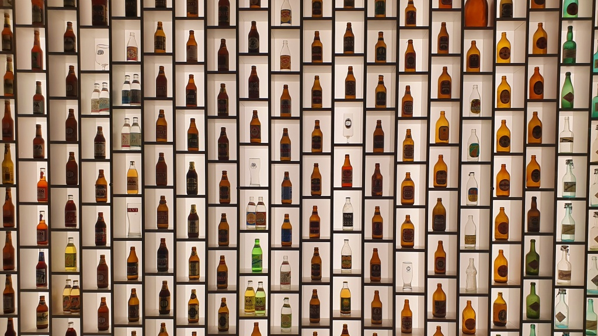

Nästa stopp blev Sonkajärvi. Jag hade lagt in det [internationella flask-muséet](https://www.sonkajarvi.fi/fi/vapaa-aika/kulttuuri/museot-ja-nayttelyt/kansainvalinen-pullomuseo) som valbart besöksmål, men beslöt i varje fall att spara tiden för nationalparken. Från Sonkajärvi körde jag längs en kort grusväg ner till väg 5822, som enligt navigationsappen borde vara kurvig och kul att köra. Nåja, det var mest en massa hål i vägen. Här körde jag i varje fall genom några byar i kommunen Lapinlax, så jag får väl addera den till listan över besökta kommuner. Och nu hade det faktiskt sluta regna.

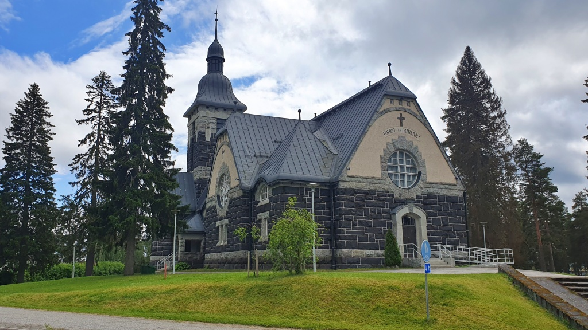

I Rautavaara tankade jag på SEO. Där verkade inte finnas speciellt många ställen att få bränsle, för en långtradare kurvade samtidigt upp för att fylla diesel från personbilarnas pump – det torde ta en bra stund eftersom personbilspumpar fyller mycket långsammare än pumpar för stora fordon.

### Norra Karelen

Staden Nurmes ligger på en hög ås, mycket vackert. Åter igen ett ställe som skulle vara väl värt ett nytt besök när det inte regnar. Sedan vidare mot Juga (Juuka), där jag provianterade S-Market. Det lokala Alko hade exakt _en_ sort av små rödvinsflaskor, så det var ju enkelt att välja.

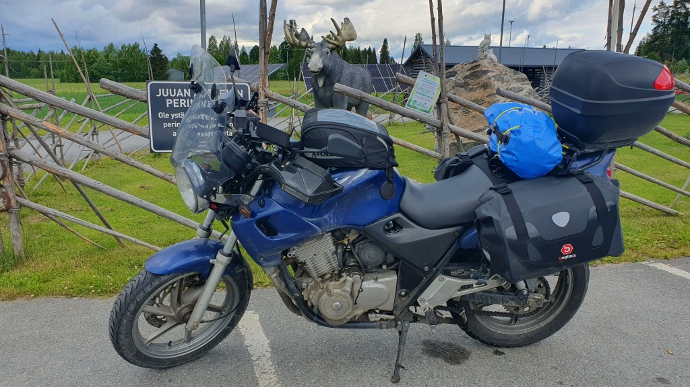
Juga

Ett ögonkast på väderappen avslöjade att ett nytt kraftigt regnområde var på väg. Jag beslöt att chansa på att hinna till turist-shoppen i Koli nationalpark innan det kraftiga regnet började, så jag skippade Juga centrum med det några kvarter stora ”Trä-Juga”.

### Koli nationalpark

Jag hann faktiskt fram till [Koli](https://www.luontoon.fi/sv/destinationer/koli-nationalpark) innan de värsta regnen kom. Det gick inte för sig att åka hoj upp till Koli-hotellet, så jag fick parkera nere och ta hissen upp. Det var ju också en trevlig upplevelse. Sedan tillbringade jag en halvtimme i shoppen under det värst regnet innan jag gav mig ut på en kort vandring längs ”tre toppars tur”.

Koli-topparna var nog den av resans mål jag hade sett mest fram emot, och visst levererade Koli. Den korta turen gick att vandra till och med med tjocka motorcykel-kläder. Visst blev jag lite svettig men samtidigt gick det också bra att sitta en halvtimme i det lätta duggregnet på en klippa på Paha-Koli och beundra den storslagna utsikten. Ett fantastiskt ställe, en underbar upplevelse.

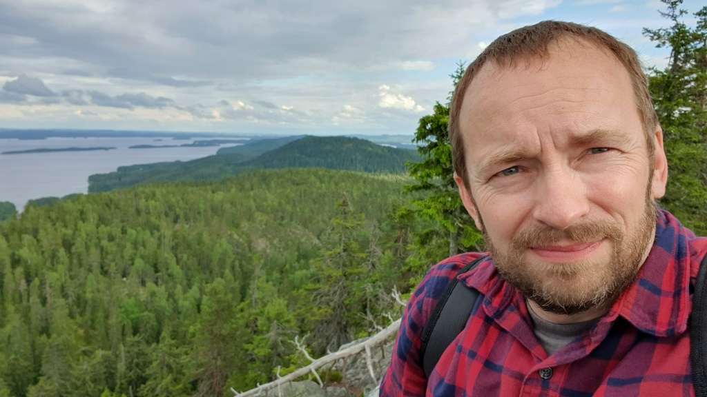
Utsikt från Paha-Koli.

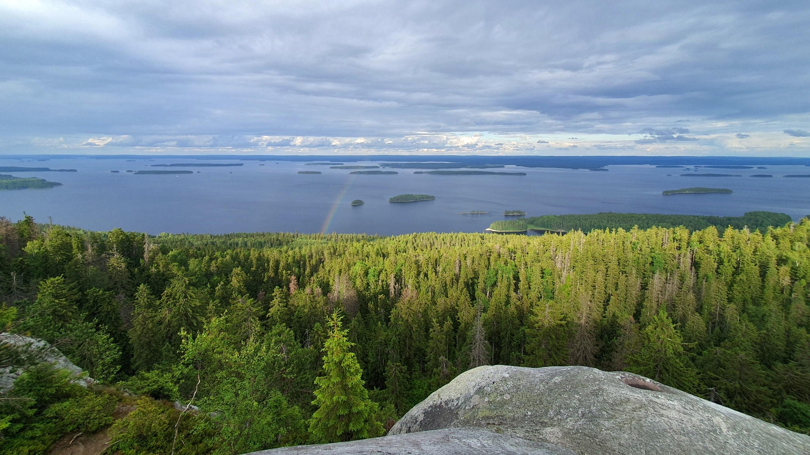
Utsikt över sjön Pielisjärvi (Pielinen). Notera regnbågen.

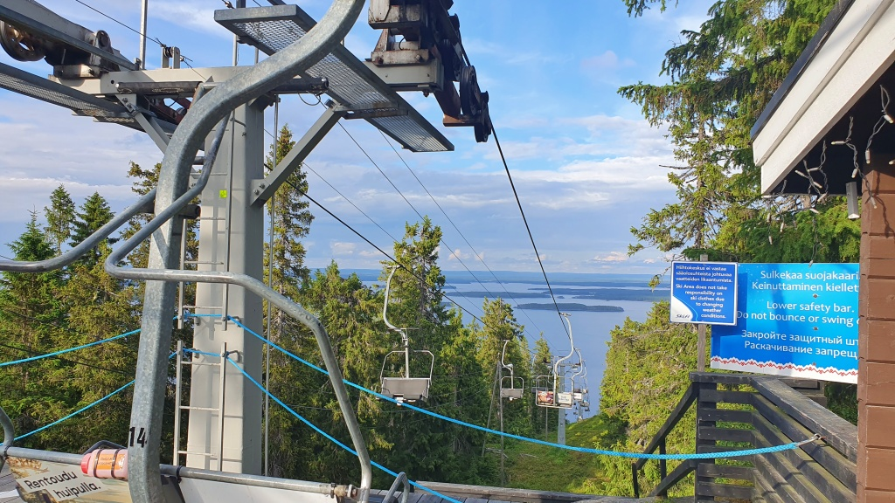
På vintern kan man åka skidor här,

Efter Koli-topparna toppade jag tanken och köpte glass på Sale i Koli centrum. Sedan ett antal kilometer grusväg genom nationalparken till tält-platsen på Lakkala udde. Det var väl inte riktigt meningen att man skulle köra ända fram och sista biten var lite off-road-aktig, men vad skall man göra när man inte har en ryggsäck att bära grejerna i? Egentligen skall man parkera en dryg kilometer bort och vandra den sista biten, men tanken att lämna en del lösa grejer obevakade vid motorcykeln på en parkeringplats lockade inte. Väl framme slog jag upp tältet, grillade en korv och sedan var det dags för nattsömn.

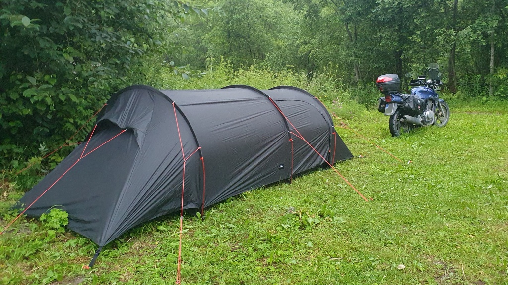
Tältet rest på Lakkala tältplats. Detta är i Kontiolax kommun.

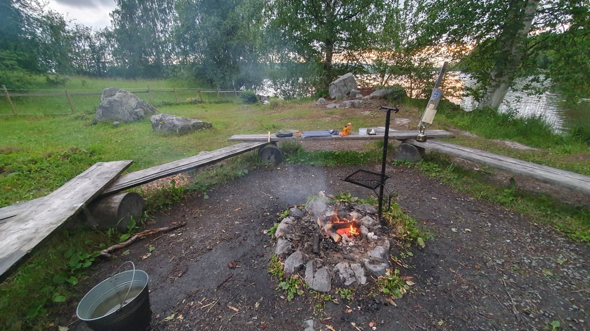
Dags för kvällsbit i Lakkala.

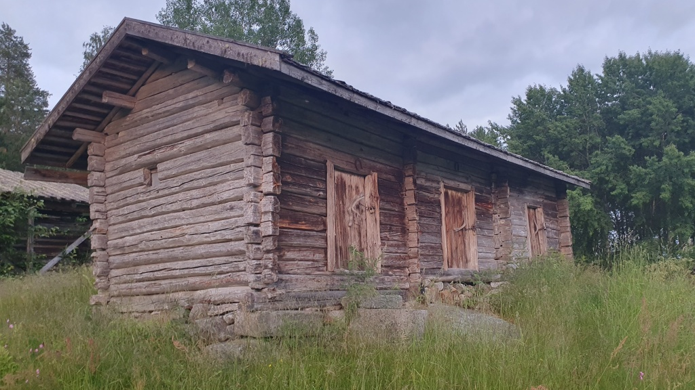
Lakkala var förut ett torp med permanent boende. Här en tillhörande uthusbyggnad. Numera kan man hyra stugan för övernattning i nationalparken.

## Nya kommuner

Mitt långsiktiga mål är att köra min mc Lilla Blue genom alla Finlands 308 kommuner. Denna dag lade jag 15 nya kommuner till listan över de besökta:
* Kyyjärvi (Mellersta Finland)
* Kannonkoski (Mellersta Finland)
* Viitasaari (Mellersta Finland)
* Pihtipudas (Mellersta Finland)
* Pyhäjärvi (Norra Österbotten)
* Kiuruvesi (Norra Savolax)
* Vieremä (Norra Savolax)
* Idensalmi (Norra Savolax)
* Sonkajärvi (Norra Savolax)
* Lapinlax (Norra Savolax)
* Rautavaara (Norra Savolax)
* Nurmes (Norra Karelen)
* Juga (Norra Karelen)
* Lieksa (Norra Karelen)
* Kontiolax (Norra Karelen)
