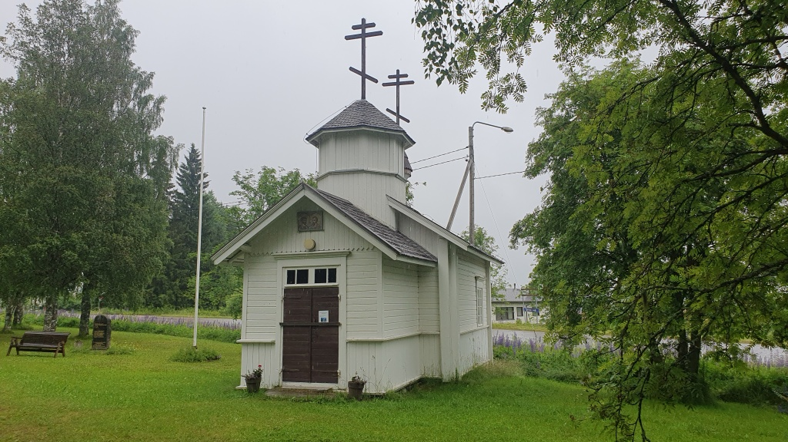
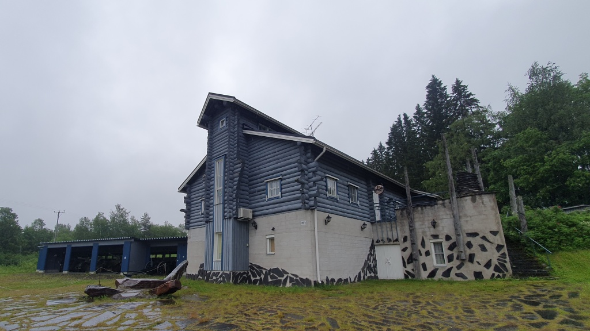
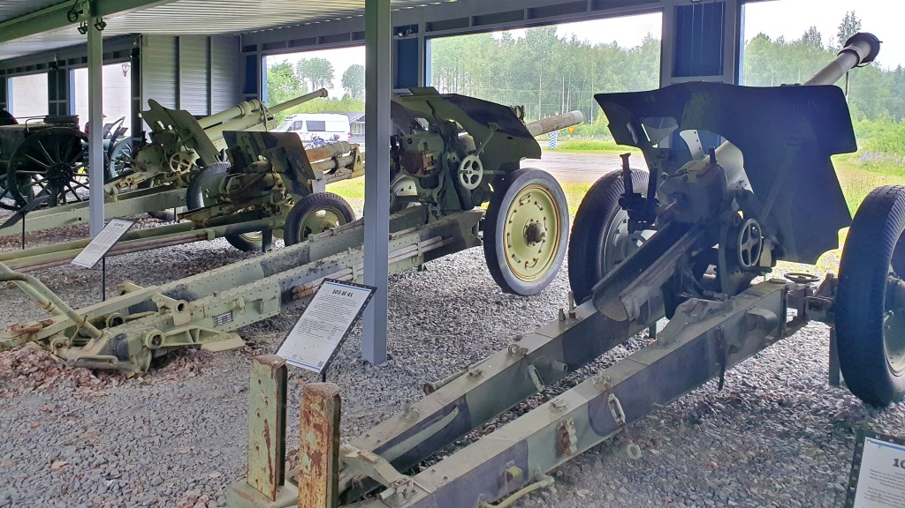
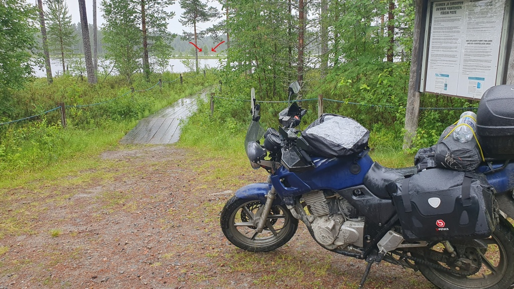
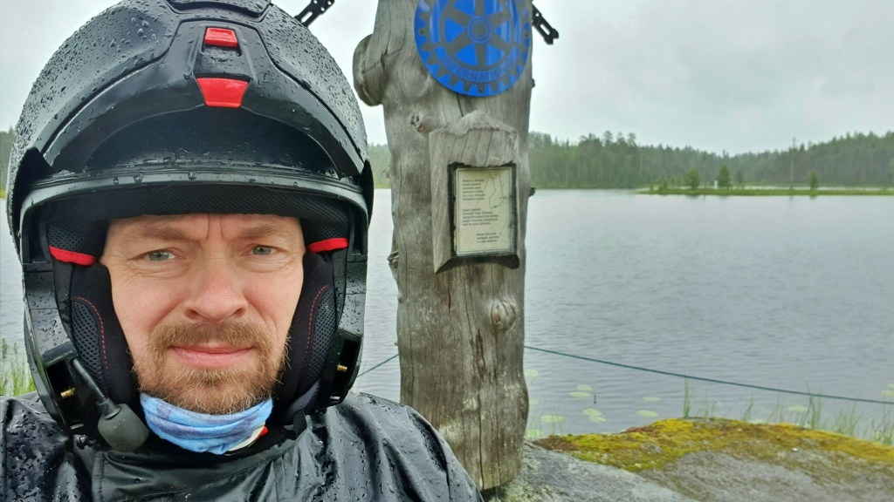
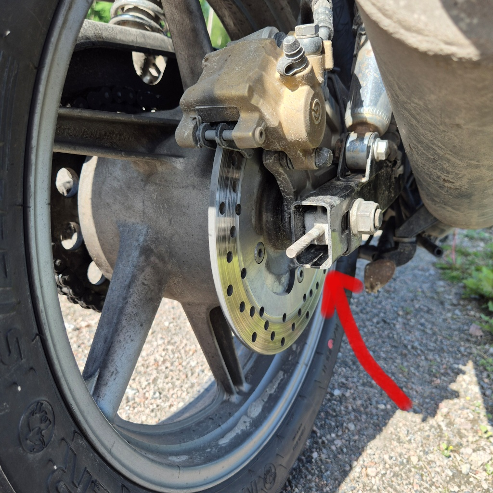
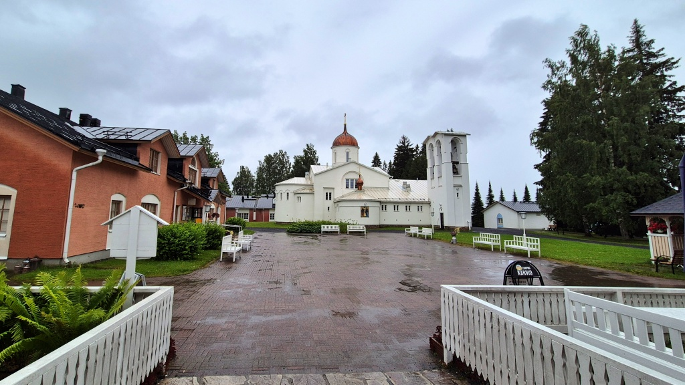
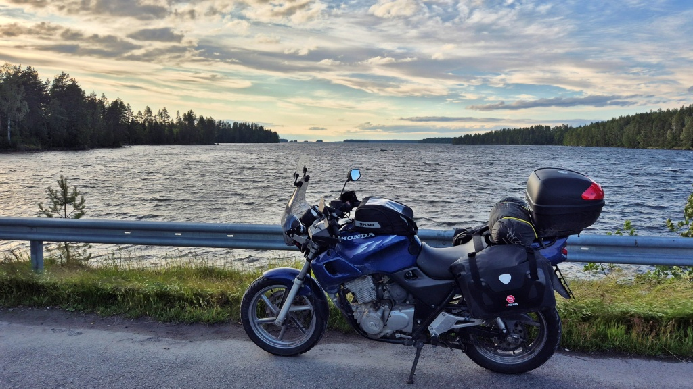
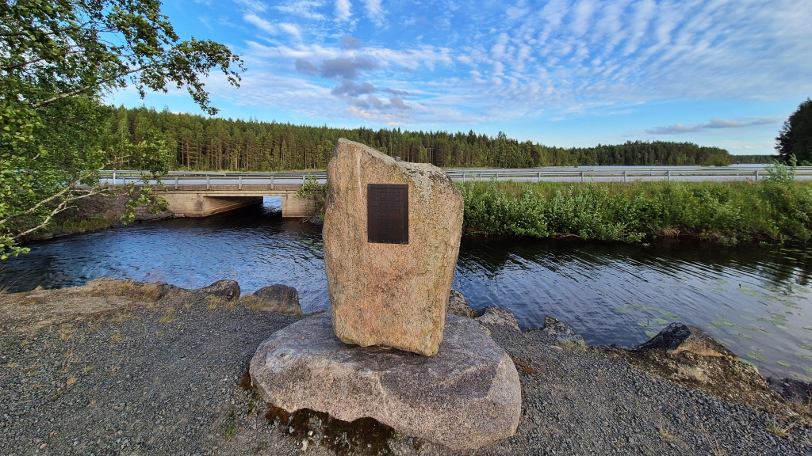
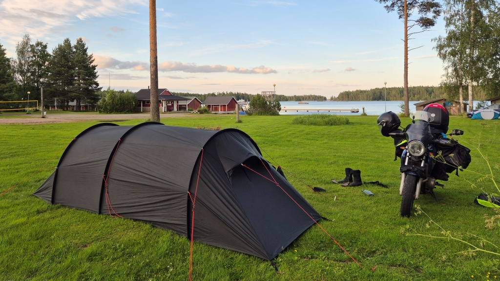

## Finlands regnigaste punkt?

_Dag två av min tre dagars färd i Österled._

### Inledning

Under resans första dag körde jag hemifrån till Lakkala tältplats i Koli nationalpark. Planen för dag två var att besöka Finlands östligaste punkt, Virmajärvi i Ilomants. Detta är tillika Europeiska Unionens fastlands östligaste punkt, åtminstone fram till det att Ukraina kommer med i unionen.

<!--more-->

### Mot Virmajärvi

Väder-rapporten utlovade regn från kl. 8, så jag hade ställt klockan på 7 för att få packa undan ett relativt torrt tält. Nå, klockan 6 började det ösregna, så allt var nog så vått det kunde vara när det skulle packas. Och efter att kila omkring i regnet med packningen var också jag redan ganska våt när jag kom mig iväg mot Virmajärvi.

Resan gick genom [Patvinsuo nationalpark](https://www.luontoon.fi/sv/destinationer/patvinsuo-nationalpark) och sedan vidare längs med grusvägar mot Hattuvaara by i Ilomants. Ställvis var vägen riktigt hal och i något skede var det faktiskt nära att framhjulet hade rymt iväg för mig. Längs vägen åkte jag förbi Endomines guldgruva i Hosko och också nära deras anrikningsanläggning i Pampalo. Båda ställena var givetvis stängda för besökare och såg sådär lite på avstånd inte alls särskillt spännande ut.

I Hattuvaara kikade jag på tsasounan, det lokala ortodoxa bönehuset och sedan tog jag kaffepaus vid [Taistelijan Talo](https://taistelijantalo.fi) (”De stridandes hus”). Där fanns ett museum över striderna i slutskedet av fortsättningskriget där finska styrkor förintade en mångdubbelt större rysk anfallsstyrka och därigenom förhindrade ett förödande genombrott. Jag hoppade ändå över muséet, för jag var i detta skede redan så gott som genomvåt och det lockade inte att traska omkring i våta mc-kläder.

Hattuvaara tsasouna

Taistelijan talo.

Regnskydd bland kanonerna i väntan på att caféet skall öppna.

Sedan styrde jag i det närmaste rakt österut mot [Virmajärvi](https://sv.wikipedia.org/wiki/Virmaj%C3%A4rvi). Några husbilar såg jag på vägen, men någon trängsel var det ju inte. Jag var ensam på själva östligaste punkten. Visst var det väl vackert, med detta var nog mera en ”been-there-done-that-check” än något annat. Grusvägen var inte i speciellt bra skick heller, med ganska stora stenar och ställvis mjukt och ställvis halt i regnet. Nu saknade jag nog en riktig äventyrshoj med bättre fjädring och grövre däck.

Där ute på ön, utmärkt med pilar, finns Finlands blåvita gränsmarkering och Rysslands röd-gröna dito.

Check. Been there, done that!

### Strul med hojen, strul med telefonen

Någonstans på vägen tillbaks small det till baktill. Jag stannade och tittade men såg ingenting just då. Antagligen hade jag då redan tappat svingarmens högra slutstycke, vars syfte är att hålla bakhjulet stabilt. Jag märkte att den saknades först senare, men jag hade lagt märke till att det kändes om möjligt ännu instabilare att köra tillbaks mot Hattuvaara än på vägen dit. Utan slutstycket vinglar bakdäcket aningen också på asfalt, det känns lite som att köra på grus. När man kör på grus är det givetvis ännu värre. Trots att det kändes lite konstigt att köra var det ändå ingen akut risk att hjulet skulle trilla av eller så, så det blev att köra hela vägen hem utan denna del.

Den saknade komponenten (bilden knäppt en annan dag)

Jag fortsatte i ösregnet till Ilomants centrum. Telefon och displayen med Android Auto guidade mig in på S-Markets ABC för att tanka men när jag tog fram telefonen för att betala så var den helt död. Då antog jag att det var fukten som orsakat telefonen att dö. Det inget problem tankningen, jag fick betala med kort istället för med ABC-appen, men sedan var jag ju också utan navigation, jag hade ingen papperskarta. Inte heller hade jag nåt sätt att låta familjen veta att jag mår bra, trots att jag inte svarade i telefon. 

Efter en kort rundtur i staden tog jag en kaffe och en funderare på [Hermannin viinitorni](https://hermannin.fi/fi/hermanni/viinitorni/) (”Hermannis vintorn”), en bar uppe i ett gammalt vattentorn. Här måste nog sägas att vyn från barens ute-terrass skulle ha varit fenomenal om man bara sett något genom spöregnet. Hela Ilomants med omnejd är nog vackert. Bör återses i bättre väder. Tyvärr spöregnade det hela tiden och dessutom hade jag mest tankarna på det nyss uppkomna problemet.

Ny telefon, fick det bli. De hjälpsamma unga damerna i baren visade på Google Maps var Gigantti finns i Joensuu, skulle knappast bli problem att hitta dit utan karta. Så dit styrde jag som nästa. Telefon inhandlades och tillika skyddsglas och telefonfodral från Prisma, som ligger granne med Gigantti. Sedan satt jag där i dyvåta motorcykelkläder på Prisma i Joensuu och installerade den nya telefonen. Tyvärr kunde jag inte de avgörande lösenorden utantill och utan lösenord inga appar. Men jag kunde i varje fall meddela familjen att jag var välbehållen.

Nu hade mycket tid använts till att fundera på telefoner. Jag skippade att åka genom Joensuu centrum och styrde istället kosan mot [Nya Valamo kloster](https://sv.wikipedia.org/wiki/Valamo_nya_kloster) i Heinävesi. Där åt jag en mycket sen och rätt smaklös lunch och fortsatte sedan färden. 

Nya Valamo kloster

### Styr mot solen

Tanken var att åka genom Varkaus och sedan via Sorsakoski till Leppävirta, men eftersom det lovades uppklarnande väder bara mot Leppävirta-hållet, skippade jag Varkaus. Och mycket riktigt, på väg mot Leppävirta övergick ösregnet först i duggregn och sedan slutade det helt. Jag korsade den storslagna Leppävirta bro utan att orka stanna och fotografera och vände stället av mot Suonenjoki. En bit norr om Leppävirta fick jag äntligen ta av mig regnställ och stövelskydd och byta de totalt genomsura vinterhandskarna mot nästan torra sommarhandskar – vid det här laget sken redan solen och jag började snabbt torka upp i fartvinden.

Suonenjoki verkade inte vara ett speciellt spännande ställe, men lika väl blev det lite äventyr. Jag tankade med kort, vilket betyder att jag steg av hojen (när jag tankar med mobilen brukar jag inte stiga av). När jag skulle kliva över och upp på hojen och i samma rörelse ta den av foten, lyckades jag välta den. Det var en manöver som jag nog gjort ett flertal gånger utan problem, men nu, trött efter dagens strapatser, fick jag motorcykeln att välta. Tidigare har jag nog klarat av att resa upp hojen utan problem, men fulltankad och med packning på var den faktiskt riktigt tung. Inga skador, förutom att sidospegeln lossade när jag lyfte – bara att spänna åt på nytt.

Kort paus i Rautalampi

Minnesmärke över [flygolyckorna i Rautalampi](https://visitrautalampi.fi/fi_FI/kansanrunoilijat-ja-muusa/rautalammin-lentoturmat-muistomerkki) 1939 och 1941

Dags för dagens sista besvikelse. Jag körde genom Rautalampi och in i [Södra Konnevesi nationalpark](https://www.luontoon.fi/sv/destinationer/sodra-konnevesi-nationalpark). Jag hade sett ut en plats att övernatta, men det visade sig att det inte gick att ta sig dit med motorcykel (åtminstone inte utan att köra över privata markägares vägar och köra förbi en potentiellt stängs bom). Jag ville inte vara ”den där killen” (igen), så jag gav upp nationalparken och körde istället till [Häyrylänranta Camping](https://hayrylanranta.fi) i Konnevesi. Och där hade jag nog mer än lite tur. Jag hade inte märkt att klockan redan var över 21, så campingplatsen hade redan stängt. Men den sista anställda höll precis på att stänga för dagen och hon lovade mig vänligt nog slå upp mitt tält och gav mig dessutom tillgång till dusch-utrymmet.

Härylänranta Camping, Konnevesi

En varm dusch kanske inte helt kompenserade att jag missade den planerade turen på Vuori-Kalaja-vandringsleden, men visst gjorde det susen att få på sig torra underkläder. Ytterplaggen hade i stort sett torkat av fartvinden, så när som på stövlarna. Så kvällen avslutades med att jag åt grillkorv och drack rödvin medan jag diskuterade Livet, Universum och Allting med Konnevesibon Eero, som hade letat sig ner till campingens grillplats.

## Nya kommuner

Mitt långsiktiga mål är att köra min mc Lilla Blue genom alla Finlands 308 kommuner. Denna dag lade jag 8 nya kommuner till listan över de besökta:
* Joensuu (Norra Karelen)
* Ilomants (Norra Karelen)
* Libelits (Norra Karelen)
* Heinävesi (Norra Karelen)
* Leppävirta (Norra Savolax)
* Suonenjoki (Norra Savolax)
* Rautalampi (Norra Savolax)
* Konnevesi (Mellersta Finland)
