## Tikkakoski flygvapenmuseum

_Dag tre av min tre dagars färd i Österled._

### Inledning

Resans första etapp var från hemmet till Koli nationalpark. Under dag två tog jag mig från Koli till Virmajärvi i Ilomants och sedan via Joensuu till Häyrylänranta Camping i Konnevesi. Dag två bjöd på ihållande ösregn ända till kvällen, då det äntligen klarnade upp. Denna tredje och sista dag var planen att besöka Tikkakoski flygvapenmuseum och sedan söka sig hemåt.

<!--more-->

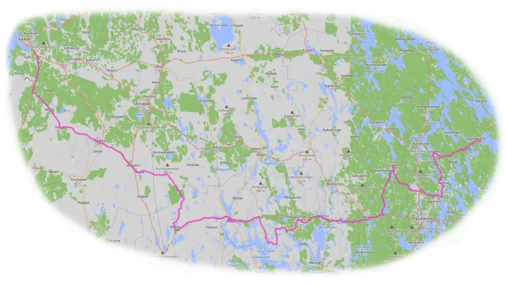

### Mot Tikkakoski

Denna dag vaknade jag i ett solvarmt tält. Det mesta jag packade ihop var nu torrt eller nästan torrt efter gårdagens ösregn. Av körutrustningen var bara stövlarna fuktiga (Gore-Tex håller fukten ute en kort stund men håller fukten inne väldigt länge). Och så var mitt första par handskar förstås fortfarande genomvåta, de kommer säkert att vara fuktiga en bit in i Augusti. Men jag hade ju flera par handskar med. Jag passade på att göra lite service på hojen innan campingen öppnade kl. 9, sedan betalade jag övernattningen, åt frukost och åkte iväg västerut.

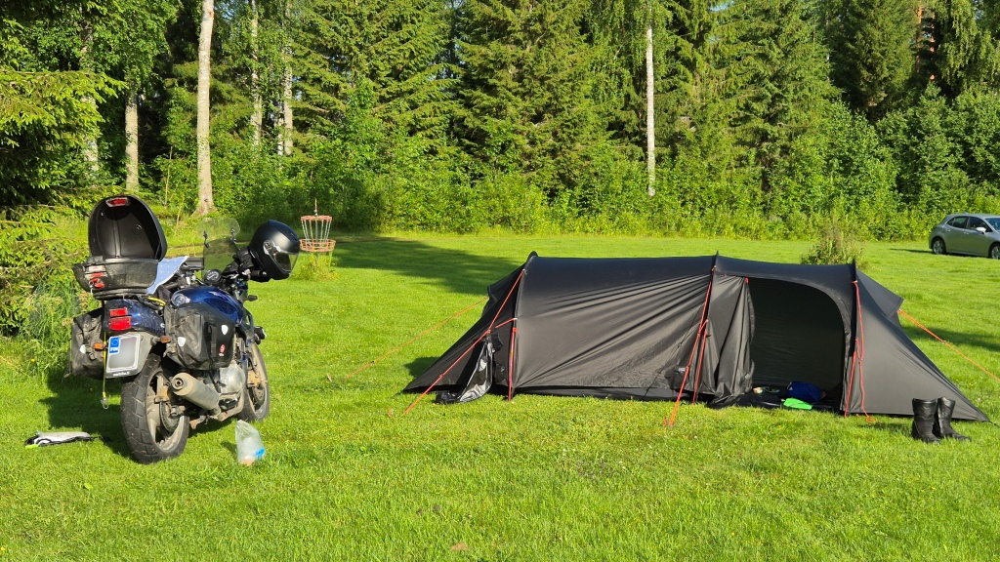
Solvarmt tält.

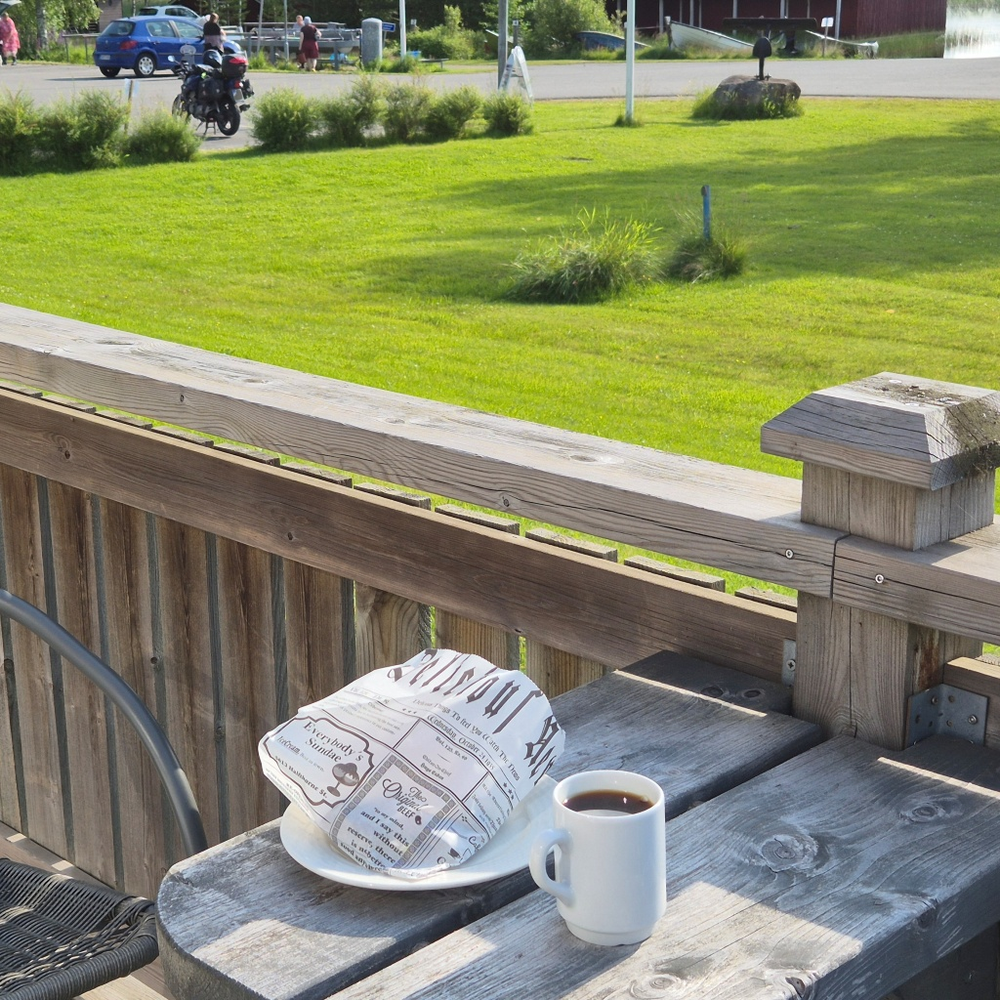
Frukost när campingens restaurang öppnat för dagen.

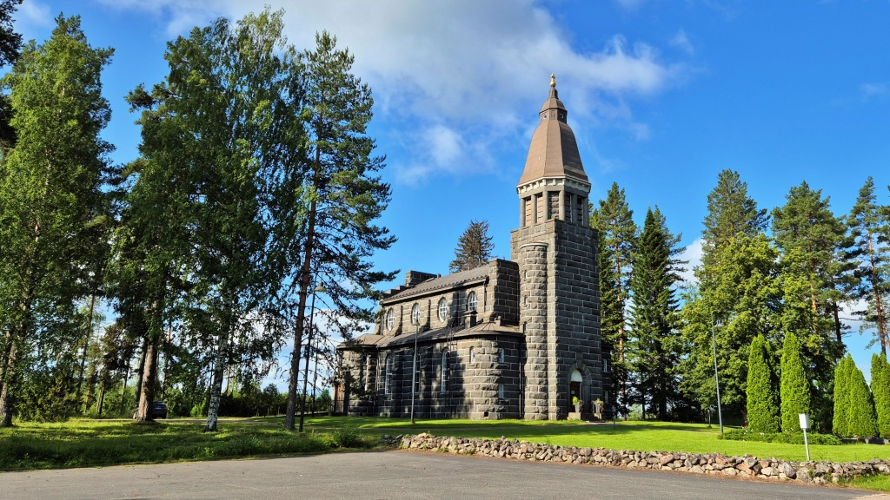
Konnevesi kyrka ser lite speciell ut.

I Äänekoski stad körde jag via Valtras fabrik i Suolahti och sedan beundrade jag Suolahti gamla tågstation alldeles nere vid hamnen. Längs vägen mot Laukas kikade jag på Kuusa kanal. Sedan genom Laukas centrum och så tog jag också en titt på slussen i Kuhankoski. Här hittade jag riktigt sköna MC-vägar på väg mot Tikkakoski, men tyvärr lade vetskapen om den saknade svingarms-delen lite av en våt handduk på nöjesåkningen.

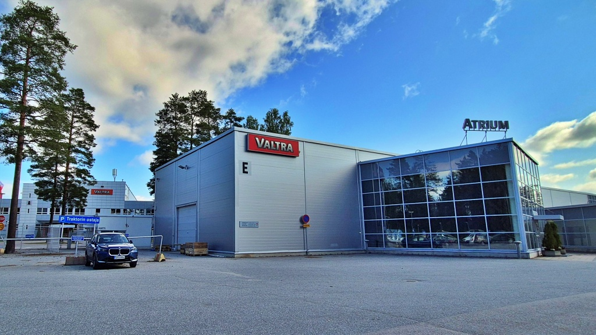
Valtras fabrik i Suolahti.

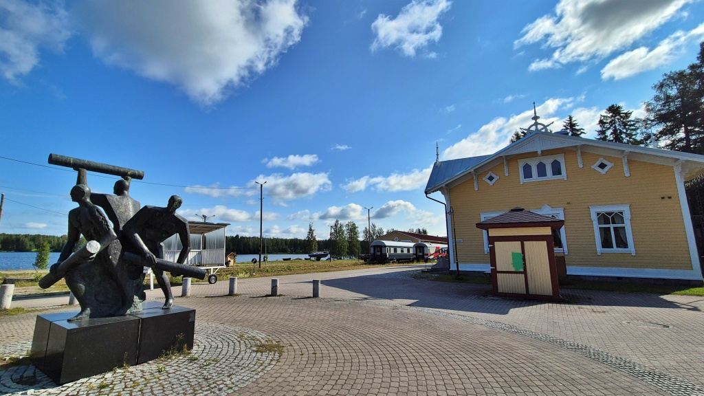
Suolahtis gamla tågstationen intill hamnen.

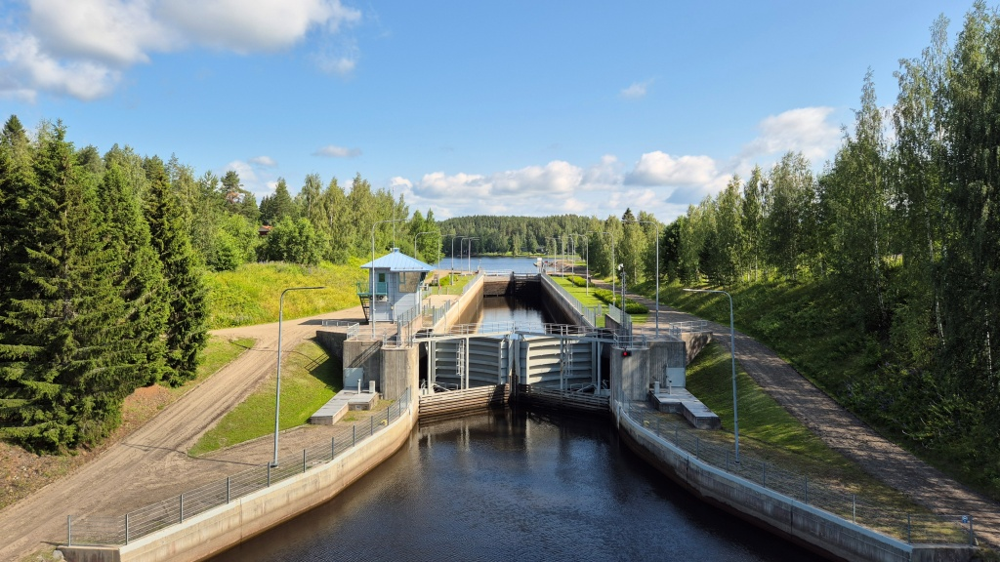
Kuusa kanal.

### Flygvapenmuseet

Sedan var det dags för resans tredje höjdpunkt – [flygvapenmuseet i Tikkakoski](https://ilmavoimamuseo.fi). Det är en imponerande samling flygplan och kringutrustning som finns att beskådas. Där fanns nog de flesta flygplanstyper som använts i flygvapnet från de första one-off planen till jet-stridsplanen Saab Draken och Mig 21. För att nu lyfta fram några höjdpunkter kan jag kanske nämna en Brewster Buffalo som lyfts ur en sjö i ryska Karelen och som visas i det skick den hittades, och visst känns det också lite tufft att klämma sig ner i en Saab Draken cookpit.

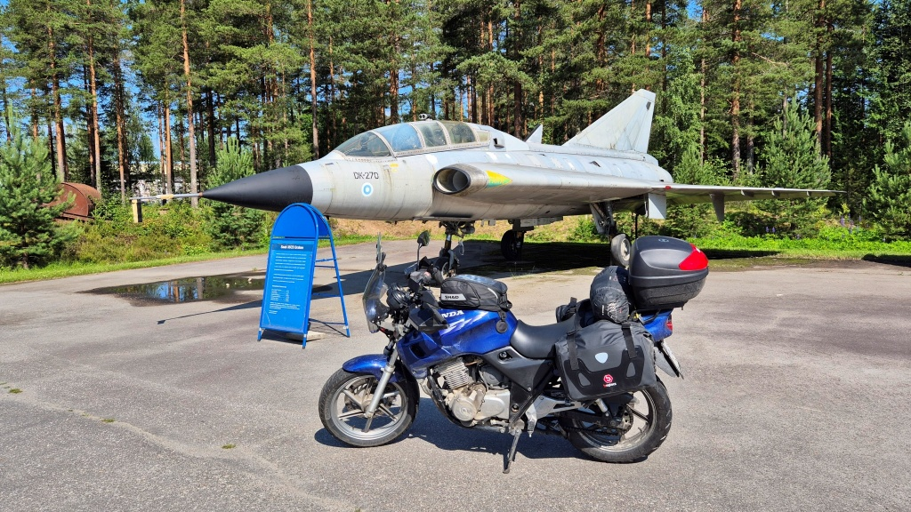
Två fartvidunder.

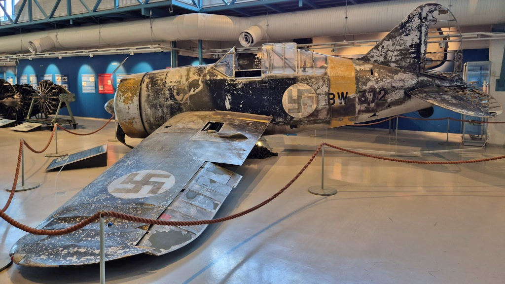
Brewster Buffalo

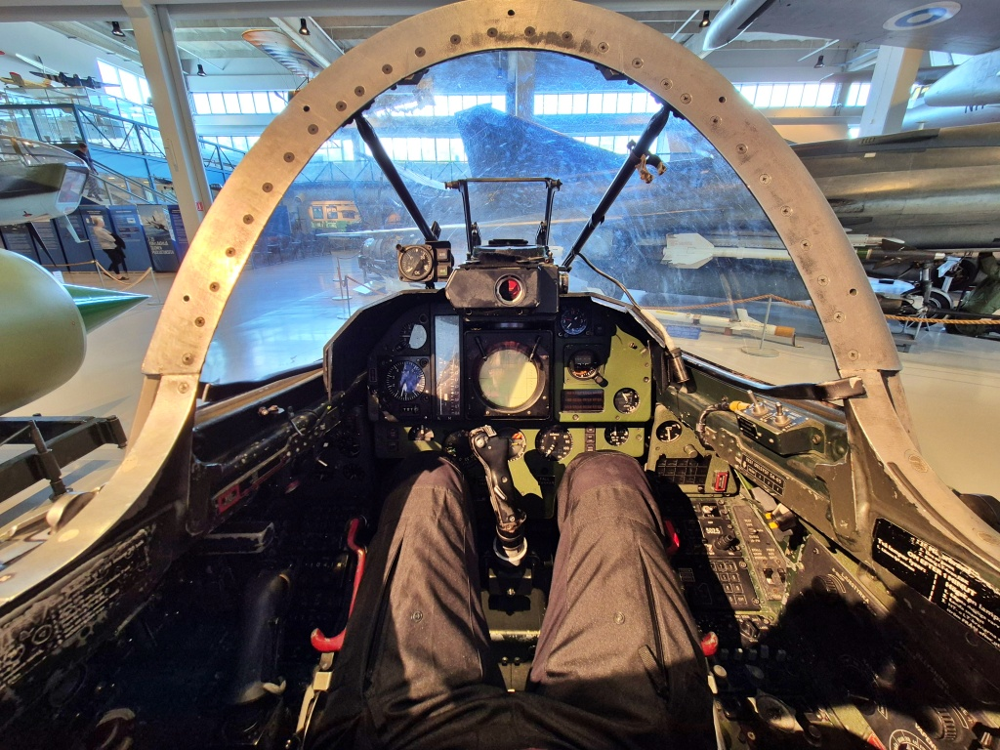
I Saab J-35 Drakens cookpit.

Här spenderade jag halvannan timme och skulle nog ha kunnat fortsätta en stund till.

### Plötsligt kom sommaren

Från Tikkakoski åkte jag först till Urais och sedan ner till Petäjävesi. Jag kikade som snabbast på [Petäjävesi gamla kyrka](https://sv.wikipedia.org/wiki/Pet%C3%A4j%C3%A4vesi_gamla_kyrka), som är ett av sju Finländska objekt på [Uncescos världsarvslista](https://www.museovirasto.fi/sv/om-oss/internationell-verksamhet/varldsarvet-i-finland#Pet%C3%A4j%C3%A4vesigamlakyrka). Sedan fortsatte jag färden västerut mot Keuru. I Keuru åt jag lunch på Pizzeria La Mel, som lyckligtvis serverade lunch med stående bord och till lunchpriser också efter kl. 14. Så tankade jag en sista gång för denna resa och åkte vidare västerut mot Haapamäki.

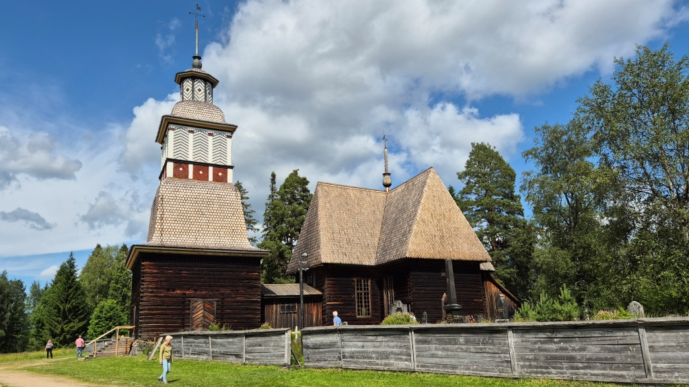
Petäjävesi gamla kyrka.

Haapamäki lokmuseum är tyvärr stängt, det hade jag läst, men jag måste ju konstatera att så var fallet med egna ögon. Sedan hade jag bestämt mig att åka rakt till Virdois, men jag körde fel och hamnade på vägen söderut mot Pohjaslahti. Ingen större skada skedd, jag hade haft denna tur som en valbar omväg. Jag tog nu vägen via Ylä-kolkki för att få köra längs med Rantalansärkkä (”Rantala-banken”).

Och någonstans där, söder om Haapamäki, kom sommaren. Plötsligt kändes det rysligt varmt i min körutrustning. Så på en sandig sidoväg strax norr om Rantalansärkkä tog jag äntligen av mig långkalsongerna och tog bort vinterfordringen från Gore-Tex-jackan. Fram till den nionde juli detta regniga, blåsiga och kalla år hade vinterattiraljerna varit fullständigt på sin plats. Och när sommaren väl kom kändes ju inte Gore-Tex utan vinterfordring heller riktigt mysigt längre, nu blev det plötsligt för varmt.

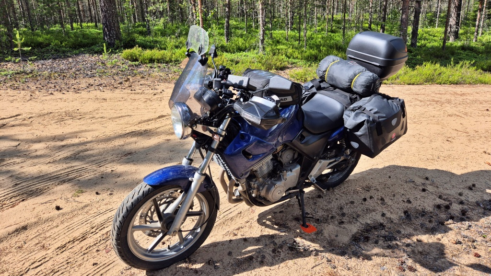
Här började äntligen sommaren!

Varmt eller inte fortsatte färden till Pohjaslahti, en före detta kommun, numera del av Mänttä-Vilppula. I Pohjaslahti tog jag kaffepaus på museumscaféet [Heikintupa](https://visittaidekaupunki.fi/kulttuuri/heikintupa/) (”Heikkis stuga”). I ärlighetens namn behövde jag inte en kaffe då, det var mest nyfikenhet på stugan som fick mig att stanna.

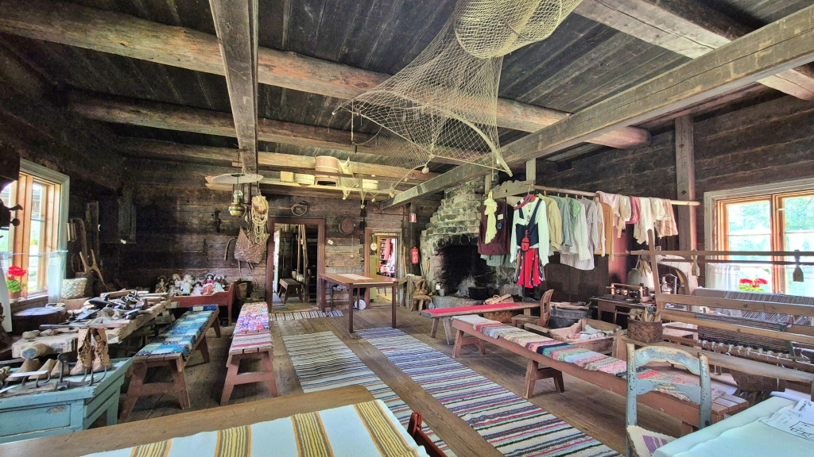
Heikintupa i Pohjaslahti.

### Hemåt

Sedan vidare till Virdois, där jag irrade mig ner till hamnen och simstranden, som nu var full med badande barn. Från Virdois kan man åka med ångbåten Tarjanne ända ner till Tammerfors, via insjöar, kanaler och slussar. Det skulle vara spännande. Därefter vek jag av till Virdois friluftsmuseum ([Virtain Perinnekylä](https://visitheartfinland.fi/kohteet/virtain-perinnekyla/)) intill Herraskoski kanal.

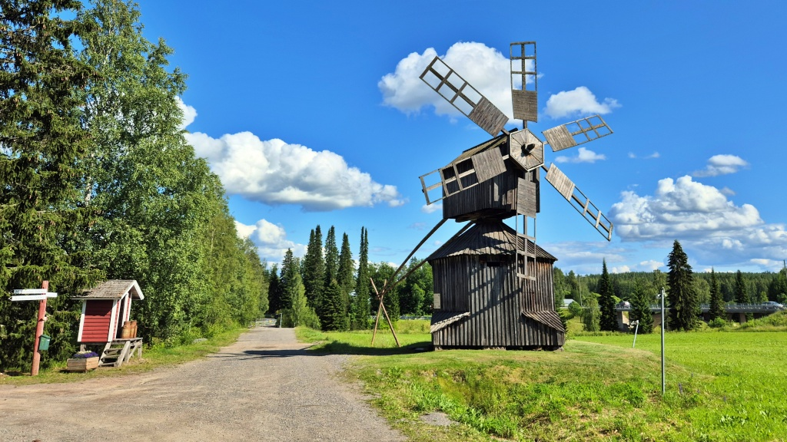
Virdois friluftsmuseum

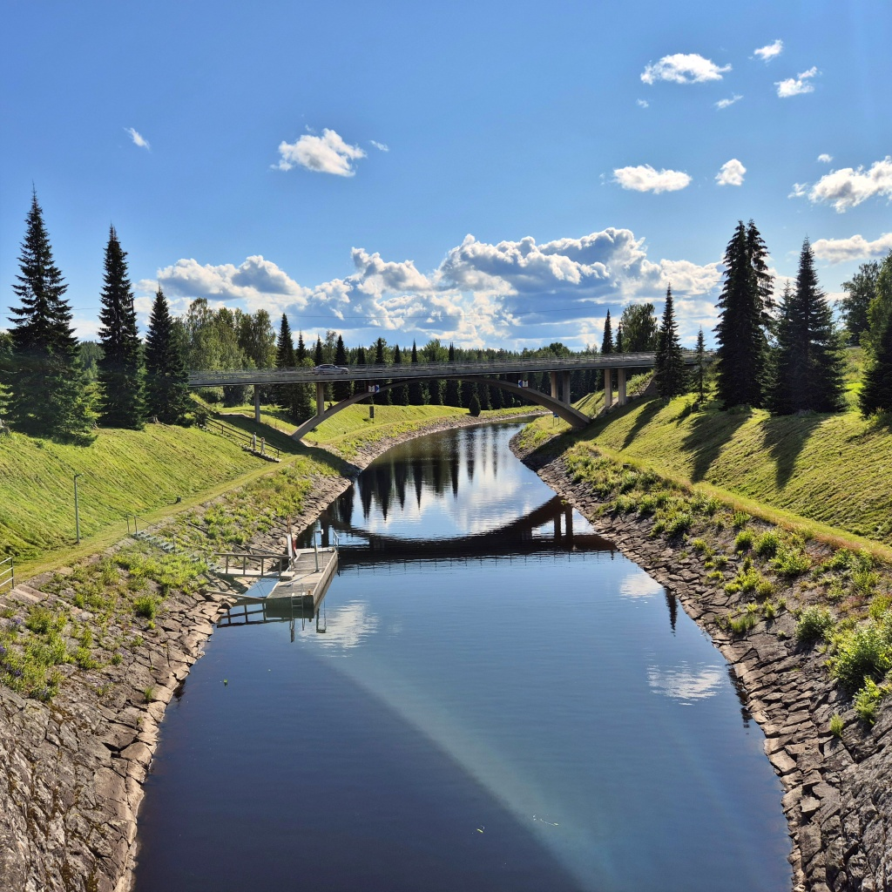
Herraskoski kanal i Virdois.

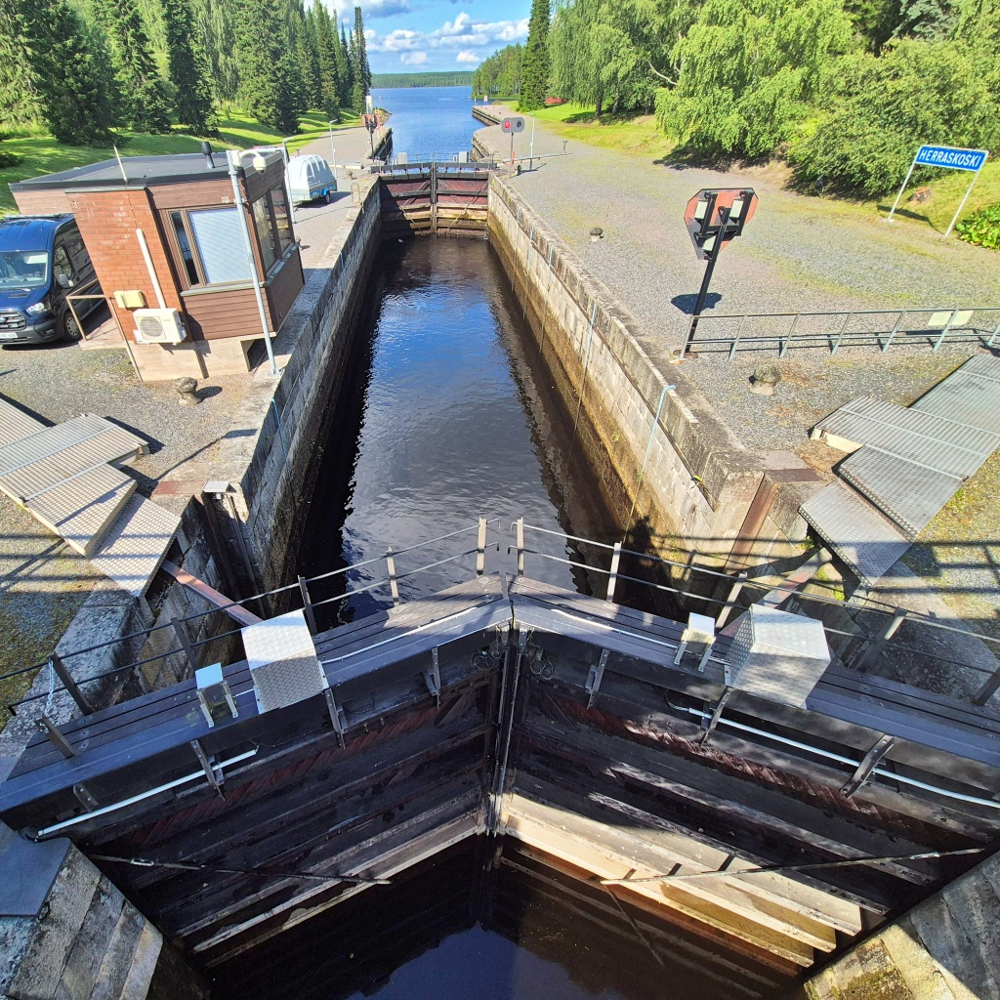
Sluss i Herraskoski kanal.

Navigeringen utan att ha en karta på skärmen bjöd på vissa utmaningar, alltid tog jag inte den väg jag hade tänkt, men jag kom mig i varje fall vidare i rätt riktning och till Kihniö, som planerat. I Kihniö fanns det egentligen inte så mycket att se så jag fortsatte norrut mot Peräseinäjoki-hållet och sedan till Jalasjärvi. Från Jalasjärvi via Kurikka och Jurva och hem var det sedan bekanta vägar.

Totalt blev det 1700 km körning, mest på den första dagen med ca. 699 km.

Budgetmässigt var resan rätt överkomlig. Jag tankade 68 liter bränsle för 120 €. Jag åt lunch på tre ställen, drack kaffe på tre, köpte lite proviant, betalade för camping och frukost i Konnevesi samt inträde till Tikkakoski flygvapenmuesum. Totalt klarade jag mig på under 200 €. Det vill säg, om man nu inte också räknar med anskaffning av en ny telefon och inköp av andra grejer (sadelväskor, tält mm.) och nya reservdelar till Blue - men vem skulle räkna så?

## Vad har jag lärt mig?

På det hela taget gick resan bra. Körmängden var rätt passlig, 700 km på en dag kändes helt bra – också därpå följande dag. Det största problemet var att välja mellan att köra eller att stanna och titta på intressanta ställen. Och så måste man ju hinna äta.

Inför dag två visste jag att det skulle regna rejält. Jag valde mellan att följa den ursprungliga planen med det värsta regnet eller att istället styra västerut mot bättre väder. Jag valde att följa planen. Jag vet inte om det är lönt att göra ett sådant val nästa gång. Det blev mera att ”checka av” Virmajärvi än någon egentlig njutning. När det ösregnar lockar det inte heller att stanna så ofta, det är krångligt att få av och på utrustningen – i synnerhet de helt genomvåta handskarna. Och grusvägarna (lervägarna?) var ställvis så hala att jag kunde ha åkt omkull.

Förta natten körde jag hela vägen fram till övernattningsplatsen i Koli nationalpark. Andra natten visade sig att det inte gick att köra fram till den tilltänkta övernattningen i Södra Konnvesis nationalpark. Det verkar nog vara med en regel än ett undantag att man inte kan köra hela vägen fram i nationalparker. Det är synd – det finns många nationalparker jag gärna skulle besöka med motorcykel, men att lämna cykeln och bära sidoväskor och tält mm. en kilometer längs en skogsväg lockar inte.

### Utrustning

Motorcykeln höll ihop – till största delen. Svingarmens ände föll bort, men i slutändan påverkade det inte färden. Sidospegeln fäste jag med medhavda verktyg. Och hittills har jag klarat mig bra med den uppsättning verktyg jag har med.

Jag trodde regnkläder skulle hålla vatten – det gör åtminstone inte det regnställ jag har. Några timmar regn klarar de bra, men en hel dags ösregn är tydligen för mycket – jag var våt ända in till kalsongerna. 

Mina stövelskydd kan man väl närmast klassa som värdelösa. Det gick hål vid växelfoten redan första turen jag använde dem och denna gång blev mina Gore-Tex stövlar helt genomvåta trots att jag använde överdragen. Kanske skyddar de lite mot att stövlarna blir helt nedskitade, men det är i såfall allt.

## Nya kommuner

Mitt långsiktiga mål är att köra min mc Lilla Blue genom alla Finlands 308 kommuner. Denna dag lade jag 9 nya kommuner till listan över de besökta:
* Äänekoski (Mellersta Finland)
* Laukas (Mellersta Finland)
* Jyväskylä (Mellersta Finland)
* Urais (Mellersta Finland)
* Petäjävesi (Mellersta Finland)
* Keuru (Mellersta Finland)
* Mänttä-Vilppula (Birkaland)
* Virdois (Birkaland)
* Kihniö (Birkaland)

Efter min tre-dagars resa är 108 av Finland 308 kommuner avklarade.
