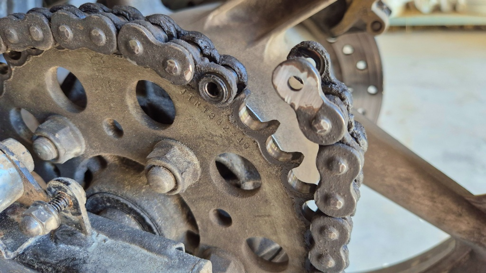
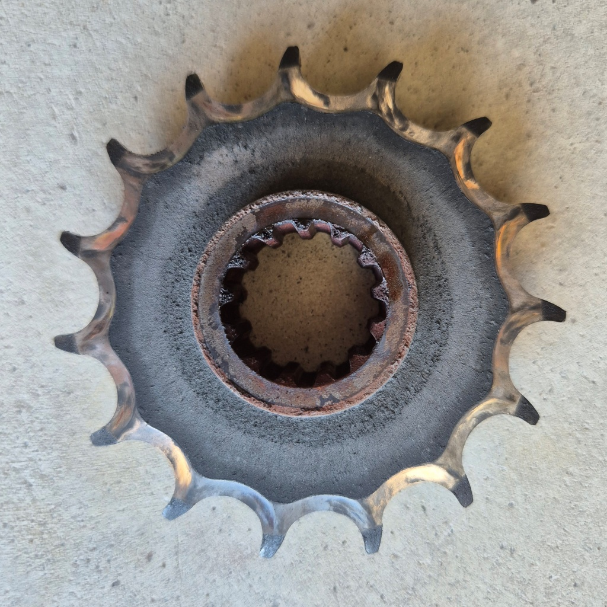
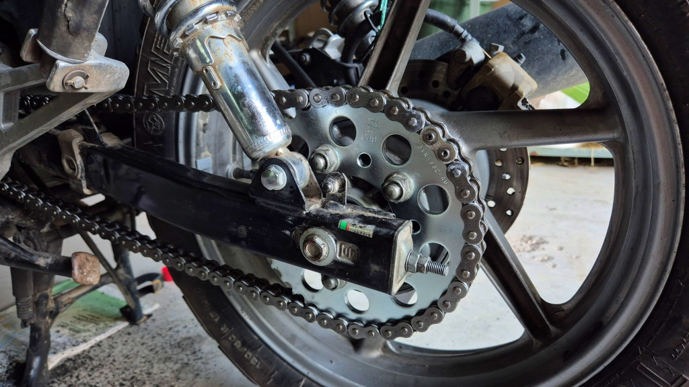

# Ny drivkedja och nya drev

Dags att byta kedja och drev. Det börjar höras rasslande ljud från drevet, i synnerhet om kedjan inte är perfekt spänd. Kedjan rör sig också rätt mycket i sidled på kugghjulet. Nu får man väl lida för att inte underhålla speciellt noggrannt. Själv har jag kört dryga 16 000 km med denna ked, men knappast var den helt ny när jag köpte hojen. Betydligt mer än så borde väl en kedja klara av?

<!--more-->

Efter lite hjälp från vinkelslipen är det lätt att kapa kedjan med kedjebrytare.

Det gamla drevet behövdes verkligen bytas! Häftiga hajtänder.

Den nya kedjan på plats. Bara torka av lite fabriksfett och så är det dags för en provtur.

