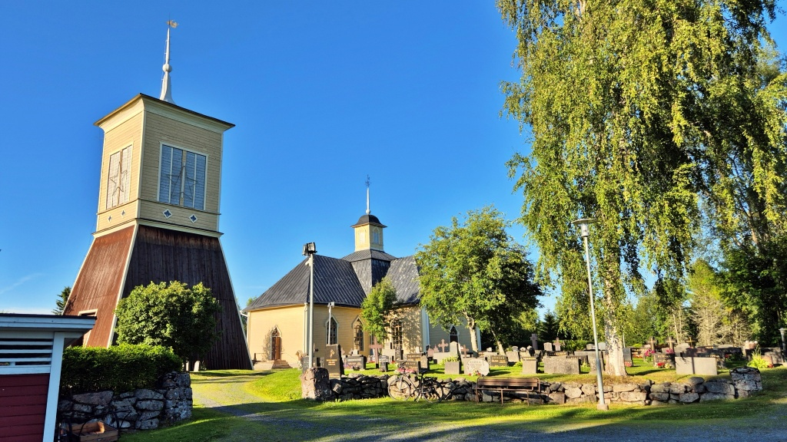
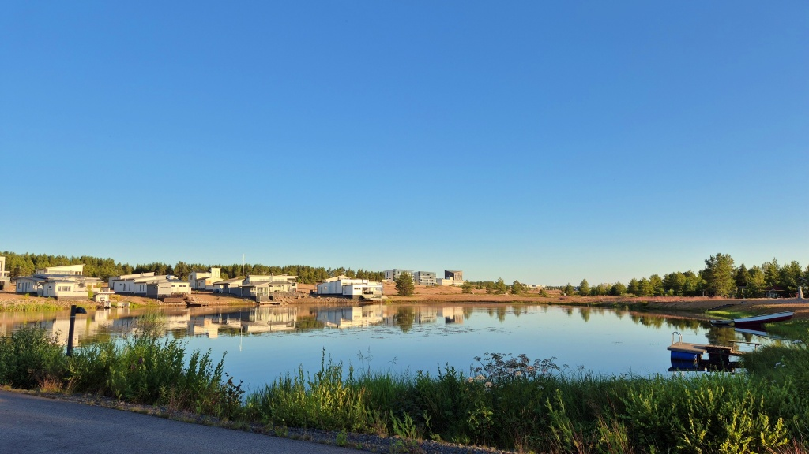
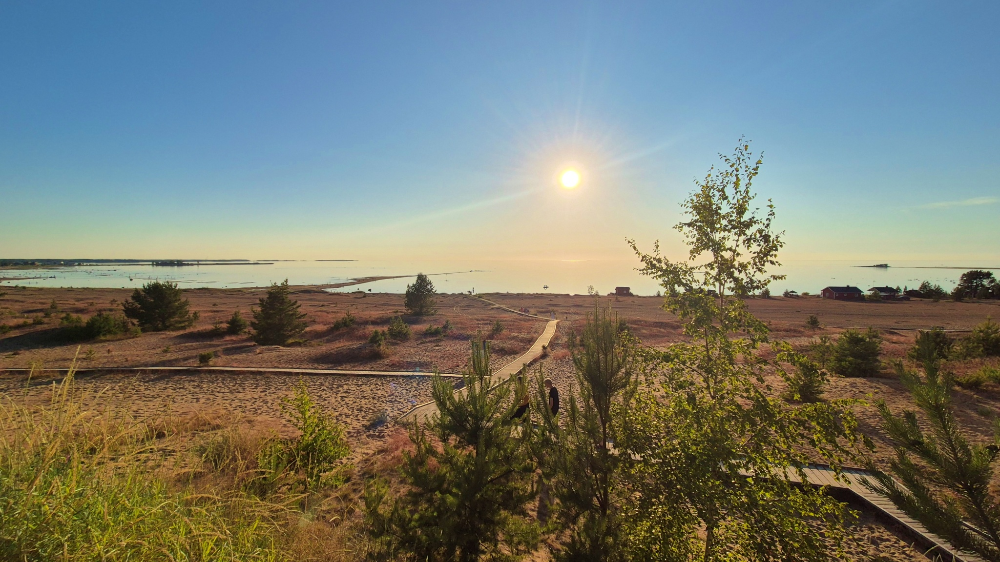
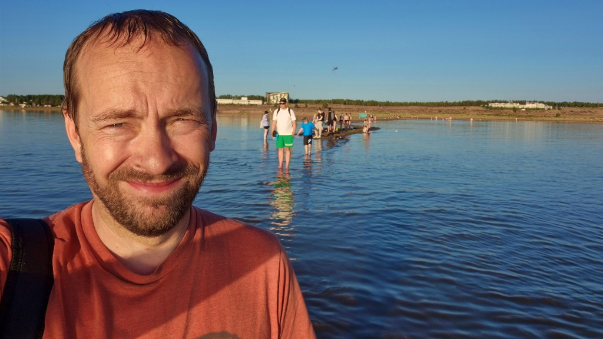
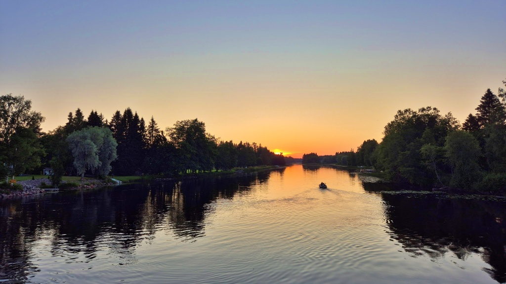
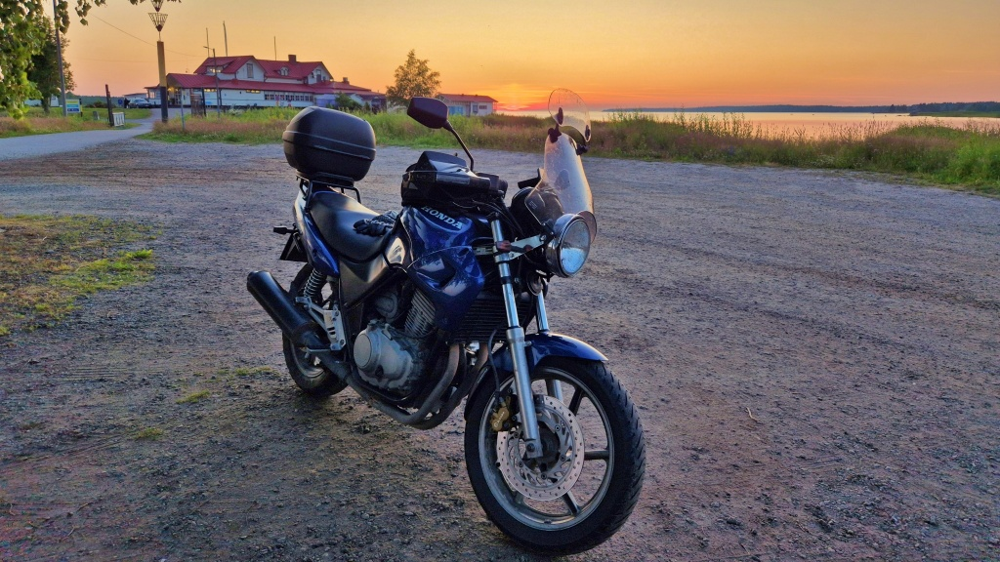

# Åka och bada – men inte till närmsta stranden

Dagen hade varit varm, resten av familjen befann sig på annan ort och jag fick lust att ta en simtur. Det blev lite onödigt sent innan husdjuren fått sin mat och allt var fixat, ca. 16:15 rullade jag iväg. Termometern visade runt 29ºC. I stället för att ta kortaste vägen, försökte jag hitta lite roligare vägar, men med den temperaturen ville jag ändå hålla mig på lite snabbare vägar för att få lite fartvind. Första delen av resan gick längs med bekanta vägar, längs Kyro älv till Lillkyro, sedan Vörå, Ylihärmä, Alahärmä, Voltti, Kortesjärvi, Evijärvi, Kaustby och Toholampi.

<!--more-->

I Toholampi tankade jag och märkte hur fruktansvärt hett det blev genast jag stannade för en stund. Sedan vidare på för mig nya vägar. Från Toholampi fortsatte jag till Sievi. Det var en hel del folk ute ”på stan” i Sievi centrum. Sedan vidare mot Ylivieska. Efter en snabb vända via centrum åkte jag vidare mot Alavieska, på norrsidan om Kalajoki älv.

Sedan vidare mot Merijärvi, en liten kommun som jag knappast kunnat placera på kartan tidigare. En mysig liten by. Med sina dryga tusen invånare har Merijärvi bara en grundskola men inget gymnasium – däremot finns en slalombacke i byn Pyhänkoski. Genom Pyhänkoski flyter Pyhäjoki älv mellan kala klipphällar, precis under bron på vägen mellan Pyhäjoki och Oulais – vackert, lite ovanligt och till och med lite dramatiskt. I efterhand ångrar jag att jag inte stannade en stund där, men klockan tickade och jag var alltmer sugen på ett dopp.

Från Pyhänkoski åkte jag nerströms på norra sidan av Pyhäjoki älv, delvis längs grusvägar. Helt fint, men själva älven syntes inte från vägen. I Pyhäjoki centrum tog jag bara en mycket kort sväng bort från huvudvägen och sedan bar det av längs riksväg 8 söderut mot Kalajoki.

Jag åkte rakt förbi Kalajoki centrum och vidare mot Kalajoen Hiekkasärkät, den superfina stranden där jag hade för avsikt att ta mig ett dopp. Jag tog en kort tur via stugområdet strax norr om stranden och beundrade de konstgjorda(?) sjöarna med vackra lyxvillor runt. Sedan parkerade jag, låste fast rocken vid hojen med ett kombinationslås och knallade ner till stranden.

Man kan vända och vrida på saken hur man vill, men detta är en naturstrand helt i världsklass. Själv kan jag faktiskt inte komma på någon vackrare som jag besökt. Och i synnerhet i detta väder finns det väl få stränder som klår den. Stranden är knappa två kilometer lång. På själva stranden finns inga byggnader och ingen service, den är helt naturlig (förutom då det rätt betydande slitage och erosion som tiotusentals årliga besökare orsakar). Från själva stranden har det bildats en halv kilometer lång ”pir” av sand, och också på andra ställen har finns stora områden av väldigt grunt vatten som man kan vada genom. Utanför stranden ser man havet ända till horisonten. En vacker sommarkväll som denna höll solen långsamt på att närma sig den horisonten.

På de flesta ställena är det väldigt långgrunt, men strax norr om ”piren” hittade jag ett ställe där det genast blev djupt. Perfekt för en som kanske ångrar sig om han är tvungen att vada långt genom kallt vatten. Nu gick det så snabbt att jag inte hann ångra mig. Rätt kallt var det faktiskt, kring 18ºC, skulle jag gissa. Min korta simtur kanske inte riktigt var värdig de 350 kilometer jag åkt för att komma dit, men sedan var kanske inte doppet det viktigaste i upplevelsen – det var ju bara symbolen för det hela och orsaken att åka iväg.

Efter doppet spenderade jag nästan en timme på att strosa runt i strandvattnet medan simbyxorna soltorkade. Klockan var nästan 22 innan jag var tillbaka vid hojen för att fortsätta söderut. Vid det här laget var det medhavda vattnet slut och det började också knorra lite i magen så jag tog en kort paus för att köpa vatten och ta lite fika på ABC. Efter det var skuggorna redan långa och temperaturen hade sjunkit till runt 20, så nu drog jag på långärmat ovanpå t-skjortan och en tub-scarf likaså. Sedan bar det av.

På väg söderut mot Karleby gjorde jag små avstickare, först via Lochteå kyrkby via belagda vägare genom byarna Karhi och Marinkainen, sedan via byn Ruotsalo. När jag snabbt planerat resan kändes det som ett bra sätt att undvika den tråkiga riksväg 8. Det hade det säkert varit på dagen, men i det tilltagande skymningsljuset var det svårt att se alla ojämnheter i vägen och samtidigt satt jag mest och oroade mig för älgar och hjortar. Inte såg jag så mycket av byarna heller.

Strax innan Karleby, längs norra stranden av Perho å, svängde jag av mot byn Rödsö. Återigen, jag såg inte särskilt mycket av byn, men fick åtminstone se en mycket vacker solnedgång på bron över ån.

Färden från Rödsö in till och genom staden Karleby gick längs vackra vägar. Jag tog ännu en avstickare för att titta på solnedgången, ut till Mustakari. Ännu en vacker solnedgångsbild.

Sedan var det nog dags att på allvar styra hemåt. Resten av resan var tämligen händelselös. Måttlig hastighet och ständigt span efter hjortdjur – men tack och lov syntes inga sådana till. Några få motorcyklar hälsade jag på. En av dem blinkade en gång med blinkers, vet inte om han hälsade eller om det var en varning för något på vägen. 

Natten var i varje fall rätt varm, så för en gångs skull fick jag uppleva en lite längre tur utan att alls behöva frysa. Jag tankade i Oravais och var sedan hemma ungefär kvart över ett på natten. 567 km blev det denna gång.

## Vad har jag lärt mig på denna resa?

### Utrustning för varm temperatur
Vid +28 går det någotsånär att stå ut med hjälm och stövlar och rätt tjocka laminerade byxor och jacka med Gore-Tex, så länge som motorcykeln rör på sig. Jackans och byxornas ventilationshål skall givetvis vara öppna. Det löns också att ha tyget vid jackans dragked så att det inte blockerar all vind, och ärmarna skall vara fullt öppna så att lite vind kan komma upp längs armarna. Genast hastigheten är under 80 km/h lönar det sig att öppna visiret (solvisiret skyddar ögonen). Och genast man stannar skall hjälm och jacka av.

Det värsta var faktiskt mina handskar – jag hade hela tiden för varmt om händerna. Visst är Blues fula handskydd ett bra skydd mot insekter, men sådana här dagar vore det kanske bättre utan. Det skulle också vara skönt med tunnare handskar som ändå kunde ge tillräckligt skydd.

### Badutrustning
Jag glömde att ta med badskor. Nu knallade jag med stövlarna (och körbyxorna) ner till stranden – en bra bit. Det gick nog rätt bra, men svalare och skönare hade det ju varit att lämna stövlarna vid hojen.

## Nya kommuner
Jag jobbar vidare på mitt långsiktiga mål att ta Lilla Blue till alla Finlands kommuner. Nya kommuner på denna resa:
* Sievi
* Ylivieska
* Alavieska
* Merijärvi
* Pyhäjoki
* Kalajoki

Av dessa har inte heller jag tidigare ens åkt genom Alavieska och Merijärvi.
Nu har Lilla Blue rullat genom 114 av Finlands 308 kommuner.

