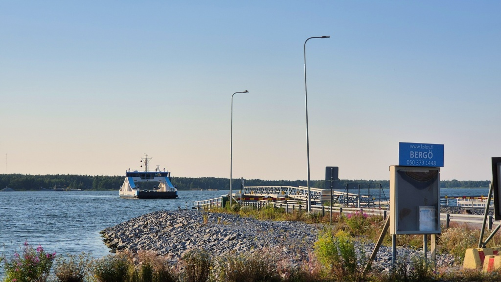
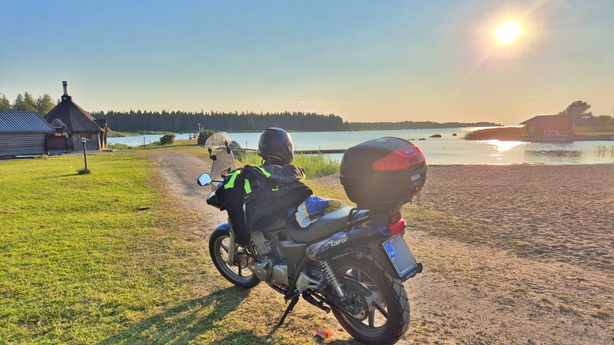
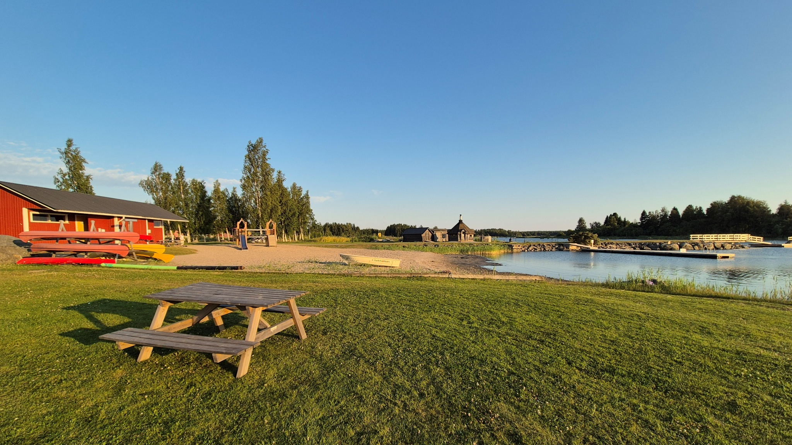
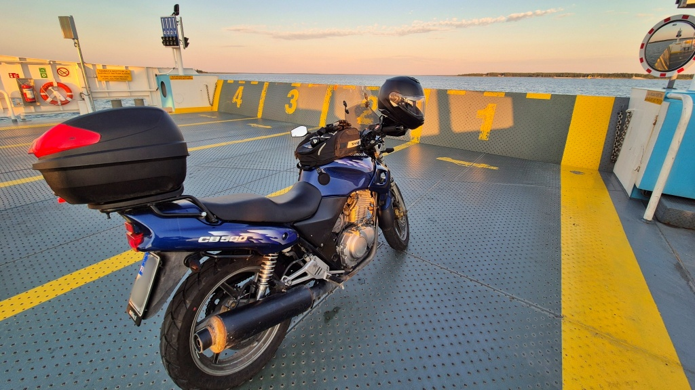
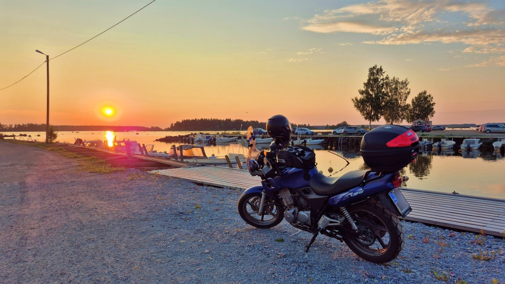

## Testa en strand: Bredhällans badstrand

Nu fortsätter serien “Testa en strand”. Vi åker ut med hojen och tar ett dopp. Denna gång testar vi Bredhällans badstrand på Bergö.

<!--more-->

### Hur man tar sig dit

Bredhällan ligger på Bergö och Bergö är ju liksom en ö. Det går ingen bro dit, men däremot en landsvägsfärja. Det är ju lite kul, jag hade faktist aldrig åkt med Blue på en landsvägsfärja tidigare. Inte heller hade jag besökt Bergö sedan den nya färjan [Vikare](https://ksloy.fi/sv/lauttaliikenne). Det var i sanning en riktig baddare.

Vägen till färjan är däremot ingen höjdare. Först Strandvägen till Molpe och sedan rak, tråkig väg med dålig asfalt från Molpe Strandpaviljong till färjefästet. Och givetvis måste man åka samma tråkiga rutt på väg hem, det finns bara en väg att välja.

Väl på Bergö är det väl mest att följa skyltarna mot simstranden. Det är egentligen förvånansvärt långt, man tänker ju sig att det skall vara en liten ö, men det tar en stund att åka.

### Strandbetyg

Här finns ju så gott som allt man kan tänka sig behöva vid en strand. Omklädningsrum(+), toalett (+). Grillplats(+) och picknickbord(+). Skräpkorg(+). Och en bara liten bit bort, en kiosk(+).

Här finns också lekplats, gungor, kanotuthyrning, minigolf(+). Och i själva verket en campingplats intill.

Stranden är rätt stor(+), sanden går ut till flytbryggan(+). Det finns också ett hopptorn(+). Vattendjupet utanför flytbryggan är inte tillräckligt för att hoppa i, men man kan börja sin simtur från stegen.

Vattnet var förhållandevis klart(+) jämför med de flesta Österbottniska simstränder. 

*Sammanfattning:* Riktigt bra strand med allt som behövs. Minus bara för den tråkiga vägen och att vänta på färjan.

*Rekommendation:* Åk hit för att bada eller chilla eller hänga med polare.

*Betyg:* 3.5/5

### Avslutning

Jag hade gärna stannat längre, men fick lite stress till färjan. Åkte i varje fall en tur via Österändan och Perisgrund. Det senare stället ligger vid stranden utan skyddande öar utanför. Det var liksom annorlunda, mycket kargare än resten av Bergö.

På väg hem från Bergö kurvade jag ut till Bockören för att njuta av solnedgången.

Dagens tur blev 99 km lång.