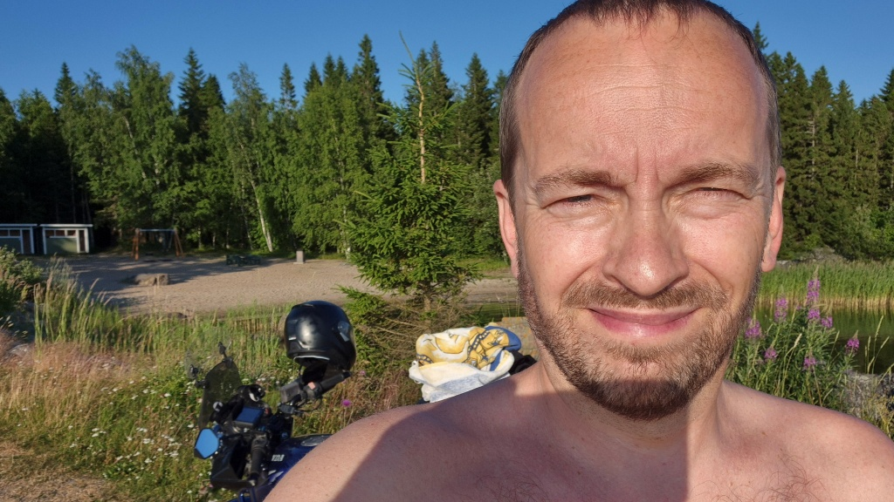
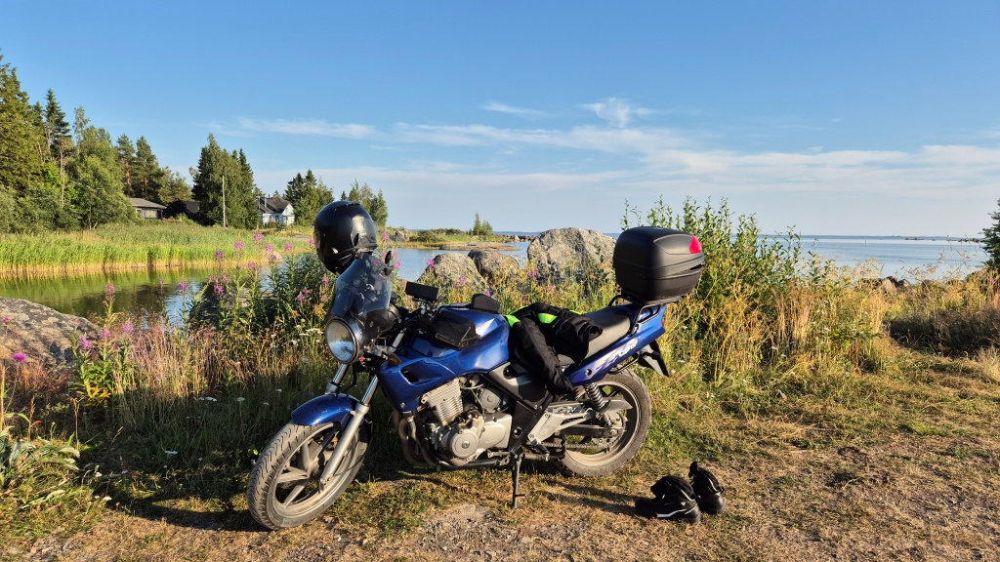

## Testa en strand: Bullerås simstrand i Södra Vallgrund

Det är fortfarande hett, så vad passar bättre än en tur till stranden? Idag åkte jag iväg till [Bullerås simstrand](https://korsholm.fi/valfard/fritidsverksamhet/simstrander-och-friluftsbad/sodra-vallgrund-simstrander) i Södra Vallgrund.

<!--more-->

Jag hade faktiskt aldrig besökt denna strand tidigare. Visserligen var jag på väg dit med hoj en gång tidigare, men jag vände om precis innan jag kom fram. För att komma till stranden måste man åka över en privat gårdsplan. Senast hade jag inte riktigt koll på var stranden låg och ville inte störa folk i onödan.

### Hur tar man sig dit

Vägen till Bullerås går via den tråkiga Alskatvägen, över den storslagna Replotbron, in till Replot kyrkby där man svänger mot Vallgrund. Sedan följer man den ganska kurviga asfaltvägen tills det är dags att svänga av på en grusväg mot Kalvholm, och efter en kort bit svänger man igen mot Bullerås. Efter några kilometer grusväg kommer man som sagt till en skylt om att detta är en privat gårdsplan, men det är bara att åka på, givetvis försiktigt och med respekt för gårdens invånare.

### Strandbetyg

Själva stranden då? En liten sand-plätt som håller på att växa igen av all vass. Inte så imponerande. Men det finns omklädninsrum i fint skick (+), dass (+), grillplats (+), picknick-bord (+) och skräpkorg (+). Och en gungställning, om man behöver en sådan (+). Direkt intill finns också en gästhamn med en rejäl brygga.

Vid stranden.

Själv skippade jag den långgrunda stranden och hoppade i från gästhamnens brygga. Det är knappast meningen att göra så, för man hamnar rätt ut i småbåtsfaret. Å andra sidan var där inte sådan rusning att jag störde någon. Vattnet var relativt klart och riktigt varmt och skönt (+). Stegen upp till den höga bryggan nådde nätt och jämnt ner till vattnet, så det var lite krångligt att ta sig upp igen.

Utsikt mot horisonten.

*Sammanfattning:* Hyfsade faciliteter men stranden är inte mycket att hänga i midsommarstången.

*Rekommendation:* Om du irrar dig dit, njut en stund av utsikten. Är det varmt men inte för trångt vid bryggan, så ta ett dopp för all del. Knappast dock värt en tur bara för strandens skull.

*Betyg:* 2.0/5

### Avslutning

På hemvägen åkte jag ner genom Södra Vallgrund till Sommarösund. Kanske man borde testa stranden där också? En annan gång. Sedan via Jungsund och Karperö till Botniahallen, där dotten just avslutat fotbollsträningen. Sedan hem. Dagens saldo blev 110 km och ett svalkande dopp.

