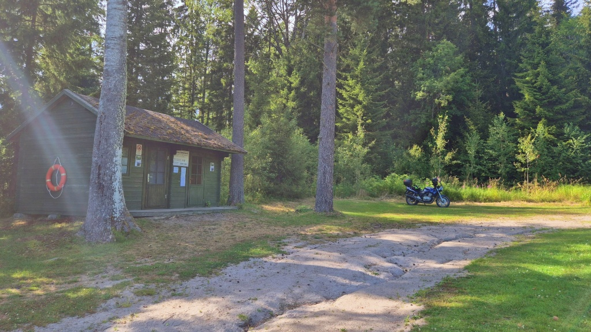
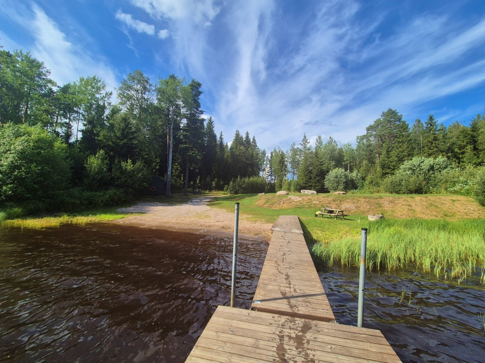
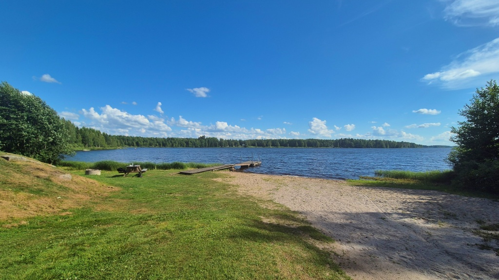

## Testa en strand: Komossa simstrand

Den omåttligt populära serien "Testa en strand" fortsätter (så länge dagstemperaturen överstiger +25). Vi åker ut med hojen och tar ett dopp. Denna gång testar vi _Komossa simstrand_.

Komossa, KAJ-medlemmen [Kevins](https://sv.wikipedia.org/wiki/Kevin_Holmstr%C3%B6m) hemby, ligger lite avsides, men man tar sig dit längs fina motorcykel-vägar. Nu skall vi ta reda på om det också lönar sig att ta sig ett dopp när man är ute och glider.

<!--more-->

### Hur man tar sig dit

Om man startar från Vasa-hållet kan man lämpligen börja med att åka uppströms längs Kyro älvs norra strand fram till *Storkyro* kyrkby. Där svänger man upp längs Ruusupurontie och fortsätter förbi den nya kyrkan. Åk tills vägen tar slut i Kaurajärvi, Vörå. Men var försiktig, precis efter kommungränsen till Vörå kommer ett par plötsliga, tvära kurvor som säkert har orsakat avkörning åt både en och annan motorist under årens lopp. Beläggningen är inte strålande men för det mesta acceptabel.

I Kaurajärvi vänder vänster du mot Vörå, kör ett hundratal meter på stora vögen och viker sedan av till höger mot *Oravais* längs Keskisvägen. Följ denna väg till Keskis bönehus, där du viker av till höger mot Komossa. Nu är det bara att köra rakt genom Komossa city, men notera avtaget mot Alahärmä, mitt i byn. Ungefär 1,4 km efter avtaget mot Alahärmä går en liten grusväg till vänster, skyltad med "Fritisområde". Följ den och du är framme. Ta det lite lugnt bara, lite lös sand på vägen och så.

När du badat klart, fortsätt mot Oravais. Sväng gärna in och ta en titt på Kimo bruk, om du inte gjort det förut.

Har du inte fått nog av kurviga småvägar, rekommenderas att du svänger av mot Vörå i Kaitsor och därefter åker genom Vörå City, svänger mot Vasa längs Larvvägen och sedan svänger av mot Lillkyro. Sköna vägar. 

För en kortare omväg kan man svänga mot Maxmo i Ölis för att sedan åka genom Vassor. Men var försiktig, många blinda kurvor och ofta en del lätt trafik på vägen!

### Strandbetyg

Vid stranden finn plats att parkera för fler än ett fordon(+). Denna dag räckte det gott och väl. Ett par hade precis varit och simmat och åkte iväg när jag kom. Sedan hade jag stranden för mig själv.Stranden har också ombytesrum(+) och även torrdass(+). Här finns gräs(+) man kan ligga och sola på och sand(+) i strandkanten. Här finns också eldstad(+), picknick-bord(+) och skräpkorg(+).

Det finns också en flytbrygga(+). Djupet vid bryggkanten var lite drygt midjedjupt(-) och bottnen bestod så långt ut mest av lera(-). Vattnet såg ut som Österbottniskt insjövatten brukar göra - mycket humushaltigt och brunt(-). Men denna dag var det varmt(+) och skönt.

Utsikten då? Inte så mycket att titta på, en insjö så stor att du inte ser så mycket av vad som händer på andra sidan. Betyget neutralt.

*Sammanfattning:* Bra faciliteter men stranden är tja och vattnet är brunt. Men vägen dit är toppen!

*Rekommendation:* Åk dit. Stanna för ett dopp om det är riktigt varmt, men annars kan du bara njuta av vägen dit och därifrån!

*Bonus-rekommendation:* stranden i Hällnäs är kanske ett strå vassare och där kanske glasskiosken är öppen.

*Betyg:* 2.5/5

### Avslutning

Jag körde 174 km idag. När jag kom hem var jag lika svettig som när jag åkte.