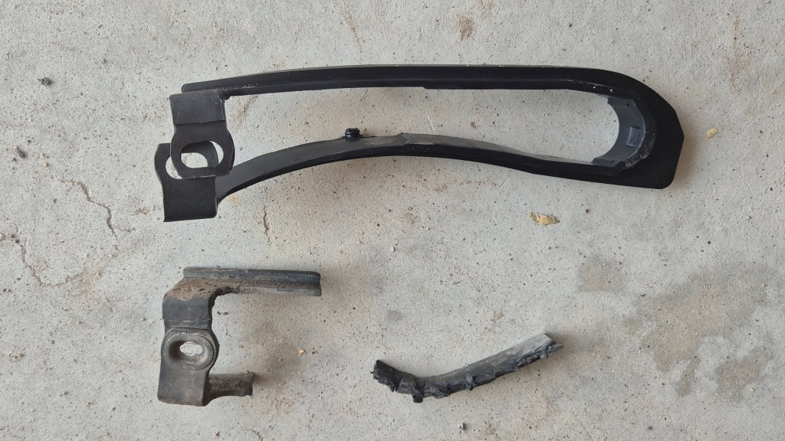
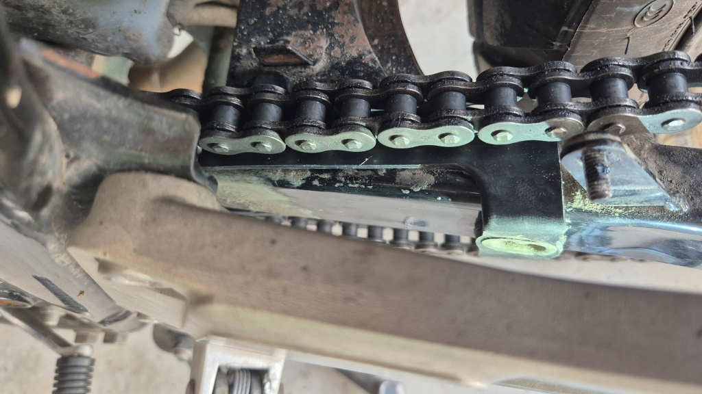
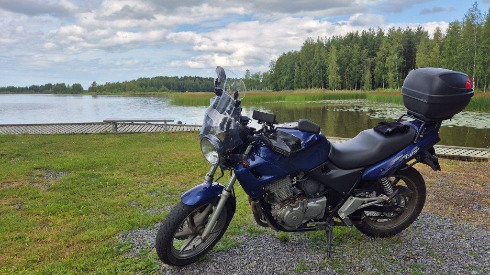

# Att ersätta gammal plast med ny

På hojens svingarm sitter en plastdel på vilken kedjan skall glida, så att inte kedjan nöter på själva svingarmen. Eller rättare sagt, det _skall_ sitta en sådan den på svängarmen - i Blues fall satt väl närmast bara minnet av en sådan del. Delen i fråga kallas chain slider, jag vet inte ens vad den kan tänkas kallas på svenska. Oberoende, nu har jag beställt hem en sådan och tänkte montera den på hojen. Nästa dag tänkte jag nämligen ge mig ut på en lite längre åktur, då vill man ju att hojen skall vara i toppskick! Mera om det i nästa post.

<!--more-->

Jag hade faktist en annan grej att testa också - jag hade precis införskaffat ett par tunna sommarhandskar, Richa någonting. Mina normaltjocka Rev'it handskar har känts fruktansvärt varma när temperaturen rört sig kring +30. Det hjälper ju inte heller att jag har på handskydden som styr bort all svalkande vind. Jag orkar ändå inte skruva bort dem bara för några få varma dagar i mitten på sommaren. Snart är det kallt och eländigt igen.

Men, till skruvandet. Först tog jag bort kedjeskyddet. Av den gamla chain slidern var det inte mycket kvar. Bara att skruva bort den lilla resten och givetvis spara skruvar och muttrar. Jag kollade om det fanns spår av slitage eftersom hela slitytan på plastdelen varit bortnött så länge jag ägt hojen. Men inte det minsta tecken på slitage. Tydligen har CB 500 inte sån vinkel på svängarmen att kedjan skulle dra längs metallen alltför mycket.

Den nya och den gamla - inte svårt att gissa vilken som är vilken?

För att komma åt att montera den nya chain slidern var jag tvungen att släppa på spänningen på kedjan, men jag tog inte av kedjan. Det gick helt bra att pilla dit den slidern och sedan använda den gamla brickan och muttern. Kina-slidern passade faktiskt bra. Spänn kedjan igen, och på med kedjeskyddet.

Nya chain slidern monterad. Hmm, borde jag göra nåt åt rosten på svingarmen?

Sedan var det givetvis dags för provtur. Till att börja med förde den nya slidern en del oljud, men efter ett tag var det som normalt igen. Tydligen skulle den nötas in lite grann. Körde ner till Korsnäs, sedan genom Taklax och förbi Hinjärv träsk. Mycket rolig väg att köra mellan Taklax och Övermark - kurvigt och med rätt nylagd asfalt. Jag stannade i varje fall en stund vid grillplatsen i Bodbacka och njöt av lugnet och utsikten över träsket.

Vid Hinjärv träsk.

Därefter Övermark - Pörtom - Petalax och hem. 136 km måste väl räcka för att konstatera att plastbiten sitter rätt? De nya handskarna kändes nog svalare än Rev'it-hanskarna - bra. För nästa morgon hade jag som sagt planerat en rejält längre tur, då är det bra att inte behöva lida av överhettade händer.