# Försök på Iron Butt Saddle Sore 1000

### Inledning
Iron Butt Associations utmaning Saddle Sore 1000 (SS1000) går ut på att man skall köra 1000 miles (ungefär 1609 km) på ett dygn. Resan skall dokumenteras genom tankningskvitton så att kvittonas tidpunkter visar resans längd och tillryggalagd sträcka beräknas i ett kartprogram som kortaste sträckan mellan de ställen man tankat på. Om ens körning godkänns vinner man ära och berömmelse och får kanske ett diplom. Mest har man väl bevisat något för sig själv, kantänka.

En mycket varm dag i slutet på juli var det äntligen dags för mitt sedan länge planerade första försök att avlägga SS1000.

<!--more-->

### Först till Ruka

Klockan 4:12 visade första tankningskvittot. Det var alltså min starttid, målet var således att var tillbaks på samma ställe senast 4:11 dygnet därpå. Jag var redan 12 minuter ”försenad” jämfört med min plan, men det var ju inget större problem. Vad som kan tänkas behövas för ett dygn på motorcykeln var packat och med. I tankväskan fanns extra handskar, I-hjälpväska, en smörgås, en termos kaffe och vatten, i toppboxen fanns mera mat, regnkläder, handduk, simbyxor och en fleece. Verktygen har jag alltid i lådan under sitsen. På ryggen hade jag en dricka-väska med 3 liter vatten och slang att dricka från.

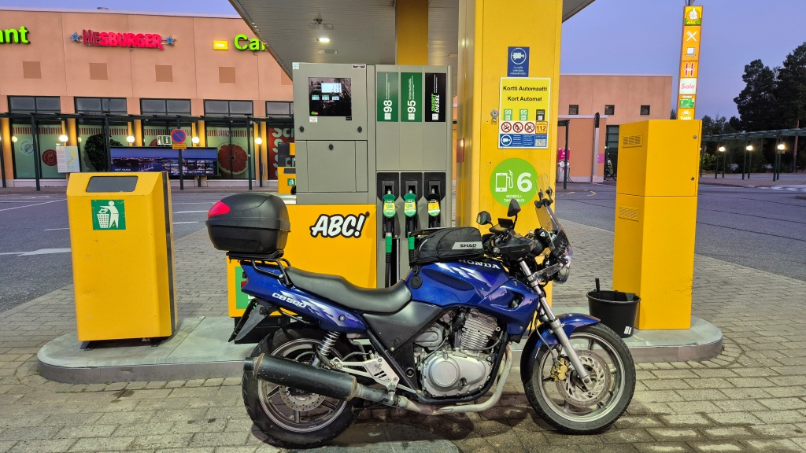

Nästa planerade tankning var Haapajärvi, så jag styrde mot Lillkyro. Trots att jag ju egentligen ville börja lägga kilometrar bakom mig, kunde jag inte låta bli att ta den lite långsammare vägen på norra sidan av Kyro älv – min favoritslinga, hel enkelt. Sedan vidare genom Vörå och Ylihärmä. I Härma, precis före Härmä Spa, steg solen för första gången upp över trädtopparna. Det hade varit lite halvdager innan, men från och med nu började det vara dagsljus på riktigt.

Därefter vidare genom (eller åtminstone strax utanför) Kauhava, Kortesjärvi, Evijärvi, Halso,  Lestijärvi och Haapajärvi. Jag tog en kort paus och drack morgonkaffe ur termos i Reisjärvi. Sedan tankade jag på ABC i Haapajärvi. Jag fick ett blankt kvitto, men tänkte i varje fall använda de elektroniska kvittona i redovisningen. 

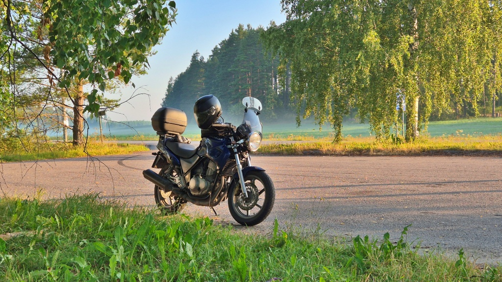

Från Haapajärvi fortsatte jag mot Kärsämäki, sedan stora vägen via Pyhäntä till Kajana. Utan att ens behöva sätta ner foten fortsatte jag sedan norrut genom Ristijärvi och Hyrynsalmi mot nästa tankning i Suomussalmi. Sträckan består till två tredjedelar av 100-väg, förutom i Kajana var det knapps någon trafik och föret var utmärkt. Det flöt på riktigt bra, helt enkelt. Lite för bra, till och med, med det får vi återkomma till senare.

Det är rätt glest befolka i dessa trakter, det syns inte mycket bebyggelse mellan de glest utspridda samhällena. Ganska vackert landskap, men för all del, mest bara skog. Värt att nämna i varje fall Seitenjärvi mellan Ristijärvi och Hyrynsalmi. En del sommarstugor längs vackra, rätt höga stränder. Vägen går en bit längs en vägbank tvärs över sjön. Vackert.

Utanför Hyrynsalmi fanns det första skyltarna om att renskötselområdet börjar och mycket riktigt, alldeles utanför centrum av Hyrynsalmi, på stora vägen på bron över Siltasalmi, mötte jag de första renarna. Inte brydde de sig om att akta sig för bilar och inte hade de bråttom.

En bit före Suomussalmi kom det några rejäla droppar regn och det såg riktigt hotfullt ut, men jag lyckades precis missa största delen av åskvädret – inget behov av att kränga på regnstället. Framme i Suomussalmi tankade jag och lättade på klädseln. Vid det här laget var det över 25 grader varmt, så nu räckte det fint med t-skjorta under jackan och de tunna sommarhandskarna. Jag försökte också fläka upp jackans flikar bort från dragkedjan så att lite luft skulle komma in den vägen också.

Norr om Suomussalmi är vägen egentligen ganska lång och enformig. Jag fortsatte i varje fall rakt förbi Kuusamo. Några renar igen, de verkade trivas bäst nära bebyggelse, för hittills denna resa hade jag enbart sett dem nära samhällen.

Sedan svängde jag upp till Ruka byn för en selfie (been there, done that, liksom). Där var faktiskt packat med folk, mitt i sommaren. Byggnaderna liknar en alpby – lite som Levi fast kanske lite mindre. Jag skulle nog gärna besöka stället vintertid också.

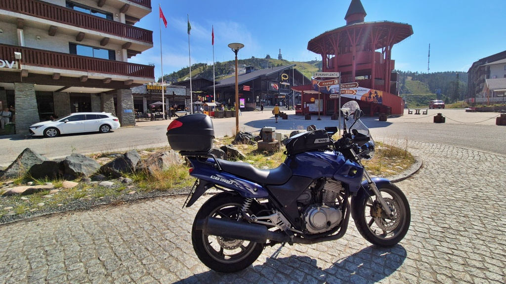
Ruka by

### Sedan vidare till Levi

Från Ruka byn ner till huvudvägen igen och vidare mot Kemijärvi. I Suomu korsar vägen polcirkeln. Jag stannade kort och fotade polcirkel-monumentet. Sedan körde jag raka spåret till ABC i Kemijärvi. Bör för övrigt nämnas att vägen österifrån in över bron till Kemijärvi centrum ger en ganska fin vy över stadens skyline (främst kyrkan då).

I Kemijärvi gjorde jag snabbservice på hojen, dvs. smorde kedjan och spände fast sidospegelns mutter som lossnat lite. Sedan tog åt jag dagens lunch, som visade sig vara kanske ännu mera smaklös än det vanliga käk man brukar få på den här bokstavskedjan. Men när kaffet var urdrucket och hjälmens visir rengjort på toan var det bara att kasta sig i sadeln igen.

Strax norr om Kemijärvi, på väg i riktning mot Sodankylä, var det dags för dagens drygaste vägarbete. 35 km väg hade försetts med skyltar och lägre hastighetsbegränsning. Sedan blev det att vänta på följebil i över 10 minuter och krypa fram i 30 km/h i nästan 10 km. Allt för att vägarbetarna höll på med beläggningsarbete på en några hundra meter lång sträcka väg. Det var rätt hett att sitta och vänta med full utrustning på i nästan 30 graders värme – medan de flesta personbilarna i kön givetvis körde sina ACn på högsta effekt.

Innan vägarbetet ens tagit slut svängde jag av från Pelkosenniemi-vägen in mot Pyhä-Luosto. Pyhätunturi är ett riktigt mäktigt berg, det skulle nog vara värt ett besök för att vandra eller åka skidor.

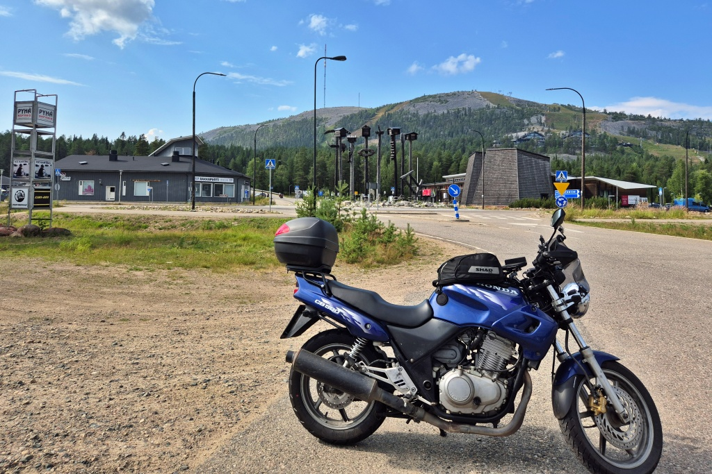
Pyhätunturi

I Luosto såg jag en skylt om en badstrand. Jag körde förbi först men sedan ångrade jag mig och vände om. Visserligen hade jag en tidtabell att följa, men att få bada i en sjö bredvid ett fjäll en stekhet dag som denna – sådana chanser får man inte många av. Så det blev ett svalkande dopp. Vattnet var rätt klart och gott och väl badvarmt vid ytan. När man stod upprätt och trampade vatten var det dock iskallt om fötterna. (Stranden är minimal, men där finns omklädningsrum (+), picknick-bord (+) och en flytbrygga (+). *Betyg:* 3,5/5, mest för det klara, sköna vattnet.)

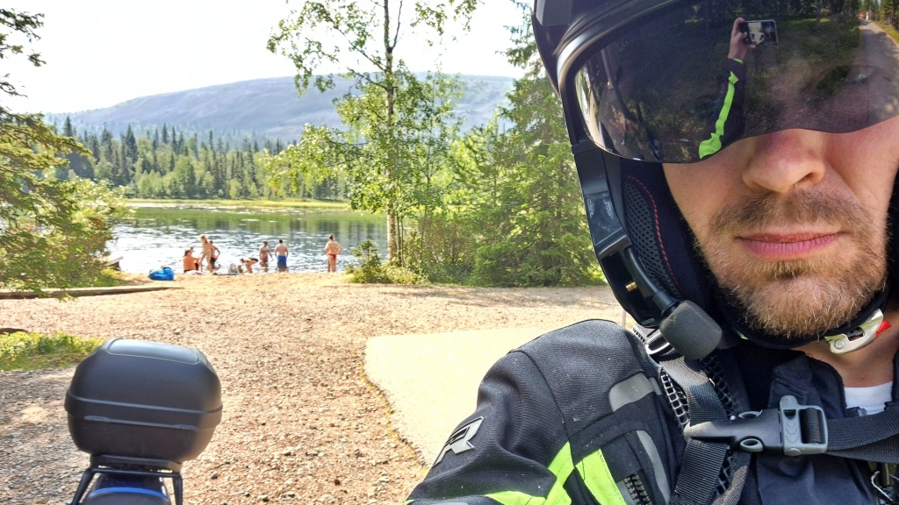
Aarnilampi, Luosto

Från Luosto åkte jag vidare mot Sodankylä och därifrån mot Kittilä. Någonstans längs denna långa väg stod en skåpbil parkerad strax till höger om vägen. Jag håller rätt bra fart, kanske till och med aningen över den rekommenderade hastigheten. Precis som jag närmade mig hände två saker. En polisbil kommer åkande i motsatt riktning och någon stiger ur den parkerade skåpbilen, mer eller mindre ut på vägen framför mig. Det blir att bromsa in rejält. Inget händer, men jag misstänker att poliserna trodde att jag bromsade för dem och allra minst övervägde att ta ett snack med mig. Men Jag antar att de hade viktigare saker för sig.

En bit före Kittilä mötte jag äntligen några icke urbana renar, som alltså gick och spankulerade på vägen utan att ha någon människoboning i sikte. Jag rekommenderade faktisk åt dem att de borde skaffa sig lite trafikvett, men de stirrade bara fånigt på mig.

Strax utanför Kittilä finns en badstrand vid Ounasjoki. Den var knökfull med badare. Denna gång unnade jag mig inte tid att stanna och ta ett dopp. Jag ångrar mig lite, det hade varit coolt (pun intended) att bada i Ounasjoki. I efterhand känns det lite som en missad once-in-a-lifetime opportunity. Jag åkte i varje fall vidare till Levi och där vände jag upp mot toppen. Vägen upp var full med diverse entrepenadmaskiner och det visade sig att den sista biten upp till toppen var helt avstängd för ombyggnad. Jag fick nöja mig med utsikten norrut istället, från en lite lägre punkt. Jag knäppte några bilder, drack en burk medhavd hydreringsdryck och sedan åkte jag ner till Sirkka för nästa tankning. En termometer på en husvägg visade +31 inne i Levi by - det kunde nog stämma, så kändes det också.

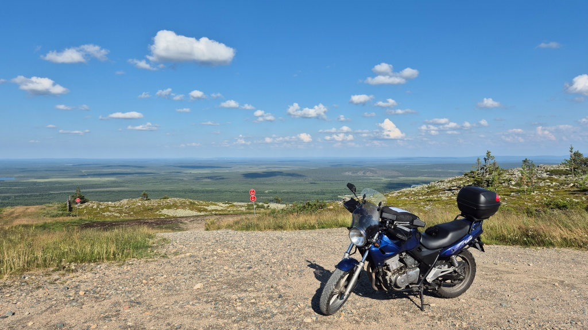
Levi

### Äkäslompolo och Ylläs

Egentligen skulle jag ha fått mina 1000 miles ihopskrapade utan ett att åka via Levi och jag skulle definitivt ha kunnat skippa Äkäslompolo. Men nu var jag ju inte på resa bara för att samla mil utan också för att se mig omkring. Därför hade jag beslutat ta en ganska rejäl omväg längs med väg 79 mot Muonio och sedan ner till Äkäslompolo. Omvägen förlängde resan med nästan 45 minuter men gav mig inga mera miles, eftersom det inte finns någon lämplig servicestation där man kan tanka för att visa hur man kört. Men som sagt, jag behövde inte kilometrarna.

På vägen ner mot Äkäslompolo stötte jag på ett flertal renar. Ingen av dem verkade ha mera trafikvett än den andra. Vägen var rätt dålig och rätt så lång. Vid det här laget hade jag redan kört en bit över 1000&nbsp;km och visst började det kännas lite att man varit ute på vägen. Ändå kändes det ju också som att det är fruktansvärt lång väg hem ännu.

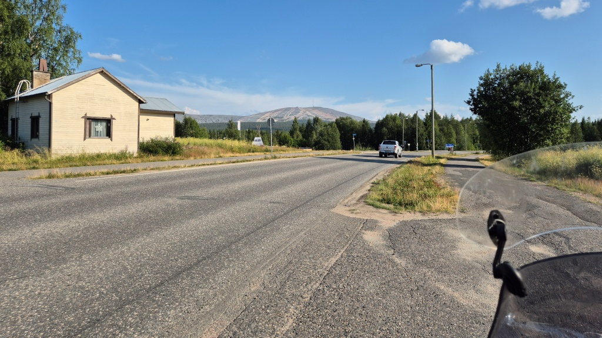

I Äkäslompolo stannade jag vid skidbacken och tittade runt mig och pratade med några renar. Det såg lite ut som om de väntade på att liftarna skulle öppna.

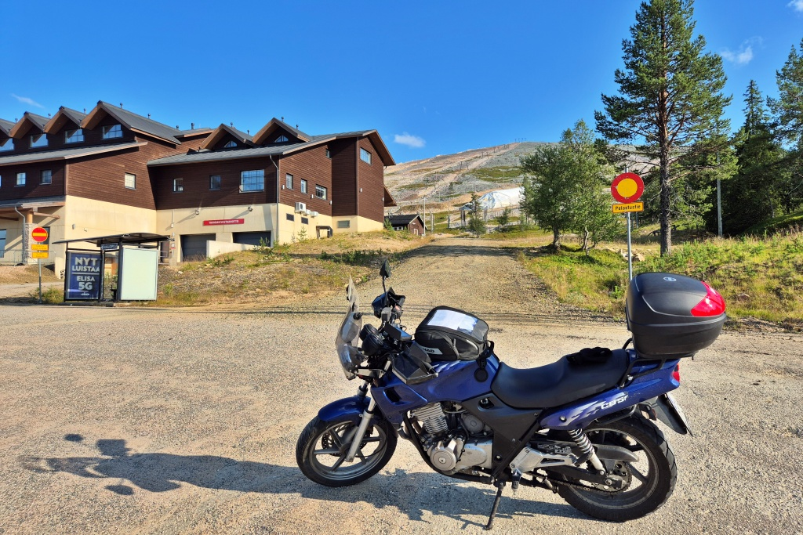
Yllästunturi från Äkäslompolo-sidan

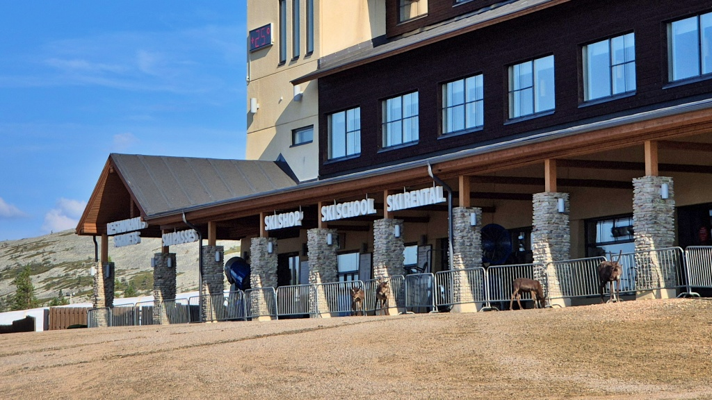
Renar väntar att skidskolan skall öppna?

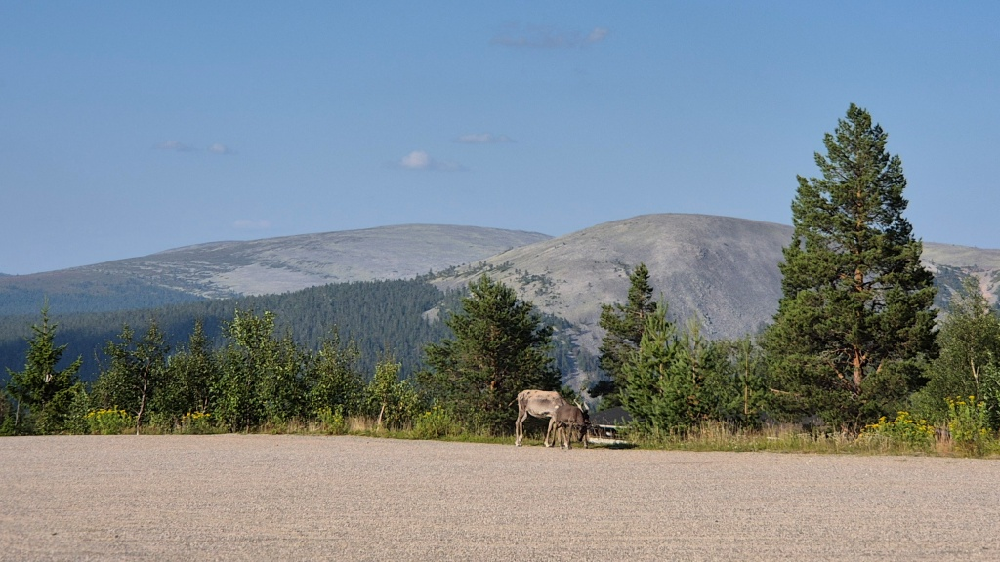
Kesänki och Kellostapuli

Sedan körde jag kring berget till Ylläs-sidan - en väg som jag aldrig åkt förut. Där stötte jag på ett par förfärligt envisa renar - de gick precis mitt på vägen, samtidigt som vägen var så krokig att man inte riktigt kunde köra om heller. Till sist kom jag förbi. Jag for också en sväng upp till Ylläs skidbacke och tittade på gondolen. Termometern visade +38, men riktigt så varmt var det ändå inte. Jag käkade en banan och gav mig sedan av på min långa färd söderut.

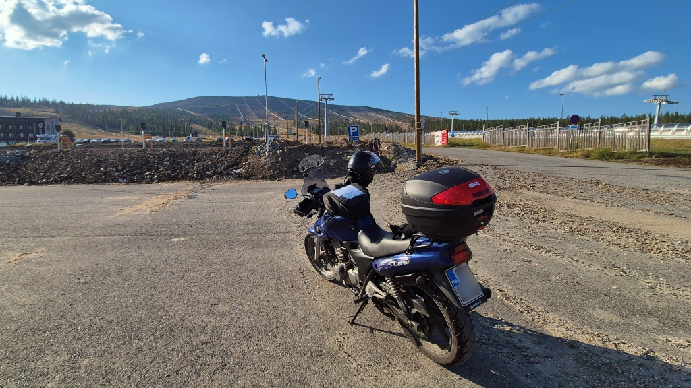
Yllästunturi från Ylläsjärvi-sidan

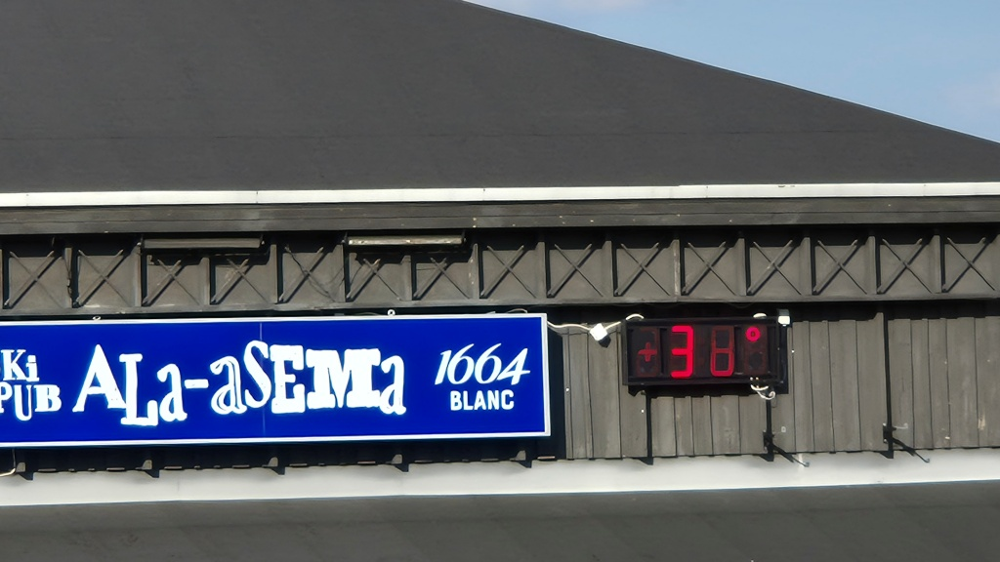
Riktigt sommar!

### Via Sverige

Då var det bara att bränna på hemåt. Längs den ganska smala vägen ut till Kolari var det en hel del bilar som krypkörde fram, men sedan ut på stora vägen flöt det på bra. I Pello kunde jag inte låta bli att åka över bron till Sverige. 100 meter inne i Sverige stannade jag, knäppte några foton och vände sedan om. Nu har jag väl varit utomlands med hojen då... Visserligen skulle det ha gått nästan lika snabbt att köra ner på svenska sidan av älven, men det sparar jag till ett annat äventyr.

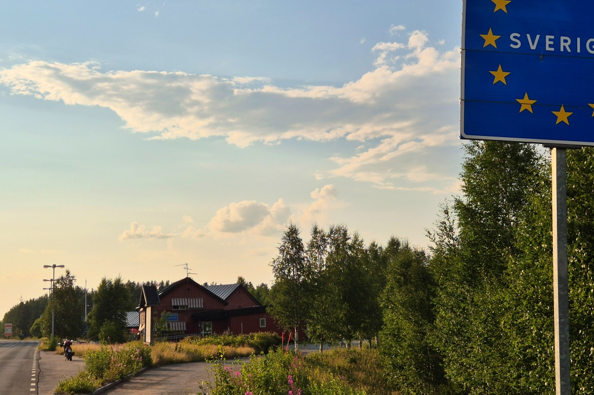

I Övertorneå (Ylitornio) tankade jag och pratade en stund med sonen. Det hade varit strul med headsettet så jag lyckades inte svara medan jag körde. En reboot verkade lösa problemet.

Efter att ha kört många hundra kilometer genom glest befolkade områden kändes Tornedalen annorlunda. Jag lade märke till att från Pello ner till Torneå var det inte många kilometer mellan byar och gårdsgrupper - helt annat än ödemarkerna i östra delarna av Norra Österbotten och Lappland.

 Efter Övertorneå fick jag häng på en annan motorcykel som höll rätt lämplig fart, så jag hängde efter hela vägen ner till Torneå. I Torneå tog han en annan väg, men efter en kort bit på motorvägen kom jag i kapp igen. Han åkte lite under hastighetsbegränsningen, så jag körde om honom och lade märke till hans IBA Finland reflexväst. Jag hälsade och fortsatte vägen fram. Sedan körde han om mig i något skede. Efter ett tag saktade han in igen och jag körde om igen. Och så höll vi på hela vägen till Uleåborg. Det var nästan det ända som hände längs denna tråkiga väg. Ja och så trafikarbetet med 5 minuters kötid och följebil i Simo.

 ### Åskväder, mörkerkörning och dimma

 Väderleksrapporten hade lovat en dag utan regn, men sitter man i sadel ett helt dygn så blir det väl förr eller senare lite regn. När jag körde ut ur Uleåborg tornade ett mäktigt åskväder upp sig framför mig. Himlen var alldeles svart och med en till två sekunds mellanrum slog en blixt någonstans i det stora åskvädret. Det såg verkligen inte lockande ut att köra in i det där åskvädret. Jag stannade i Limingo för att fundera vad jag skulle ta mig till. 

 På min väderapp såg jag att åskvädret rörde sig från inlandet och ut över kusten. Jag räknade ut att jag skulle åka bakom åskvädret om jag väntade en halvtimme och sedan tog vägen via Vihanti och Ylivieska. När jag gav mig av regnade det inte, men molnen var fortfarande tunga och det började vara ordentligt mörkt. När jag svängde av mot Ylivieska insåg jag att min strålkastare pekade mot marken och jag såg nästan ingenting framåt. Dessutom var vägarna plaskvåta vilket gjorde det ännu mörkare. Räddare i nöden blev en svenskregisrerad Volvo på väg åt samma håll. Jag hängde på bakom den, fast besluten om att inte släppa. Tanken att stå i kolmörkret och duggregnet och försöka justera strålkastaren lockade inte. Så jag hängde på, även om det gick lite för snabbt för min smak ibland.

 När vi åkte förbi Vihanti kom en brandbil med blåljusen på åkande bakom oss. Vi (Volvon och jag) släppte förbi brandbilen. Efter en stund kom vi till en plats med flera brandbilar och en ambulans. Antagligen hade blixten slagit ner i något hus.

 Jag hängde efter Volvon ändå till Oulais (Oulainen), men där måste jag tanka. Alla gatljus var mörka vid det här laget och molnen var fortfarande tunga och mörka. Så vid ABC kallstationen tankade jag strax efter midnatt och sedan stod jag där i den fuktiga natten och justerade strålkastare. Men vilken skillnad det blev. Nu såg jag gott och väl vart jag var på väg. Det är stor skillnade mellan den gamla halogen-H4-brännaren och den nya... ja, alltså... LED-lampor får man ju inte montera i gamla strålkastarhus...

 I lugn takt åkte jag vidare genom mörkret. Nu började temparaturen sjunka. Inte så att det blev kallt, men tillräckligt för att fukt på den regnvåta marken skulle stiga upp som dimma. Söderom Ylivieska blev det allt dimmigare, i synnerhet ute på barmark. När jag kom ut till Karlebyvägen var det ställvis riktigt tjock dimma längs med marken. Nu hjälpte inte min olagaliga strålkastare mycket längre. Före Kannus var vägen nyasfalterad och kolsvart. Det ända som fanns att köra efter var pinnarna som markerar kanten av vägen. På något ställe fanns inga pinnar heller. Det var så förbaskat mörkt att jag inte såg något alls av vägen, så jag kröp fram i 20-30 km/h. Det kändes som en evighet innan jag kom till gammal asfalt igen, så att jag kunde ana var vägen började och slutade - och just i gränsen mellan gammal och ny asfalt visade det sig att jag körde på fel sida av vägen, nästan i vänstra diket. Nå i varje fall var den övriga trafiken nästan obefintlig. Jag tror jag mötte ett par långtradare och någon enstaka bil på hela vägen från Eskola ut till riksväg 8/E8 i Karleby.

 I Kannus tog jag paus och klädde på mig lite mera kläder - snart 22 timmar i sadeln började göra sitt, nu var jag nog rätt trött och det började kännas kyligt (fast det säkert var +20 ännu). ABC i Karleby var stängt, där blev det inget kaffe. Sista biten hem var nu mer eller mindre en plåga. Jag var trött, frusen och var vid det här laget ganska öm i baken (Saddle Sore!). Och till detta kom de regnvåta vägarna som sög åt sig allt ljus. I Nykarleby hade regnet tydligen upphört, härifrån var vägarna i det närmaste torra. Och dessutom började det ljusna lite grann.

### Hemkomst och summering

Jag gjorde slut-tankningen på samma pump som jag startat och literpriset var fortfarande exakt detsamma. Tiden för kvittot var 3:08, alltså hade jag spenderat 22:56 på vägen. Den officiella körsträckan blev 1698 km, medan mätaren visade 1821 km. Totalt, inklusive vägen till start och hem från mål körde jag 1836 km. Jag hade tankat 80,62 liter bensin för 134,54 €. Det ger en medelförbrukning på kring 4,4 €/100 km. Där kan kanske konstateras att genom att sänka hastigheten kan man spara in lite där. På sträckan Oulais - Vasa låg medelförbrukningen på 3,8 l/100km.

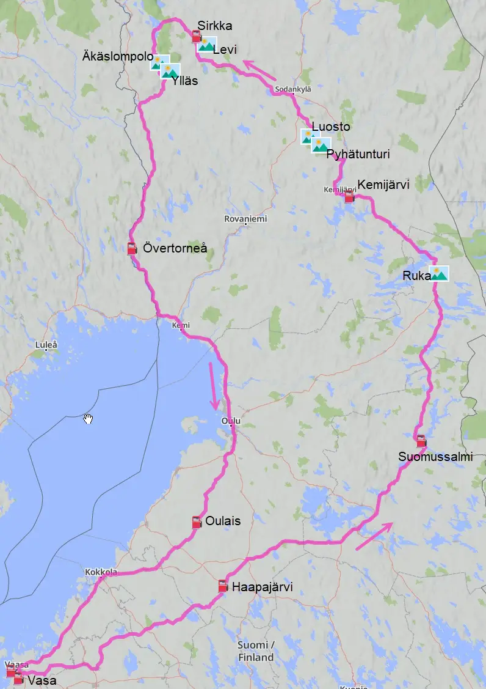

Sedan var det verkligt skönt att komma hem. Oftast känner jag när jag kommer hem att jag gärna skulle ha åkt en bit till. Så var det inte denna gång.

Därpå följande dag var jag rätt trött och trots att jag hade druckit en hel del vatten ur min ryggsäck så var jag nog lite uttorkad också. Det tog ett par dagar innan jag kände mig normal igen.

Som jag nämnde var jag nog rätt om i baken. Lite grann ont i ryggen hade jag också, men det gick snabbt över. Det värsta var kanske någon slags ömhet i gashanden av alla vibrationer, som nog kändes i flera veckor efteråt. Och jag åkte faktiskt inte ut med hojen på en hel vecka efter långfärden. Dels hade jag en del annat att pyssla med, semestern var slut och saker skulle fixas. Men dels var nog suget borta för ett tag.

### Blev det något diplom då?

Så blev jag godkänd? Nej tyvärr, jag skickade in alla papper men blev underkänd. Orsaken var överhastighet på sträckan mellan Haapajärvi och Suomussalmi. Kontrollatorn räknade ut att min medelhastighet var för hög för att jag skall ha kunnat hålla hastighetsbegränsningen. Och visst stör det! Jag hade inte bråttom, ändå gick det för fort. Och i Suomussalmi tankade jag först och sedan tog jag paus - skulle jag ha gjort tvärtom hade den inte varit ett problem. En planeringsmiss att inte beakta medelhastigheten, men samtigt också lite tillfälligheter - som sagt, jag satte knappast ner foten en enda gång på hela vägen mellan Haapajärvi och Suomussalmi, det gick lite för smidigt.

Kanske kommer det en ny chans, men för att det skall lyckas krävs det att rätt många saker faller på plats. Det skall vara möjligt att vara borta från familjen i två dygn, vädret skall vara bra, hojen skall vara i skick och sedan är det ju bäst att göra det på den ljusaste tiden av året.

## Nya kommuner

Min långsiktiga målsättning är att köra med min motorcykel Lilla Blue i alla Finlands kommuner. På denna resan växte listan över besökta kommuner med hela 33 stycken:
* Reisjärvi
* Haapajärvi
* Kärsämäki
* Siikalatva
* Pyhäntä
* Kajana
* Paltamo
* Ristijärvi
* Hyrynsalmi
* Suomussalmi
* Taivalkoski
* Kuusamo
* Posio
* Salla
* Kemijärvi
* Pelkosenniemi
* Sodankylä
* Kittilä
* Muonio
* Kolari
* Pello
* Övertorneå
* Torneå
* Keminmaa
* Kemi
* Simo
* Ijo
* Uleåborg
* Kempele
* Limingo
* Siikajoki
* Brahestad
* Oulais

Efter denna resa hade vi besökt 147 av Finlands 308 kommuner.