# Tour de Birkaland

Det här blev högst antagligen årets sista långtur - en heldagstur med sightseeing i Birkaland. Dagarna börjar bli kortare, så timmarna av dagsljus tar slut innan viljan att åka tar slut. Det var samtidigt antagligen en av årets sista riktiga sommardagar med temperatur över +20. Planen hade varit att spendera veckoslutet med att renovera sonens rum, men vid sådant här väder är man hellre utomhus. Renoveringen fick bli till följande veckoslut.

<!--more-->

Jag startade redan en stund före den egentliga soluppgången, fast det började nog vara hyggligt ljust redan. Först blev det en transportsträcka ner genom Jurva, Kauhajoki och Karvia till Parkano. Från Parkano följde jag riksväg 3/E12 en bit söderut, tills jag svängde av längs väg 276 mot Luhalahti. Den vägen går öster om Kyrösjärvi, medan riksvägen går västerom. Luhalahti hör till Ikalis stad, vars centrum ligger på andra sidan sjön. En trevlig ringlande väg med små byar med jämna mellanrum. Vid Inkula bro, nu i Ylöjärvi kommun, stannade jag för frukost och termoskaffe.

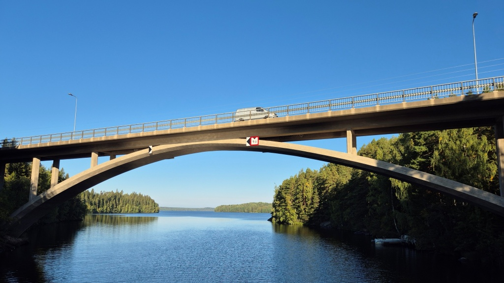

Strax söderom Inkula ligger Haveri, känt för sin nedlagda guldgruva. Haveri-gruvan har ett vattenfyllt dagbrott med gamla gruvgångar under vattnet. Gruvan är, eller har åtminstone varit, ett tillhåll för landets grottdykare. Tyvärr ligger det mesta bakom lås och bom, så jag kunde inte ta mig någon närmare titt. Jag kollade inte ens om museet var öppet såhär tidigt på en lördag morgon. Jag åkte vidare till Kyrofors (Kyröskoski) och Tavastkyro (Hämeenkyrö). Därefter fortsatte jag längs slingrande småvägar ner mot Suiro i Nokia kommun.

Siuro är en mysig liten by med smala gränder och de små husen byggda ganska tätt intill varann. Museiverket har klassat Siuro-backen som ett nationellt viktigt skyddsobjekt. I (eller kanske strax bredvid) Siuro ligger Linnavuori där Valmets, senare Sisus och numera Acgo Powers motorfabrik ligger. Där tillverkas motorerna till Valtra-traktorer liksom till en del andra av Agcos traktos-brands.

Från Siuro fortsatte jag in till Nokia stad och specifikt till Tehdassaari (fabriksön). På denna lilla ö har områdets industri växt fram. Bland annat finns det som var företaget Nokias huvudkontor på den tiden som huvudprodukten var gummistövlar. Jag hade planerat ta en kaffe här, men caféet verkade inte vara öppet ännu. Efter en kort rundvandring fortsatte jag färden, nu i riktning mot syd-väst för att cirkla runt hela Pyhäjärvi. Jag åkte genom Tottijärvi, förut en självständig kommun, nu en del av Nokia stad.

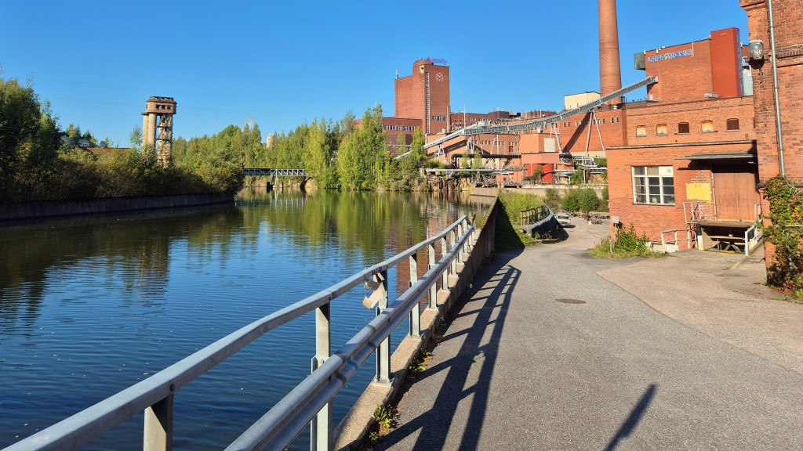
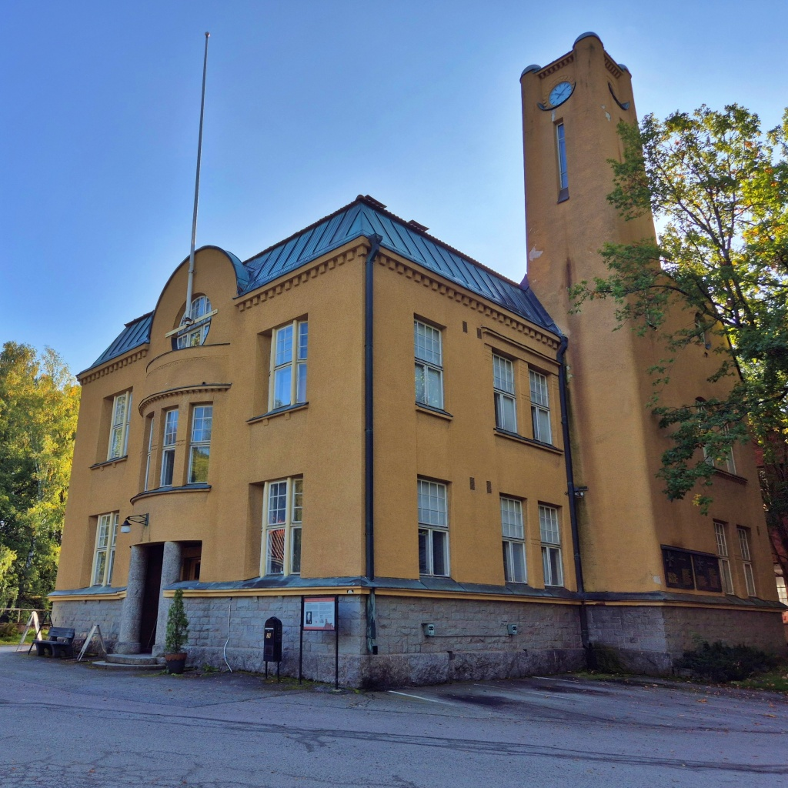
Nokias huvudkontor i början på 1900-talet.

Jag gjorde en kort avstickare till Laukko gård, ett ställe med anor allra minst från tidigt 1400-tal. Herrgården är nu i privat ägo, men på sommrarna finns här sommarcafé, restaurang och det ordnas koncerter, utställningar och rundvandringar. Tyvärr var nu säsongen över och allt var stängt, så jag fick inget kaffe här heller. Jag åkte vidare och sneddade genom Narva by i Vesilax (Vesilahti) kommun. Sedan vidare till Vesilax centrum, där jag fyllde lite soppa i tanken på Blue.

Färden fortsatte sedan genom Lembois (Lempäälä) och sedan ut mot Tammerfors-Birkala flygplats. Jag hade lite hoppats få se skymten av något militärt flyg stationerat vid Satakunda flygflottilj, men så tur hade jag inte. Istället fortsatte jag in till Birkala centrum och sedan vidare in mot Tammerfors. Jag tog en promenad i parken vid Hataanpää herrgård. Även denna herrgård har ett händelserikt förflutet, men är nuförtiden i Tammerfors stads ägo, så att folk kan njuta av den fina rosenträdgården och den i övrigt vackra omgivningen.

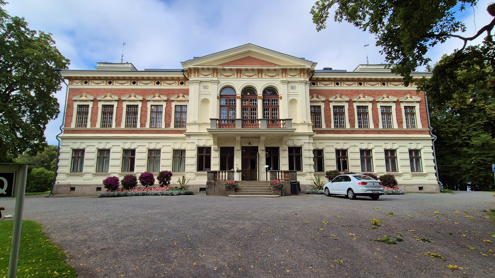
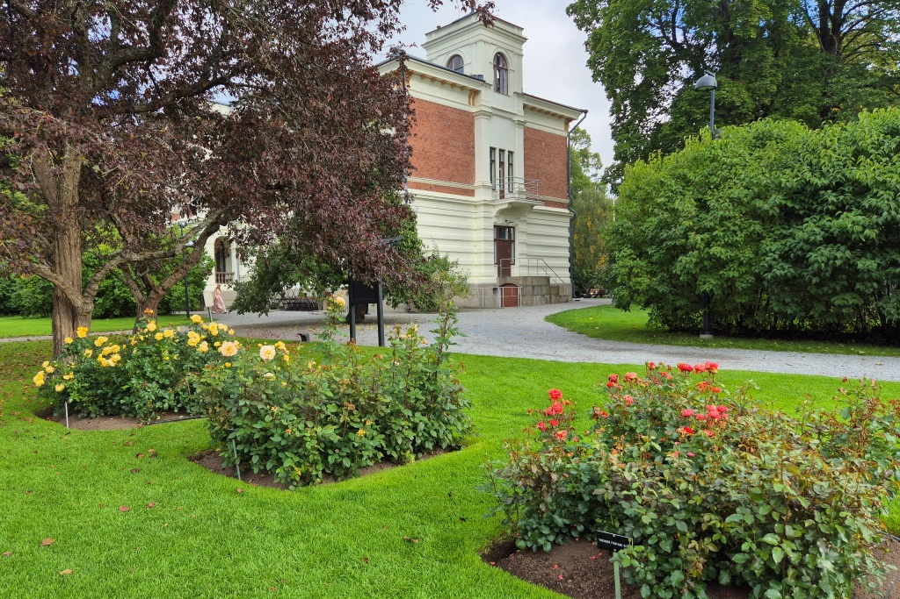
Rosenträdgård

Jag fortsatte in mot Tammerfors centrum, men ungefär vid Koskikeskus vek jag av i riktning mot Kangasala. Här märktes att Tammerfors är en rätt stor stad. Om man undviker motorvägen är det en bra bit av stadstrafik innan man är i Kangasala centrum. I Kangasala körde jag upp till utsiktstornet på Kirkkoharju (Kyrkåsen). Utsiktstornet bjöd på en vacker utsikt över de omgivande sjöarna. 

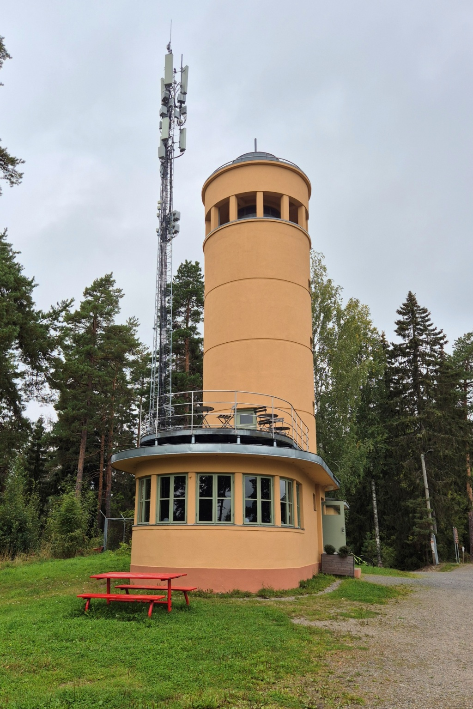
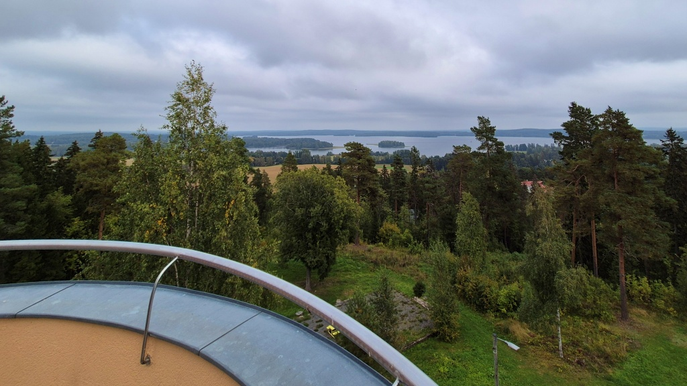

Efter utsikten var jag hungrig, så jag sökte upp en trevlig restaurang i centrum av Kangasala. Medan jag åt min pizza fick jag förströ mig med att titta på ett rätt stort antal motorcyklar som åkte förbi, bl.a. två större korteger av stora glidare. Pizzan var för övrigt mycket god och (den alkoholfria) ölen passade tillfället.

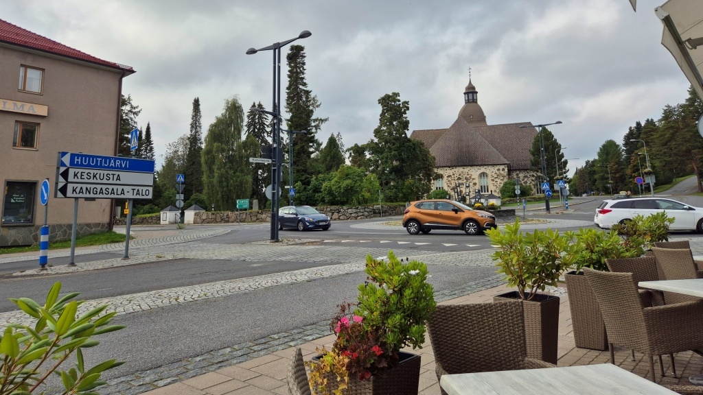
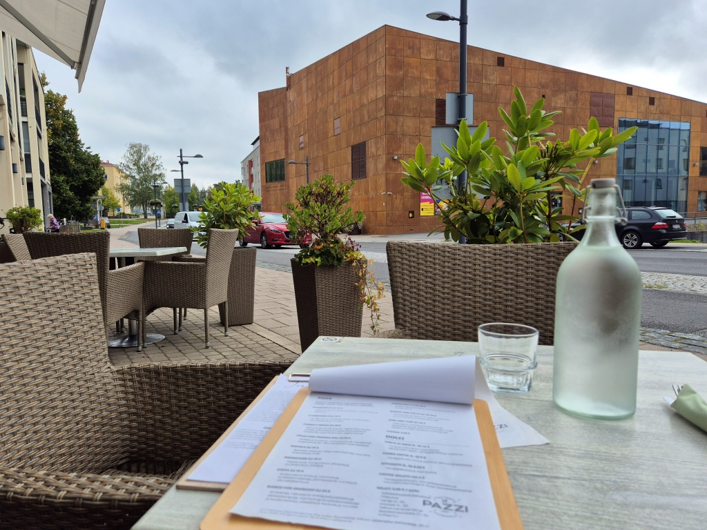
Kangasala-huset

Från Kangasala åkte jag vidare i riktning mot Orivesi. För att vara en tvåsiffrig väg är väg 58 förvånande smal och slingrig. Tyvärr var trafiken rätt tät, så det var inte tal om att brassa på något extra. Orivesi lämnade inga starkare intryck. Kyrkan var en modern, rund konstruktion, medan klockstapeln var byggd i traditionell stil. Jag åkte vidare, en kort bit längs riksväg 9/E63 mot Jyväskylähållet, men svängde snart av mot Juupajoki kyrkby. Juupajoki är nog en av de kommuner jag inte tidigare hade kunnat placera. En liten kommun, som inte riktigt ligger vid någon större genomfartsväg. Juupajokis kommuncentrum är Korkeakoski, med bl.a. en gammal skofabrik. 

Där finns också en 30 m djup dalgång med branta väggar som eroderats ut under istiden, [Juupajoen rotko](https://retkipaikka.fi/juupajoen-rotkon-polut/). Att gå nerför den långa trappan var som att komma in i en annan värld. Trafikljudet försvann och ersattes av porlandet från bäcken och fågelsång. Det blev dunklare. Luften luktade jord och gamla löv. I botten av dalgången går en kort naturstig. Väl värt ett besök. Denna dag kändes det dock rätt varmt med motorcykel-kläderna på sig.

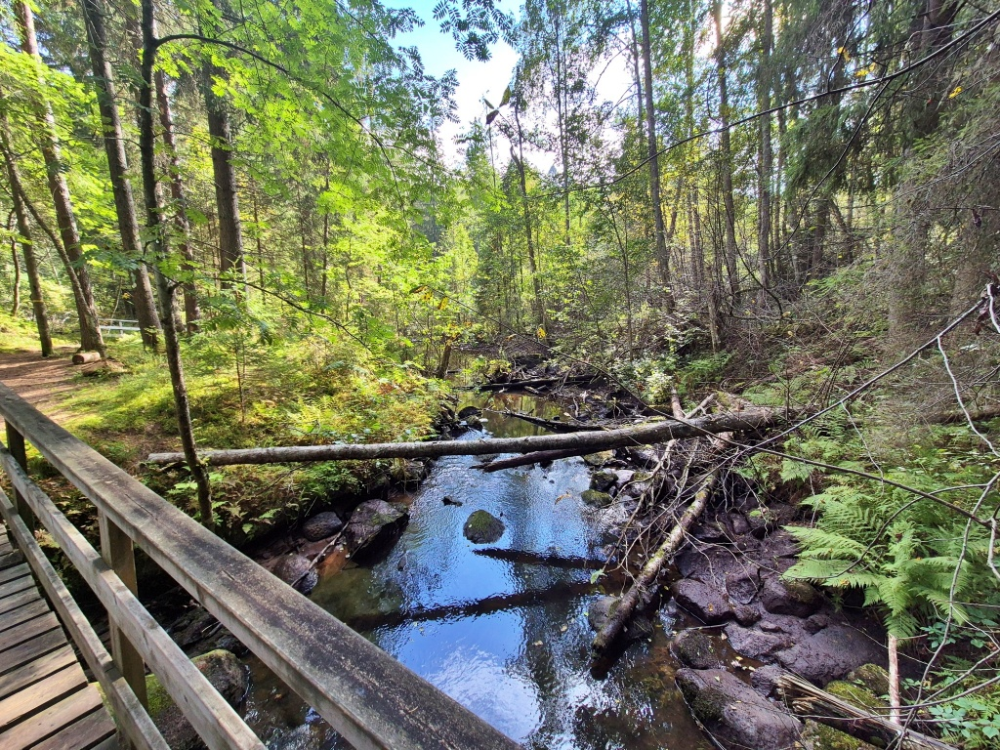
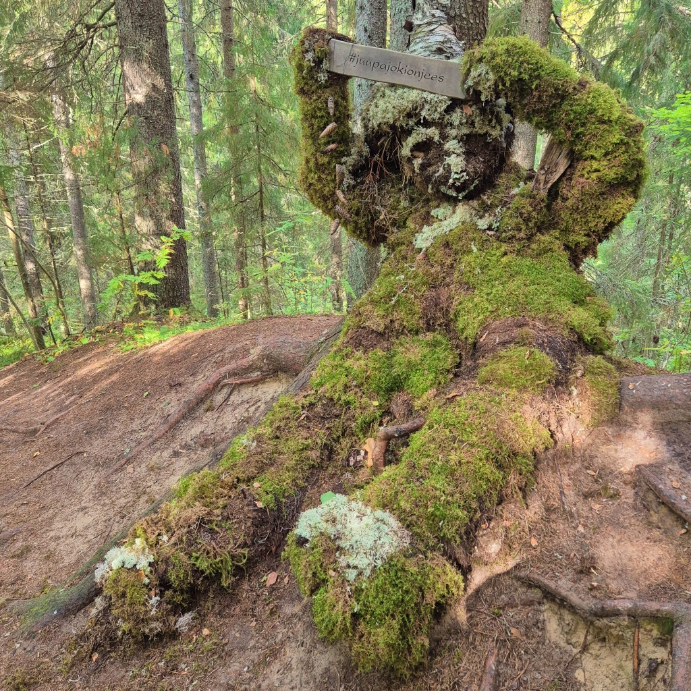

Efter promenaden fortsatte jag i riktning mot Mänttä. Men eftersom jag inte hade sett några militärflygplan vid Tammerfors-Birkala flygfält, kom jag nu på att ta en omväg ner via Halli flygfält i Kuorevesi, Jämsä. Det blev ett antal kilometer på grus, men vägen var rätt okej och helt torr. Tyvärr låg även Halli flygfält öde så det blev inga Hornetar idag. Passade också på att kika på Patrias nya fabrik för F-35-komponenter som ligger intill flygfältet, men som så ofta är fallet såg även denna fabrik tråkig ut på utsidan. Inga Lightning II på piedestaler eller något sånt. Däremot fanns faktiskt en J-35 Draken utställd i centrum av Kuorevesi. Jag märkte det förs när jag åkt förbi och iddes inte vända om - jag har ju rätt färska bilder av Draken från flygvapenmuseet i Tikkakoski.

Nu fortsatte jag till Mänttä och återupptog den planerade rutten. Kikade som snabbast på museum Gösta. Sommarkafeet var stängt för säsongen och restaurangen kändes lite för fin för mina skitiga körkläder så jag åkte vidare genom Vilppula mot Ruovesi.

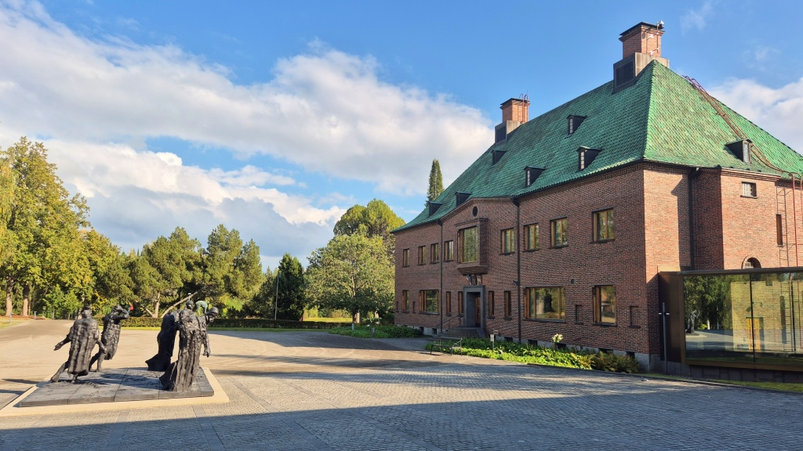

I Ruovesi besökte jag Runebergs källa. Jag har faktiskt aldrig sett en källa där vattnet bubblar upp på det viset (det konstigt ljusgråna området på bilden nedan). Jag smakade också på vattnet, det smakade helt utmärkt. Nu kände jag mig rätt kulturell faktiskt. Tänka sig - jag och Finlands nationalskald [Johan Ludvig](https://sv.wikipedia.org/wiki/Johan_Ludvig_Runeberg) har druckit vatten från samma källa! Jag kunde faktiskt inte låta bli att sjunga ett par strofer av ["Vid en källa"](https://runeberg.org/runeberg/1/0132.html), den lär skall ha inspirerats av justdetta ställe. Och förvånande nog kunde jag tydligen texten för de tre första verserna helt utantill. Sedan åkte jag ner till Ruovesi hamn där jag äntligen hittade en servering som passade min stil. Jag åt sockermunk och drack kaffe i solen.

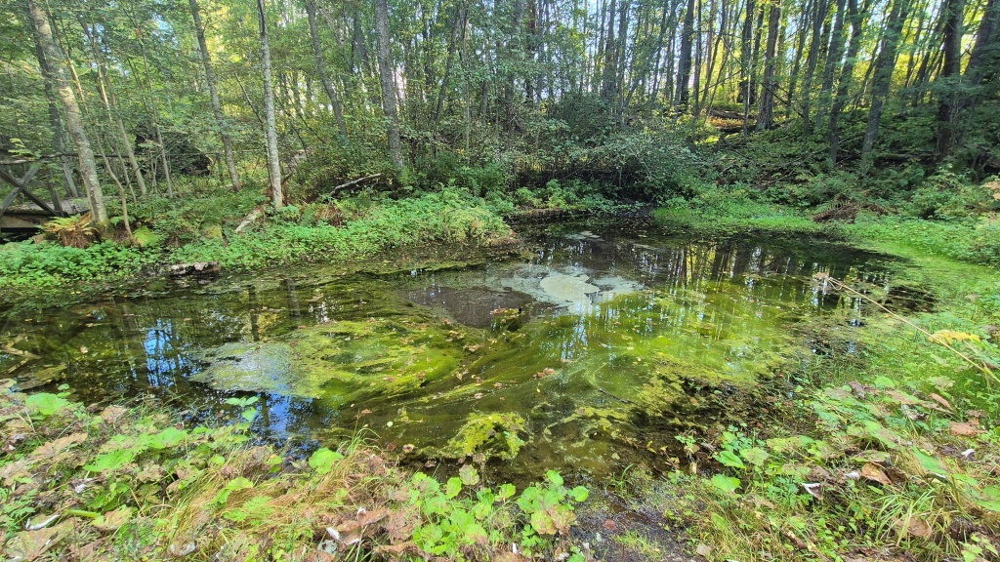

Från Ruovesi fortsatte färden till Kuru. Där fortsatte jag Runebergstemat och besökte vad som kallas för [Fänrik Ståls stuga](https://fi.wikipedia.org/wiki/Kurun_ulkomuseo,_koulumuseo_ja_V%C3%A4nrikki_Stoolin_tupa). En Fänrik Polviander, som bodde i denna stuga lär skall ha gett Runeberg inspiration till hans verk [Fänrik Ståls sägner](https://sv.wikipedia.org/wiki/F%C3%A4nrik_St%C3%A5ls_s%C3%A4gner).

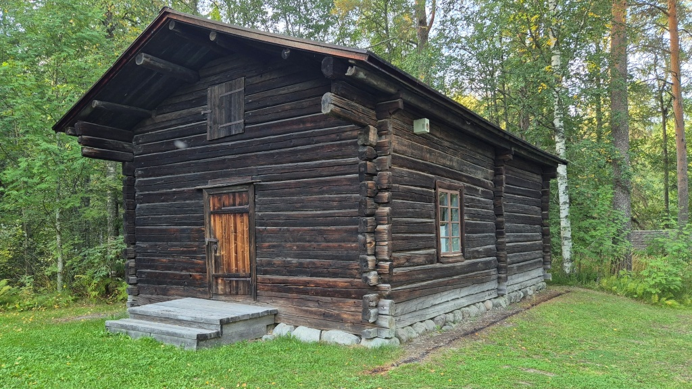

Åter i sadeln gick färden vidare mot [Seitseminen nationalpark](https://www.luontoon.fi/sv/destinationer/seitseminen-nationalpark). Nu räckte inte tiden till någon lång vandring, men en kort skogsvandring blev det. En kort stund med stillheten vid en liten sjö. För övrigt knappast ens några myggor - detta skulle ha varit en fantastisk dag för fotvandring! Jag hittade till och med en bunt [trattkantareller](https://sv.wikipedia.org/wiki/Trattkantarell), men de var i minsta laget för att plockas, så jag lämnade dem till någon annan.

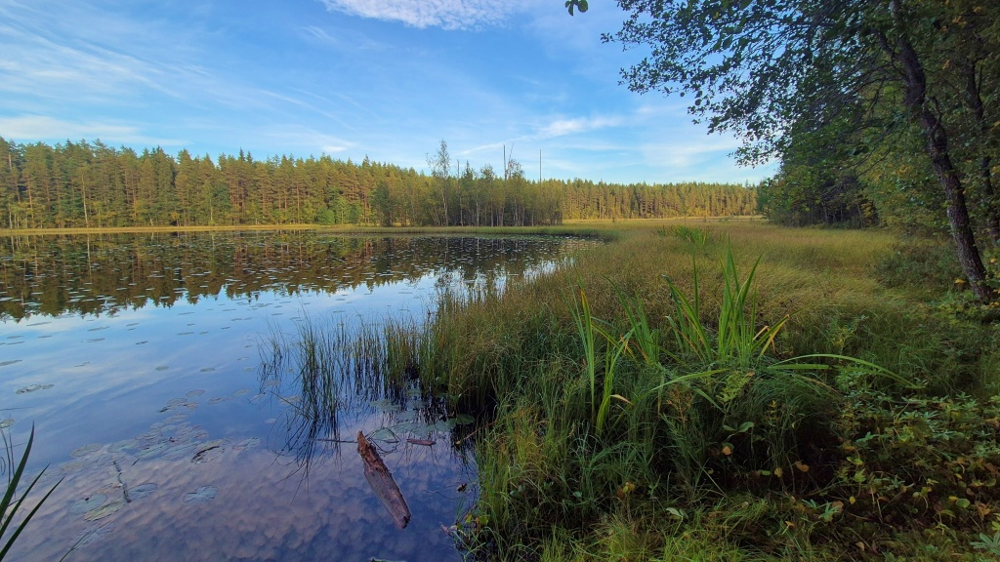
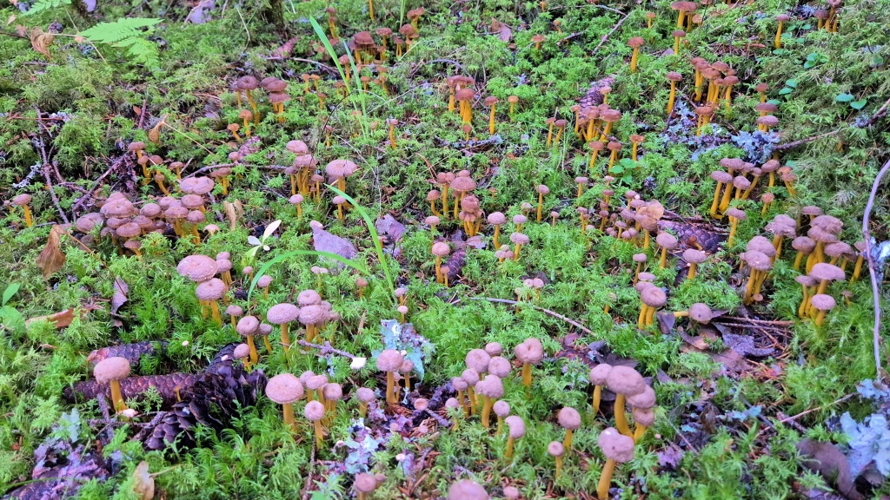

Nu började skuggorna växa sig allt längre. Jag åkte tillbaks till Parkano, tankade och åkte sedan norrut. Jag har många gånger åkt tåg och förundrat mig över att tåget stannar på en station mitt ute i skogen - Parkano. Nu fick jag lust att se den stationen så att säga från landsvägssidan. Visst var det några kilometer från bebyggelsen, men det är ju ändå inte total ödemark, så som det verkar från tågfönstret. Mycket lugnt och stilla var det i varje fall när jag var där.

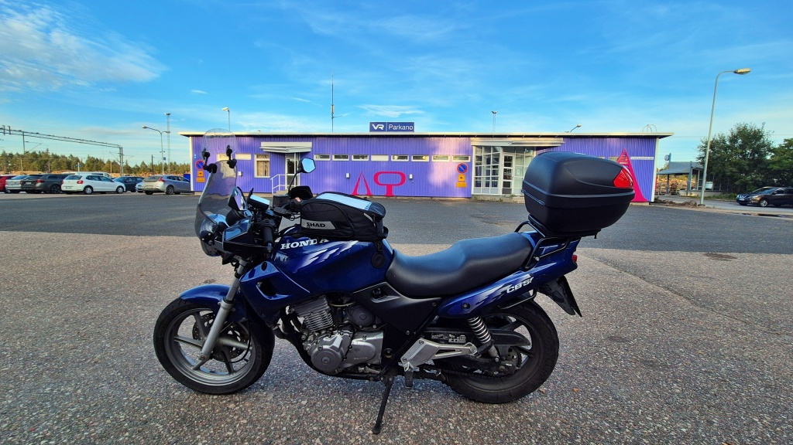

För att spara tid och hinna hem innan mörkret åkte jag denna gång riksväg 3/E12 tillbaks mot Vasahållet. Jag tog en genväg (kortare men långsammare) genom Koskue, längs gamla landsvägen. Här vid en gammal nedlagd butik finns ett [de Havilland Vampire](https://sv.wikipedia.org/wiki/De_Havilland_Vampire) flygplan utställt. Jag stannade inte, kanske jag borde ha fotat. Åkte sedan vidare norrut förbi Jalasjärvi.

Nu började solen närma sig horisonten, men jag tyckte ändå att jag hade tid för en sista avstickare. På en backe strax innan Kurikka centrum finns [Loukajanvuori utsiktstorn](https://retkipaikka.fi/loukajanvuori-nakoalapaikka-kurikassa/). Det gick inte att köra hela vägen upp på kullen, men det var bara en kort promenad. Jag klättrade upp i tornet och måste säga att för en gång skull var ett utsiktstorn onödigt högt. Redan från första avsatsen såg man hur bra som helst ut över trädtopparna. Och trappan dit upp var faktiskt lite läskig.

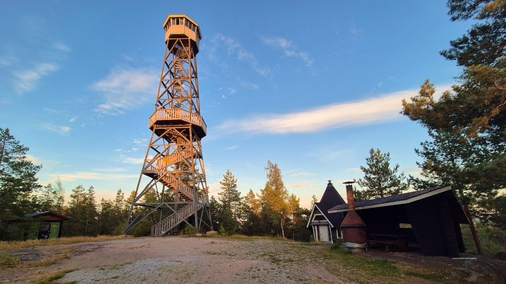
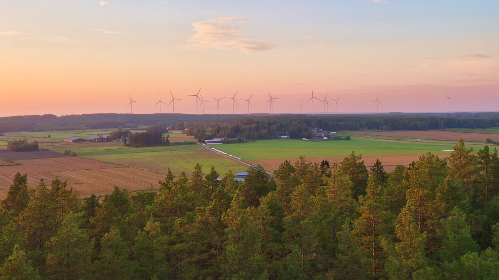
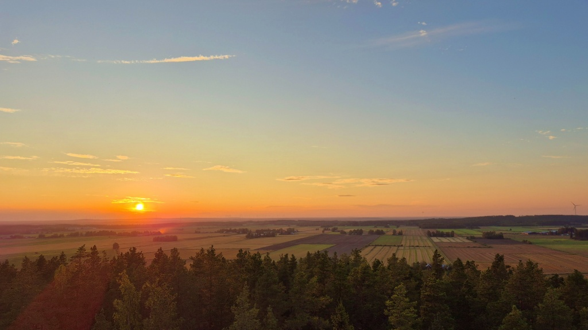

Nu hade solen nästan gått ner, det var bara att fortsätta hemåt. Jag kom hem efter solens officiella nedgångstid, men med det fina vädret var det inte så mörkt ännu. Dessutom var det riktigt varmt och skönt ännu en stund efter kl. 21 på kvällen. Jag hade inte ens bytt till de tjockare handskarna jag hade med. Körsträckan blev denna gång 793 km. Lite öm i baken hann jag väl bli, men nog skulle jag gärna ha fortsatt några timmar till om bara dagsljuset räckt till.

På det hela taget var det en ganska händelsefattig resa. Jag har inte pratat med någon på hela dagen, så när som på några ord när jag köpte fika. Resan bjöd inte på några stora överraskningar och inte heller några problem. Bara härlig körning hela dagen.

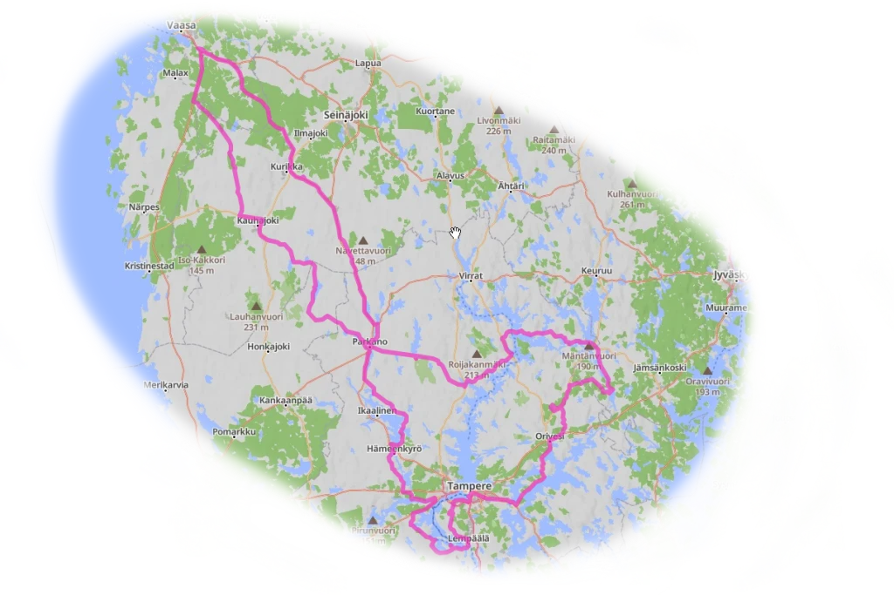

## Nya kommuner

Mitt långsiktiga mål är att ta min motorcykel Lilla Blue till alla Finlands kommuner. På denna resa fick hon besöka hela 14 nya kommuner:

* Parkano
* Ikalis (Ikaalinen)
* Ylöjärvi
* Tavastkyro (Hämeenkyrö)
* Nokia
* Vesilax (Vesilahti)
* Lembois (Lempäälä)
* Birkala (Pirkkala)
* Tammerfors
* Kangasala
* Orivesi
* Juupajoki
* Jämsä
* Ruovesi

Vi har redan tidigare kört genom utkanten av Mänttä-Vilppula, men denna gång besökte vi också centrum.

Lilla Blue har nu besökt 161 av Finlands 308 kommuner.

