# Bytt topplockspackning och vattenpump

Den här historien börjar redan i fjol på hösten. Några dagar efter min tur till [Tammerfors](../2025-09-06-tour-tammerfors/), den 11 september faktiskt, ringer frun och berättar att bilen har punktering och står vid hennes jobb. Jag tar en batteridriven däckpump och sätter mig på hojen, åker dit och fyller däcket, som håller tillräckligt med luft för att jag skall kunna åka hem. Senare på kvällen får jag skjuts för att hämta hojen. Den startar och går som vanligt, men när jag kommer hem och kör in hojen i garaget upptäcker jag att det formligen rinner kylvatten från vattenpumpen. Två missöden på samma dag. Och ett abrupt slut på körsäsongen, skulle det visa sig. Och början på en ganska utdragen reparationsprocess.

Fast egentligen börjar historien kanske ännu tidigare, redan på sommaren. Efter mitt [Iron Butt SS1000-försök](../2025-07-31-ironbutt/) i slutet av juli hade motorn ett konstigt ljud, något slags vinande, vid höga varv. Jag trodde först att det var något som satt löst och vibrerade, men det kan hända att detta ljud var ett symtom på något som skulle leda till haveriet. Mer om detta senare.

<!--more-->

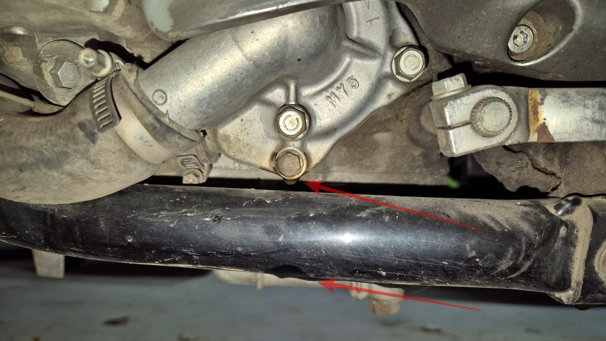

Eftersom det droppade kylvatten från vattenpumpen antog jag att det var pumpens packning som läckte. Jag försökte således få tag i en packningssats. Som vanligt finns ju inget att få tag i lokalt, utan allt måste beställas med rätt långa leveranstider. Då är det lika bra att beställa själv, tänkte jag, och lade iväg en beställning till [Lelles](https://www.lellesmc.se), ett svenskt företag med bra anseende och kort leveranstid. Nå, det dröjde några dagar innan de skickade iväg paketet, och sedan tog PostNord över. Efter dryga två veckor fick jag meddelande om att jag kunde hämta ut försändelsen från den ort i Sverige som har samma postnummer som min egen ort i Finland. Det var mindre bra: att åka 1300 km för att hämta en packningssats för 20 €? Nej tack. Jag meddelade Lelles att jag ville ha pengarna tillbaka och att de kunde göra vad de ville med packningssatsen. (Det kan nämnas att Lelles betalade tillbaka pengarna _och_ skickade packningssatsen till mig - men då hade jag redan beställt en ny.)

Under tiden tog jag i sakta mak itu med jobbet att demontera vattenpumpen. Detta innebar ju att kylsystemet måste tömmas. Och nu blev det mindre kul. När jag tömde ut kylvattnet upptäckte jag nämligen att det var en hel del olja blandad med kylvätskan. Så skall det inte vara. Det tog ett tag av funderande innan jag insåg att egentligen enda stället där olja kan komma in i kylvattnet är i topplocket - vilket måste innebära att topplockspackningen läcker! Att fixa det problemet är inte längre någon alldeles liten operation.

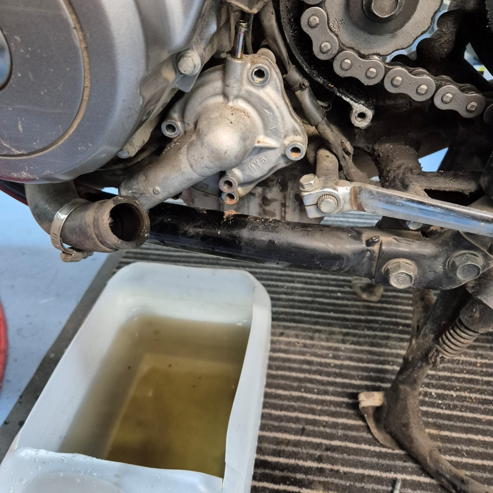

Jag tog i varje fall mod till mig och öppnade cylindrarna. Det i sig är ju ett litet projekt. Kåporna skall bort, tanken skall bort, förgasarna och luftfilterhuset skall bort, avgasröret skall bort, ventilkåpan skall bort, kamaxlarna skall bort och kamkedjan får inte tappas ner i vevhuset. Lite bränt var det mellan cylinderfoten och topplocket, men för att vara ärlig hittade jag inget ställe där jag kunde peka på att "där har det läckt".

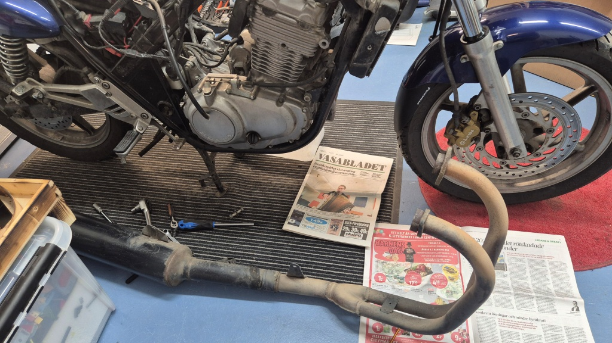

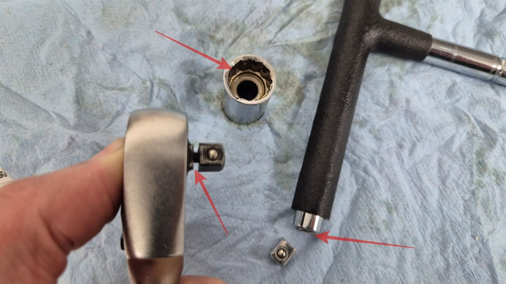

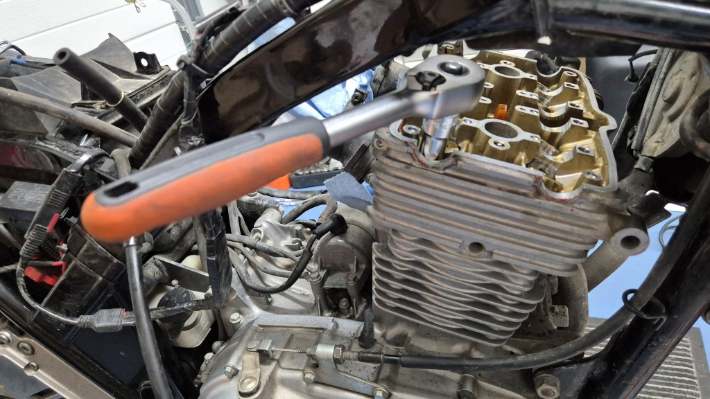

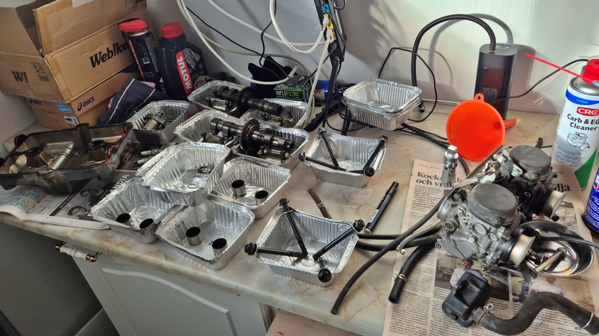

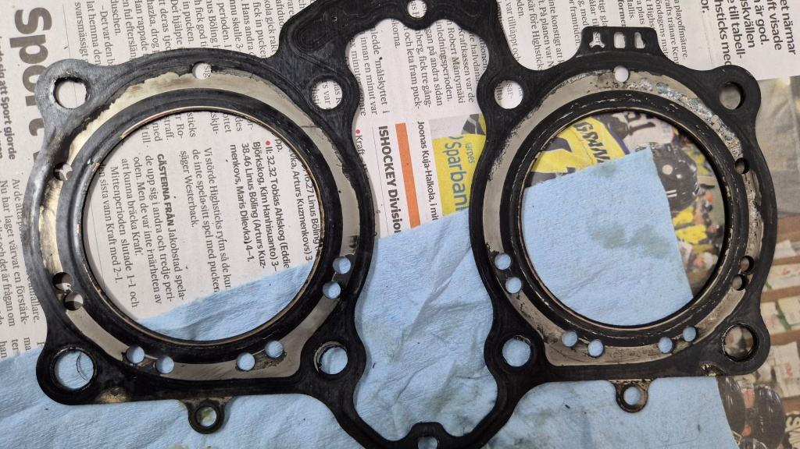

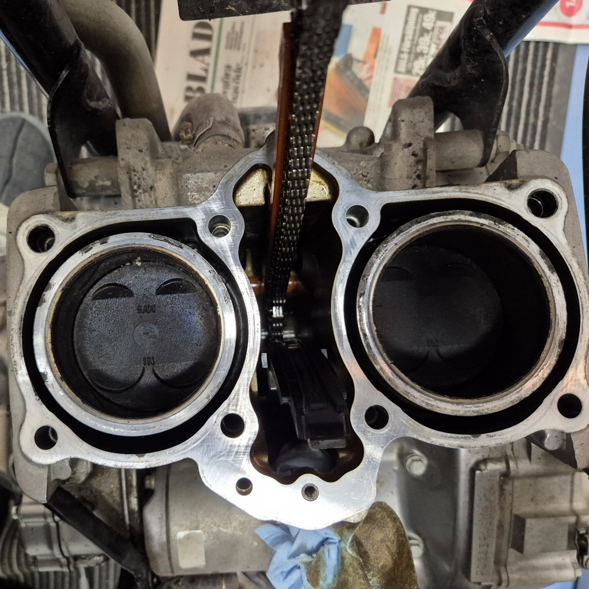

Det blev i varje fall att beställa en rejäl hög med diverse packningar och reservdelar tillsammans med en ny topplockspackning, eftersom man bör byta de flesta packningar om man öppnar dem. Jag passade också på att beställa ett nytt packningsset till vattenpumpen. Det enda förmånligare stället jag lyckats hitta för att beställa OEM-delar är [Webike](https://www.webike.fi), som skickar från Japan. Det tog alltså sina modiga 2-3 veckor innan delarna anlände.

Jag försökte också, efter bästa förmåga, mäta hur rakt topplocket var. Enligt mina mätningar var topplocket så skevt att det var utanför Hondas tolerans. Alltså måste topplocket planas. Efter en del sökande hittade jag ett ställe som gör sådant, [Diesel Test](https://www.dieseltest.fi/svenska/) i Vasa. De var snabba och professionella, och det kostade inte heller så mycket som jag befarade - 67 € tog de för besväret. De berättade i varje fall att de inte hade behövt plana av så mycket som jag mätt upp; locket hade nog varit inom toleransgränsen. Men nu var det rakt i varje fall.

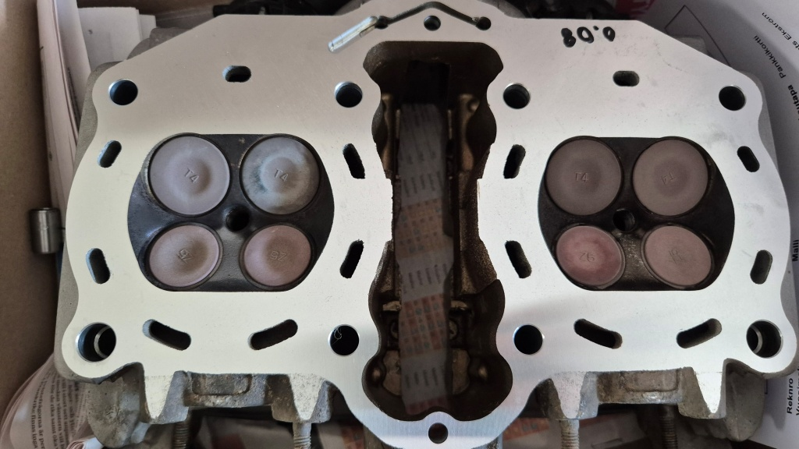

Sedan skruvade jag ihop allt igen. Givetvis passade jag på att kontrollera ventilspelet (inom toleransen), kolla kedjespännaren osv. Så då borde allt vara i ordning, hoppades jag. Problemet var bara att det var slutet av oktober och kallt och eländigt ute. Inte alls kul att skruva ute, och om jag kör in en varm motorcykel i mitt kombinerade arbetsrum/verkstad så stinker det olja i en dag efteråt. Så hela projektet lades liksom lite på is i väntan på varmare väder.

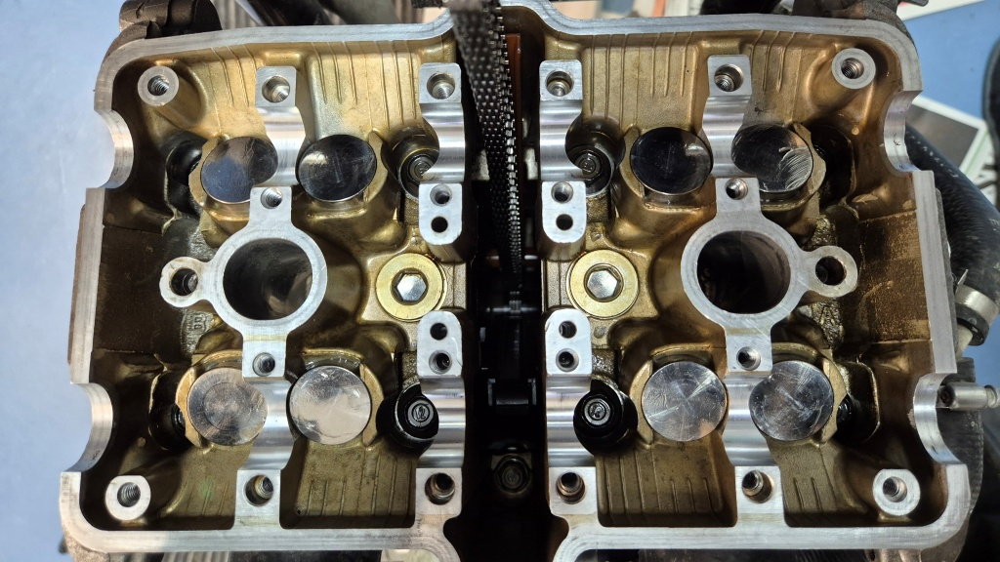

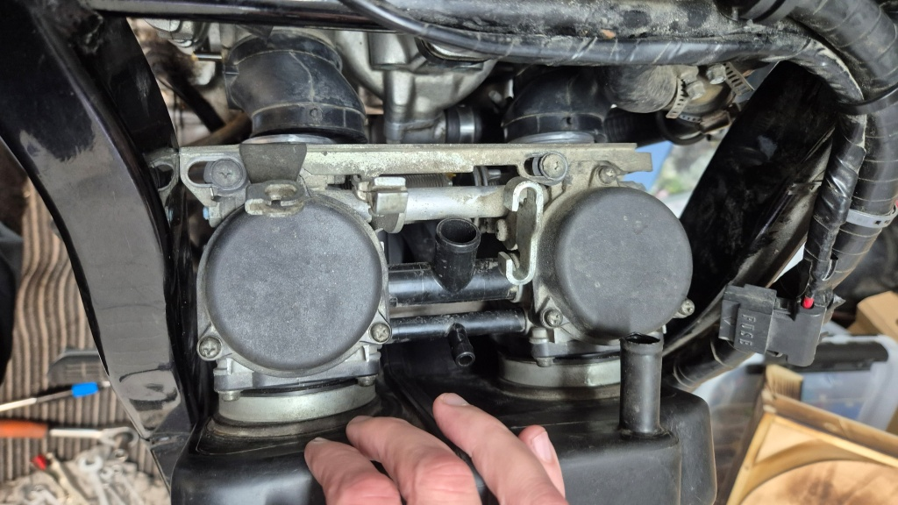

Så i början av mars, när snön hade smält och solen äntligen börjat värma igen, fortsatte projektet med att skölja ur kylsystemet. Först med vatten, sedan med ättiksvatten och därefter med destillerat vatten. Men när jag startade motorn för att köra den varm visade det sig att vattenpumpen fortfarande läckte, trots ny packningssats. En sådan vattenpump kan läcka på två ställen, dels vid själva pumphusets packning (den jag bytt), dels vid axeln mot vevhuset. Det senare kan inte repareras (även om det säljs kinesiska reparationskit för detta ändamål, dock utan anvisningar om hur man utför reparationen). Så då var det bara att skaffa en ny vattenpump. Eller inte ny, det blev en begagnad, men dyrt blev det i varje fall - faktiskt den dyraste del jag köpt till denna motorcykel. Och givetvis tog det en dryg vecka innan den levererades också, trots att jag, mot min vana, betalade för expressleverans.

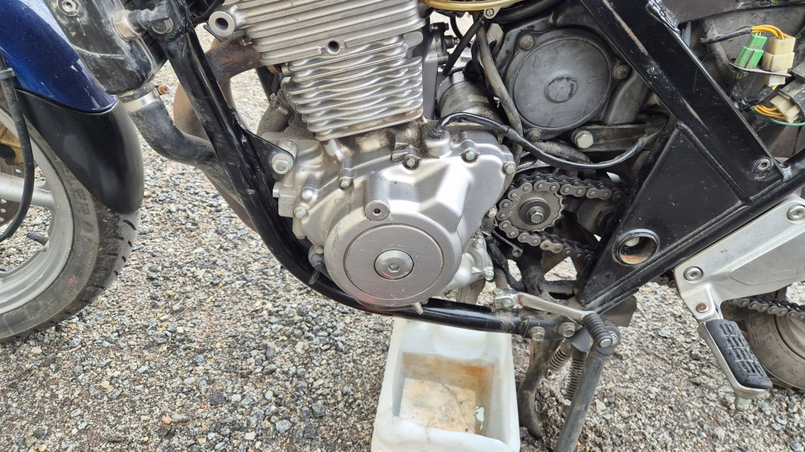

Först nu lyckades jag lägga ihop ett och ett. Orsaken till att vattenpumpen började läcka var att trycket i kylvätskan blev för högt. Vattenpumpar byggs så att de då skall läcka ut kylvätskan på marken i stället för att läcka in den i oljetråget. Trycket blev för högt eftersom avgaser läckte från cylindrarna förbi topplockspackningen in i kylsystemet vid höga varv. Ljudet jag hade hört på hösten var antagligen just det - en läckande topplockspackning. Och orsaken till att topplockspackningen började läcka var nog att jag körde stackars Lilla Blå 1800 km på ett dygn under en dag då utetemperaturen som varmast var över 30 grader. Så var det kanske; det är åtminstone min teori just nu.

Alldeles i slutet av mars hade jag sedan ihop hela paketet. Hojen startade men behövde väl justeras in en del (tomgång, synkronisering av förgasarna och standardvårservice). Vädret var nu tämligen kasst igen, så någon provtur blev det inte. Det får vi återkomma till senare.
