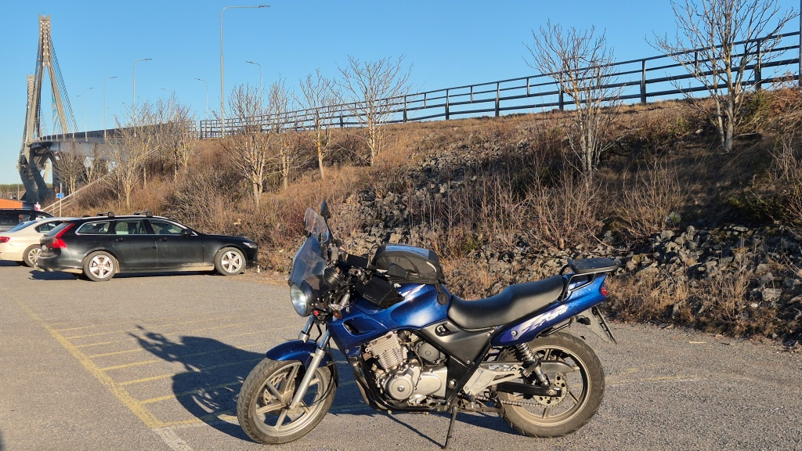
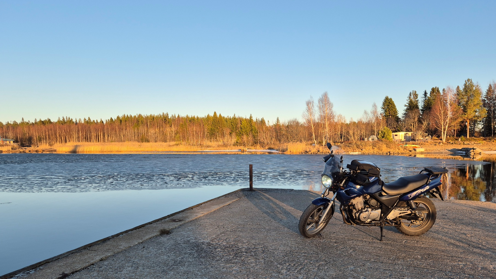
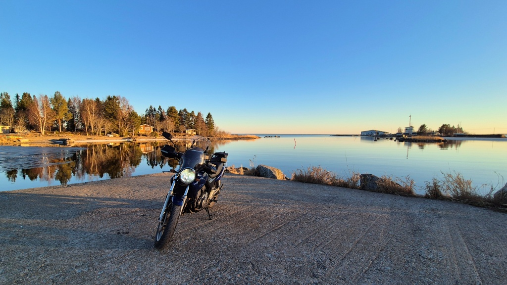

# Säsongsöppning 2026 - Sommarösund

Vårsolen lyser och snön har smält för länge sedan. Visserligen kommer nästan varje natt fortsättningsvis med nattfrost, men framåt eftermiddagarna har körbanorna varit torra och temperaturen legat över +5°C redan i snart en månads tid. Orsaken till att årets premiärtur försenats är diverse strul med hojen. Men efter att ha skruvat hela dagen, kändes det som att hojen nu är i tillräckligt bra skick för en första tur.

Eftersom all snö smält för länge sedan, styrde framhjulet denna gång bort över Replotbron med förhoppningen att hitta lite havsis att plåta hojen mot. Fast på vägen märkte jag att jag var hungrig, så första stoppet blev [Berny's](https://www.berny.fi). Viktigt att passa stängningstider så att man inte blir utan pizza!

<!--more-->

Efter pizzan fortsatte jag ut genom Replot, svängde av mot Vallgrund och sedan vidare ut till Sommarösund. Det var inte mycket till is, men en liten tunn skorpa fanns det kvar inne i viken. Det var nog nästan sista chansen att fota hojen med havsis för denna vinter.

På hemvägen blev det en liten omväg via Jungsund, Karperö och sedan via Kvevlax till Golkas. Jag kom hem när solen precis gått ner. Premiärturen blev 129 km lång.

")

## Hur kändes det då?

Äntligen ut och åka. Jag kände mig inte speciellt rostig eller så, kändes nog som om jag hade bra kontroll på motorcykeln.

Hojen däremot har nog fortfarande en hel del att justera. Det verkar fortsättningsvis bli en del skruvande.

* Framdäcket har en långsam pysläcka. Startar man med fulla 2 bar har trycket sjunkt till kanske 1,7 bar när man är hemma. När trycket sjunker tilltar vibrationerna i styrstången. Det blir nog att beställa ett nytt framdäck i varje fall, det är börjar vara rätt nött efter att ha gått mer än 21 000 km.

* Dessutom börjar bakdäcket också vara slut, efter blott ca. 11 000 km. Det är väldigt fyrkantigt, precis som det föregående blev i ett alltför tidigt skede. Jag kanske borde ha högre däcktryck eller nåt (enligt tillverkaren skall det vara 2,25 bar utan passagerare och 2,5 bar med passagerare). Eller så måste jag lära mig ta kurvor ordentligt, för att nöta bort "chicken stripes", så att säga.

* Ett av bromsbeläggen bak är nästan helt utnött. Måste bytas. Och att bara den ena brombelägget är utnött, medan det andra har rejält med kött kvar, skvallrar om att bromsoken eller i synnerhet tapparna borde putsas eller renoveras.

* Tomgången för låg, hojen stannar nästan. Det är väl lätt fixat, bara att justera in för hand.

* Choken hakar upp sig. Om man öppnar choken helt, verkar den hänga kvar på fullt. Måste försöka smörja kabeln.

* Också i övrigt känns motorn lite "ovillig". Kanske behöver förgasarna justeras och synkroniseras. Jag försökte visserligen vakuumsynka redan, men det blev inte riktigt bra eftersom bränsletillförseln inte är tillräckligt jämn när tanken är bort (bränslekranen kräver vakuum för att funka). Jag köpte en billig garage-tank, men den läcker som bara tusan - Kina-skräp.

* Framgafflarna läcker lite. Försökte redan rensa med en tunn plastfilm. Höger blev bättre, vänster läcker fortfarande. Blir väl nog att renovera dem vad det lider.

* Värmehandtaget på gassidan värmer inte eller åtminstone betydligt sämre än vänster sida. Verkligt irriterande, de där Oxford värmehandtagen har inte gjort annat än krånglat hela tiden.

Suck, blir det mera skruvande än körning denna säsong?
