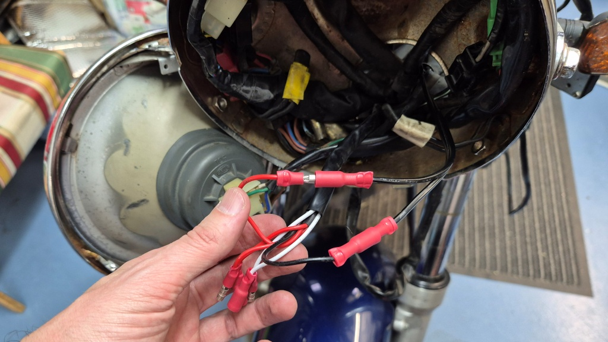
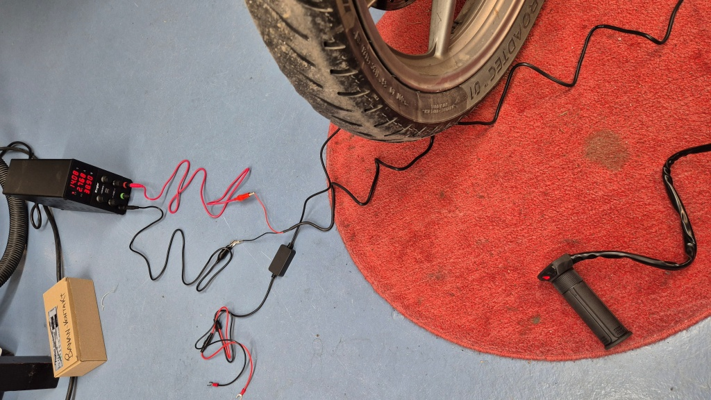
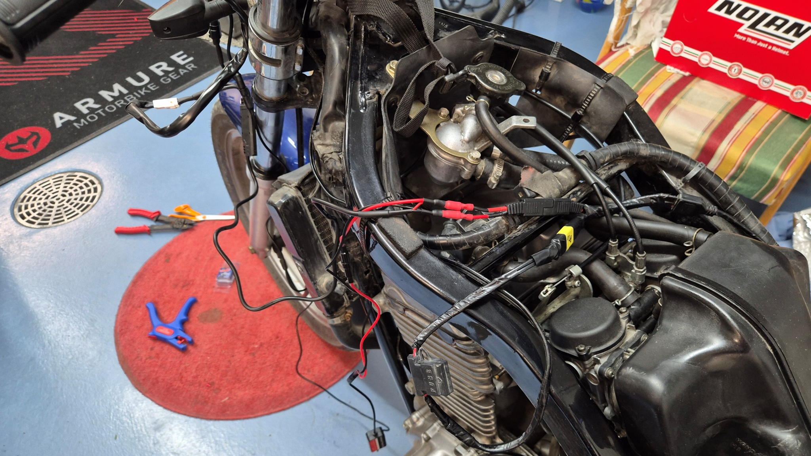
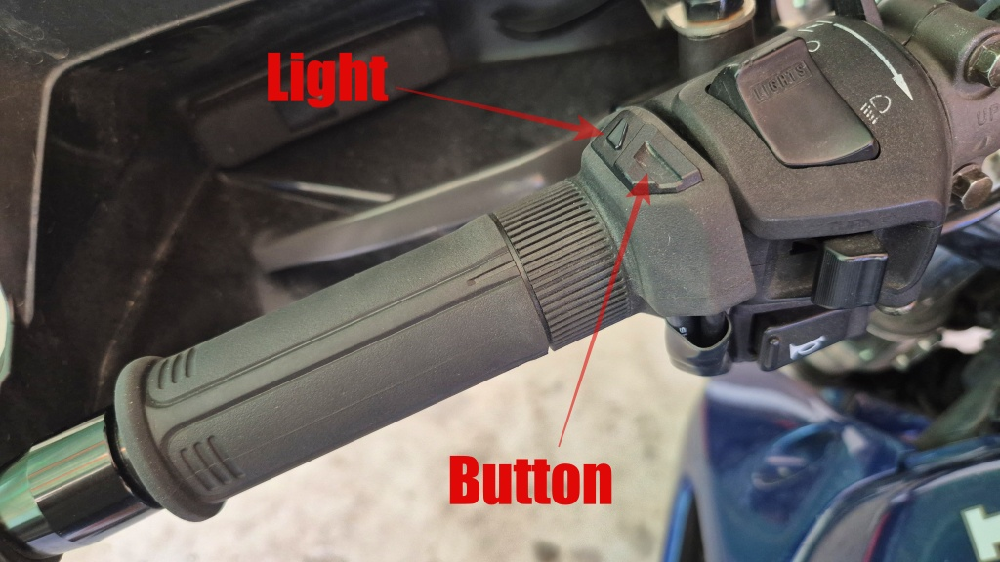

# Installation av nya värmehandtag

Mina Oxford värmehandtag, som jag installerade i september 2024, har inte riktigt hållit måttet. De har ständigt bråkat på sätt eller annat, nu senast har de knappt värmt alls på höger sida (gas-handen), medan vänster hand har stekts. Nu beslöt jag att ersätta dem med ett par Koso HG-13 istället.

<!--more-->

Oxford-handtagena har orsakat trassel mest hela tiden. Eftersom de var olika varma på höger och vänster sida, försökte jag ersätta de mycket stora och sladdriga standard-kontakterna (inne i strålkastar-huset) med nya rundstift-kontakter. Det verkade bli lite bättre. Limmet har också lossat två gånger, med påföljd att gashandtaget roterar under körning, så jag har fått bättra på det.

Nu senast har höger handtag bara gått på halv effekt. Märkväl gas-handen, som hela tiden skall hållas på styret! Jag försökte byta kontakter för matningen, men det hjälpte inte. Multimetern visar att båda handtagen ger kontakt men att det högra handtaget har aningen högre resistans. Men jag hittade inga uppenbara, kanske är det löskontakt inne i kablarna eller handtaget. Jag fick i varje fall nog av det hela och inhandlade ett par Koso HG-13 istället.

Installationen var rätt problemfri, efter att jag tagit bort tanken var det största jobbet att ta bort allt tejp som jag satt runt Oxford-handtagens kablar. För säkerthets skull testade jag de nya handtagen med en extern strömkälla för att försäkra mig om att de faktiskt fungerade. Funkade fint.

Sedan lirkade jag av Oxford-handtagen, vilket gick betydligt lättare än jag trott. Lite hjälp av en tunn skruvmejsel och lite tryckluft och så kom de bort. Jag putsade styrstången till vänster och gashandtaget till höger och sedan tryckte jag dit de nya Koso-handtagen med lite WD-40 som övertalningsargument. Riktigt enkelt, faktiskt. Koso nämnde inte något om lim och jag satte inte heller något lim. Får se hur det funkar.

Hittills har jag försett min Aocci Android Auto-skärm med ström från ett USB-uttag, men nu passade jag på att ersätta detta arrangemang med en egen fast strömmatning. Sedan tejpade jag ihop kablarna till ett snyggt paket och arrangerade dem under tanken enligt bästa förmåga.

## Erfarenheter

Hur känns de nya värme-handtagen då?

* De har reglagen integrerade vänster handtag, vilket gör att handtaget känns aningen litet, också för mina rätt små händer. Kanske man vänjer sig.

* Jag monterade vänster handtag så att ljuset skulle synas så bra som möjligt, men det gjorde att själva knappen kom precis bredvid blinkers-reglaget - med påföljden att värmehandtagens inställningar lätt kan ändras när blinkers används. Det går iofs. att rotera, men då syns inte indikationslampan lika bra längre.

### Uppdatering i juni

Med dryga 1000 km erfarenhet av de nya handtagen:

* Handtagen ger jämn och bra värme och temperaturen är tillräckligt justerbar för alla förhållanden - nåja, det har ju inte varit när noll på sistone, det får vi vänta tills i höst att bedömma.

* Storleken, att handtagen är ganska korta, känns inte längre som ett problem. Åtminstone inte med aningen mindre sommarhandskarna.

* På det sätt som jag ursprungligen monterade vänster handtag, stötte jag till kontrollern och ändrade inställningarna nästan varje gång jag använde blinkers. Efter att ha roterat vänster handtag aningen, så att knappen kommer uppåt och ljuset snett framåt, händer det fortfarande då och då att jag råkar ändra installningarna, men inte lika ofta. Men indikationslampan är svår att se i dagsljus. Och risken är att det blir problem när man börjar använda långljus-knappen senare i höst. Jag tror jag skall testa att vrida handtaget åt andra hållet istället, så att knappen kommer i höjd med signalhorns-knappen - den använder jag aldrig (frivilligt, åtminstone).

* Utan lim verkar handtagen rotera aningen efterhand. Inget stort problem, det går att justera tillbaks. Jag har inte upplevt att handtagen ger efter under använding.

På det hela taget är jag nöjd med investeringen. Trots ergonomi-problemen är det ändå bättre än att vara tvungen att felsöka hela tiden. Och frusna händer tar lite glädjen ur körningen - och är en säkerhetsrisk.
