# Varggrottan i Kristinestad

Våren kom på riktigt till Valborg. Både Valborgsmässoafton och första maj var varma och soliga. Även idag, lördagen den andra maj, började soligt och varmt. En perfekt dag för en tur, och idag styrde jag kosan mot [Varggrottan](https://sv.wikipedia.org/wiki/Varggrottan) i Kristinestad.

<!--more-->

Egentligen var detta inte alls planerat, men eftersom vädret var strålande och det inte fanns några alltför pressande saker att göra, beslöt jag mig att åka en tur. De flesta lite längre turer brukar jag planera rätt noggrannt i förväg, men denna gång blev det bara att mata in några ruttpunkter på datorn, för att inte vara tvungen att irra runt under själva åkningen. Med temperaturer mellan 10-15 grader klädde jag på mig underställ och vinterfodret i jackan och byxorna sitter också kvar (antagligen sitten vinterfodret kvar ända in i juli). Men jag tog i varje fall sommarhandskar (med tjockare handskar i tankväskan). Jag smorde keden, kollade däck-trycket och plockade snabbt ihop en flaska vatten, I-hjälpväska och vad man nu behöver med på en några timmars tur. Sedan bar det av.

Första korta stopp blev vid [Korsnäs kyrka](https://sv.wikipedia.org/wiki/Korsn%C3%A4s_kyrka). För mitt [Finland/308](/finland308/)-projekt har jag börjat fundera att jag ju egentligen borde ha bildbevis från varje kommun. Och vad finns i precis varje kommun? En kyrka, eller flera. Så varför inte börja fota varje kyrka jag kör förbi? Kanske det får bli en samling foton över alla Finlands kyrkor, eller åtminstone en hel del av dem? Så då är det väl bara att börja fota också kyrkor på närmare håll, så att samligen blir komplett, så att säga.

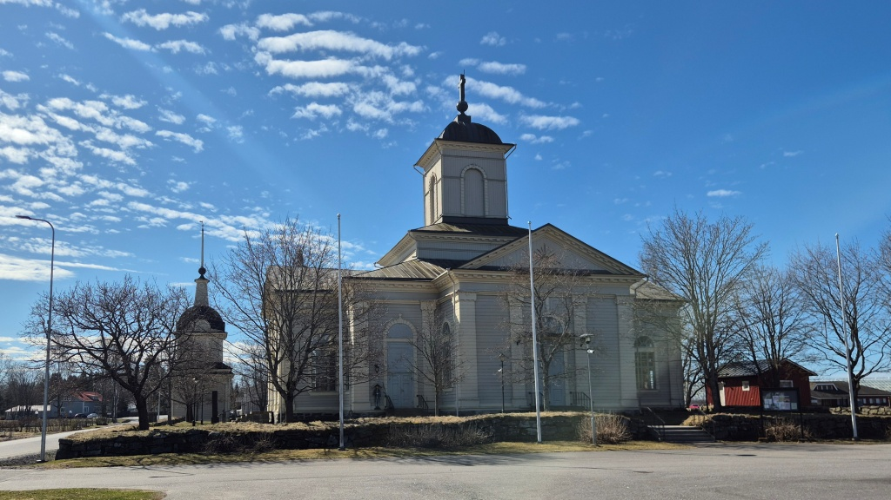

Det kändes lite kyligt med sommarhandskarna, trots att de nya Koso-värmehandtagen värmer jämnt och bra. Jag passade på att byta till läderhandskarna.

Jag tog en sväng via Harrström strandpaviljong - nuförtiden en lite sorglig syn. Sedan vidare till Norrnäs och därifrån längs en asfalterad (men rysligt ojämn) väg till Yttermark - en väg jag inte åkt förut. 
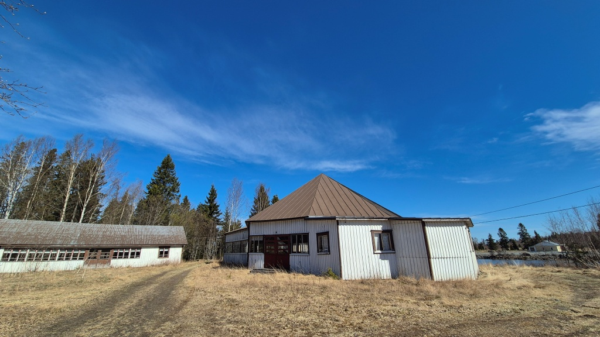

Därefter ett snabbt besök vid [Närpes kyrka](https://sv.wikipedia.org/wiki/N%C3%A4rpes_kyrka) och kyrkstallarna. Sedan vidare via Skrattnäsvägen mot Kristinestad. Det var inte inritat på kartan, men kom på att ta en kort omväg via [Carlsro](https://www.kristinestad.fi/fritid/kultur/museum/stadsmuseum-carlsro), Kristinestads stadsmuseum. Det var stängt, men vackert också på utsidan.

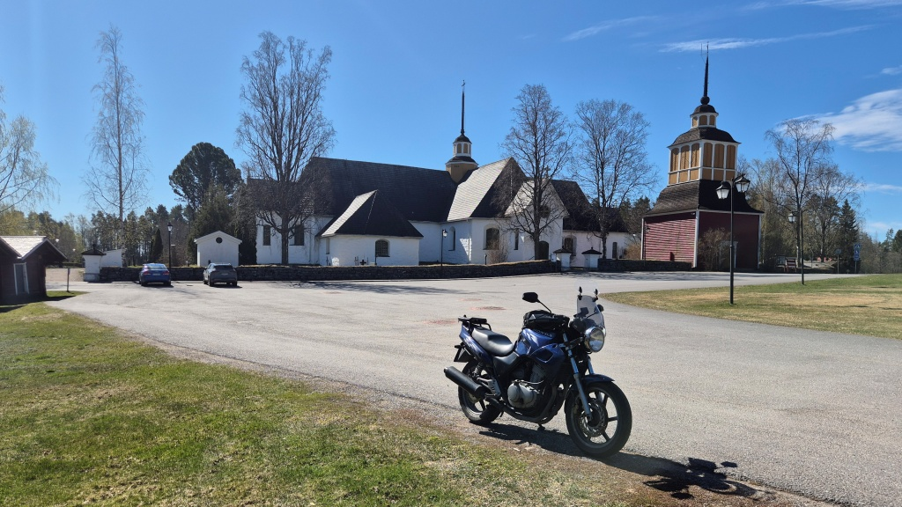

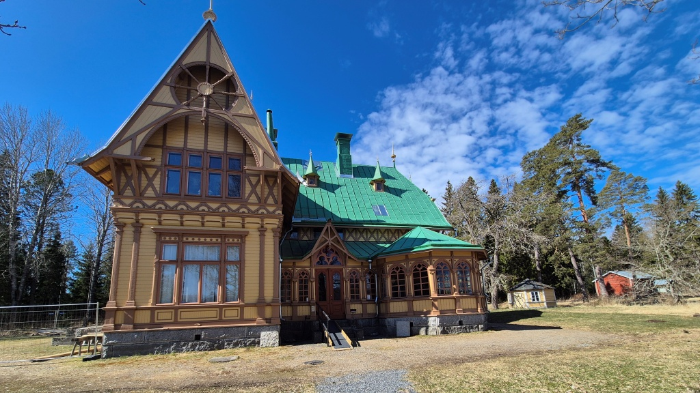

I Kristinestad fotade jag gamla kyrkan, [Ulrika Eleonora kyrka](https://sv.wikipedia.org/wiki/Ulrika_Eleonora_kyrka,_Kristinestad) och den [nya kyrkan](https://sv.wikipedia.org/wiki/Kristinestads_kyrka,_Finland). Sedan ut ur staden och till den stora [Lappfjärds kyrka](https://sv.wikipedia.org/wiki/Lappfj%C3%A4rds_kyrka), enligt Wikipedia den näst största landsortskyrkan i Finland (antagligen tvåa efter [Kerimäki kyrka](https://sv.wikipedia.org/wiki/Kerim%C3%A4ki_kyrka)). Från Lappfjärd fortsatte jag via Perus och Dagsmark mot Bötom (fi: Karijoki).

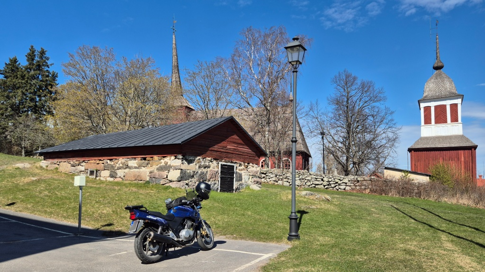

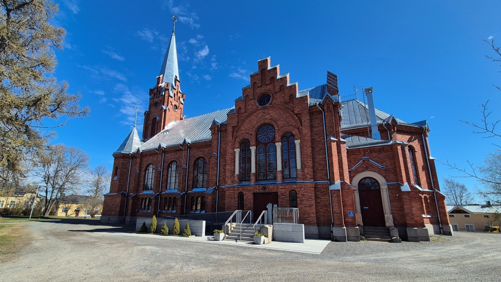

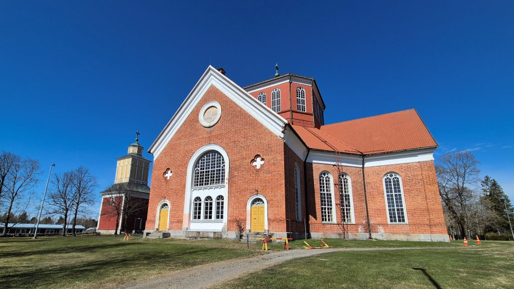

Sedan var det dags för resans höjdpunkt (bokstavligen). Varggrottan ligger en kort bit från Bötom centrum, men på Kristinestads-sidan av kommungränsen. För att få en så kort promenad som möjligt, åkte jag först 2,5 km grusväg - detta var grusväg av den roliga sorten. Jag parkerade på närmaste möjliga plats och lämnade jackan vid hojen. Nu började jag ångra mitt val att ta på långkalsonger. Efter en blott 150 m lång vandring var jag redan rätt varm. Varggrottan i sig var sedan inte så spektakulär - en klippskreva med ett nät och lite tecken på mycket långsamt pågående utgrävning. Men: been there, done that.

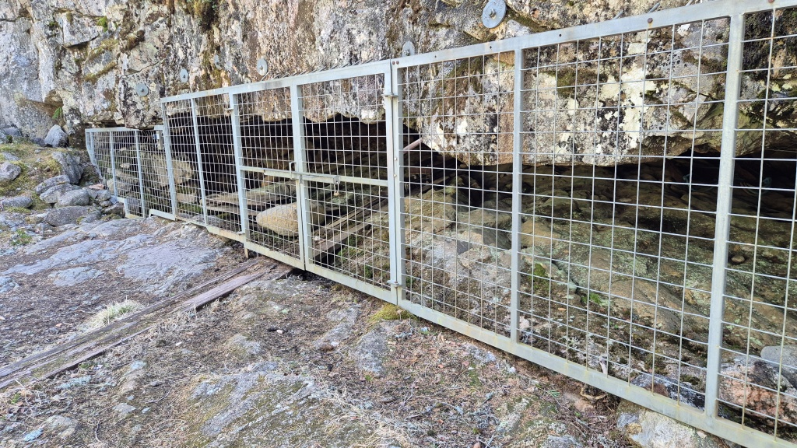

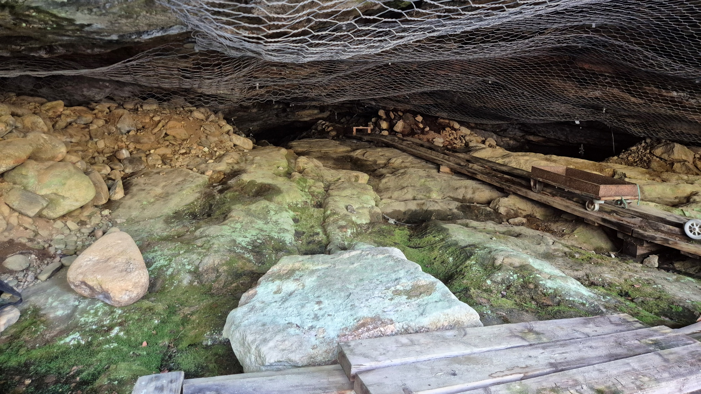

Sedan pustade jag iväg ytterligare några hundra meter till ett litet utsiktstorn på toppen av Vargberget. Fint, men inte direkt spektakulärt. Men som sagt, detta var turens högst belägna punkt. Miljön på Vargberget är i sig var iofs. väldigt vacker med spridda stenblock på i övrigt rätt sandig terräng. Allt var mycket torrt. Och som sagt, rätt varmt i mina vinterfodrade Gore-tex-skyddade körbrallor. Nu bytte jag till sommarhandskarna igen - och med Koson på lägsta nivå, hade frös jag inte om fingrarna på hemvägen.

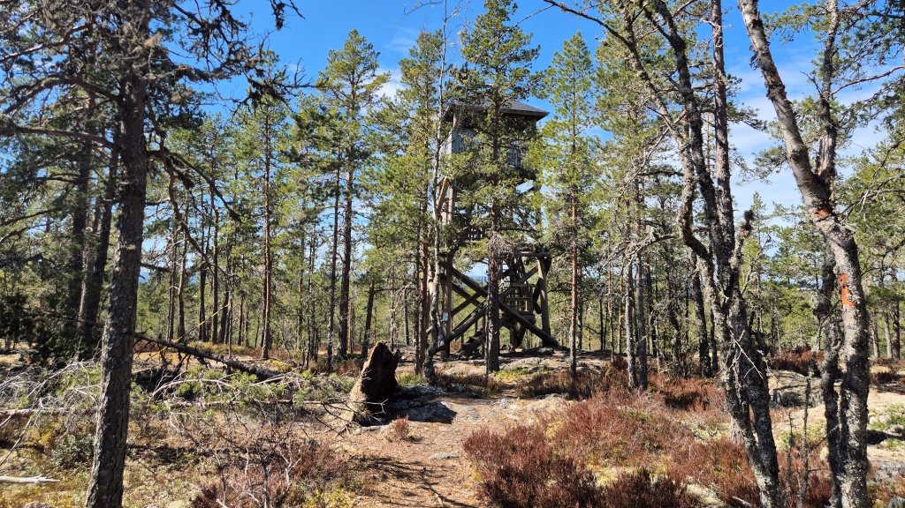

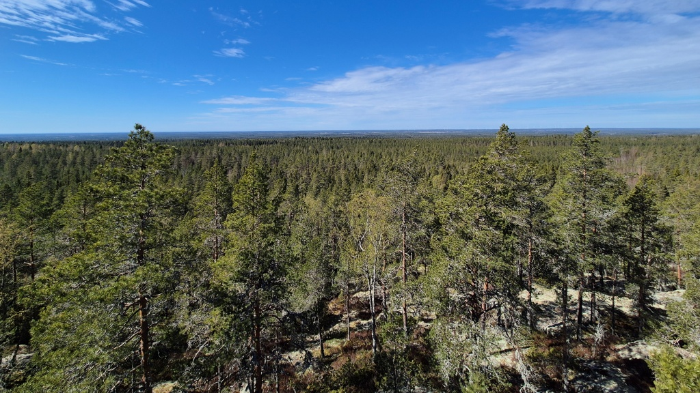

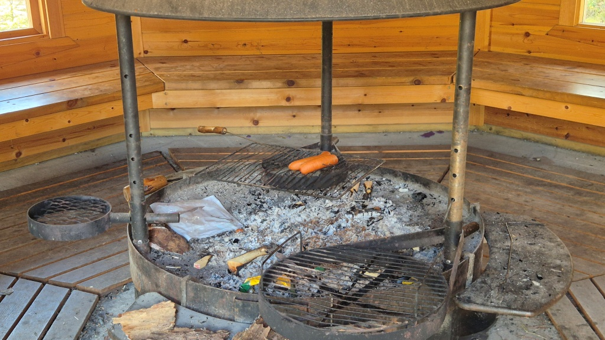

I Bötom fotograferade jag [Bötom kyrka](https://fi.wikipedia.org/wiki/Karijoen_kirkko) (fi) och sedan fortsatte jag mot Östermark (fi: Teuva) via Luovankylä. Nu blev det några kilometer gruskörning av den mindre roliga sorten - nysladdat med rullgrus. Jag är usel på att köra på sådana här vägar, jag spänner mig, vet inte hur mycket grepp jag har och vågar egentligen inte heller testa. Men jag utgår ifrån att ju mer jag kör på sådant här underlag, desto bättre blir jag. Vägen förde mig i varje falle förbi [Parra skidcenter](https://parra.fi/sv/) - lite snö fanns det kvar, om än inget i jämförelse med kontrasten mellan skidåkare och motorcykel på [fjolårets första mc-tur till Simpsiö](/posts/2025-03-22-simpsio/). Sedan var den kvarvarande biten asfalterad väg in till Östermark riktigt kul att köra!

")

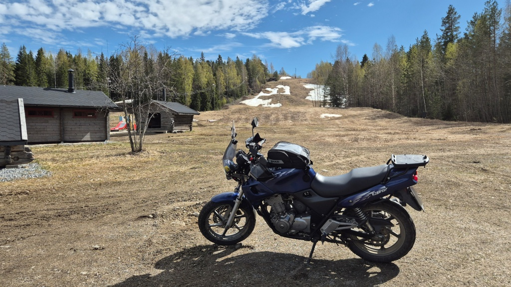

I Östermark fotograferade jag både den [nya kyrkan](https://fi.wikipedia.org/wiki/Teuvan_kirkko) (fi) och Östermarks kyrkoruin ([Teuvan rauniokirkko](https://fi.wikipedia.org/wiki/Teuvan_rauniokirkko)). Den gamla kyrkan förstördes i en brand år 1950, men en del har restaurerats och används som utescen. Från Östermark fortsatte färden via Norinkylä till [Jurva kyrka](https://fi.wikipedia.org/wiki/Jurvan_kirkko) (fi). Och sedan vidare till [Laihela kyrka](https://fi.wikipedia.org/wiki/Laihian_kirkko) (fi) i Laihela (fi: Laihia). Vägen från Pyörni i Jurva till Kylänpää i Laihela är rolig - den är kurvig och glest trafikerad och tills vidare är beläggningen i ganska bra skick.

")

")

")

Det blev en tur på 279 km och foton på 9 kyrkor och en kyrkoruin. Koso värmehandtagen fungerar jättebra. Hojen i övrigt fungerar rätt bra, det känns som om motorn går aningen ojämnt och aningen varmare än förut - jag bör nog justera och synkronisera förgasarna. Och sedan läcker ju framdäcket en aning, vilket orsakade vibrationer mot slutet av resan.
