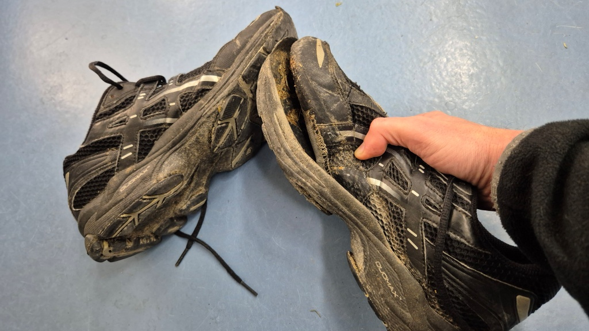
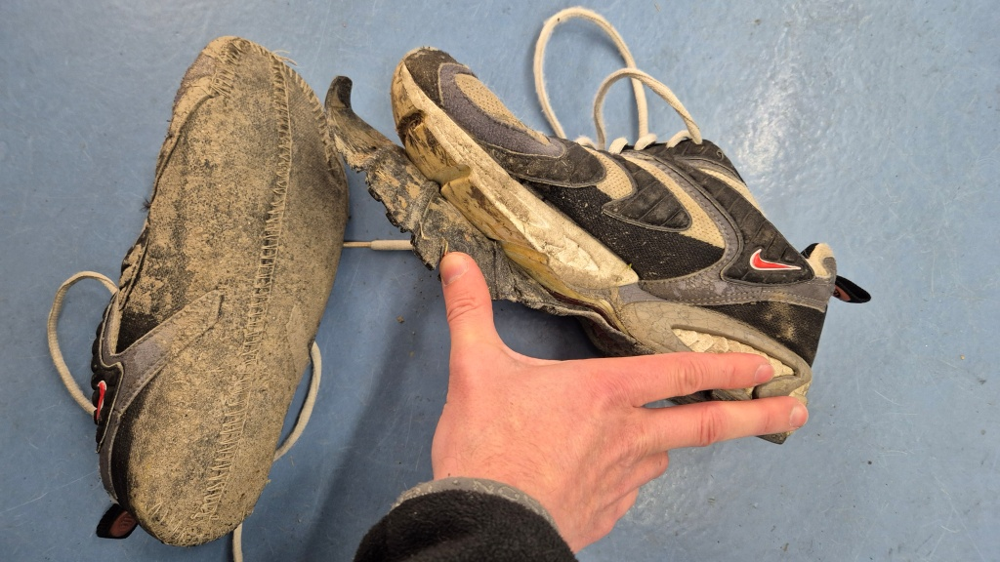
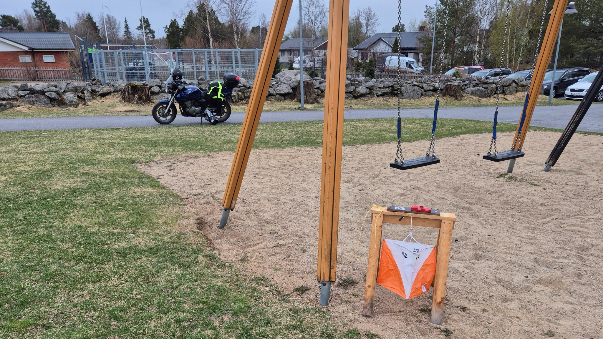
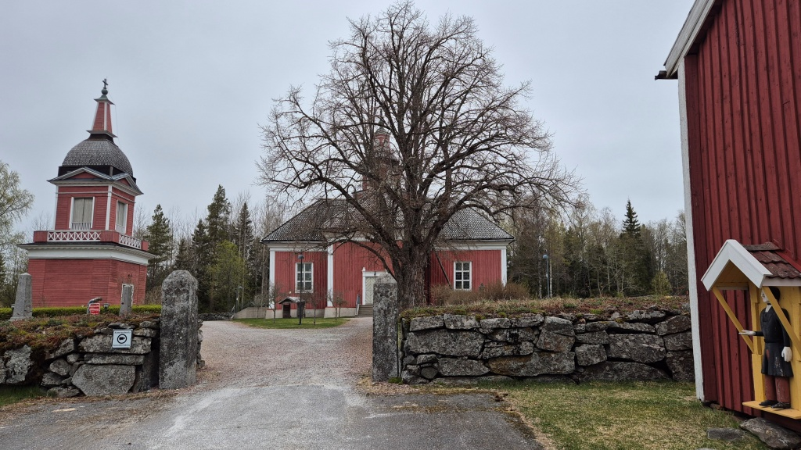

# Måndagsbommen

Denna vår beslöt jag mig för att återuppta en länge vilande hobby, nämligen motions-orientering. Några lokala orienteringsföreningar ordnar varje måndag kväll en träningstillfälle med namnet Måndagsbommen. Det finns banor av olika svårighetsgrader och just på måndagskvällen finns ordnas tidtagning med elektroniskt stämpelbricka. Jag införskaffade till och med en egen [EMIT](https://sv.wikipedia.org/wiki/Emit)-bricka för ändamålet.

Eftersom jag inte lyckats locka med någon annan familjemedlem med denna motionsform, så är det ju lämpligt att ta sig till och från evenemangen med motorcykel. Bara att hända på toppboxen för att packa lite grejer i.

<!--more-->

För orientering behövs inte så mycket utrustning. Träningskläderna tar jag på mig, mc-stället utanpå. I toppboxen packar jag sedan lämpliga skor, stämpelbricka, kompass och en flaska vatten. Eventuellt en keps och handskar också, om det är kyligt. Och ett par torra strumpor att ta på sig efter löpturen, det tenderar att bli vått om fötterna.

På tal om våta fötter, det visade sig snabbt att skor gjorda för landsvägslöpning inte passar speciellt bra i våt skogsterräng. Efter två måndagar hade sulan lossnat från mina trogna gamla Asics-skor. Detta skopar har iofs. hängt med i mer än 25 år, har löpt fem maraton-lopp och har nog används för mer än 2000 km löpning. Men två gånger i skogen var alltså för mycket. Då tog jag ett ännu äldre par skor (som jag nog har använt i skogen tidigare) men med ännu värre resultat - jag kom i mål utan den ena sulan, jag märkte inte ens när den föll av.

Nu har jag investerat i ett par stiglöparskor så förhoppningsvis håller de bättre för fuktiga och mossiga förhållanden. Premiärturen var idag och de var riktigt bekväma. Bara jag kom på tricket att peta in skosnörena under snörningen, så att de inte gick upp hela tiden. Dessa skor är för övrigt försedda med en fuktskyddande Gore-Tex hinna. Trots att jag är lite skeptisk till den idén (Gore-Tex håller ut vattnet en kort stund men håller inne fukten länge) kunde jag konstatera att det faktiskt märktes lite skillnad, jag blev inte alls lika våt om fötterna denna gång.

Så som är typiskt för orientering, ordnas varje träff på olika ställen. Det betyder ju att man på vägen till och från evenemanget kan få chansen att utforska vägar man inte åkt tidigare. Idag var träff nummer fyra för i år, denna gång i Petalax, vid skolan inne i kyrkbyn. Banan var ganska klurig, men bjöd ändå på möjlighet att välja rutter längs med stigar och vägar (till skillnad från första träffen som bjöd på ca. noll meter stiglöpning och resten genom svårlöpt terräng). Denna gång lyckades jag stämpla rätt för att få en godkänd prestation.

När orienteringen är avklarad, kan man ju sedan ta en liten extra sväng med motorcykeln. Fast just idag var det +6°C med tunga moln, frisk vind och annalkande regn. Med fuktiga träningskläder under körkläderna lockade det inte med en extra tur. Men jag hann ju åtminstone plåta [Petalax kyrka](https://sv.wikipedia.org/wiki/Petalax_kyrka). Sedan åkte jag via butiken för att fylla på soppa i tanken och småhandla lite matvaror.

Med denna korta kvällstur passerade jag 1000 km körda denna säsong. Vid motsvarande tid i fjol hade jag kört nästan det dubbla.
