# Nytt framdäck och en sen provtur

Framdäcket har haft en långsam läcka, som gjort att däcktrycket sjunkit under färden. Eftersom däcket har rullat en bit över 20 000 km, beslöt jag att ersätta istället för att försöka reparera, trots att det fanns lite mönster kvar i däcket. Jag beställde däck och montering på fälg från [Skurs däck & service](https://www.skurs-dack.fi). Det är bara att skruva av framhjulet och föra till verkstaden.

<!--more-->

När Lilla Blå står på sitt centralstöd (en: center stand), kommer bakhjulet upp i luften, men framhjulet vilar på golvet. Jag har aldrig tidigare haft av framhjulet. Jag funderade på att använda depåstöd under framgafflarna, men konstaterade att det kan bli en stor eller ojämn belastning på gafflarna när det inte finns en förenande framaxel. Så istället stödde upp hojen med en pallbock under oljetråget.

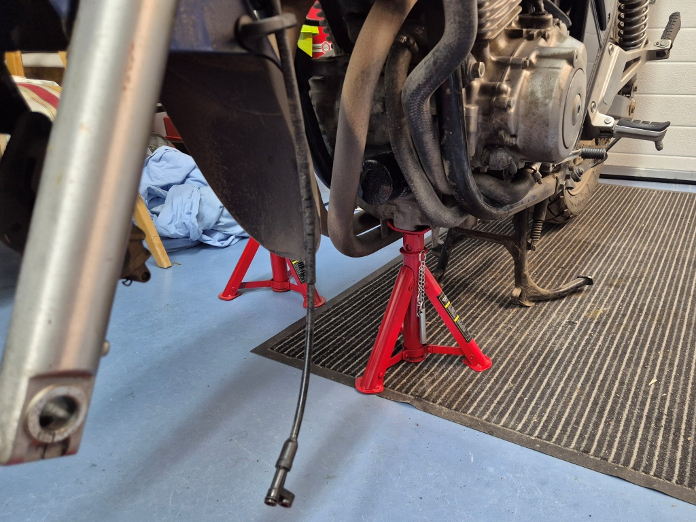

När jag ändå skruvade av framdäcket, passade jag på att skrubba fälgen och rengöra bromsskiva och bromsklossar. Jag kollade också hjullagren, som verkade ok. Jag putsade bromsoket, pinnen, bromsklossarna och skivan så gott det gick. Bromsskivan är i acceptabelt skick och bromsklossarna har fortfarande lite material kvar, men så småningom börjar det nog vara dags att byta bromsklossarna. Egentligen borde jag också byta bromsvätska, jag har inte bytt så länge hojen varit i min ägo.

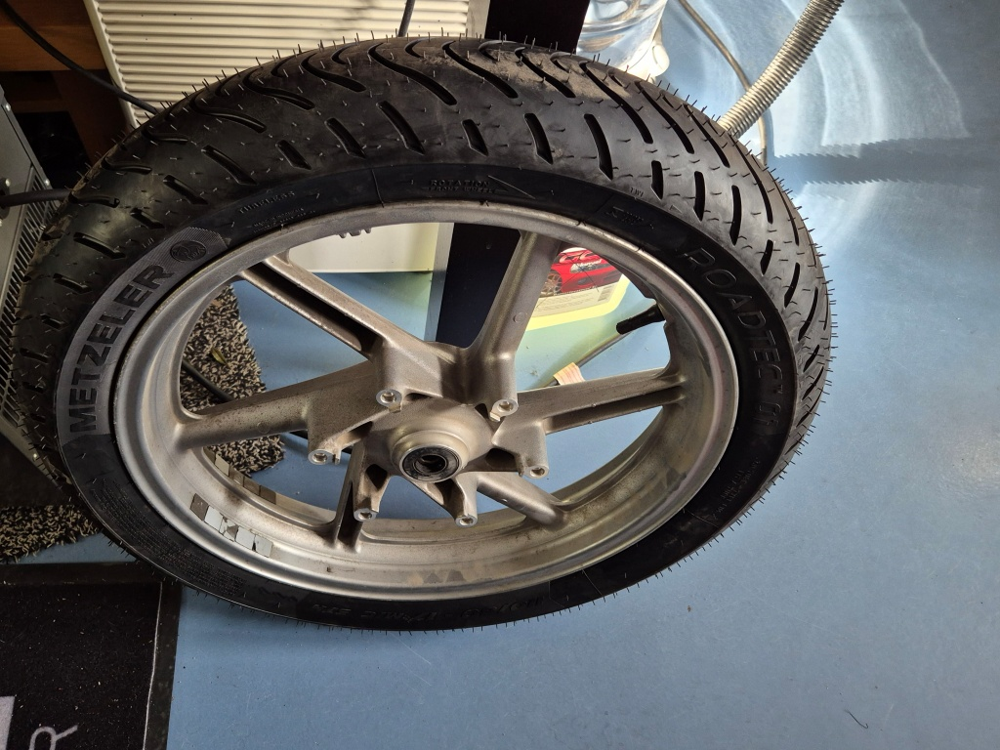

Av någon orsak fick jag för mig att ta bort bromsskivan, för att komma åt att rengöra ordentligt - det var nog ett misstag. För det första skall egentligen bultarna bytas till nya när de en gång lossats, enligt Haynes manual. För det andra skall bultarna dras med ganska rejält moment, med enbart 6mm insex. Jag återanvände i varje fall bultarna men kletade på lite egen gänglåsning (en: threadlock) - köper man nya bultar kommer de med en låsande hinna. För att kunna dra rätt moment var jag tvungen att vara lite kreativ. Momentskaftet med rätt moment har 1/2" fyrkantsfäste, men jag har inga 1/2" till bithållare konverteringhylsor. Lösningen blev följande kombination:
* en 1/2" till 3/8" konverteringshylsa
* en 3/8" till 1/4" konverteringshylsa
* en 1/4" bithållare
* en 6mm insex bit

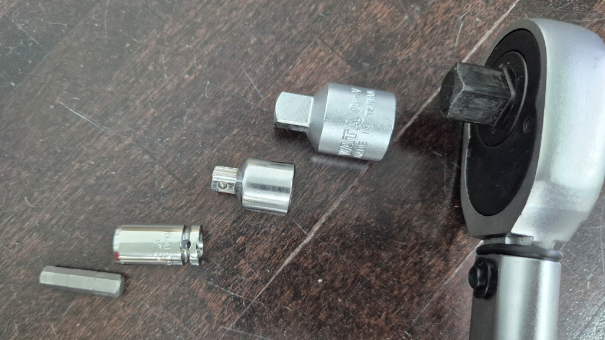
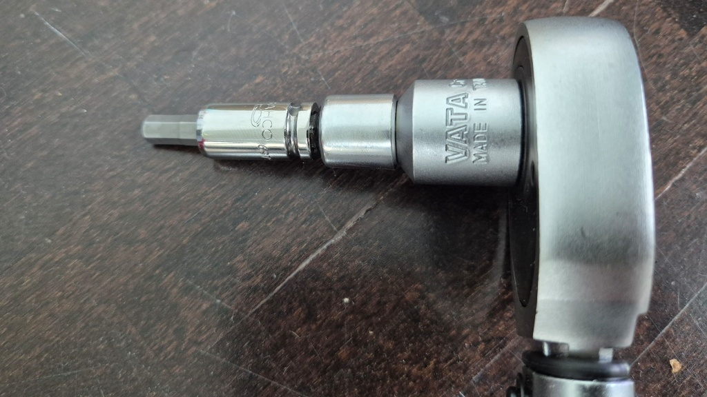

Sedan var det bara att dra åt till 43 Nm. Eller? Man drar åt i kryssmönster och jag måste ha varit ganska nära 43 Nm när - det började då väldigt lätt. Den svaga länken visade sig vara 3/8" till 1/4" konverteringshylsa som kom från nån billighets-hylssats jag haft i all evighet. Det är för övrigt inte den första hylsan jag har dragit sönder i den hylssatsen. Jag försökte sedan ytterligare dra fast med mitt lilla 1/4" spärrskaft, men lyckade inte längre rubba bultarna. Inte heller går det ju att efterspänna när jag satte gänglåsning på. Det är väl bara att hoppas att bromsskivan sitten som den ska, och tillräckligt jämnt åtdragen för att inte börja böja sig eller så. Till nästa gång skall jag skaffa en 1/2" 6mm insex-hylsa.

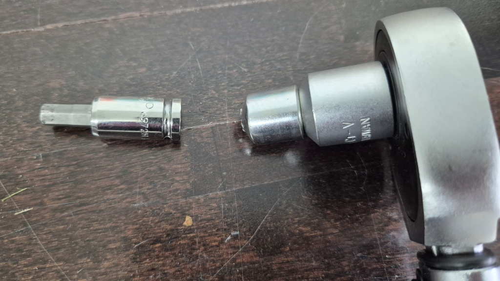

## Provtur

När sedan bromsklossarna var tillbaka och framhjulet påmonterat var klockan redan ganska mycket. Jag beslöt mig ändå att ta en kort provtur, varför inte för att fota Vasas kyrkor?

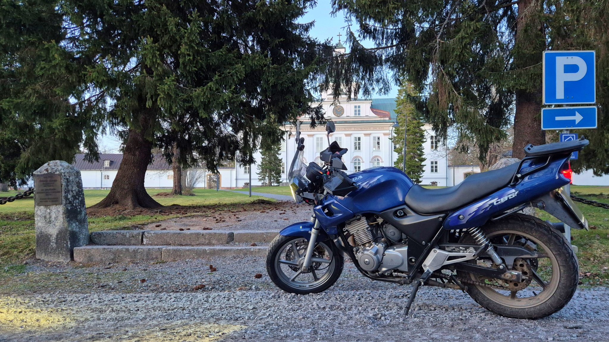

[Korsholms kyrka](https://sv.wikipedia.org/wiki/Korsholms_kyrka) fungerar som Korsholms församligs kyrka, trots att den ligger i Vasa (Gamla Vasa). Kyrkan var förut Vasa Hovrätt, fram till Vasa brand år 1852. Den gamla kyrkan, [Sankta Maria kyrka](https://sv.wikipedia.org/wiki/Korsholms_kyrkoruin), förstördes i branden, medan hovrätten klarade sig.

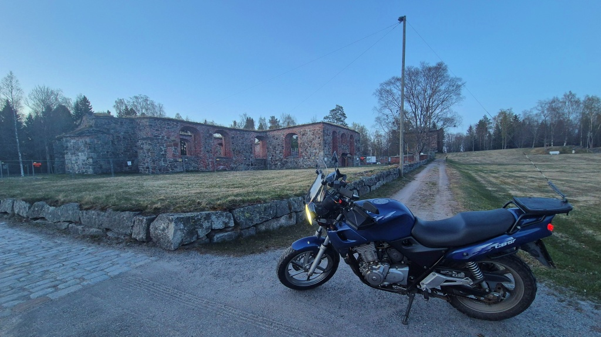

Alla kyrkor är sedan inte lika vackra, åtminstone inte på utsidan. [Roparnäs kyrka](https://sv.wikipedia.org/wiki/Roparn%C3%A4s_kyrka), invigd 1964, torde väl tillhöra de mindre estetiskt tilltalande kyrkobyggnaderna i vårt land. [Dragnäsbäcks kyrka](https://sv.wikipedia.org/wiki/Dragn%C3%A4sb%C3%A4cks_kyrka) är invigd under samma årtionde, men är ju ändå inte alls lika anskrämlig.

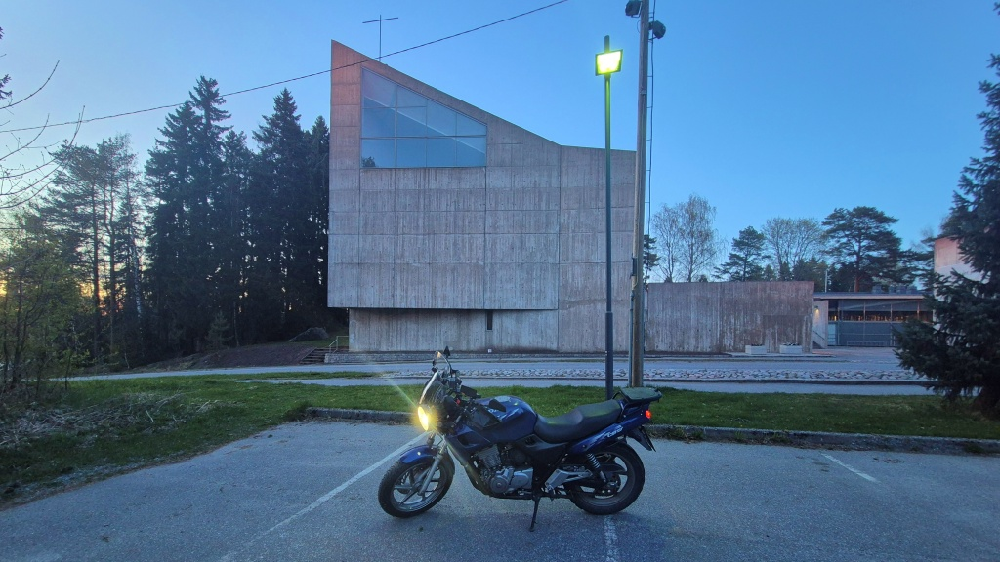

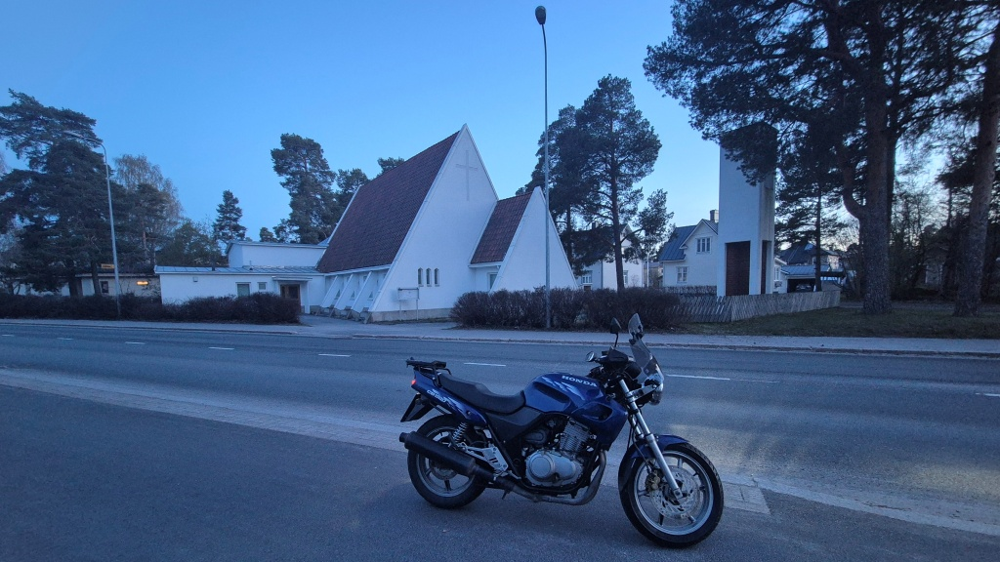

På Brändö finns [Brändö kyrka](https://sv.wikipedia.org/wiki/Br%C3%A4nd%C3%B6_kyrka,_Vasa) från 1910.

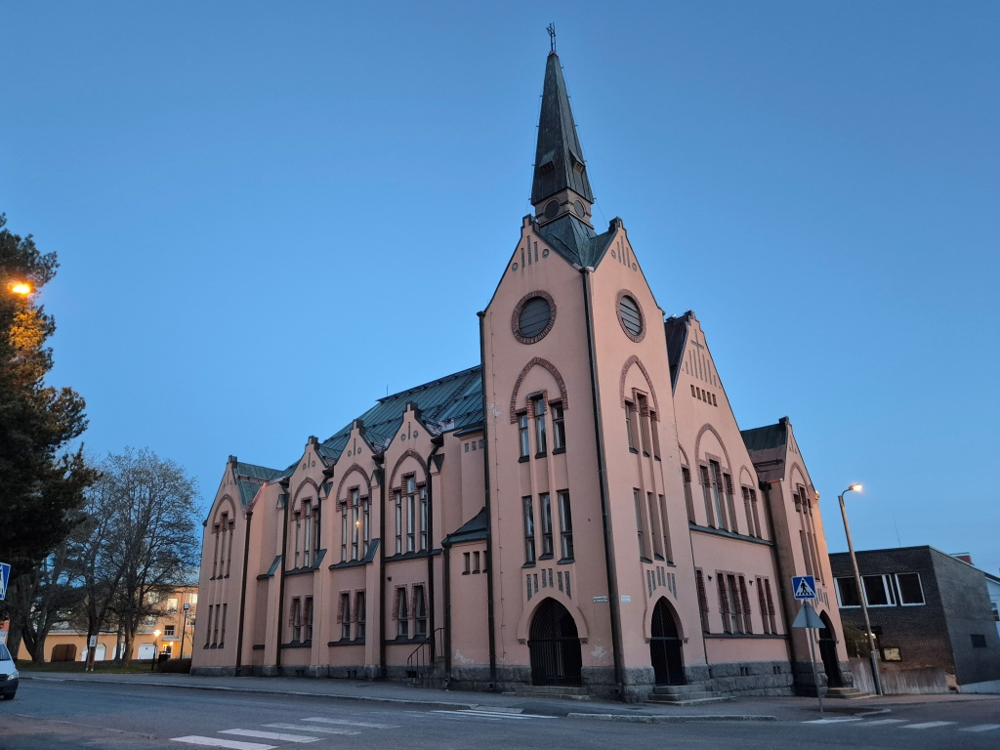

Inne i centrum finns sedan [Trefaldighetskyrkan](https://sv.wikipedia.org/wiki/Trefaldighetskyrkan,_Vasa), invigd 1862. Efter Vasa brand flyttades hela staden från Gamla Vasa till sin nuvarande plats närmare havet. En ny stad byggdes upp, också denna kyrka. Likaså uppfördes en ortodox kyrka, Den Heliga Nikolaus kyrka, invigdes 1866. I folkmun kallas denna kyrkan ibland för "Rysskyrkan"..

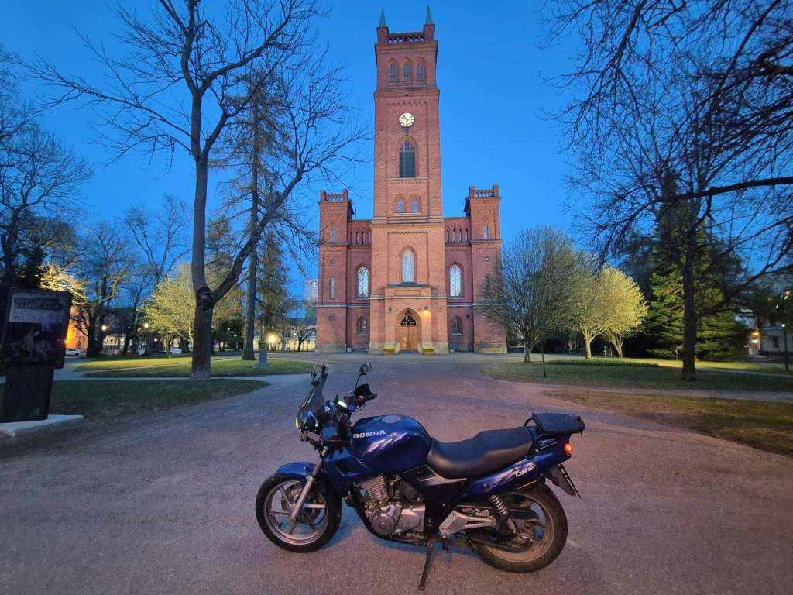

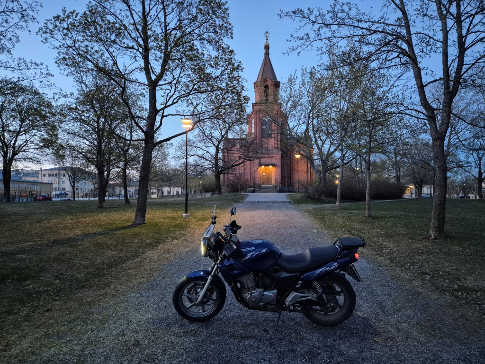

När jag sedan kom till sista kyrkan för denna korta provtur, var det redan rätt mörkt. [Sundom kyrka](https://sv.wikipedia.org/wiki/Sundom_kyrka) blev klar 1929, då som en sidokyrka i Solf församling. När kommungränserna ritades om 1973, blev Sundom en del av Vasa stad, medan Solf blev en del av nya Korsholms kommun. I samband med detta splittrades även Solf församling, så att Sundoms invånare och också kyrkan överfördes till Vasa svenska församling.

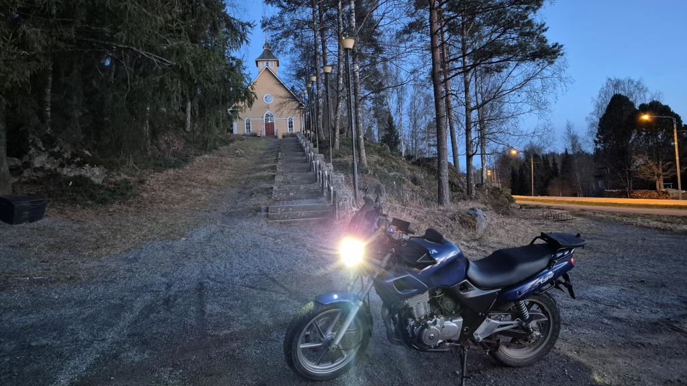

Först när jag kom hem insåg jag att jag missat en kyrka i Vasa, nämligen Lillkyro kyrka. Lillkyro blev en del av Vasa år 2013 och som en exklav känns det ännu ganska långt som en egen enhet. Jag får fota Lillkyro kyrka en annan gång.

## Resultat

Det nya framdäcket gav faktiskt en stabilare känsla än det gamla. Kanske bara inbillning. Åtminstone håller det trycket.

Som nackdel kan väl nämnas att det nya däcket säkert har en aning större omkrets så att det gnider emot den extra förlängningen jag satt på framstänkskärmen, åtminstone när det följer grus med däcket upp till skärmen. Egentligen gör det väl ingen större skada, men irriterande i varje fall. Jag vet inte vad jag skall göra åt saken, jag tycker att den extra stänkskärmen ger lite mera skydd från skvätt och stenskott.

Vidare noterade jag att vänstra blinkers bak har löskontakt som gör att den fungerar ibland men inte alltid. Suck. Måste i varje fall åtgärdas, det är en mycket viktig säkerhetsdetalj.

Jag har också problem med reglaget för de nya Koso-värmehandtagen. Värme-reglaget sitter precis intill blinkers-reglaget, så det blir lite feltryckningar ibland. Detta märks ju extra tydligt inne i staden, när det blir många svängar och blinkningar. Jag skall försöka vrida värmereglaget till en annan position, men det betyder i såfall att det blir svårare att nå och/eller att indikationslampan försvinner ur sikte.
