# Korsu, Levaneva naturskyddsområde och 90k!

Det blev lite ändrade tider för barnens träningar, så jag fick tid att åka på Suunta Jurvas kvällsorientering i Tainuskylä. Naturligtvis tog jag hojen. Orienteringsbanan var ganska svår för en som är van med plattland, en del höga klippor, ganska brant och överlag rätt utmanande.

Det hade regnat hela dagen och duggade fortfarande lite. Mot bättre vetande beslöt jag ändå att ta mig hemåt via skogsvägar. Det blev en kväll med leriga och hala grusvägar med också storslagen natur och till sist ett litet jubileum.

<!--more-->

## Korsun i Tainuskylä

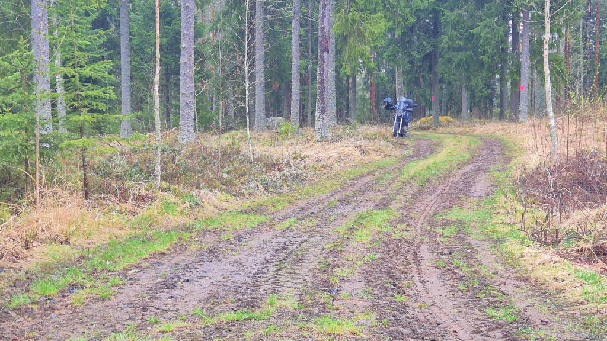

Bara en kort bit från orienteringen finns en historisk plats som påminner om en situation som för några år sedan kändes rätt avlägsen, men som i det rådande världsläget känns allt mer aktuellt. Tre män beslöt sig att inte rycka in när de kallades till försvarsmakten under fortsättningskriget och de klassades således som desertörer. De byggde sig en liten [korsu](https://sv.wikipedia.org/wiki/Korsu), där de gömde sig under vintern 1942-1943. I mars 1943 fick myndigheterna reda på var desertörerna höll till och också att de var beväpnade. Den 10.3.1943 omringades korsun med resultatet att två av de tre desertörerna dödades. Det finns olika versioner av vad som hände - skjöt de sig själva, dog de i strid mot myndigheterna eller avrättades de (olagligt) på stället.

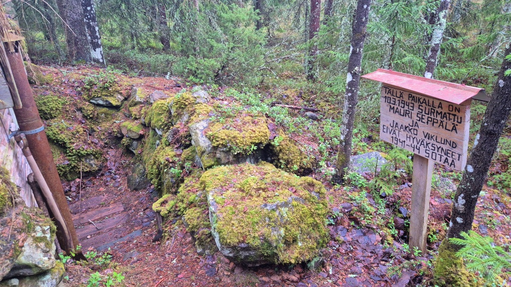

Den korsu som nu finns att se är inte den ursprungliga. Den har rekonsturerats 2019 av Tainuksen Kyläyhdistys. I [invigningstalet](https://www.vapaussotaeppy.fi/wp-content/uploads/2019/09/Puhe-Tainuskyl%C3%A4n-korsulla-15.9.2019.pdf) (fi) återger Tapani Tikkala händelserna från 1941-1943.

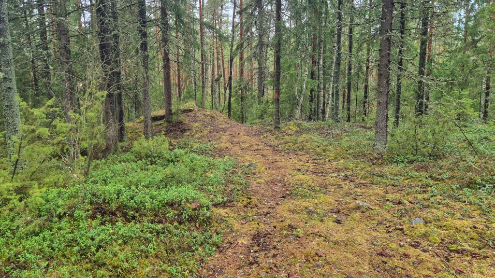

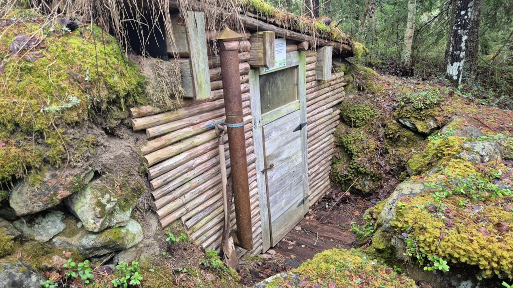

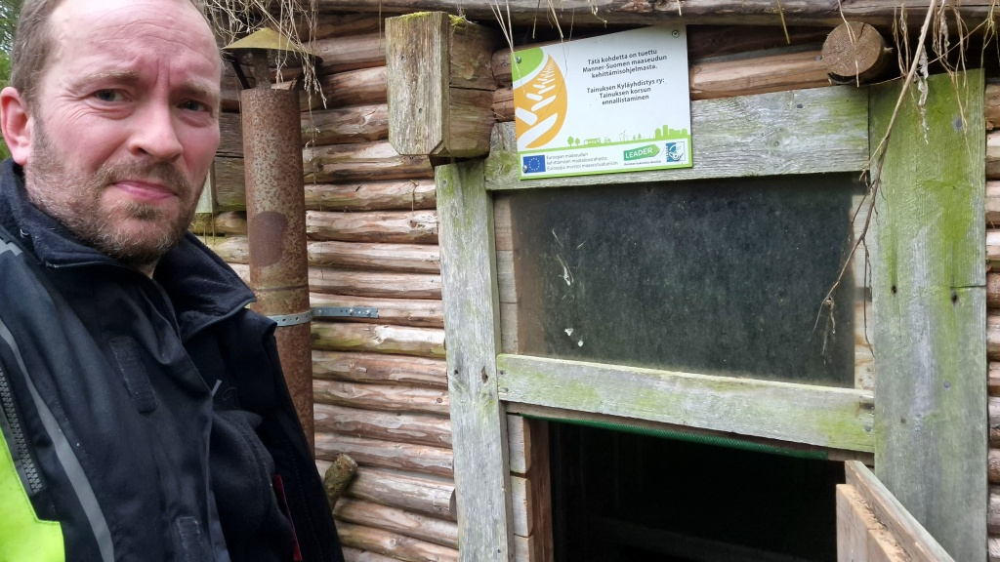

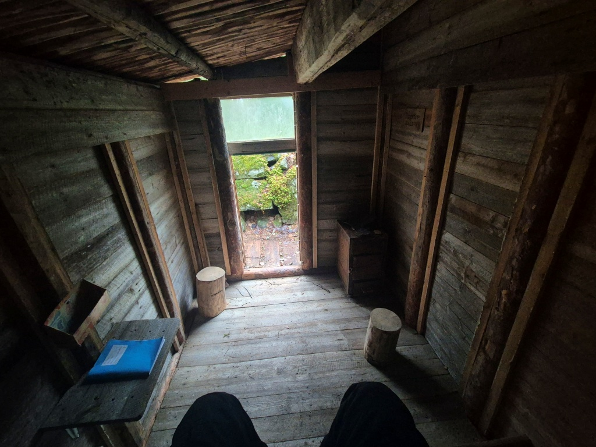

Nu får vi verkligen hoppas att vi aldrig mera hamna i en situation där man måste ta ställning till om det är rätt eller fel att myndigheterna tvingar befolkningen att fösvara landet med vapen i hand. Efter att i många år känts som något av det förflutna, börjar det återigen kännas som att risken finns. Detta kan hända igen och tyvärr kanske alldeles för snart.

## Levaneva naturskyddsområde

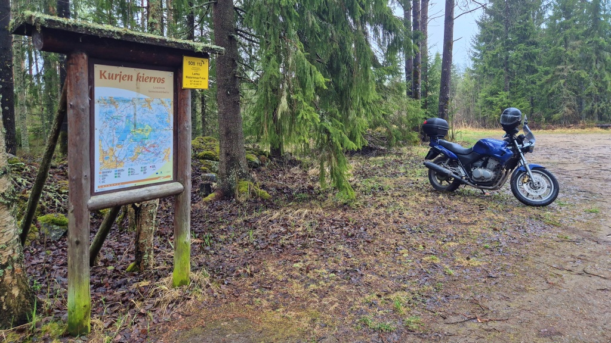

Från Tainuskylä är det rätt nära till Kivi- och Levalampis konstsjö och Levaneva naturskyddsområde. Några kilometer skogsbilsväg och du är där. Jag har förut varit och vänt på parkeringsplatsem, men nu beslöt jag mig för att gå den lilla biten fram till Maalarinmaa fågeltorn.

Stigarna är väl upptrampade. Det finns väl underhållna vandringsleder från Rajavuori i Laihela kommun via Levaneva och Tainuskylä (Kurikka stad) till Kalaisjärvi (Ilmajoki kommun) och det märks att de är rätt flitigt i bruk. Denna småregniga dag var jag dock helt ensam, eller åtminstone bestod sällskapet nästan uteslutande av bevingade vänner - måsar, diverse småfåglar, skogsduvor, nån trana eller svan och några som jag inte kunde identifiera.

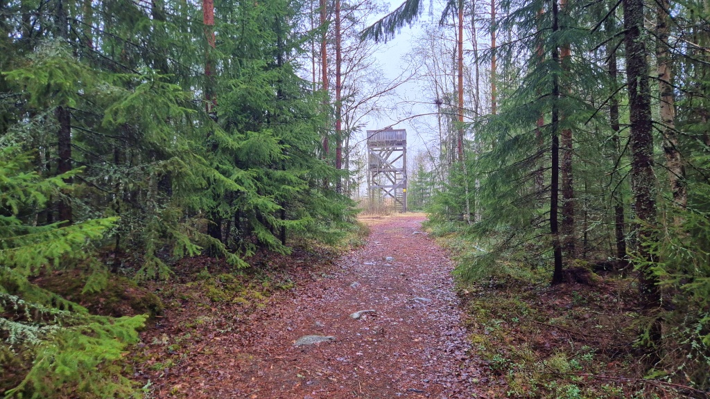

Vyn från fågeltornet är rätt storslagen. Mossen sträcker sig flera kilometer bort, in i regndiset. Det skall vara möjligt att vandra över mossen längs en spång, det vill jag pröva på någon dag. Inga andra ljud än naturens egna.

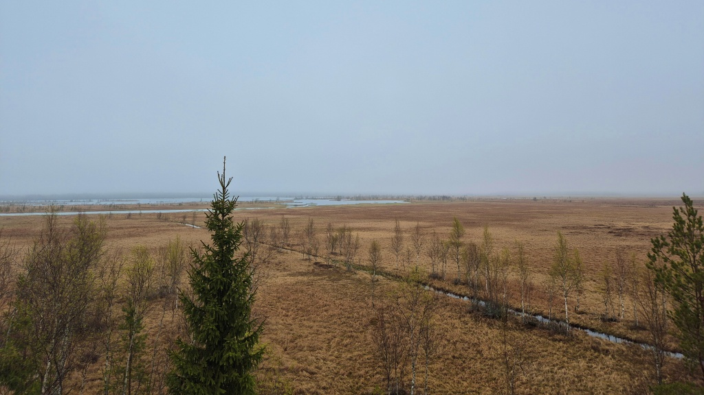

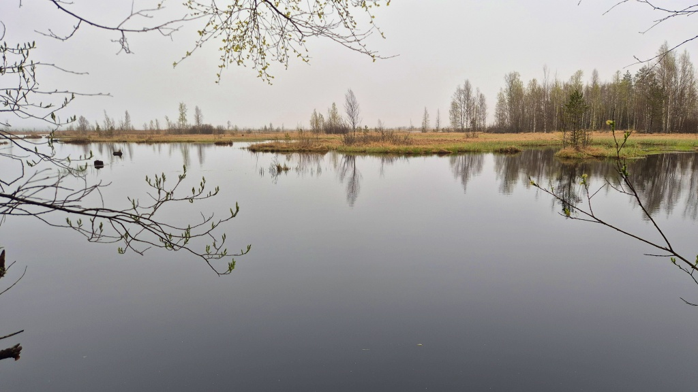

Åter på motorcykeln följde jag konstsjöns "påfyllningskanal". Sedan kom den mest utmanande biten: våt och delvis sönderkörd grus/ler-väg, kryddat med matjord som traktorerna dragit med sig från åkrarna. Riktigt halt på mina landsvägsdäck. Men jag kom helskinnad ut till den asfalterade vägen och styrde sedan hemåt.

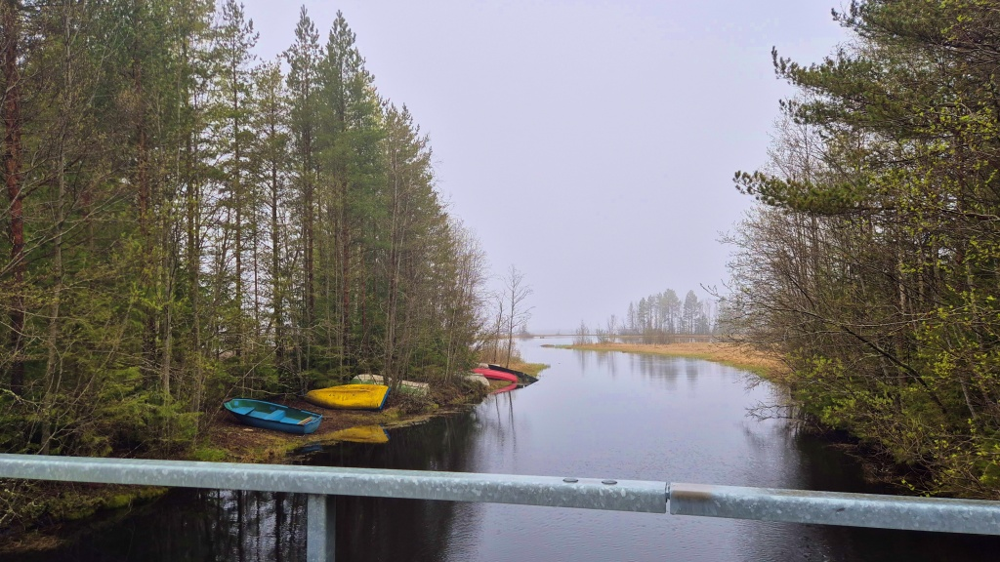

## 90 000 km

På väg hemåt märkte jag att hojens kilometerställning återigen närmade sig en milstolpe. För att inte vara tvungen att bevittna denna händelse på stora vägen, svängde jag av på lite mindre vägar. Passade på att fota [Malax kyrka](https://sv.wikipedia.org/wiki/Malax_kyrka) för min samling.

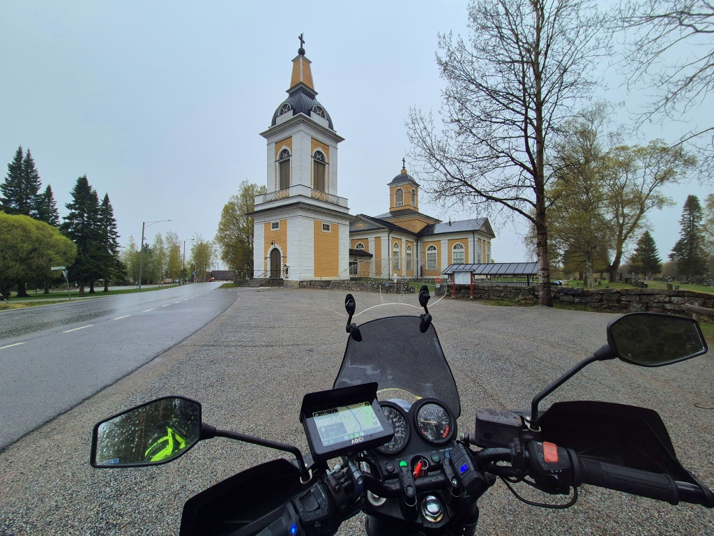

Sedan var det dags för odometern att byta tiotusental, från 80k till 90k. Nästan exakt ett år sedan [senaste tiotusental](../2025-05-19-80k/). För en nästan 30 år gammal motorcykel är 90 000 km inte speciellt mycket - i genomsnitt ca. 3 000 km per år. Några kilometer har säkert tappats bort under åren. Jag hade själv vajern till mätaren sönder i dryga hundra kilometer. Kanske har tidigare ägare också haft liknande perioder. Mätaren har ju ingen siffra för 100k, men jag kan ändå inte tro att den skulle ha slagit runt och hojen skulle vara medkörd 190k. Inte ens en Honda... Men snart är det i varje fall dags för att slå runt till noll, om den orkar 10k till. Knappast ännu i år, men vi får väl se. Idag blev det 121 km, för en kort kvällsorientering. :-) 

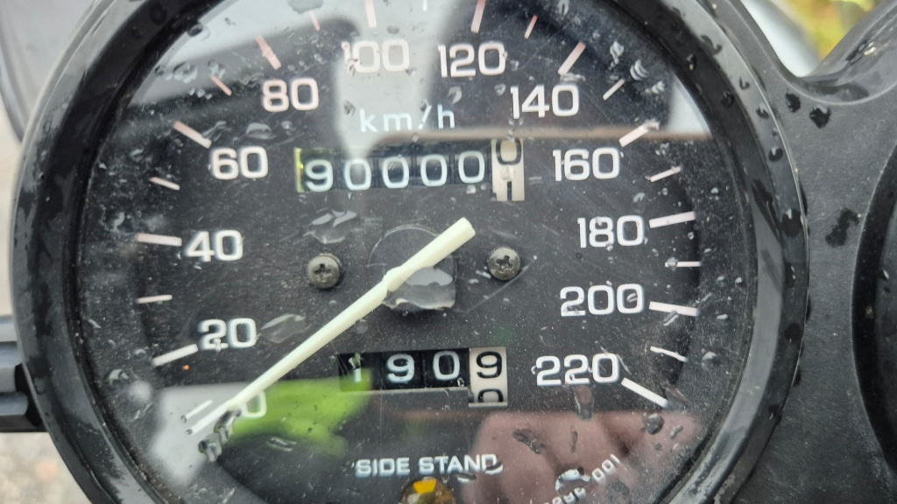

