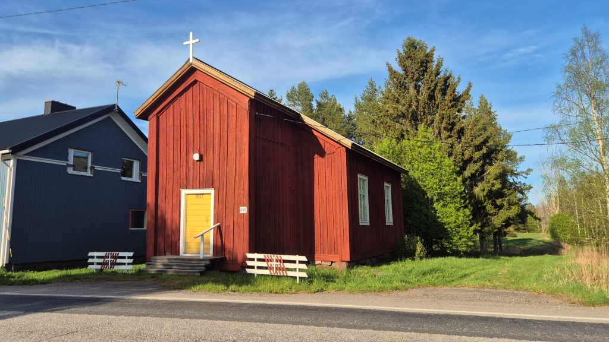
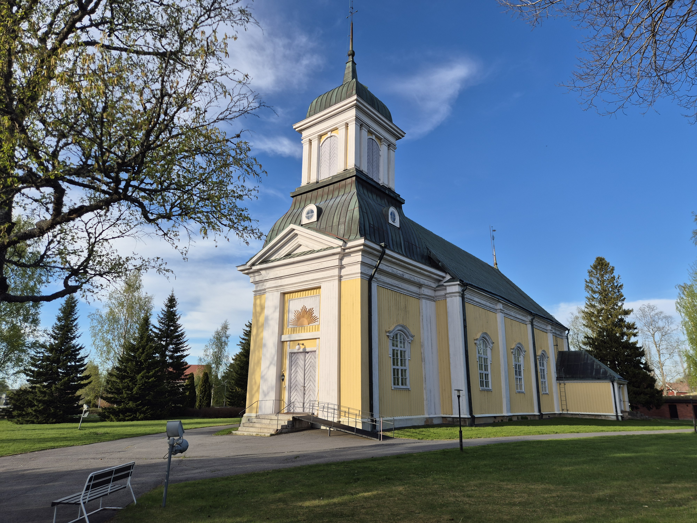
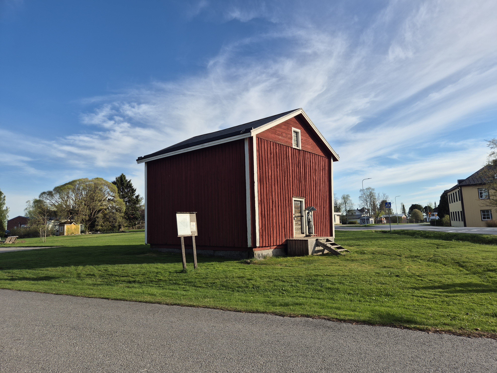
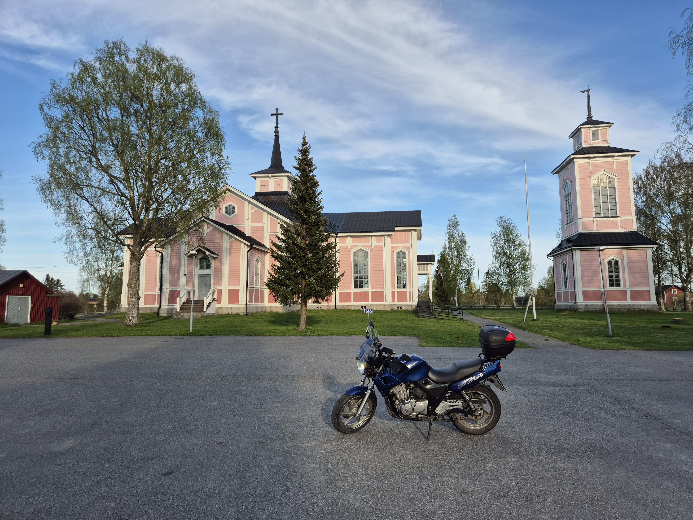
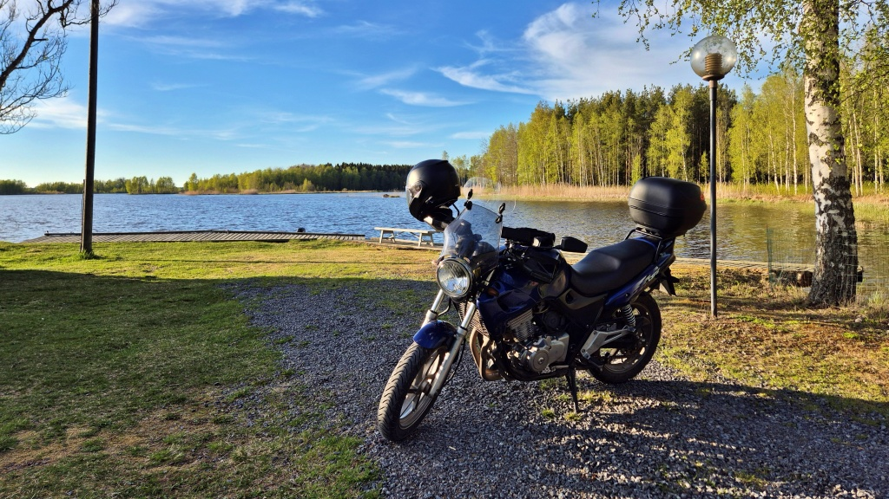
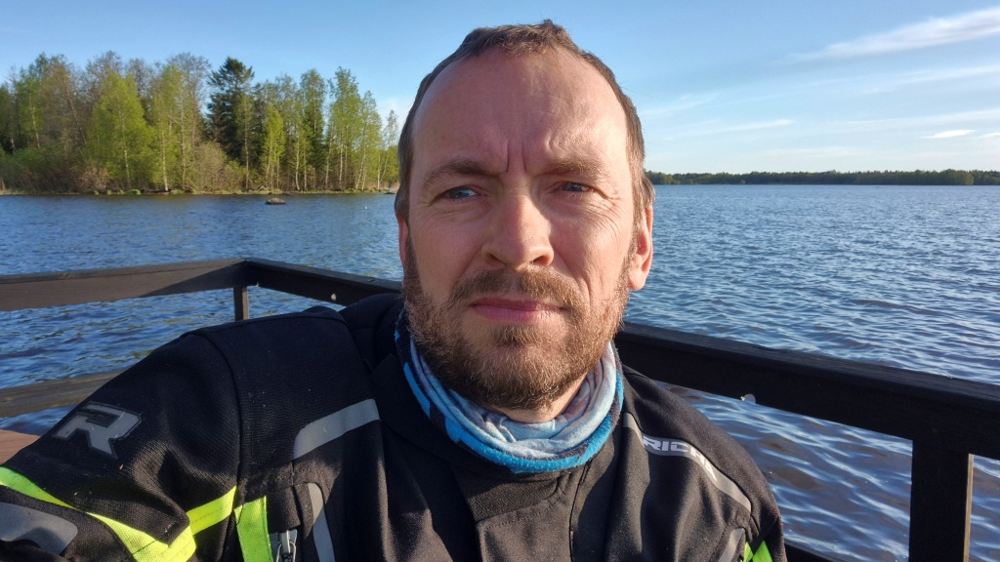

# Kvällstur efter Måndagsbommen

Åter måndag, åter orientering på Måndagsbommen. Givetvis med motorcykeln som färdmedel. Denna vecka hade Malax IF lagt banan i Sarvijoki, på Jurva-sidan (Kurikka) av kommungränsen. När de flesta andra vände västerut tillbaks mot Malax efter orienteringen, vände jag mot öster och Jurva. Det blev en kort och mysig kvällstur i riktigt skönt väder. Ett par kyrkor hann jag plåta och så hann jag sitta en kort stund i solen och ta igen mig.

<!--more-->

Vägen mot Jurva går först genom Sarvijoki by. Där fotade jag bönehuset. Jag vände av från Jurvavägen mot Jyrynkylä och Harjunkylä. Dessa byar är liksom vid sidan av de normala färdvägarna. Själv kände jag inte ens till dessa byar före jag började röra med på motorcykel. Trots detta är de asfalterade vägarna allt mellan nöjaktiga till bitvis riktigt bra. Det känns lite otippat att dessa små byar, mitt i skogen, har så bra vägar. Från Harjunkylä fortsätter man till Metsäkylä och sedan vände jag av mot Närvijoki (sv: Österland)

I Närvijoki vände jag åter västerut i riktning mot Pörtom. Denna väg är i rätt usligt skick, till och med sämre än vägen mellan Metsäkylä och Närvijoki. Väl i Pörtom fotade jag [kyrkan](https://sv.wikipedia.org/wiki/P%C3%B6rtoms_kyrka). Pörtom var fram tills 1973 en egen kommun men är numera en del av Närpes stad.

Sedan vidare söderut mot Övermark. Också Övermark var en egen kommun fram till 1973, då den tillsammans med Pörtom uppgick i Närpes. Vägen mellan Pörtom och Övermark och sedan vidare till Yttermark är för övrigt en tämligen långtråkig sträcka. Den är i stort sett spikrak och närapå fullständigt platt. Med bara några väldigt små kurvor är det 25 km rak landsväg. Den passerar genom Övermark via ett par små kurvor och nästan spikrakt genom Yttermark, men också mellan byarna finns gott om hus spridda mellan åkrarna. Hastighetsbegränsningen varierar mellan 50 km/h i Övermark och Yttermark till 80 km/h mellan byarna.

Istället för att följa hela (den ganska tråkiga) raksträckan, vek jag av vid Övermark kyrka (fotades) och fortsatte sedan i riktning mot Korsnäs. I stark kontrast till den spikraka vägen jag nyss följt, erbjuder denna väg för tillfället något som få vägar i Österbotten har: den är smal, krokig och _asfalten är i utmärkt skick_! Det är närapå den enda vägen i Österbotten där du faktiskt kan och behöver luta motorcykeln ordentligt i kurvorna - de andra krokiga vägarna har så dålig asfalt att det ändå inte går att köra fort. Passa dock upp med lösgrus på asfalten i kurvorna, det verkar alltid finnas på flera ställen längs denna väg!

Efter det korta slingriga avsnittet tog jag en paus och satt en stund i solen och hydrerade efter orienteringen. I Bodbacka by finns en liten grillplats på stranden vid Hinjärv träsk. Vackert och mycket rofyllt.

Sedan var det bara att styra hemåt. Klockan var redan över nio innan jag var hemma. Mindre än en trekvart timme orienteing och 162 km körning blev det denna kväll.