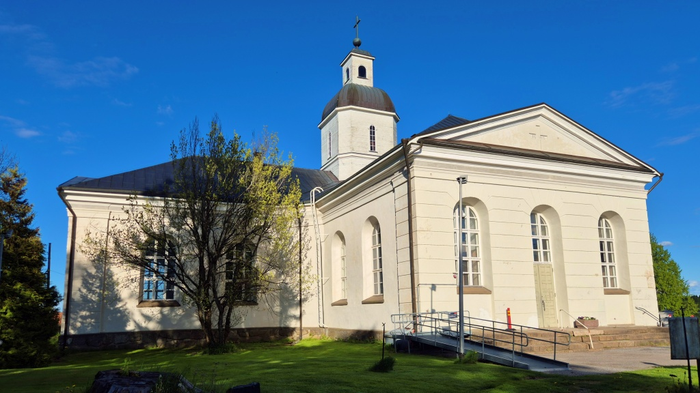
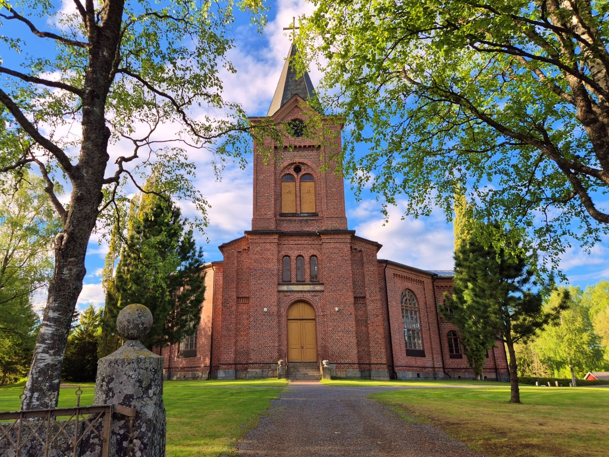
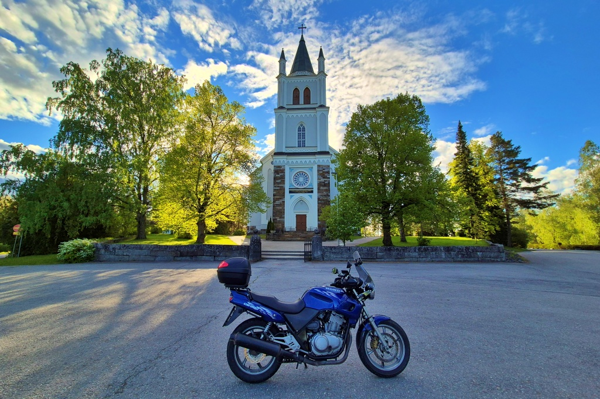
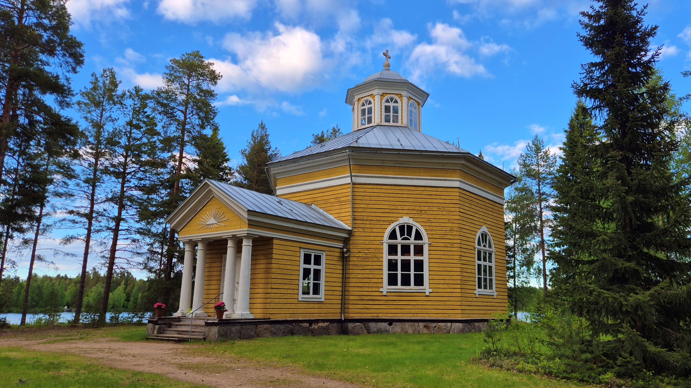
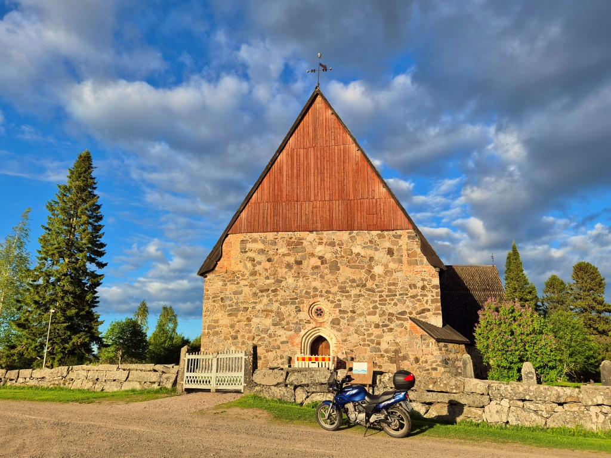

# Längs Kyro älv

Torsdagskväll och Vaasan Suunnistajat ordnade skärmträffen i Höstves. Orienteringen gick riktigt illa denna gång, jag bommade på nästan varje kontroll och var mycket långsammare än de flesta andra att hitta kontrollerna. Men vädret var fint, så efter orienteringen fortsatte jag från Höstves mot Lillkyro-hållet för en liten kvällstur.

<!--more-->

Mellan Veikars i Korsholm till Ylistaro centrum (numera del av Seinäjoki), i synnerhet längs älven norra strand, följer vägen hela tiden Kyro älvs lopp och älven syns på många ställen bra från vägen. Detta är lite av min favoritväg för en kortare tur. Vackert, slingrigt och mestadels ganska lite trafik. Tyvärr börjar beläggningen vara ganska dålig på många ställen, men inte så dålig att det förtar nöjet. Ikväll var det bara att åka.

På vägen stannade jag för att fota några kyrkor. Först fullbordade jag min samling av foton på Vasas kyrkor med att fota [Lillkyro kyrka](https://sv.wikipedia.org/wiki/Lillkyro_kyrka).

I Storkyro, på norra sidan av älven, finns [Storkyro nya kyrka](https://sv.wikipedia.org/wiki/Storkyro_kyrka), byggd i slutet på 1800-talet. Den gamla kyrkan finns på södra stranden, vi återkommer till den på hemvägen.

Från Ylistaro centrum kan man fortsätta följa älven österut, men man blir tvungen att endera köra på grusvägar eller göra en avstickare längs med den tråkiga Lappovägen. Idag hade jag inte riktigt tid att fortsätta längre. Jag fotade [Ylistaro kyrka](https://fi.wikipedia.org/wiki/Ylistaron_kirkko) (fi) och vände sedan om för att följa norra älvstranden tillbaks västerut.

Jag följde älven längs Alapää-vägen, sedan vek jag av från älven upp mot Orisberg. Orisberg och [Orisbergs kyrka](https://fi.wikipedia.org/wiki/Orisbergin_kirkko) (fi) var kvällens nyhet, jag har inte besökt den tidigare. Kyrkobyggnaden är i privat ägo och hör till [Orisberg gård](https://sv.wikipedia.org/wiki/Orisberg). Herrgården är i privat användning och inte öppen för allmänheten, men kyrkan och den lilla omgivande begravningsplanen kan man besöka. En kristlig förening driver ett kafé intill kyrkan, kanske värt ett besök någon gång. Det såg mysigt ut, men var givetvis stängt den här tiden på kvällen.

Efter Orisberg åkte jag förbi Storkyro järnvägsstation och genom Orismala tillbaks till huvudvägen ut vid älven. Jag åkte genom Storkyro centrum till Storkyro gamla kyrka, [S:t Lars kyrka](https://sv.wikipedia.org/wiki/S:t_Lars_kyrka,_Storkyro). Den äldsta delen av denna stenkyrka uppfördes 1514. Det fanns dock redan en kyrka i trä på samma plats, som gradvis ersattes med stenkyrkan. Den ursprungliga kyrkan byggdes år 1304 eller möjligen till och med i slutet av 1200-talet. På områden kring kyrkan ordnas varje år Storkyro 1700-talsmarknad.

Därefter bar det av raka spåret hem, längs stora vägen. Tråkigt, men aningen snabbare än älv-rutten. 137 km körning blev det denna kväll.
