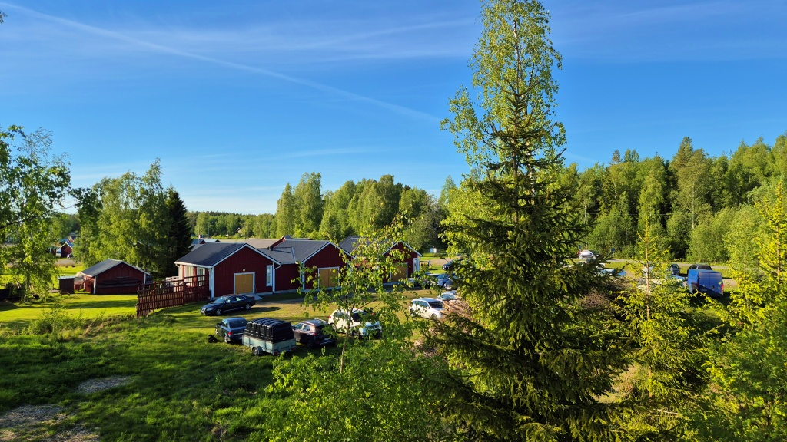
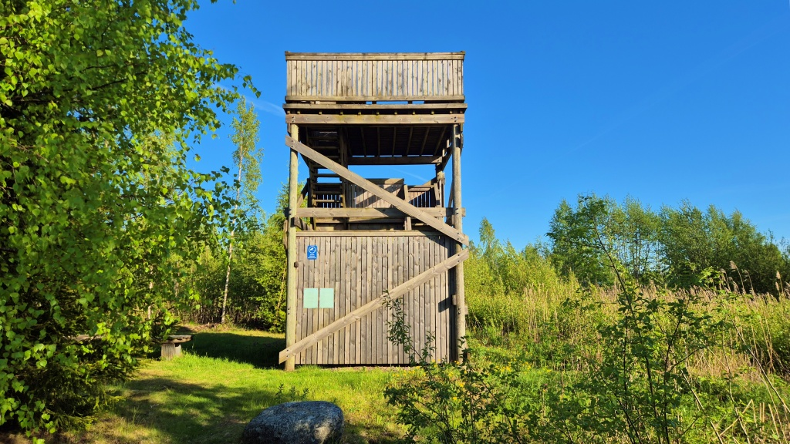
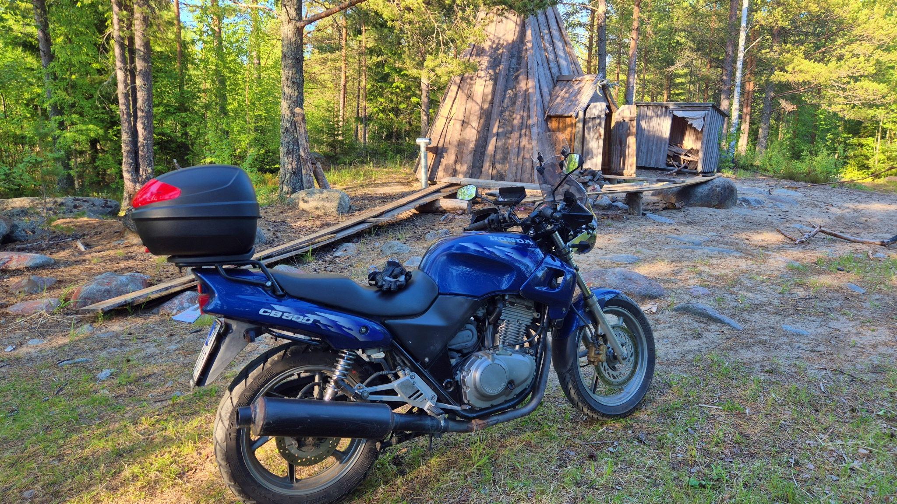
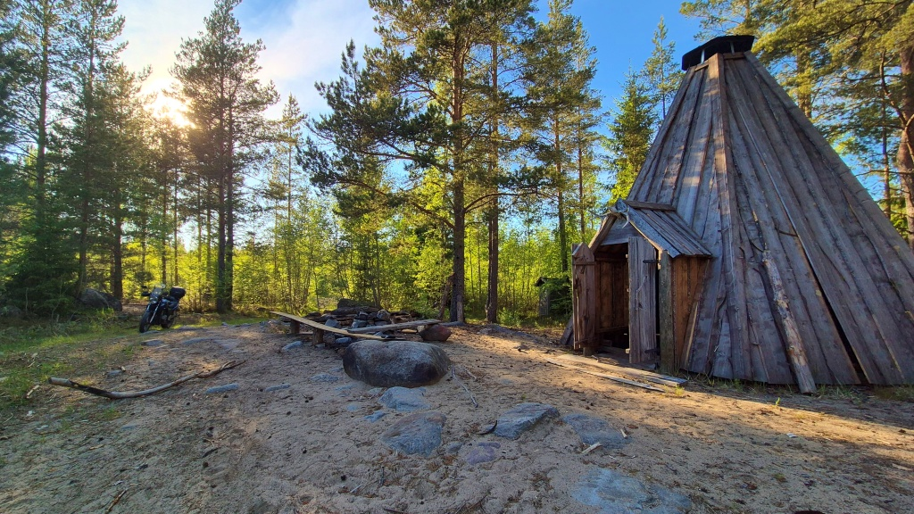

# Adventure riding

Idag blev det lite adventure riding efter kvällsorienteringen. Sämre vägar än vad som känns bra för hojen.

<!--more-->

Nu tog jag en kort tur på asfalt före Måndagsbommen i Åminne. Njöt av solen och en temperatur på precis under 20 grader. Perfekt för åkning.

Orienteringen gick denna gång riktigt bra, bara en bom som jag dessutom klarade upp rätt fort. Av någon orsak verkar Malax IF lägga lättare banor än vad Solf IK gör - åtminstone för C-banorna, den tredje nivån, alltså för oss nybörjare/långsammare motionärer. Idag fanns stigar att löpa efter och framförallt någon terrängdetalj som fångar upp en om man går förbi kontrollen. Kul att för en gångs skull inte vara långsammast på en enda kontroll...

Efter orienteringen passade jag på att stifta bekantskap med fågeltornet i Åminne. Och sedan åkte jag hem via skogsbilsvägar. Ett kort parti av vägen är mera av traktorväg-karaktär. Där hade någon precis skrapat vägen på något sätt. Resultatet var en yta med ställvis löst grus och sand, blandat med upprivna, rätt stora stenar och kvistar. Den här typen av vägar åker jag sällan (de flesta skogsbilsvägar brukar vara i hyfsat skick). Och jag insåg att den här typen av vägar skulle jag definitivt vilja åka mer på - men med en hoj som är bättre lämpad för det än Lilla Blue. Förutom gatdäcken kändes det tydligt att fjädringen inte hängde med. Och med såpass ojämn väg skulle man gärna stå upp, men Lilla Blues geometri är liksom inte anpassad för det. Jag vill ha en enduro-cykel, eller åtminstone en adventure-hoj!

