# Kajane mossens naturstig

Denna blog har förvandlats till en dagbok över vad jag gör på hemväg från orienteringsträningarna. Så också denna gång. Efter att ha varit på resa i två veckor var det åter dags för Måndagsbommen, och därmed faktiskt också första motorcykelturen på hela två veckor. Denna gång blev det främst grusvägar och skogsbilvägar. Jag ville kolla in Kajane naturstig.

<!--more-->

Idag fanns det ingen bana C svår, så jag beslöt att testa på att springa B-banan. Den var betydligt längre, men inte kanske direkt svårare. De flesta av kontrollerna fanns på ställen med tydliga uppfångare, dvs. det var lätta att märka om man gått för långt. Jag hittade alla kontroller utom en utan att behöva leta alltför länge, ändå var min tid bland den sista tredjedelen av deltagarna - medtävlarna blir skickligare på svårare banor. Det blev en tid kring 1:20, vilket är rejält mer än det brukar bli på C-banorna. Jag tyckte själv att jag lyckades hyfsat med vägvalen, men på vägen såg jag en räv, en vitsvanshjort och för det mesta inga medtävlare - kanske ett tecken på att mitt ruttval ändå inte var på samma nivå som de övrigas.

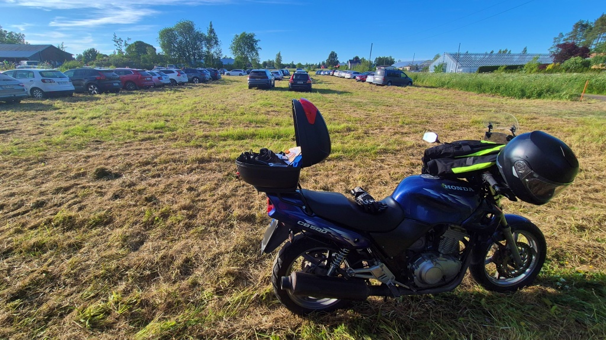

Sedan grenslade jag hojen och styrde längs grusvägar och skogsbilvägar mot Kajane lägerplats och naturstig. Längs en skogsbilsväg hade det dragits upp flera stora lösa stenar i hjulspåren. Jag gjorde nybörjarmisstaget, jag stirrade på stenen som dök upp framför framhjulet istället för att titta på rutten _bredvid_ stenen - och körde givetvis rakt på den nästan volleyboll-stora stenen. Till all lycka var hastigheten rätt låg och jag träffade på sidan, så jag lyckades hållas på hojen. Fälgen verkar inte heller ha tagit skada, men en rejäl krock blev det.

Jag hade inte egentligen gjort några planer för vad jag skulle göra i Kajane, närmast tänkte jag titta efter om det skulle vara värt ett besök för att vandra i något skede. När jag anlände var det så lugnt och vackert, att jag klev av och blev kvar en god stund. Jag var givetvis ensam på stället en måndagskväll som denna. Solen sken och den rätt friska vinden blåste bort allt mygg.

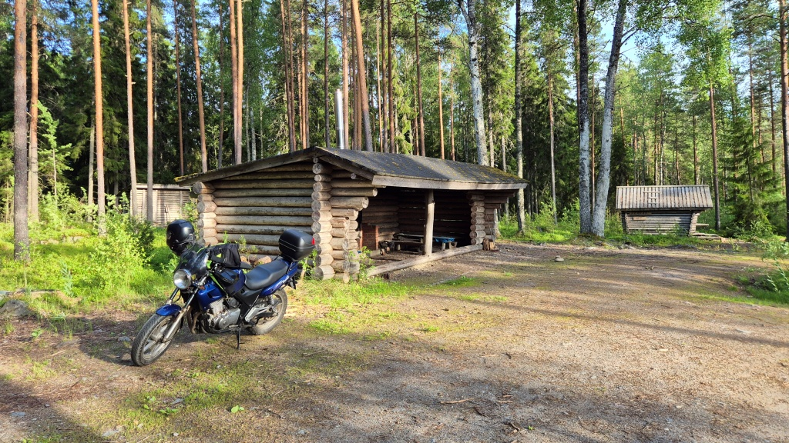

Själva lägerområden var riktigt imponerande. En rätt stor sovstuga, en vedeldad bastu (fast brunnens pump verkade sönder), ett rejält kokskjul, vedbodar med torr björkved, utedass mm. Allt tillgängligt att användas, bara man håller grejerna i skick och städar efter sig.

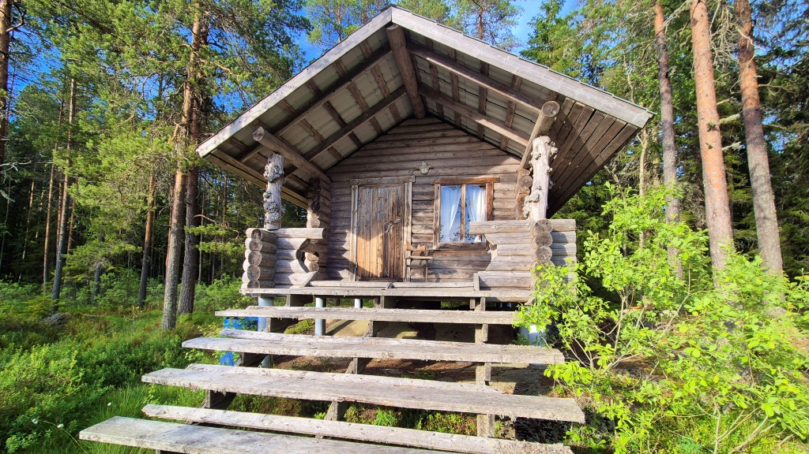

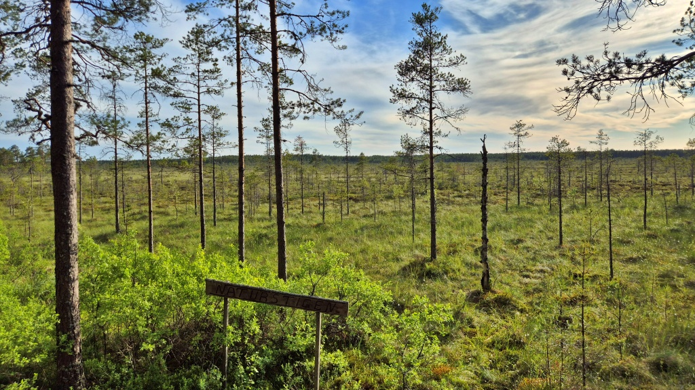

Hur det nu kom sig fann jag mig sedan traskandes längs naturstigen ut över mossen. Över hela mossen har man lagt ut spång, så första delen av stigen tog man sig fram torrskodd. En bit ut på mossen finns ett vindskydd/en kåta. 

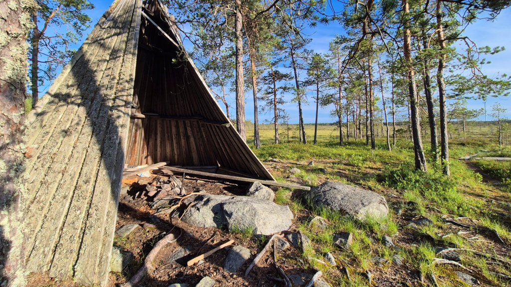

Sedan går man vidare över vad som förefaller vara orörd myrmark. Små tvintallar växer sig upp till höfthöjd, men i övrigt är det bara låg vegetation. Och spången skyddar myren från vandrarnas kängor, som annars nog hade nött rejält på den långsamt växande mossan.

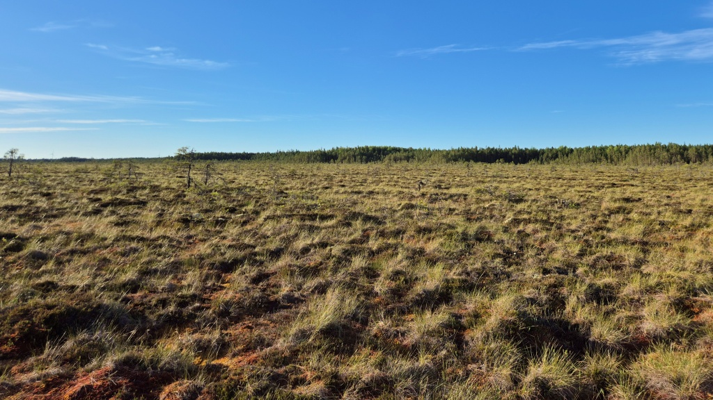

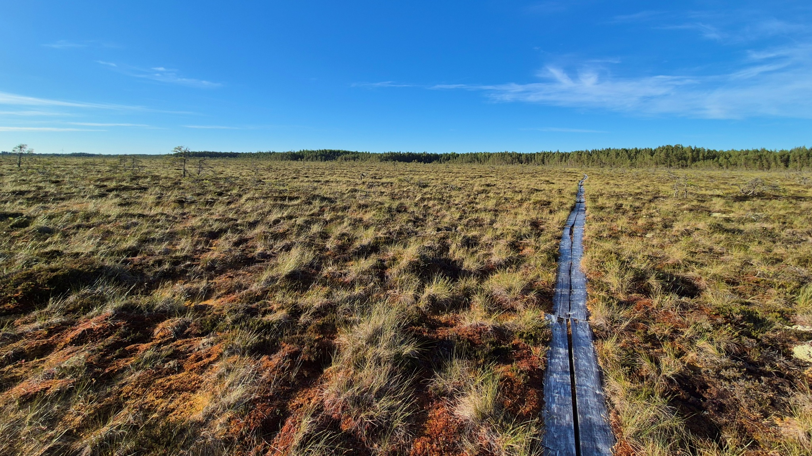

Efter en kort promenad över spången kom jag fram till Lillträskets vindskydd. Ett svanpar navigerade runt näckrosorna i sjön, men de var noga med att hålla sig långt borta. Jag såg inte om de hade några ungar med sig. Lugnet stördes bara av det låga surrandet av Takanebackens vindkraftverk som snurrade med god fart i den rätt friska vinden. Också annars kändes vindmöllorna som en lite störande kontrast till den annars rätt vilda naturen.

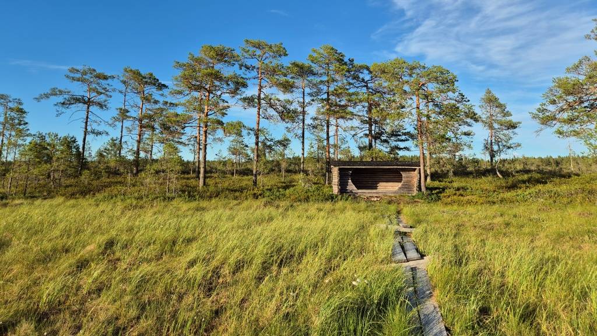

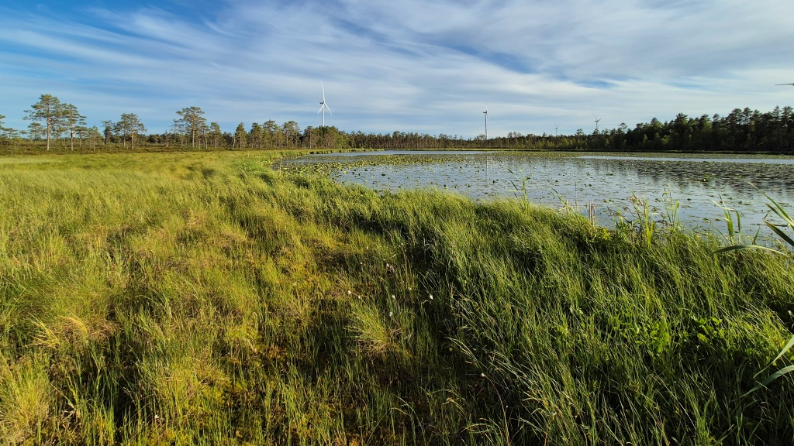

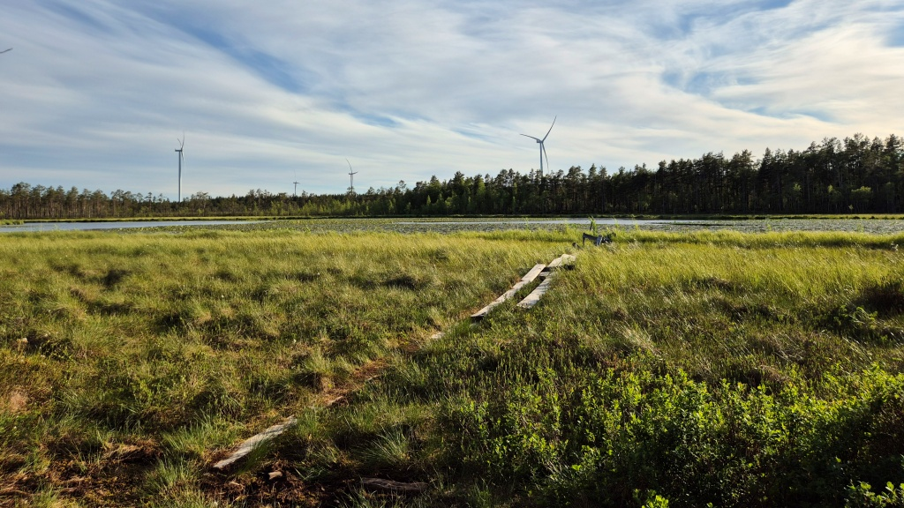

Den andra halvan av naturstigen gick längs kanten av myren. Stigen gick förbi Lisansjön, där ett tranpar trampade runt. Någon sjö är det ju inte längre, utan en gräsbevuxen blötmark utan synlig vattenspegel. Här växte myrväxterna midjehögt, sikten mot myren begränsades av lågväxt tallskog. Inga spångar var utlagda och ibland sjönk stävlarna ned en bit i den våta mossan. Ibland försvann stigen nästan helt så det blev till att hoppa mellan tuvorna mot nästa rikt-märke. På det hela taget var den andra halvan inte lika speciell som att gå över myren, jag hade nog hellre följt spången samma väg tillbaks tvärs över myren.

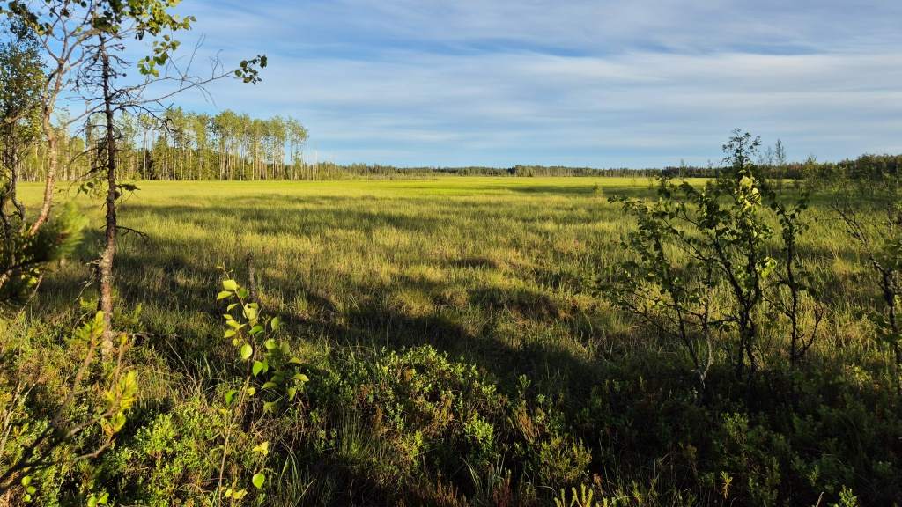

När jag kom tillbaks till lägerområden var jag ganska varm. På grund av min bristfälliga planering hade jag traskat runt den 3 km långa naturstigen i mc-stövlar och byxor, istället för att byta till de lättare orienteringskläder jag hade i toppboxen. Man får skylla sig själv. Satt en stund och svalkade mig i bara kallingarna innan det var dags att hoppa på hojen och dra vidare.

Hemvägen gick tvärs över riksåttan, sedan från Svarvar i Malax till Pitkäloukko på Jurva-sidan och sedan via Kolnebacksvägen och Kolne skolväg tillbaks ut till riksåttan. Mellan Svarvar och Pitkäloukko var det lite mera terrängkörning. Vägen var iofs. rätt torr, men det var såpass stora stenar och hål i vägen att det i varje fall inte skulle ha varit möjligt att ta sig fram med personbil. Inga problem på två hjul dock. Jag förvånades lite över hur mycket bebyggelse det fanns på båda sidor av kommungränsen, det är trots allt en bra bit till närmaste byacentrum. Men så är det väl överallt i Finland, finns det åkermark så finns det också bebyggelse nära till.

Det blev rätt sent innan jag var hemma igen, nästan 23:30. Men så hade jag ju också tillryggalagt nästan 10 km i terrängen och 80 km i sadeln.
