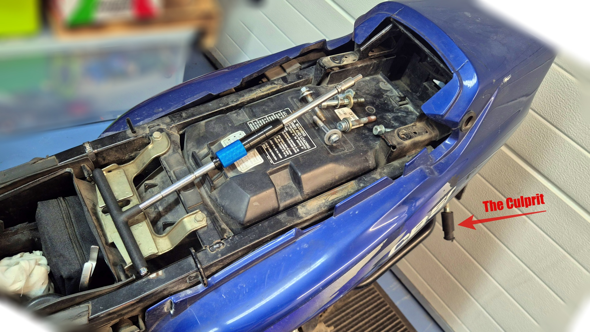
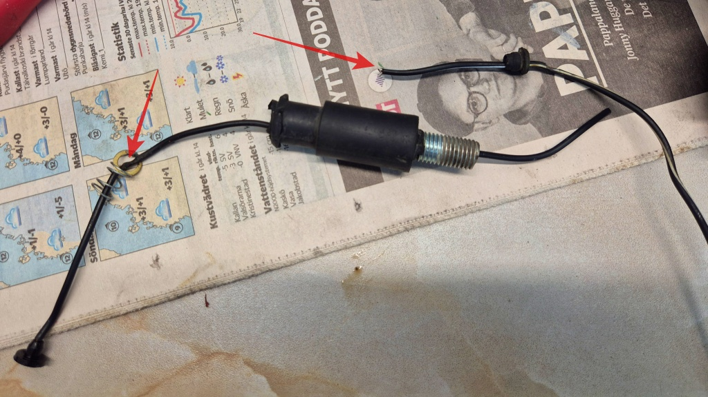
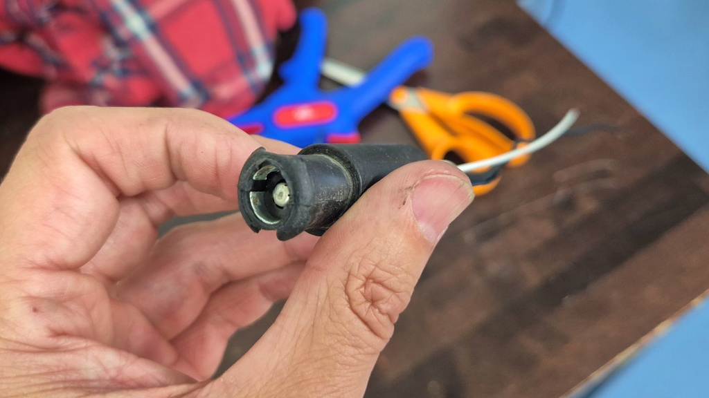

# Löskontakt i blinkers

Vänster blinkers bak har strulat en tid. Det fungerar ibland, men i synnerhet vid högre fart (när den böjs bakåt av fartvinden) slutar den blinka. Det är ju lite tråkigt, eftersom bilen bakom således inte har en aning om att jag strax tänker bromsa och svänga. Idag var det dags att ta itu med detta problem. Och som alltid, tenderar minsta lilla fix att bli ett stort projekt.

<!--more-->

Närmare analys visade att det nog var en löskontakt. Blink-ljuset sitter i änden på en flexibel gummi-hållare. När man böjer hållaren bakåt eller framåt slutar ljuset fungera. Hittade inget problem i själva lamphållaren, ingen nämnvärd korrosion. Då var det bara att skruva loss hela hållaren för att försöka undersöka innanmätet. Men för att få loss hållaren måste man komma åt att koppla ur trådarna. Vilket man borde kunna göra under/bakom sätet - om inte föregående mekare hade beslutat att byta standardkonnektorerna mot klämda konnektorer. Jag hade iofs. nog kunnat klippa dem under sitsen, men kablarna var för korta för att jag skulle komma åt att sätta fast nya konnektorer. Så då var det bara att plocka bort bak-kåpan. Och för att kunna göra det måste jag givetvis ta bort sido-kåporna och i synnerhet pakethållaren. Så då hade en liten(?) reparation utvecklats till ett halvt projekt igen.

När jag fått loss blinkern, var ju problemet rätt uppenbart. Den ena kontakten borde sitta fast i lamp-sockeln men var helt lös. Antagligen var det detta som orsakade löskontakten. Skyddsgummit på båda kontakterna var genomnötta. Jag lödde fast en ny kabel i sockeln och tejpade den andra kabeln, klämde tillbaks alltihop in i gummihöljet och testade med multimetern - funkar. Detta får nog åndå betraktas som en tillfällig reparation - förr eller senare släpper lödningen eller så skavs den tejpade kabeln av helt. Så inom sisådär 10-20 tusen km borde jag nog byta till nya blinkers.

Jag passade på att putsa kåpor och ram på sådan ställen man inte normalt sett kommer åt. Förvånansvärt lite smuts inne i kåporna, faktiskt - närmast bara damm. Sedan rengjorde och smorde jag keden medan jag väntade på att kåpan skulle torka.

Det blev väl nästan midnatt innan allt var ihopskruvat igen. Men nu funkar blinkers som den skall en tid igen!
