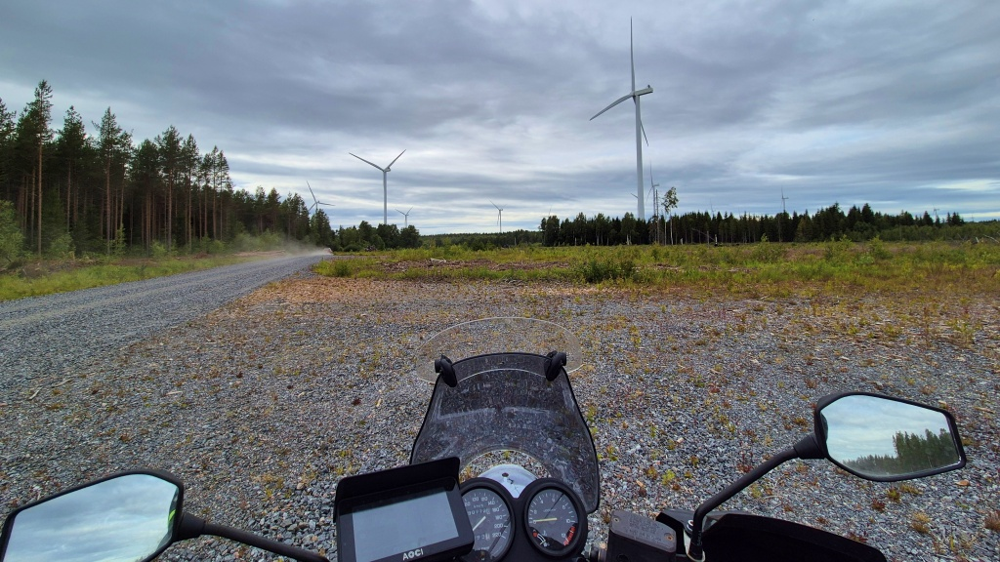
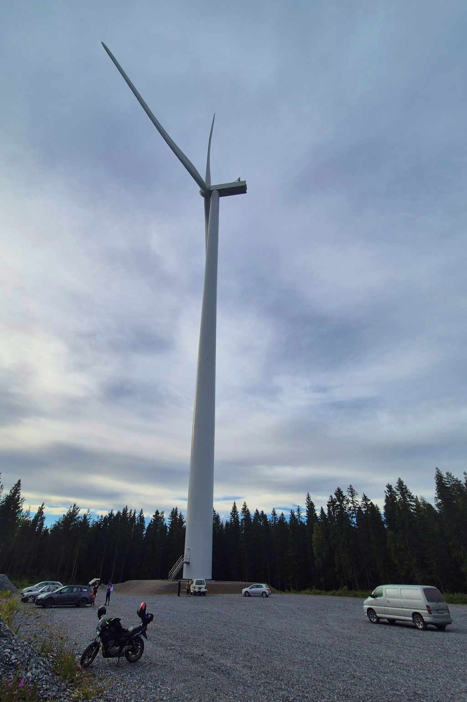
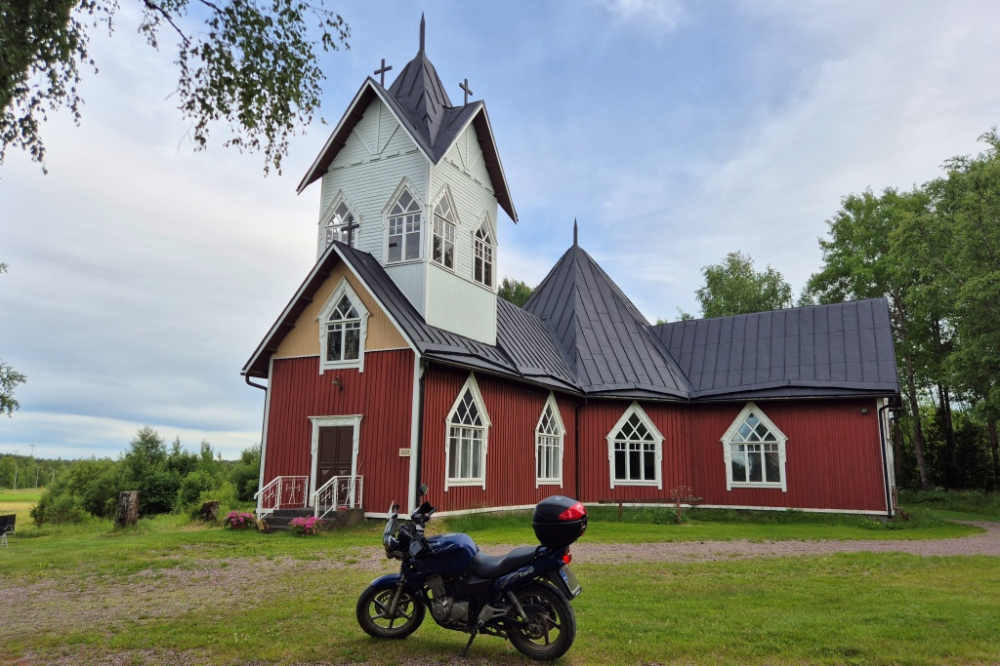
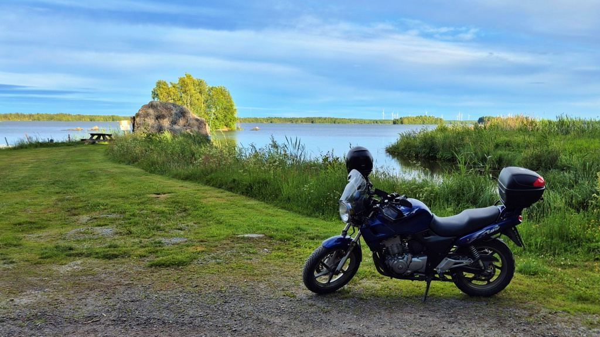
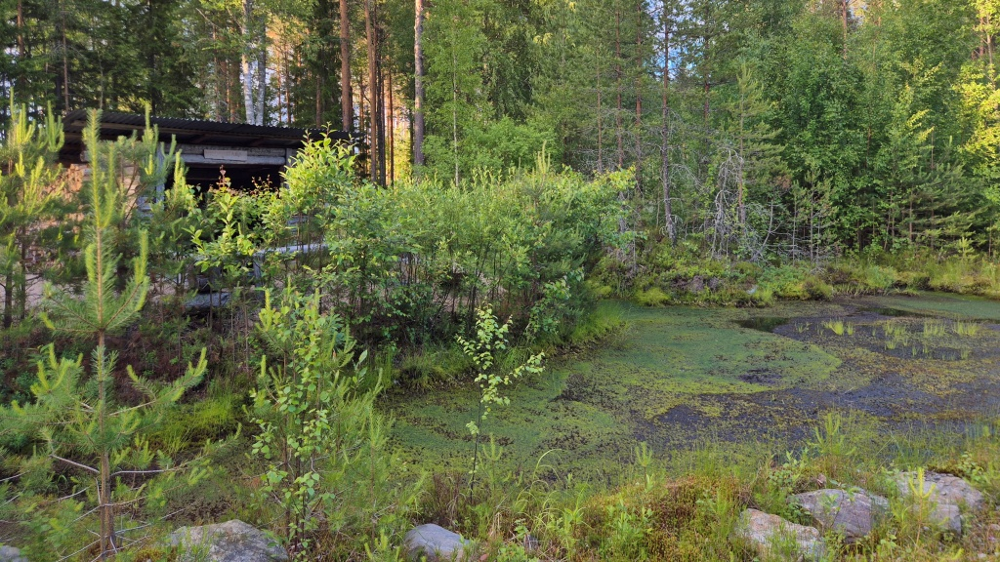
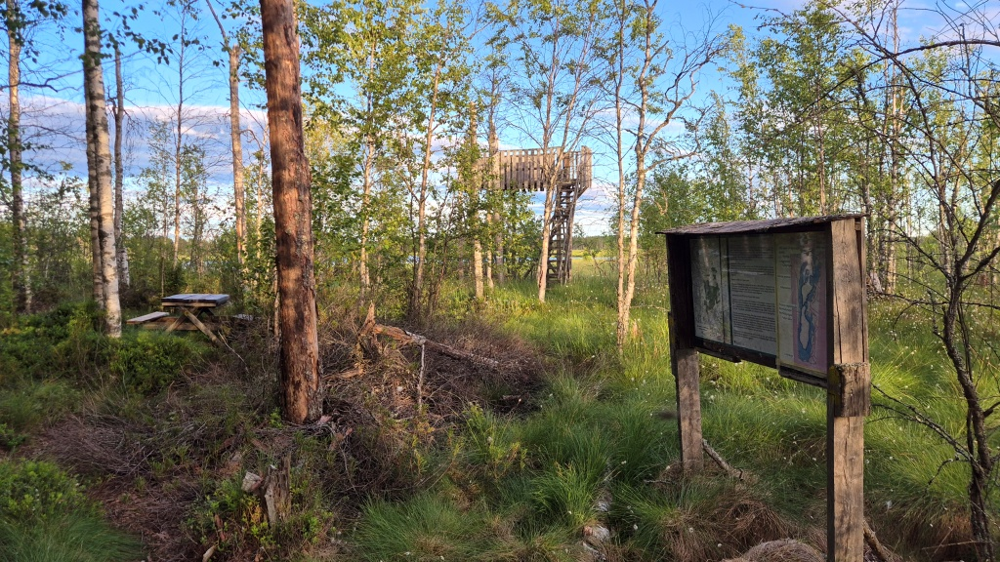
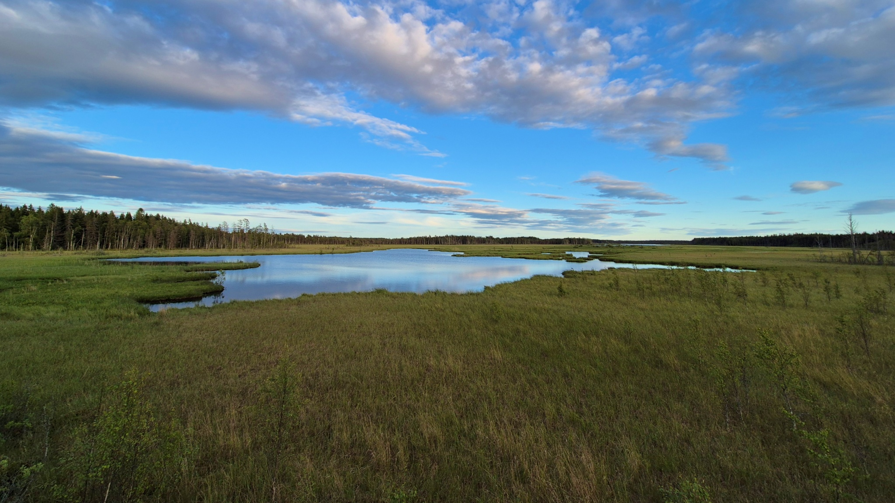
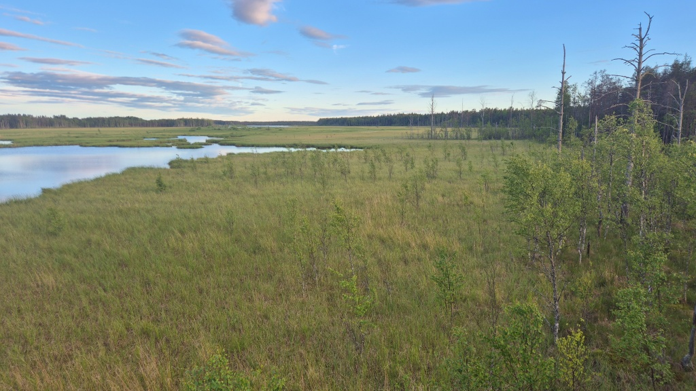

# Vad händer efter kvällsorientering i Norrnäs?

Dags för ännu ett kapitel i serien "på väg hem från kvällsorientering". Denna gång besökte jag Närpes OKs torsdagsträff vid Kompassberget i Norrnäs, Närpes. På hemvägen blev det sedan mera orientering när navigationsappen hade andra idéer om vart vi var på väg än vad jag ville. Till Nojärv träsk tog jag mig i varje fall, efter mycket om och men.

<!--more-->

Torsdagsträffens arrangörer tog emot anmälningarna vid foten av ett ca. 200 m högt vindkraftverk, eftersom platsen är i Norrskogens vindkraftspark. Vindmöllorna är så mäktiga att det inte riktigt går att fånga på foto. Orienteringen gick inte direkt strålande. En riktigt rejäl miss på mer än 20 minuter. Min plan var att gå mot en stig för att sedan svända av mot kontrollen - men stigen som enligt kartan borde varit tydligt var i praktiken osynlig. Jag gick förbi stigen och spenderade de följande 15 minuterna med att svärande ta mig fram genom ibland mycket tät skog och ibland de röjda stammarna av mycket tät skog. Sedan gjorde jag ett s.k. parallellfel, då jag trodde att jag hittat stigen jag var på väg till men det visade sig vara en hyggesväg som inte fanns på kartan. Till råga på allt gjorde jag en liten miss igen när jag skulle följa samma stig i en annan riktning - och tappade stigen igen. Jag hittade i varje fall alla kontrollerna, så det blev en hedrande sista plats i resultatlistan.

Efter att ha spenderat 1,5 timmar i skogen styrde jag norrut mot Rangsby. Tittade som snabbast på Rangsby bykyrka. Den är lite annmorlunda. Den byggdes av frivilliga i början på 1900-talet, bl. a. med material från fyra väderkvarnar. Den underhålls idag av en förening, inte av Närpes församling.

Jag körde vidare via Träskböle mot Taklax, mestadels längs smala grusväger. I Taklax besökte jag hamnen i Kamb vid Hinjärv träsk. Åt en banan, studerade de svartvita flugsnapparna och njöt av friden en stund.

Efter Kamb började problemen. Min navigator, Kurviger, ville att jag skulle följa en skogsväg norrut mot Bjurbäck, men jag bestämde mig för att åka genom Taklax byn. Eftersom jag inte hade satt några vägpunkter längs skogsvägen trodde jag att navigatorn skulle förstå att jag valt en annan väg och anpassa sig. Men nej. I Bjurbäck visade bad navigatorn mig att svänga av åt fel håll. Det tog ett tag innan jag insåg att jag var på fel väg. Och inte fick jag den förbaskade navigatorn att ge med sig, jag var tvungen att knappa in Korsbäck på Google Maps istället.

I Korsbäck startade jag Kurviger igen, eftersom jag hade den planerade rutten där. Den guidade mig helt korrekt in på vägen mot Viitala by, men när vägen delade sig sade den inte till att jag skulle ta av till vänster och inte heller påpekade den att jag kört fel. Efter en bra stund var jag plötsligt tillbaka vid vägen mellan Bjurbäck och Korsbäck igen, jag hade alltså åkt i en cirkel.

Jag åkte istället tillbaks längs med skogsvägen och denna gång lyckades jag svänga rätt mot Viitala. I Viitala börjar en vandringsled mot Velkmossen och där finns också ett fågeltorn med utsikt över Nojärv träsk. Jag knallade den knappa kilometern till fågeltornet, i sällskap av en miljon myggor. Uppe i tornet blåste det tack och lov tillräckligt för att hålla bort de flesta myggorna. Jag drack mitt kaffe ur en medhavd termos. Ute på myren knallade några tranor, i övrigt hände det inte så mycket.

När jag kom tillbaks till motorcykeln insåg jag att klockan var mycket och att jag nog skulle vara tvungen att skippa det mesta av de andra eskapaderna jag planerat. Jag körde ut till Petalax, sedan via Mamrelund ut till Strandvägen och sedan raka spåret hem. Inga mer skogsbilsvägar denna dag. Totalt blev det 176 km åkning, varav nästan hälten på grus. Skamligt nog är denna blygsamma rutt faktiskt den näst längsta jag gjort hittills i år - kräver bättring.

### Om navigationsappar

Jag har egentligen varit riktig nöjd med [Kurviger](https://kurviger.de), men nu börjar tålamodet tryta. Det där med att avvika från rutten har alltid varit krångligt. Jag skulle önska att appen skulle uppdatera rutten för att guida mig till nästa vägpunkt - men det fungerar inte alltid korrekt, det verkar som den har sina egna, interna vägpunkter som ställer till det. Att skippa en vägpunkt har också vållat bekymmer. Det skall vara möjlig att göra via Android Auto, men jag har inte fått det att fungera, så i praktiken har jag oftast stannat motorcykeln, stoppat navigeringen på min telefon och sedan startat navigeringen på nytt. Då brukar den förstå att den skall skippa den redan passerade vägpunkten.

Jag har gillat att Kurviger låter en planera rutterna på förhand på datorn. Men på sistone är att web-gränssnittet varit mycket långsamt. De sparade rutterna laddas inte, man måste försöka flera gånger innan den går med på att ladda dem. Ibland försvinner kartan, då måste man ladda om hela appen. Och ibland slutar den räkna rutten och ger något otydligt felmeddelande. Det känns som att detta håller på att bli "abandonware", alltså att utvecklarna inte längre sätter resurser på appen.

Tyvärr har jag inte hittat något bra alternativ. Calimoto känner bara till asfalterade vägar, vilket inte funkar speciellt bra i Finland. Google har en begränsning på 12 vägpunkter - jag brukar ha ca 50 på mina längre rutter. Några andra alternativ med planering på datorn och hyfsad Android Auto-navigation och med stöd för både asfalt och grus har jag inte hittat. Det har varit en del reklam för Stegra.io på sistone, men dels har jag inte lyckats ta reda på vad den kan och inte kan och dels verkar den vara mycket inriktad på grus och skogsvägar.
