# Nytt bakdäck och en kort provtur

Lilla Blues bakdäck började vara aningen nött. Det underskred det lagstadgade mönsterdjupet med ca. 1 mm (det lagstadgade minsta mönsterdjupet är 1 mm). Dags att byta således. Jag beställde ett nytt däck, plockade av bakhjulet från hojen, tvättade fälgen lite grann och förde till däckverkstaden. Förhoppningen var att det nya däcket skulle vara monterat och kunna hämtas redan samma dag. Och att jag skulle hinna skruva tillbaks hjulet på hojen och fixa några andra småsaker på kvällen. I slutet av processen hägrade nämligen en provtur på kvällskvisten. Från torsdag kväll framåt utlovdes regn, så om det inte provturen blev av denna kväll skjuts den upp med flera dagar.

<!--more-->

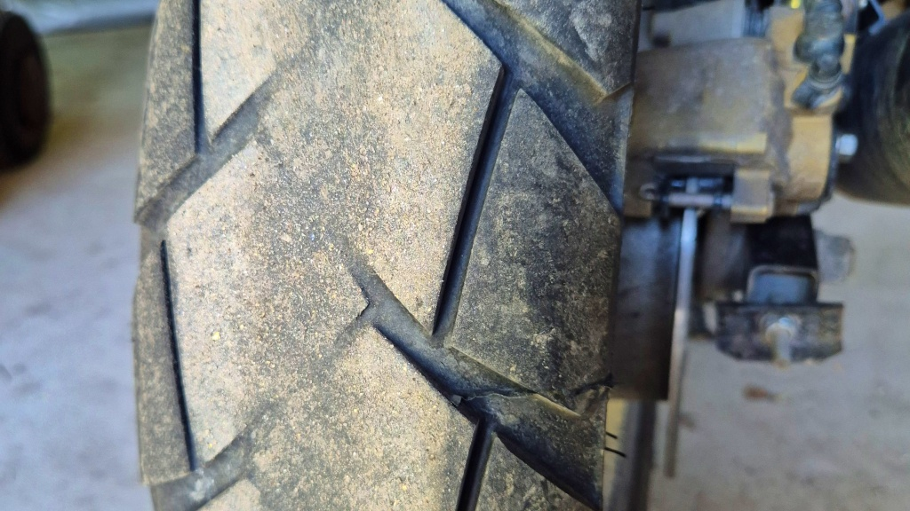

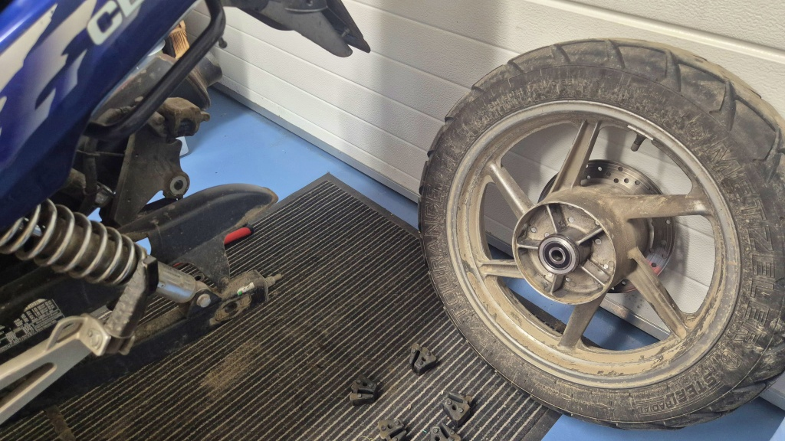

De lovade ringa från [Skurs däck & service](https://www.skurs-dack.fi) när däcket var bytt. Jag var lite otålig, så jag åkte dit 16:30 efter jobbet, men det var förgäves - däcket var inte monterat ännu. Sjutiden på kvällen fick jag ett samtal från Tobbe att däcket var klart för avhämtning. Det blev 220 € för nytt Michelin Anakee Adventure samt montering på fälg och balansering. Det känns rätt dyrt om man skall byta bakdäck varje år (och då tror jag inte man får det billigare än så någon annanstans.)

Jag rengjorde alla delar enligt bästa förmåga och passade på att kolla lager, bakbromsar osv. Allt verkade i skick. Jag passade också på att byta höger sidas kedjespännare. Den gamla föll bort någonstans i Ilomants i juli 2025. Sedan dess har jag kört med en provisorisk kedjespännare gjort av en del till en kasserad cykelsadel, en bricka (inte rostfri) och en låsmutter (inte rostfri). Det har faktiskt fungerat helt utmärkt. Men det blir väl lite snyggare med riktiga delar. Jag beställde delarna från Japan redan för nästan ett år sedan, men jag har inte haft behov att röra kedjespännarna förrän nu.

")

Efter att jag hade justerat kedjans slack och dragit fast hjulbulten med moment-skaftet (90 Nm), rengjorde och smorde jag kedjan. Som nytt, nästan. Klockan var nu efter 22, men tyckte ändå att situationen _krävde_ en liten provtur.

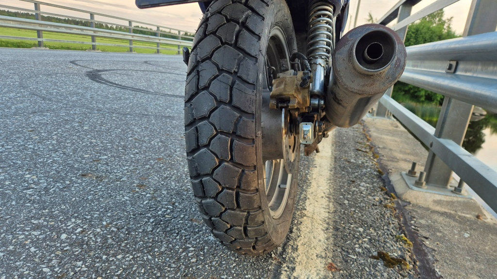

## Provtur

Jag åkte en bit längs Kyro älv från Skatila till Kvevlax. Vägen är i uselt skick, men omgivningen är vacker. Eftersom jag åkte förbi fortsatte jag mitt projekt att fota traktens kyrkobyggnader. [Älvkyrkan i Voitby](https://alvbyarna.weebly.com/aumllvkyrkan.html) har förut kallats bönehus, men benämns numera som kyrka i folkmun. Sedan stannade jag också upp vid [Kvevlax kyrka](https://sv.wikipedia.org/wiki/Kvevlax_kyrka).

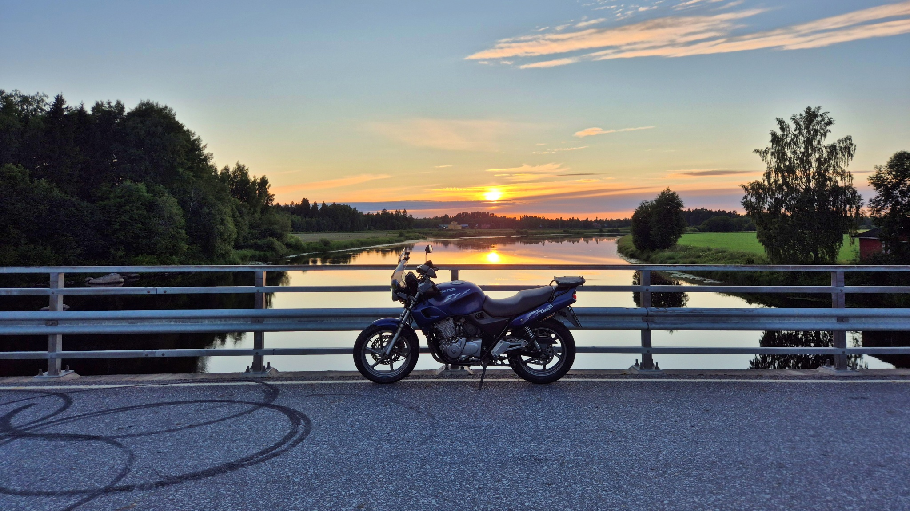

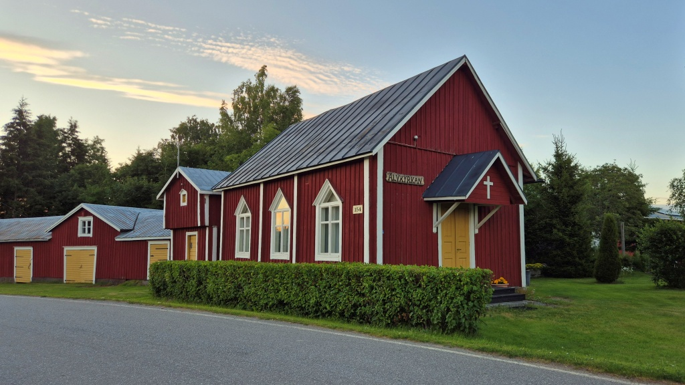

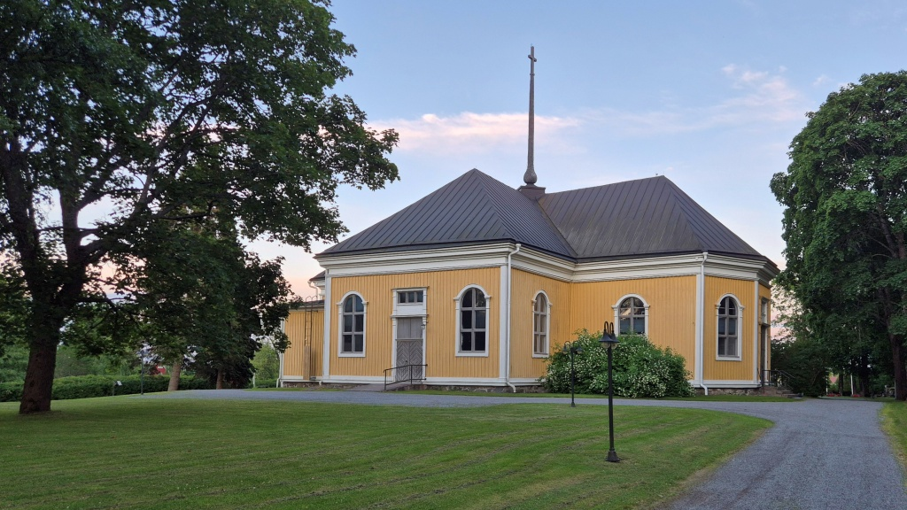

Från Kvevlax fortsatte jag av bara farten till Petsmo och sedan vidare till Koskö och Karperö. Här fick jag testa det nya däcket en kort bit på grus också, för vägen mellan Petsmo och Koskö är inte asfalterad. Därefter fortsatte jag till Gamla Vasa och vandrade runt kring [Korsholms kyrka](https://sv.wikipedia.org/wiki/Korsholms_kyrka) och upp till [Korsholms vallar](https://sv.wikipedia.org/wiki/Korsholms_vallar). Korsholms vallar är den kulle där Korsholms slott fanns, uppfört i början på 1300-talet. Antagligen fanns bebyggelse på kullen redan tidigare än så.

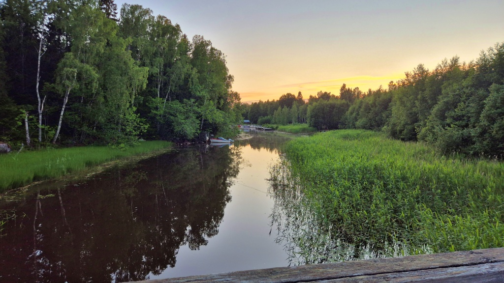

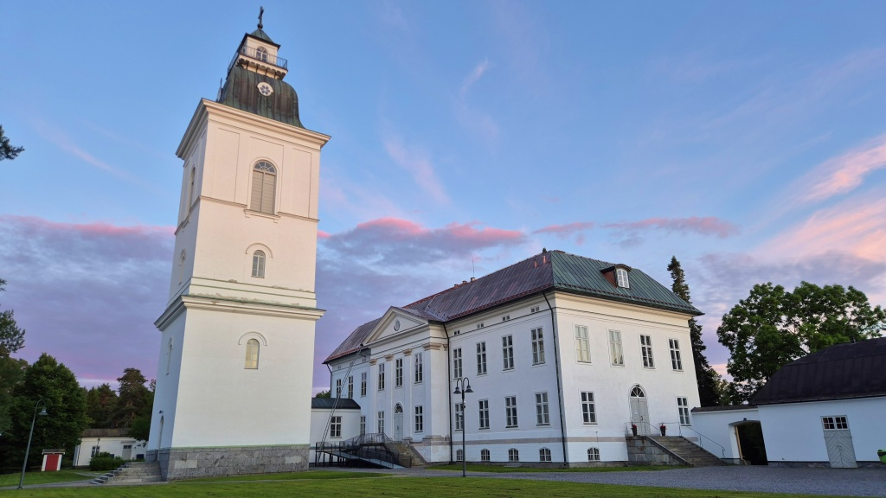

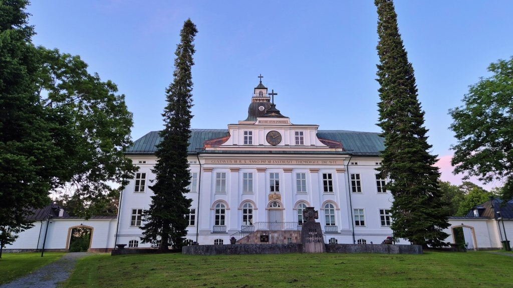

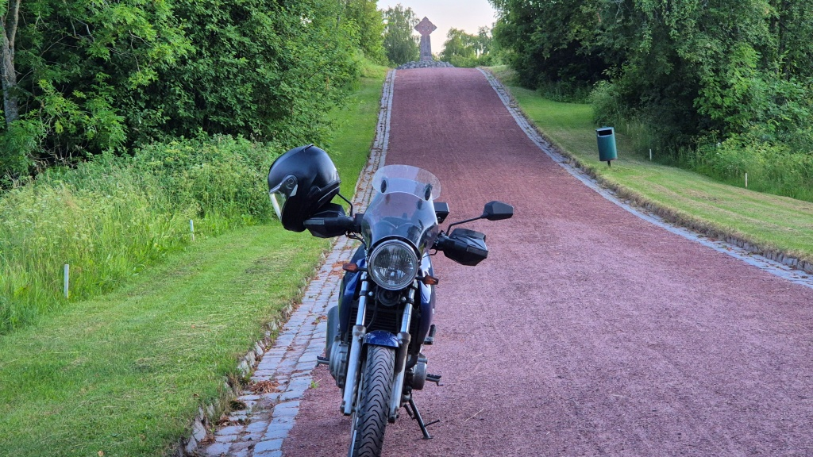

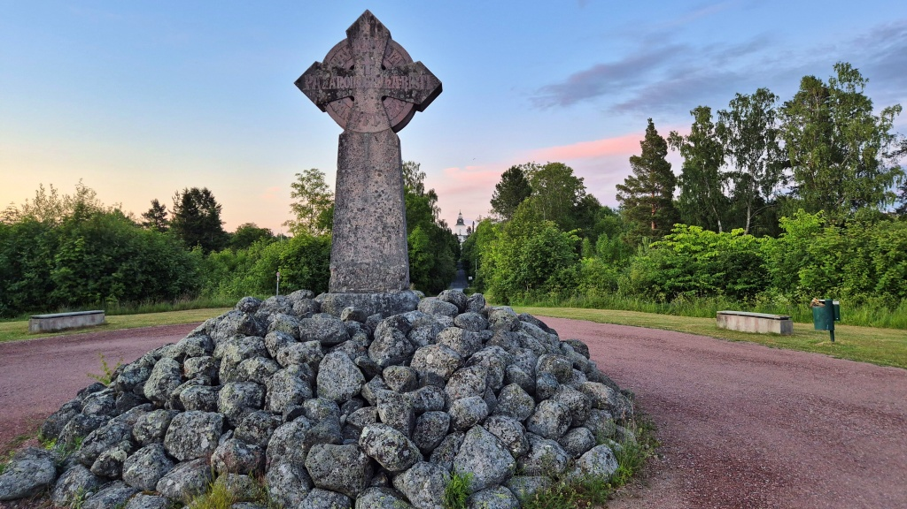

På hemvägen var jag ännu tvungen att tanka. Reserven brukar komma på där kring 340, nu hade jag redan kört 350 på en tank, men klarat mig utan reserven. Den teoretiska räckvidden (om tanken rymmer 18 l) ligger då kring 416 km (långtidsmedeltal), men det varierar med typ av väg, packning och framförallt det som kallas "körstil". Någon dag skall jag ta en reservdunk med mig och se hur långt jag verkligen kommer på en tank. Med risk att jag drar den skitiga bottensatsen i tanken in i förgasarna.

Själva provturen blev i varje fall bara 73 km lång. Klockan var ändå efter midnatt innan jag var hemma.

## Resultat

Vilken skillnad! Det gamla däcket, Metzeler Tourance, var ju helt slutnött och dessutom "fyrkantigt". Med det nya däcket kändes naturligtvis inte samma motstånd när man lutade hojen. Men när jag bytte bakdäck förra gången, från Metzeler Roadtec till Tourance, kändes det nya däcket inte alls så bekvämt på asfalt - klart sämre än Roadtec. Nu tyckte jag däremot att Anakee-däcken kändes mycket bra på asfalt. Också på grus kändes de mycket bra, men här kan jag inte riktigt jämföra - dels är ett splitternytt 80/20-däck givetvis mycket bättre än det utslitna, nästan-slicks, Tourance-däcket, dels tror jag att jag blivit lite säkrare på grus sedan senaste bytet. I varje fall kändes däcken stabila på grus. Det är riktigt så att man undrar hur det skulle kännas att ha ett Anakee framdäck också, kanske skulle det på riktigt göra en stor skillnad för gruskörningen. Tyvärr finns det inte annat än gatdäck att få för mitt 17-tums framhjul, så jag får nog nöja mig med min Roadtec 01 där. Just nu känns det i varje fall som Anakee var värd de några tiorna mera det kostade jämfört med ett nytt Tourance.

Jag har också försökt läsa på om varför mina bakdäck slits så snabbt. Tourance-däcket höll bara 12400 km - och det var ju verkligen utslitet. Med tanke på att Lilla Blue är en rätt lätt hoj och att jag mest kört asfalt tycker jag att det känns som en rätt kort hållbarhet. Teorin är nu att jag använt för lågt däcktryck. Enligt Hondas manual skall däcktrycket bak vara 2,25 bar (2,5 bar med passagerare), medan däcktillverkarna (Metzeler och Michelin) rekommenderar 2,5 normalt och 2,8 bar med passagerare. Motsvarande för framdäcket; Honda rekommenderar 2,0 bar, Metzeler 2,25 bar. Så nu skall jag höja trycket och se om Anakeen klarar 15000 km. 

Vad som däremot inte var så bra är att de vibrationer jag känt i styret bara blir värre. Dels kan det bero på att högre lufttryck i däcken gör dem hårdare, men den bakomliggande orsaken måste vara något annat. En misstanke är att de läckande framgafflarna gör att det är obalans i dämpningen. Idag kände jag tydligt att framänden liksom studsade när vägen var ojämn. Jag måste definitivt byta bussningar i framgafflarna så snabbt som möjligt. Eventuellt borde jag byta annat också, glidbussningar och O-ringar, men de får jag inte tag på alldeles genast. Jag måste också kolla framhjulets lager och styrlagren. Jag planerar en längre resa, men jag måste få vibrationsproblemet fixat innan det är möjligt.

Vad kedjespännaren beträffar, får se hur länge den nya hålls där. Jag tror att jag skall packa med min hemgjorda spännare på nästa långresa - för säkerhets skull.
