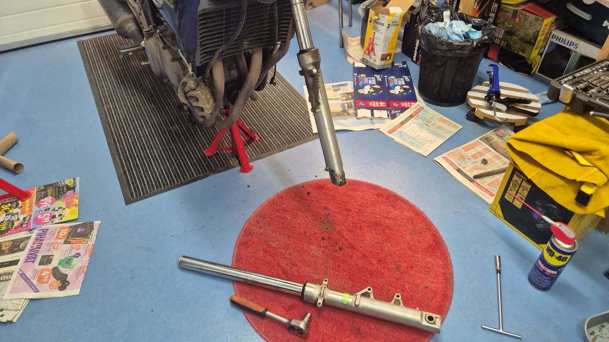
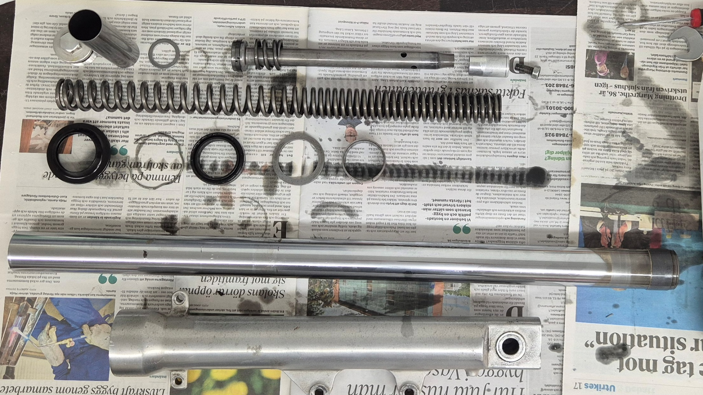
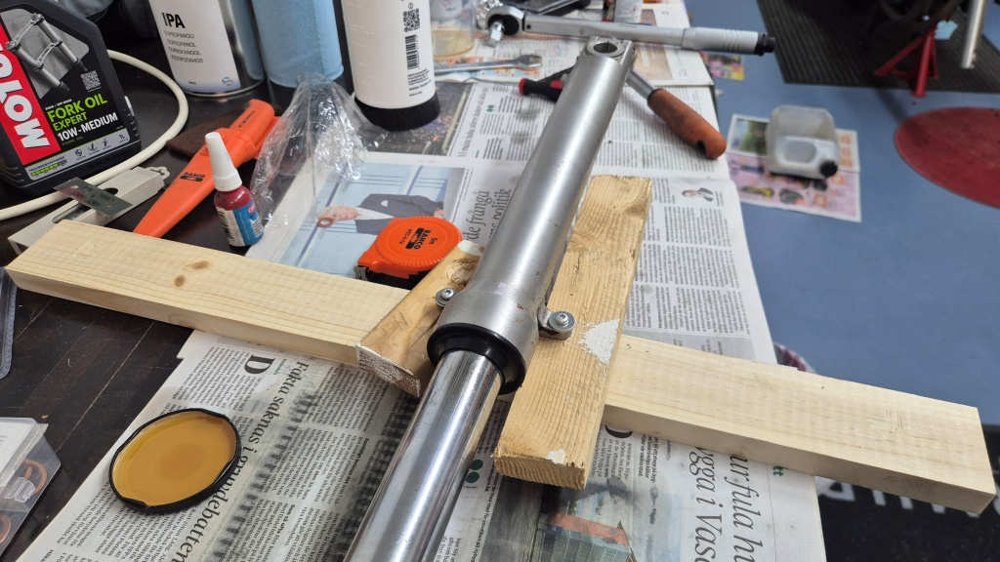
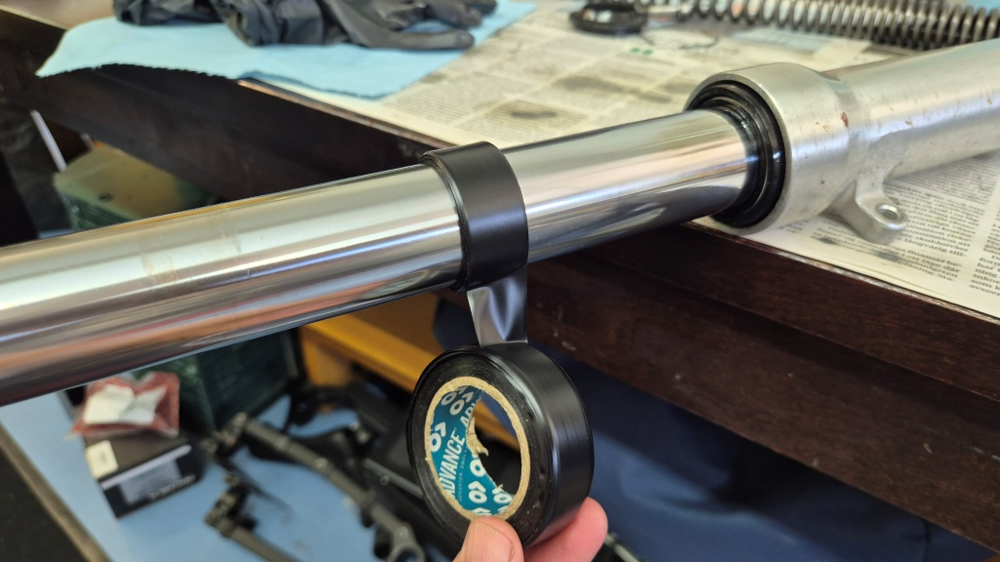
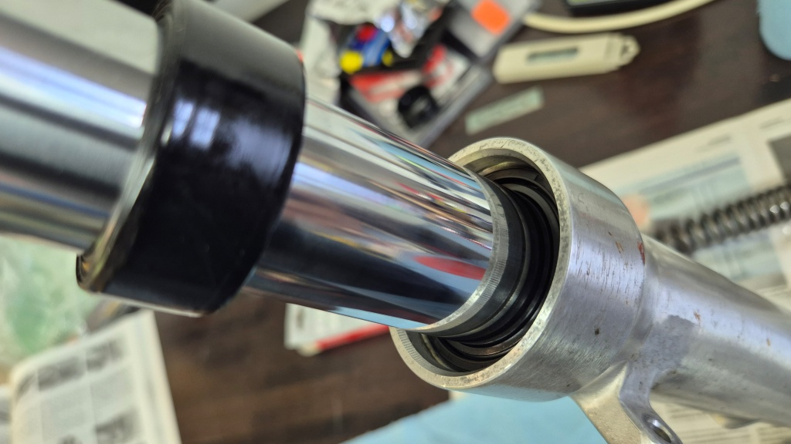

# Serva framgafflarna

När jag köpte hojen för några år sedan berättade försäljaren att framgafflarna nyligen renoverats. Trots det har framgafflarna nu läckt olja en längre tid. Jag har försökt fixa det genom att peta en tunn plastfilm mellan gafflarna och oljetätningen, men senaste gången hjälpte det inte alls. På sistone har det till och med synts oljefläckar på garagegolvet under framgafflarna. Dessutom kändes det som om stötdämpningen inte längre fungerade som den skulle, dels vibrationer och dels "skuttande" på ojämn väg. Det var alltså dags att ta itu med denna måste-syssla: att serva framgafflarna.

<!--more-->

Det var första gången jag tog av och isär framgafflarna, så det var lite funderande innan jag kom igång. Jag tog först av det högra gaffelbenet och monterade isär det. Inga direkta problem, men lite klott med olja och så - och oljan i de där gafflarna var vidrig - både beträffande utseende och lukt! Jag gjorde dessutom misstaget att lämna oljiga tidningspapper liggande i mitt kombinerade arbetsrum/verkstad, vilket gjorde att det stank av den hemska oljan nästa dag när jag satt vid min dator och försökte jobba.

När jag inspekterade delarna kunde jag konstatera att det mesta var i hyfsat skick. Glidbussningarna var i och för sig lite nötta, men de skall nog hålla ett bra tag till. Fjädrarna såg bra ut. O-ringen vid gaffelbulten var också i bra skick, vilket var tur, för någon ny har jag inte inhandlat. Dammtätningen borde egentligen alltid bytas, men nu hade jag inte heller någon sådan, så den gamla fick duga. Planen var alltså att endast byta oljetätning och gaffelolja, men återanvända alla andra slitdelar.

Efter att jag fått isär gaffelbenet stannade det hela upp lite. Det fanns en del saker att lösa innan jag kom vidare:
  * Det kromade innerröret hade en del ojämnheter, så jag måste ta reda på hur dessa kunde åtgärdas. Egentligen borde väl hela röret kromas om, men det är en långsam och säkert dyr historia. Jag bestämde mig efter en del efterforskningar för att bara använda finkornigt sandpapper (P800 och P1200) och slipa runt röret - inte längsmed. Men sandpappret måste inhandlas.
  * För att rengöra delarna från olja och smuts hade jag tänkt använda Brakleen, men Internet avrådde från detta och rekommenderade istället isopropanol. Det har länge funnits på "borde handla" listan, nu var det dags att göra slag i saken och samtidigt skaffa en sprejflaska för att distribuera den lättflyktiga lösningen.
  *  Sedan måste jag klura ut hur jag skall driva in oljetätningen i gaffelbenet. Att köpa ett dyrt specialverktyg (och vänta veckor på leverans) kändes inte som ett alternativ. Trots att jag mindes att jag borde ha lite lämpligt grovt PVC-rör liggandes någonstans, hittade jag inget sådant. Istället hittade jag ett tips om att man istället kan linda många varv eltejp runt gaffeln och använda själva gaffeln som drivande vikt. Det bestämde jag mig för att pröva. Och eltejp gick att uppbringa från egna lager.
  * För att mäta oljenivån i röret beslöt jag att helt enkelt doppa ned ett vanligt rullmåttband och läsa av var oljenivån var.

När sandpapper och IPA var inhandlade tog jag itu med arbetet att rengöra delarna och sedan plocka ihop det hela. Det gick rätt bra. Största problemet var att dra fast bottenbulten med rätt moment - jag var tvungen att skruva fast gaffelbenet i en träbit för att lyckas hålla det stabilt. Jag använde en inoljad plastpåse över innerröret för att skydda oljetätningen när jag trädde den på röret. Eltejp-drivaren visade sig fungera riktigt bra - det var nog ganska mycket motstånd när man bankade in innerröret i ytterröret, men till sist sjönk tätningen in på sin plats. Jag rullade tillbaka tejpen på rullen för att återanvända den på nästa gaffelben. Med hjälp av en måttkanna lyckades jag fylla exakt rätt oljemängd - på millimetern när.

Sedan var det bara att montera tillbaka gaffelbenet på sin plats och därefter ta itu med det vänstra gaffelbenet. Andra gången gick det lite snabbare, även om jag stötte på några små problem. Denna gång roterade dämparinsatsen när jag försökte dra åt bottenbulten. För att få den att ligga stilla satte jag in fjädern och mellanröret och skruvade fast gaffelbulten - då gick det att dra åt till rätt moment. Denna gång blev det lite för lite olja från måttkannan, så det blev att lägga till och ta bort lite olja innan det var rätt luftspalt i röret.

Därefter monterade jag det andra gaffelbenet och justerade lamphållaren till rätt höjd på båda sidor. Jag rengjorde frambromsens ok och skiva lite nödtorftigt och monterade sedan oket på gaffelbenet. Serviceboken säger att bultarna skall bytas, men jag satte bara lite Loctite på de gamla. Därefter satte jag framhjulet på plats, framstänkskärmen och till sist hastighetsmätarvajern. Klart!

När jag var klar var klockan redan över midnatt, så det blev inte riktigt tid för en provtur. Provturen tog jag istället nästa dag, i samma veva som jag for på lunch. Efter den korta provturen kan jag kanske konstatera att det är bättre än förut. "Skuttandet" var borta och framänden kändes på något sätt lugnare. Ännu syns inga tecken på oljeläckage. Men vibrationerna är inte borta. Lite bättre blev det kanske, men det är nog något annat som orsakar vibrationerna. Som nästa steg skall jag försöka synkronisera förgasarna - trots att jag inte tror att det är motorns vibrationer som orsakar det hela. Som jag konstaterat tidigare blir det nog mera skruvande än körande med en så här gammal hoj.
