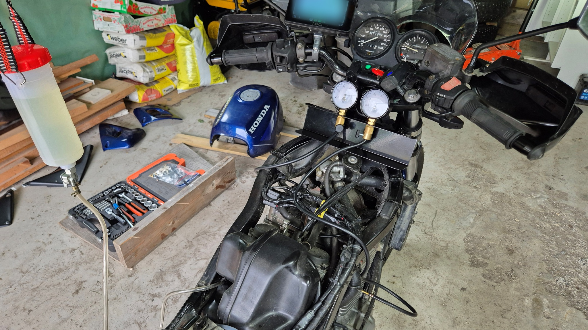
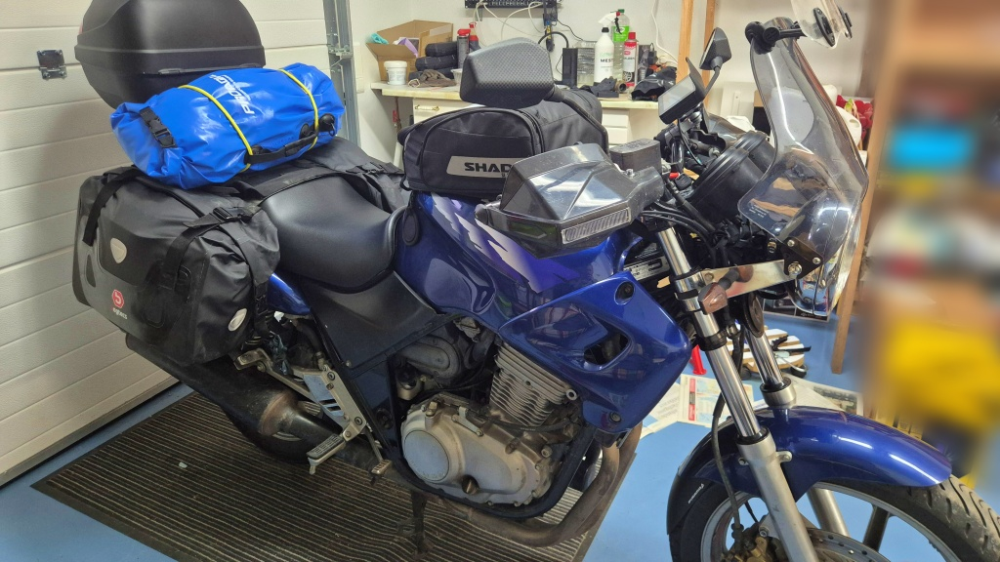

# Synkronisera förgasarna - igen

För att försöka bota vibrationer och ett lite motvilligt gaspådrag försökte jag - ännu en gång - synkronisera förgasarna. Och det var faktiskt lite bråttom att få det gjort.

<!--more-->

Jag har nu försökt synkronisera förgasarna åtminstone tre gånger tidigare - utan att lyckas pricka in det helt. Dels kanske det beror på att mitt synkroniseringsverktyg inte är alldeles exakt, men framförallt har det varje gång fallit på att jag inte fått till stång en pålitlig bränsletillförsel. Jag köpte en "verkstadsflaska" med kran, men den förbaskade flaskan (jag kallade den tidigare för Kina-skit, men den är Made in India) läcker tom på några minuter. Jag tog mig nu tiden att försöka fixa läckaget med två aningen för små slangklämmor och nu slutade den läcka vid slangfästet. Men den läcker fortfarande från själva kranen - jävla Indien-skit. Nu droppade det i varje fall så långsamt att jag bedömde att det kommer att fungera.

Jag skruvade av alla kåpor och körde motorn varm med en kort tur. Samtidigt kalibrerade jag min "före"-markering. Sedan av med tanken, på med vakuummätarna och så kopplade jag verkstadstanken. Denna gång fick jag det hela att fungera någotsånär bra. Lite droppade det bensin, men inte oacceptabelt mycket.

Enligt mätarna var cylindrarna aningen i osynk, men inte mycket. Utan gedigen erfarenhet kan jag inte säga om 0,1 - 0,2 bar vid 2000 varv är mycket eller litet, eller om det kan ha orsakat problem. Jag justerade i varje fall skruven så att båda mätarna visade exakt lika, både på tomgång och vid 4000 varv. Sedan nöjde jag mig med det och rev ner test-setupen igen (jag tömde överbliven bensin från verkstadstanken i gräsklipparen.) Det var lite bråttom att gå och hjälpa till med middagen, med gäster på kommande. Efteråt kom jag på att jag naturligtvis borde ha bytt respektive mätare till den andra cylindern för att dubbelkolla inställningen. Suck. Nåja, senast jag testade visade de faktiskt nästan exakt lika.

När middagen var avklarad skruvade jag ihop det hela och åkte på en liten provtur för att fylla tanken inför morgondagen. Under den korta provturen _kändes_ det faktiskt bättre. Den verkade inte lika ovillig vid gaspådrag och den ojämna gången var aningen bättre (men inte helt perfekt.) Men jag inser att en kort provtur inte är tillräcklig för att bedöma om det blev bra eller inte. Jag får känna noggrannare efter imorgon. Imorgon, ja - då bär det av på tur.

Nya däck, luften kollad. Hjullager ok. Bromsbeläggen ok (lite i tunnare laget där framme, men borde räcka). Oljan kollad. Kylarvätskan kollad. Ackun nyladdad. Ljusen ok. Framgafflarna nyservade, den läcker inte. Och nu förgasarna också synkroniserade. Få se hur långt jag kommer, 50 km, halvvägs eller hela vägen hem igen? Det är ju oftast de saker man inte tänkt på som orsakar de verkliga problemen.
