# Olofsborg, Kolovesi och en kvällstur

_Dag ett av vår fyra dagars resa i sydöstra Finland._

Min efterlängtade långtur kan äntligen börja. Idag styr Lilla Blue och jag mot sydöstra Finland. Dagens huvudmål är Olofsborgs fästning i Nyslott och nattläger är planerat i Kolovesi nationalpark. Kommer vi oss dit?

<!--more-->

## Tidig start

Eftersom rutten jag planerat för idag är rätt lång gäller det att komma iväg i tid. Ganska exakt kl. 6 på morgonen åkte ekipaget av gården, på väg mot äventyret. Den första delen av varje resa går ju längs med nuförtiden rätt välbekanta vägar. Laihela, Ylistaro, Lappo, Alajärvi. Solen sken vid avfärden, men när vi åkt förbi Lappo började mörka moln torna upp sig österut. Ungefär vid gränsen mot Alajärvi försvann solen bakom det tjocka molntäcket. Men tvärtemot vad det såg ut som gav dessa moln inte ifrån sig regn, de bara täckte solen.

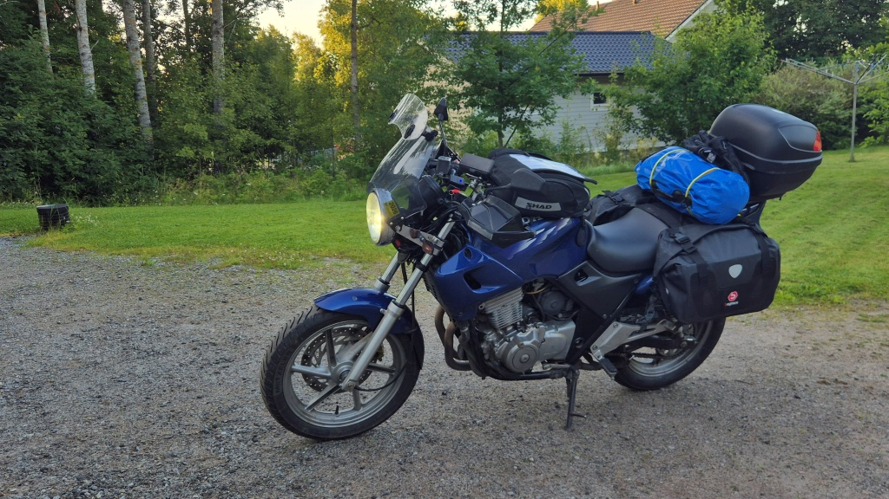

När solen försvann blev det också svalare. I Kyyjärvi fick jag konstatera att det inte är en sådan sommar att det räcker med två lager under Gore-Tex-jackan, utan jag var tvungen att dra på mig fleecetröjan också.

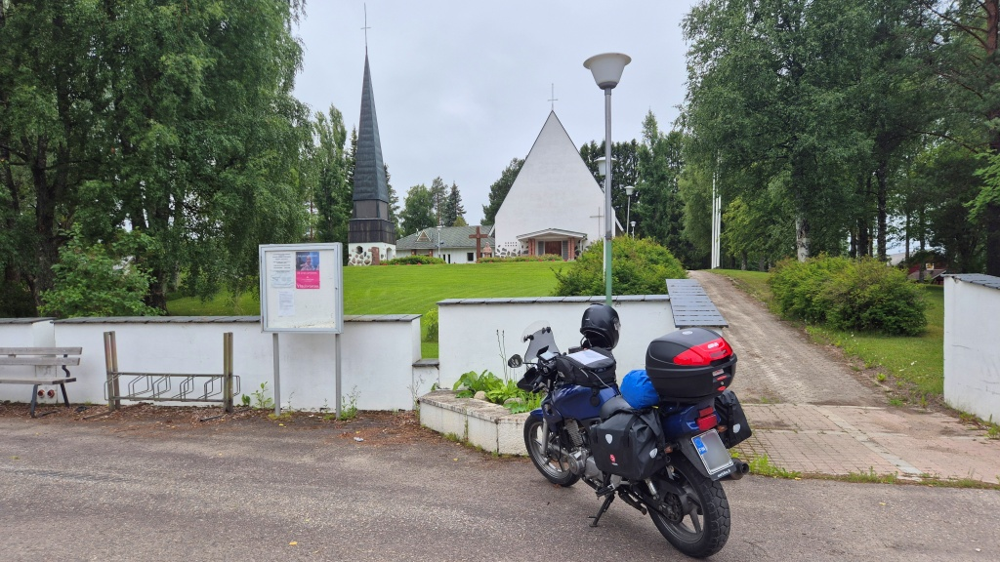

Färden gick förbi Saarijärvi centrum, så vi kurvade in där. Jag har tidigare kryssat av Saarijärvi som besökt kommun, men då var det faktiskt bara "utbyn" Pylkönmäki, tidigare egen kommun, som vi besökte. Detta blev alltså första gången i kommuncentret.

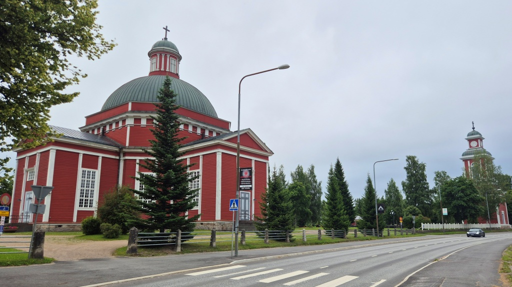

På samma sätt var Äänekoski centrum en ny upplevelse, senast besökte vi bara Suolahti. Vid [Paatela kanal (fi)](https://fi.wikipedia.org/wiki/Paatelan_kanava) blev det frukostpaus med termoskaffe och medhavda mackor. Sedan var det dags att tanka i Suolahti. Jag hade tänkt mig att denna region skulle ha förmånligt bränsle, men det var betydligt dyrare här än på ABC:n hemma.

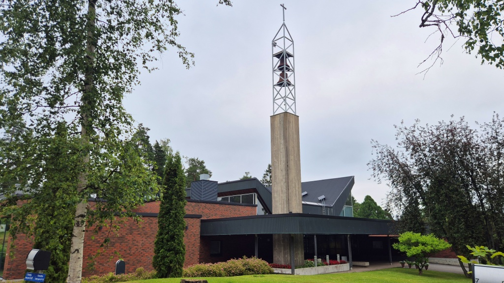

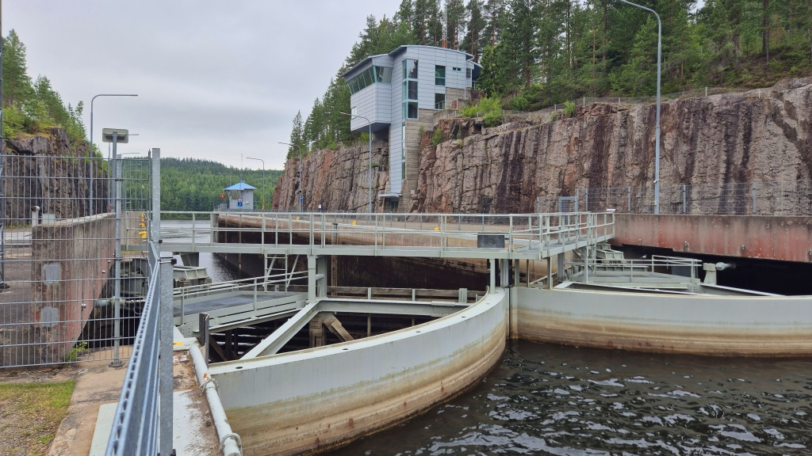

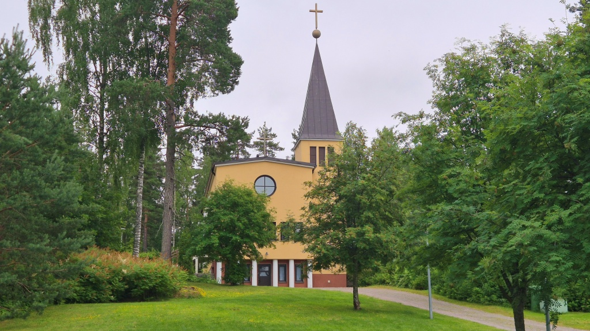

## Hankasalmi

Efter Suolahti styr man österut mot Konnevesi och sedan svänger man söderut mot Hankasalmi. En by med en huvudgata rakt igenom. Några affärer, en kyrka och en brandstation. Inget speciellt som fäster sig i minnet. Men Hankasalmi är den första nya kommunen på denna resa och faktiskt den första nya kommunen för hela det här året.

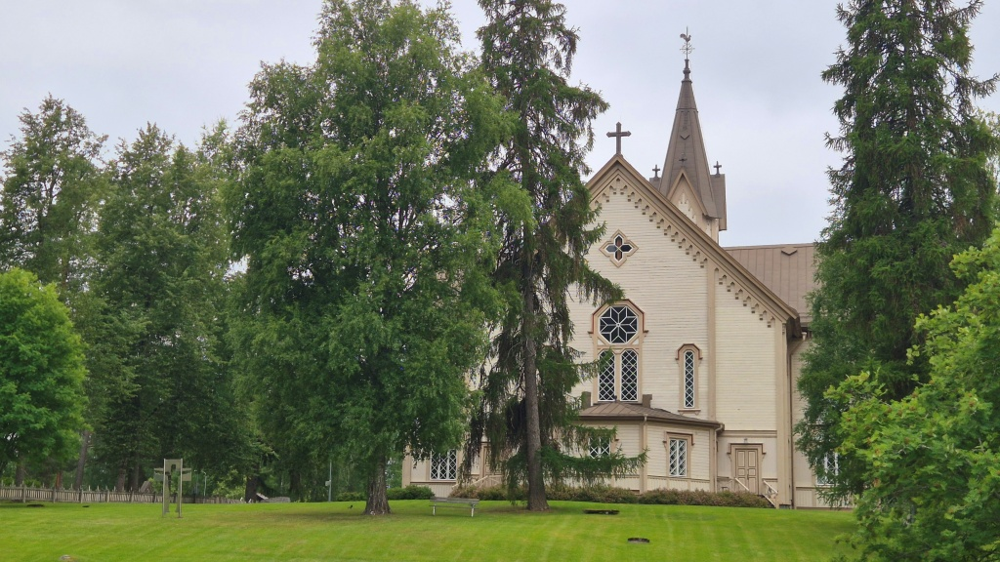

## Pieksamäki

Pieksamäki är ett lite större ställe. Den [gamla kyrkan (fi)](https://fi.wikipedia.org/wiki/Pieks%C3%A4m%C3%A4en_Vanha_kirkko) ligger vackert uppe på en kulle en bit utanför stadens centrum. Själva centrum är sedan uppbyggt kring järnvägen och mycket verkar fortfarande kretsa kring detta. Det var en del folk och aktivitet på torget, vilket inte är illa för en måndagsförmiddag. Stadens Prisma är, åtminstone delvis, inhyst i ombyggda gamla lokstallar, det är ju lite speciellt. Jag hoppade över diverse järnvägsrelaterade turistattraktioner, som järnvägsmuseet, och åkte vidare mot Varkaus.

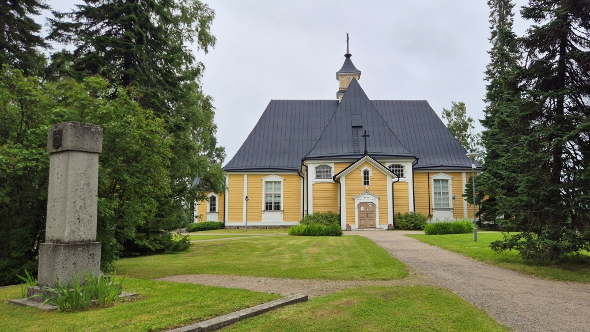

## Lunch i Varkaus

Om Pieksamäki är uppbyggd kring järnvägen, så är Varkaus uppbyggd kring sitt pappersbruk. Stora Ensos fabrik ligger alldeles mitt i staden på vad som kanske skulle vara stadens bästa tomter. Handelsgatan är enkelriktad en ganska lång bit och faktiskt ganska mysig. Här finns butiker, restauranger, bio och annat. Man kan väl säga att denna stad nog har sin alldeles egen stil. Jag åt lunch på restaurang "Kaks Ruusua", som verkade ganska fin. Den har antagligen en historia som anknyter till stadens industriella arv.

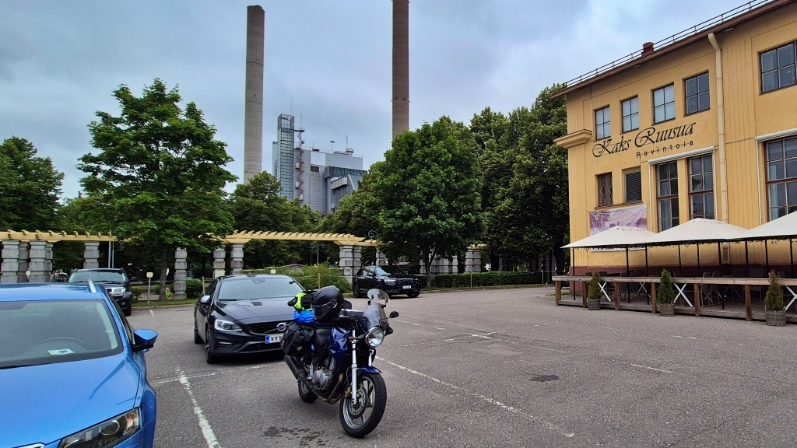
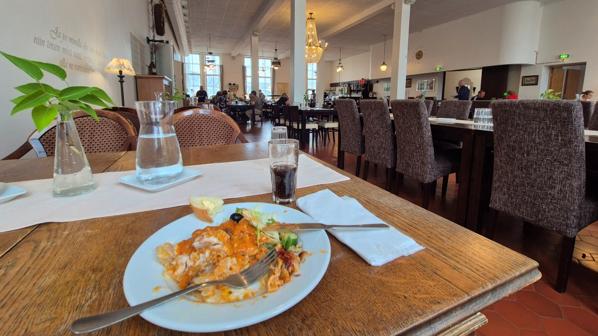

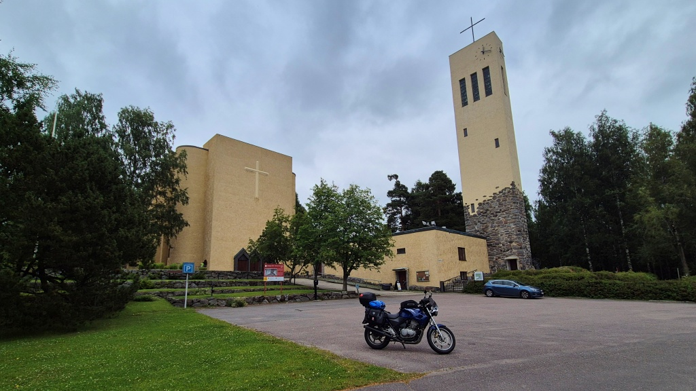

## Jorois

Strax söder om Varkaus ligger Jorois (fi: Joroinen). Jorois är känd för sina många herrgårdar. Jag passade på att köra förbi en av dem - [Järvikylä gård](https://sv.wikipedia.org/wiki/J%C3%A4rvikyl%C3%A4,_Jorois). Om namnet känns bekant kan det bero på att en stor del av de kruk-örter som säljs i vårt land är odlade här. Deras uthus pryder även etiketterna, vill jag minnas.

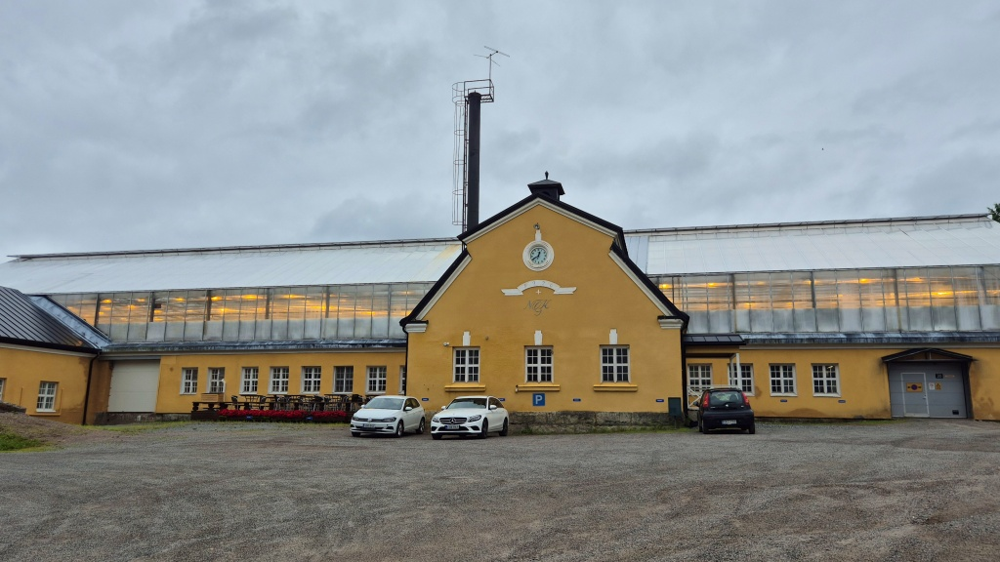

Jag åkte också förbi hotell Joronjälki, det hotell som drabbades av en explosionsolycka i november 2025. Gasflaskor exploderade i en bil som stod parkerad på gården. Två människor omkom och hotellet skadades svårt. Jag var inte tillräckligt mycket katastrofturist för att svänga in till hotellet, men det såg i varje fall ut att ha verksamhet, för det var en del bilar parkerade på gården.

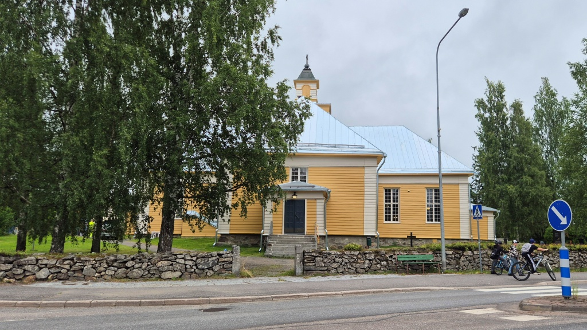

Strax utanför Jorois centrum ligger [Varkaus flygplats](https://sv.wikipedia.org/wiki/Varkaus_flygplats). Denna flygplats har inte längre reguljär passagerartrafik och ägs inte längre av Finavia. Jorois kommun använder istället terminalen, som ser fräsch och rätt ny ut, för kommunförvaltningen. Samtidigt arbetar man i Varkaus och Jorois för att få tillbaka passagerartrafik till flygfältet.

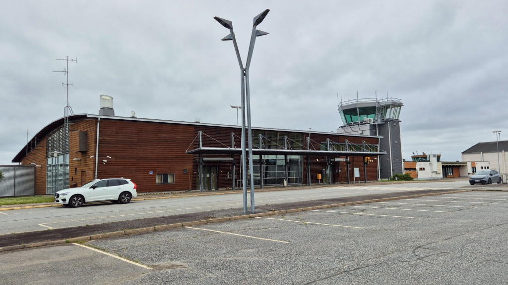

## Rantasalmi

Efter att nästan hela tiden kört längs breda och raka vägar bjöd vägen från Jorois till Rantasalmi på lite mera variation. Långa svepande kurvor. Men tyvärr också ganska mycket trafik. Centrum av Rantasalmi såg åter ut som månget annat centrum. Här torde den berömda arkitekten [Eliel Saarinen](https://sv.wikipedia.org/wiki/Eliel_Saarinen) vara född, men jag noterade inga turistfällor kopplade till detta. Kyrkan är i varje fall stor och ståtlig, mäktigare än vad kommunens storlek låter ana.

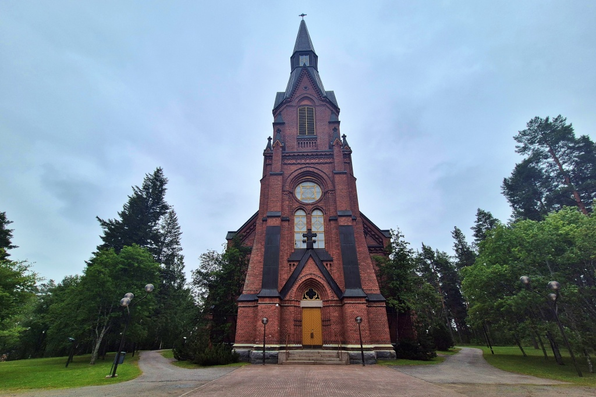

## Nyslott och Olofsborg

Efter Rantasalmi närmade jag mig Nyslott och genast märktes att det var närmare till en lite större stad och framför allt en större turistort. Huvudvägen (väg 14) in till staden var rätt full med bilar, husbilar och husvagnar. Inne i staden var det rätt livlig trafik mitt på dagen. Några gator var avstängda, så jag var tvungen att lägga om rutten en aning, men det är ju ingen stor stad som man riskerar att köra vilse i.

.")

Dagens primära mål var fästningen [Olofsborg](https://sv.wikipedia.org/wiki/Olofsborg), som nog kan räknas som en av Finlands mest kända byggnader. Trots att borgen besöks av ett stort antal turister finns ingen egen parkeringsplats, man blir tvungen att parkera på gatan. Märkligt nog lyckades jag hitta en lucka längs gatan i stort sett så nära man bara kan komma, utan P-avgift dessutom.

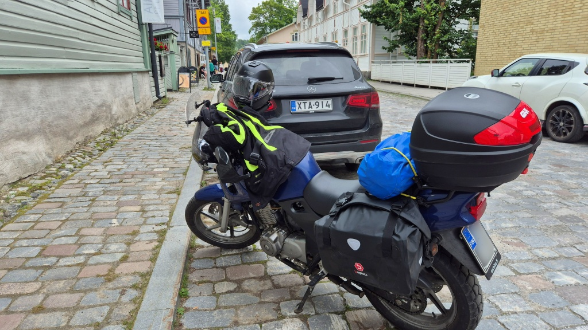

Visst är det en häftig plats. Jag gick med på en guidad tur för att få se så mycket som möjligt av slottet. Vi var närmare 100 personer, men delades som tur upp i två grupper. Turen tog kring en timme, varav en stor del av tiden gick åt till att vänta på att alla deltagare skulle ta sig upp och ner för smala trappor och gångar.

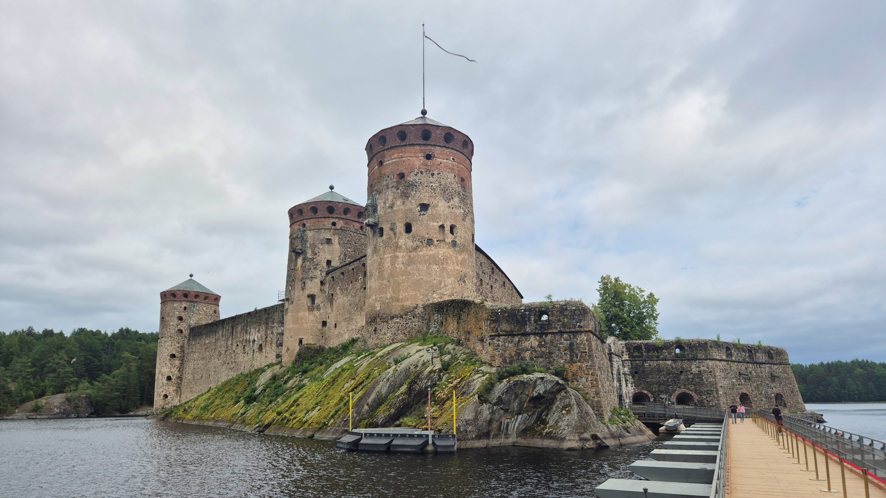

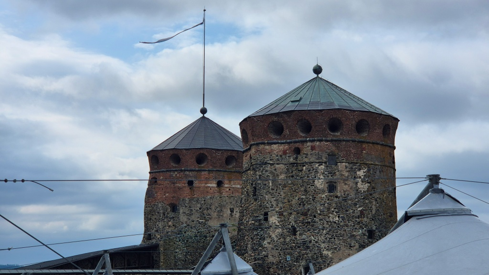

Jag gjorde mig ingen speciell brådska utan njöt av att vandra runt i den historiska miljön. Men när jag till slut kom ut från fästningen konstaterade jag att jag var rejält efter min preliminära tidtabell. Jag hade nu tänkt sätta mig ner på en restaurang och inta en fin middag, men beslöt att istället masa mig iväg till motorcykeln för att fortsätta färden. Jag fyllde tanken och köpte en färdig sallad i butiken och fortsatte sedan norrut. Jag tog en kort vända via [Nyslotts flygplats](https://sv.wikipedia.org/wiki/Nyslotts_flygplats), som låg precis intill vägen till Enonkoski.

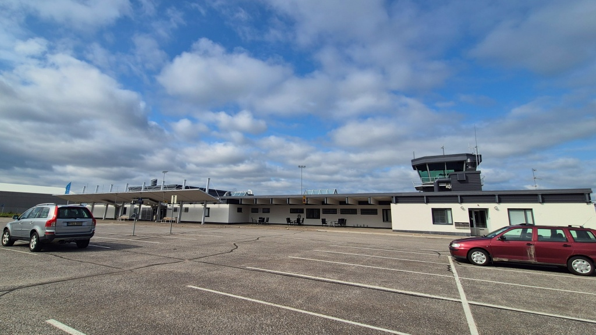

## Enonkoski och Kolovesi nationalpark

Enonkoski var inget stort ställe. Det har i varje fall redan tidigare varit på min radar eftersom jag planerat en [Iron Butt SS1000 "Namnet på kartan"](https://www.ibafinland.fi/jasenille/ajosuoritukset/) (fi). Då skall man besöka och tanka i en ort med begynnelsebokstaven samma som alla bokstäver i ett namn, till exempel "E" för Enonkoski. Jag kunde nu se med egna ögon att det finns någon slags bensinstation i Enonkoski, så det borde lyckas att tanka här.

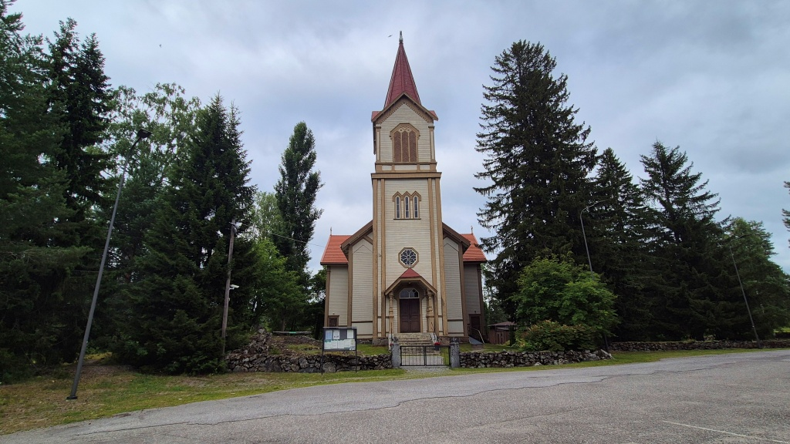

Efter kyrkbyn fortsatte jag norrut till [Hanhivirtas färja](https://sv.wikipedia.org/wiki/Hanhivirtaf%C3%A4rjan). Jag hade verkligt tur med tidtabellen. På väg mot färjfästet märkte jag att det inte alls kom mötande trafik, så jag gissade att färjan inte hade kommit. Nästan i samma stund jag fick färjfästet i sikte, lade färjan till. Jag behövde inte ens stänga av motorn, bara att vänta några sekunder innan jag fick rulla ombord. Färjan blev nästan helt full, så när jag som sista fordon kört ombord, lade den genast ut.

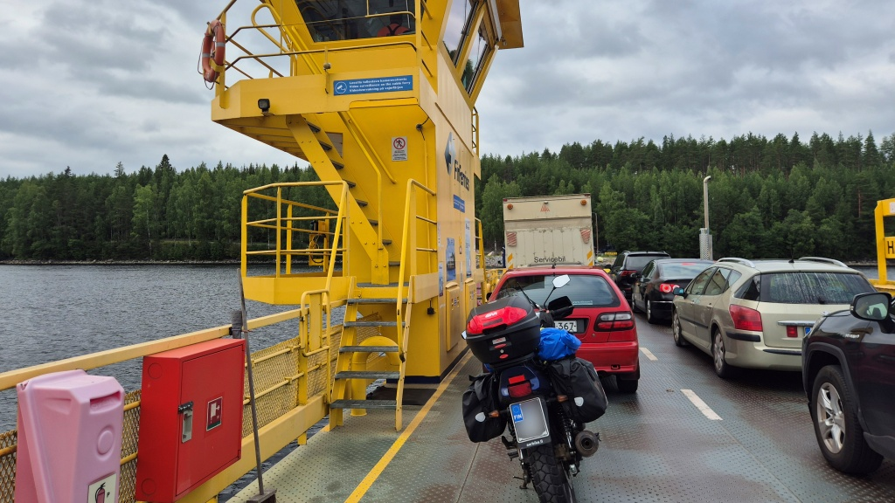

Från färjan var det sedan en bit långsam åkning längs usel väg efter alla bilar från färjan. Efter 15 km svängde jag av ner mot Kirkkoranta tältplats i [Kolovesi nationalpark](https://www.luontoon.fi/sv/destinationer/kolovesi-nationalpark), nattens lägerplats. Det fanns gott om plats på parkeringen, men jag var tvungen att kånka tält och utrustning dryga hundra meter in i skogen till själva tältområdet. Där slog jag snabbt upp tältet och avnjöt sedan en middag bestående av sallad, mineralvatten och de sista mackorna jag haft med mig. Maten var väl sådär, men stället var bedårande. Vacker och tyst, vila för själen och öronen.

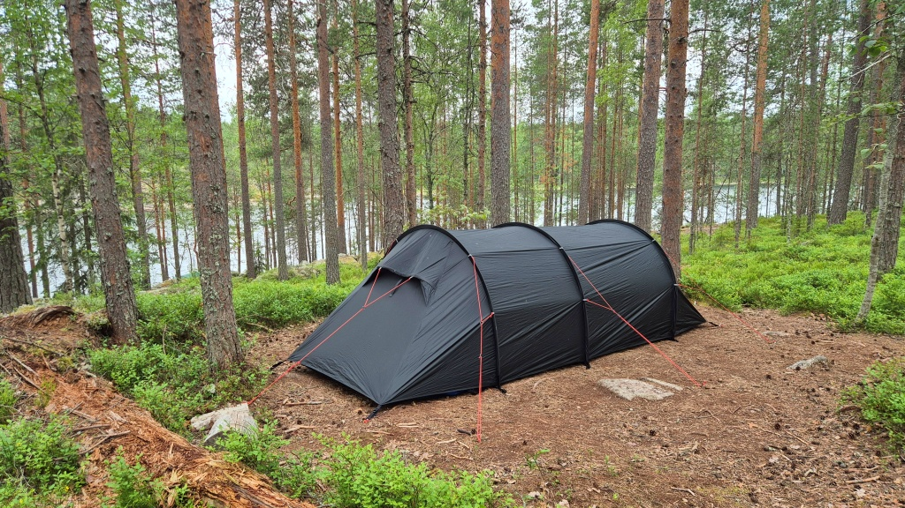

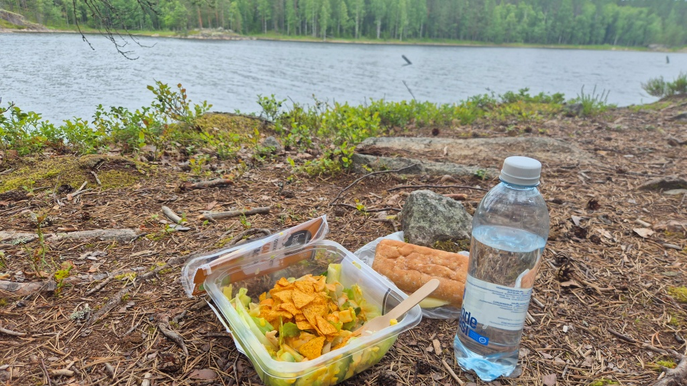

## En extra kvällstur

Nu skulle man ju kanske ha kunnat tänka sig att 570 km skulle ha varit tillräckligt för den första dagen, men här fanns ett par saker att beakta. För det första hade jag genom att ha skippat middagen i Nyslott och varit rätt snabb med att slå upp tältet sparat in lite tid, så nu var jag aningen före tidtabellen. För det andra hade jag planerat en liten extra tur för kvällen, "ifall om". Turen var planerad så att jag skulle besöka några kommuner som blivit lite på sidan av under den senaste resan och således inte besökts förut. Så det gick sig inte bättre än att jag efter en liten stund åter satt i sadeln, denna gång dock med lättare packning eftersom sadelväskor och tält lämnats i Kolovesi.

## Heinävesi

Först i tur var Heinävesi centrum. Jag körde genom Heinävesi på fjolårets [regniga tur i Österled](../2025-07-08-osterled2/), men då besökte jag Nya Valamo kloster, inte kommunens centrum. Fast det var väl inte så spektakulärt, en typisk småort med en kyrka på en höjd i utkanten av byn.

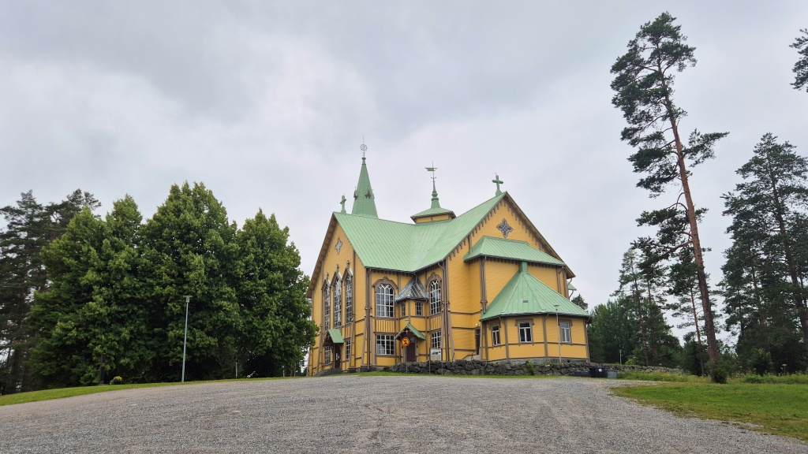

Mera spektakulärt var sedan nästa stopp. Efter att ha rundat sjön Kermajärvi, det blev nästan 30 km, och kört förbi [Karvio kanal](https://sv.wikipedia.org/wiki/Karvio_kanal), där Neste Karvionkanava är ett känt rastställe, kom jag till [Varistaipale kanal](https://sv.wikipedia.org/wiki/Varistaival_kanal) (fi: Varistaipaleen kanava). Detta är tydligen landets enda kanal med hela fyra sluss-steg. Fallhöjden är 13-14 m. Rätt spännande. Tyvärr ingen trafik genom kanalen så här dags.

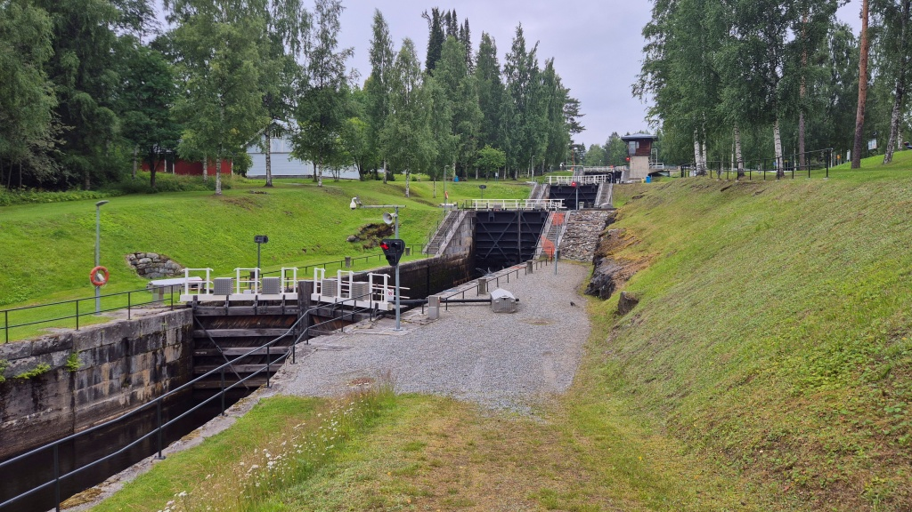

Jag svängde också av en kort bit från rutten till [Lintula kloster](https://sv.wikipedia.org/wiki/Lintula_kloster), Finlands enda ortodoxa nunnekloster. En kvinna med ett litet barn plockade bär utanför klostret, men i övrigt var det ganska tyst. Jag misstänkte att nunnorna inte ville ha besök efter kl. 20, så jag åkte vidare.

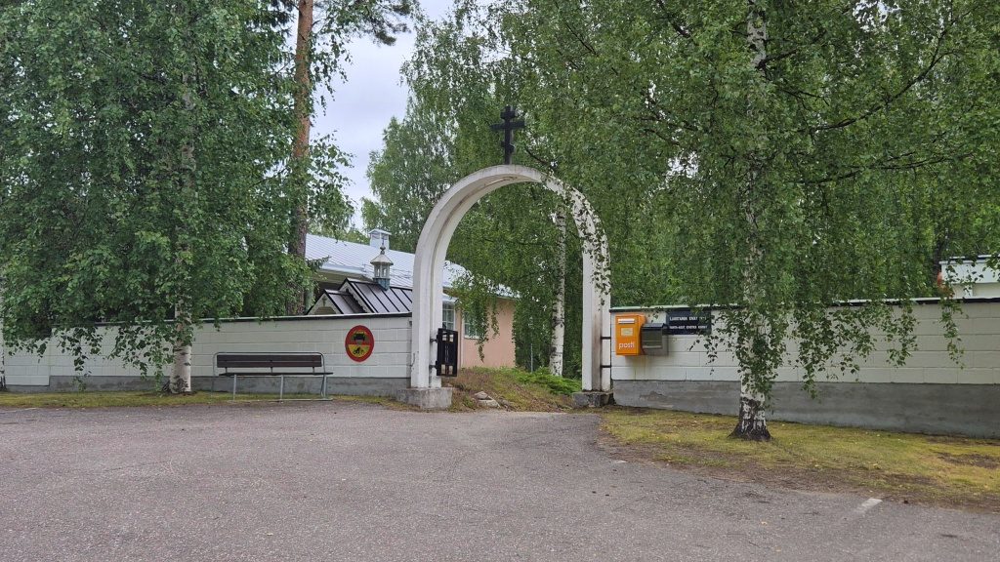

## Tuusniemi, Kaavi, Polvijärvi och Outokumpu

Därefter styrde Blue och jag mot kommuner vi inte hade besökt förut. Vi körde genom Tuusniemi och Kaavi. Jag började nästan ångra mitt val att åka på kvällstur. Vädret var fortfarande mulet och grått, så det började kännas lite kallt. Avstånden var längre än jag hade trott, bara vägen mellan Lintula och Tuusniemi var nästan 40 km. Men det värsta var att vägarna var väldigt tråkiga och i ganska dåligt skick. Mellan kommuncentren fanns inte mycket att se, mest skog. Några få hus här och där, kanske en sjö som skymtade mellan träden. Men ingen spektakulär utsikt, höga berg eller liknande. Och kommuncentren var små och tråkiga. Det som räddade det hela var nog att vägen mellan Kaavi och Polvijärvi var passligt krokig, åtminstone nästan tillräckligt jämn, och trafiken var mycket gles. Det var trevlig åkning.

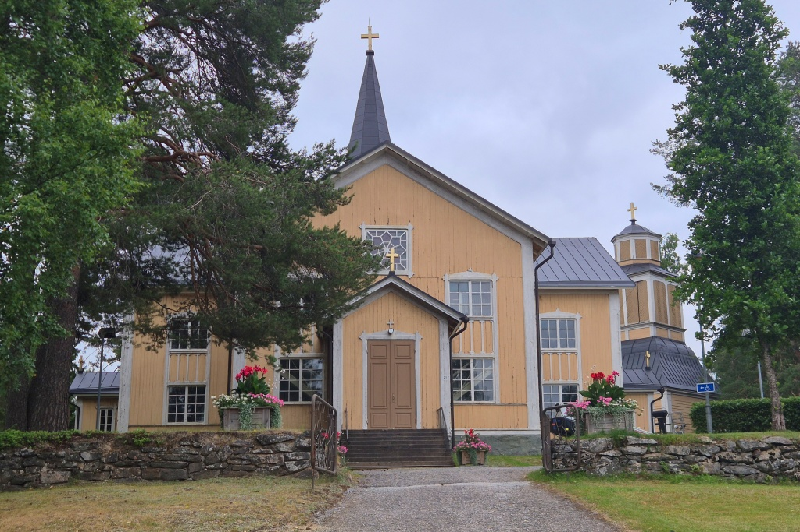

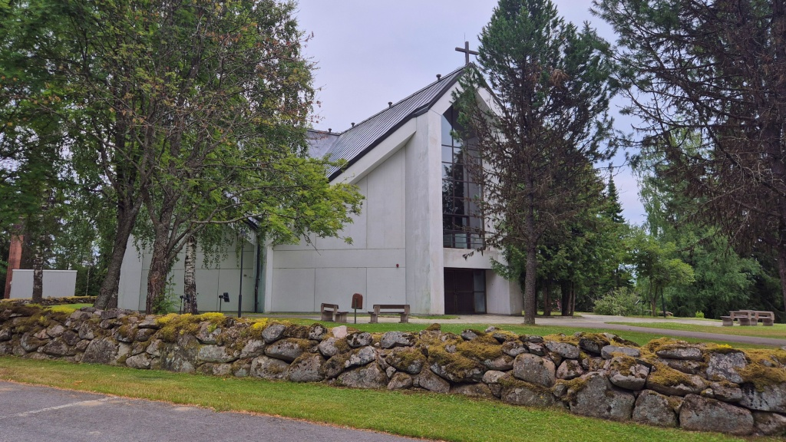

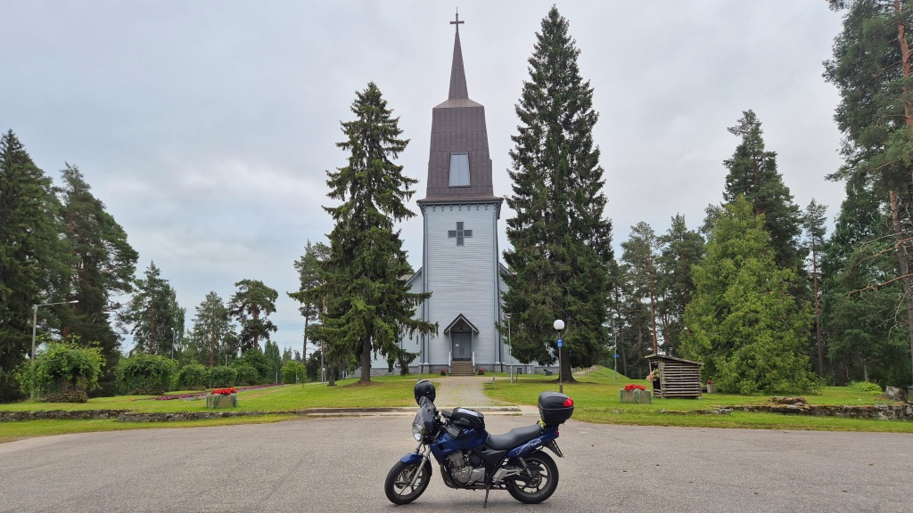

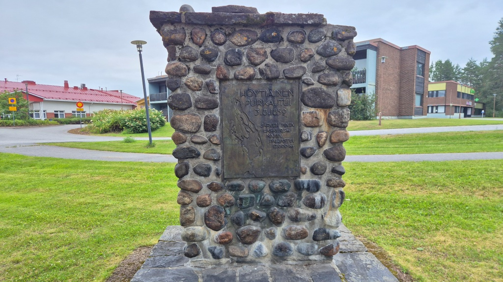

I Polvijärvi var det såpass kyligt att jag fick kränga på mig fleecen och tjockare handskar. Här körde jag också förbi ett minnesmärke som stod utanför kommunhuset. Monumentet påminner om [sänkningen av sjön Höytiäinen](https://fi.wikipedia.org/wiki/H%C3%B6yti%C3%A4isen_j%C3%A4rvenlasku) (fi) år 1859. 

Höytiäinen är en stor sjö som ligger mellan Polvijärvi och Kontiolahti, rakt norr om Joensuu. Tanken var att sänka vattenytan lite för att frilägga mark för odlingsbruk genom att leda bort vatten genom en ny kanal, men dammarna gav vika och stora mängder vatten forsade ut mot Pyhäselkä. På två veckor sänktes sjöns vattenyta med 7,5 meter (senare ytterligare 2 meter till) när 3 biljoner liter (3 miljoner miljoner) vatten rann ut. Detta orsakade översvämningar nedströms, ända ner till Villmanstrand. För Polvijärvi var detta en omvälvande händelse: landskapet förändrades kraftigt när strandlinjen flyttade sig och stora områden av ny mark och åkermark blottades längs sjön. Så kan det gå.

Vägen tillbaka till Kolovesi var sedan om möjligt ännu tråkigare. Outokumpu centrum låg närmast öde kl. 22 på kvällen, och kyrkan är i fulare laget. Jag hade inte noterat att det finns en mycket mera spännande kyrka i Kuusjärvi, nästan på rutten hemåt, så den missade jag tyvärr.

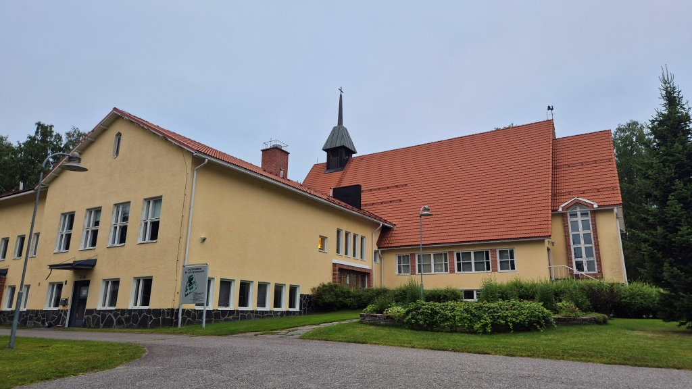

Istället fortsatte jag söderut längs de tråkiga och eländigt dåliga vägarna. En del av rutten var faktiskt grusväg, det hade jag glömt bort. Detta gav ju en liten extra utmaning i den tilltagande skymningen. Vid det här laget började det faktiskt kännas lite i baken av allt sittande, så sista sträckan var enbart en transportsträcka, givetvis med ständig spaning efter vilda djur i skymningen. Inte lika njutbart som åkningen annars är.

## "Hemma" igen

När jag kom "hem" till Kolovesi igen var klockan 23:20 och det började bli mörkt. Nu var det bara att borsta tänderna och krypa ner i sovsäcken. Väckarklockan ställde jag på 06:00. Jag misstänker att det inte gick mera än en kvart från att jag parkerade mc:n till att jag sov.

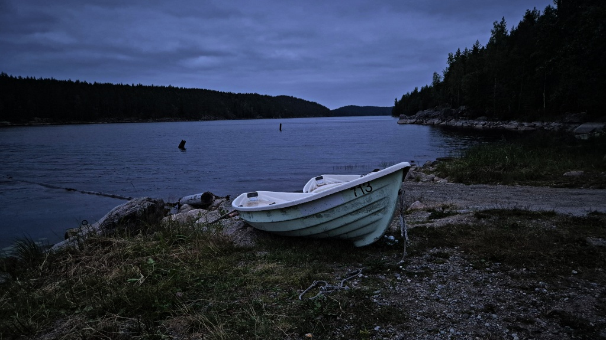

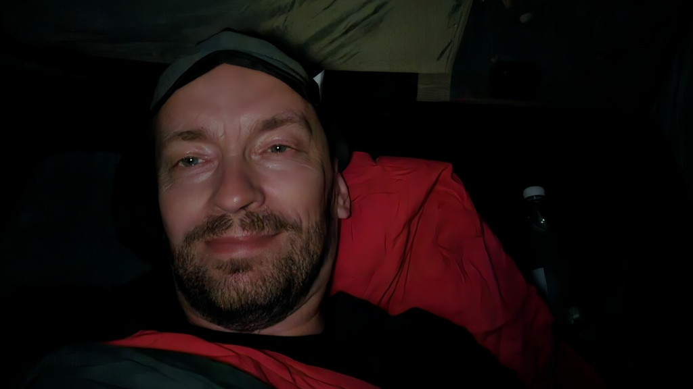

## Dagens rutt

Det blev en rätt lång första dag, Blues mätare visade totalt 879 km, inklusive den extra kvällsrutten. Som tidigare konstaterat började det kännas lite i baken efter 800 km, det är i linje med mina tidigare erfarenheter också. Men i övrigt gick allt bra.

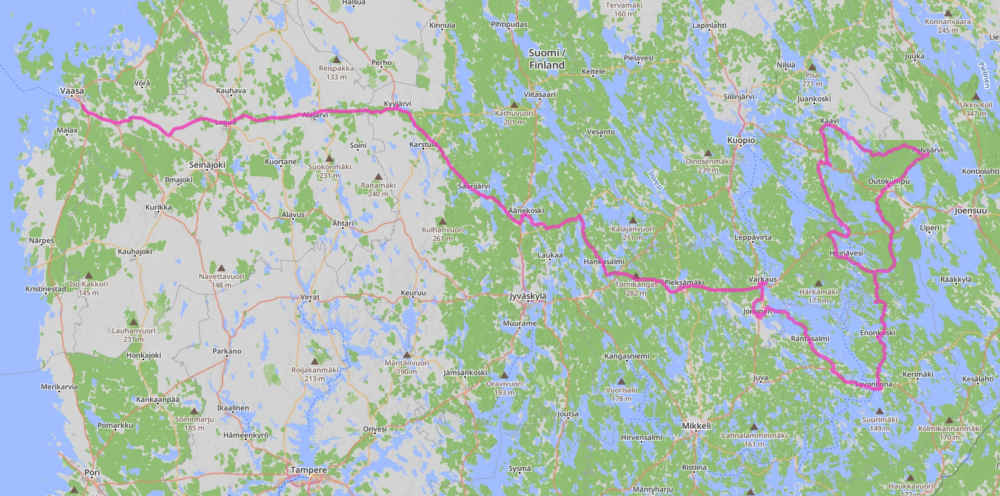

Mitt långsiktiga mål är att köra min mc Lilla Blue genom alla Finlands 308 kommuner. Denna dag lade jag 11 nya kommuner till listan över de besökta:

* Hankasalmi (Mellersta Finland)
* Pieksamäki (Södra Savolax)
* Varkaus (Norra Savolax)
* Jorois (Norra Savolax)
* Rantasalmi (Södra Savolax)
* Nyslott (Södra Savolax)
* Enonkoski (Södra Savolax)
* Tuusniemi (Norra Savolax)
* Kaavi (Norra Savolax)
* Polvijärvi (Norra Karelen)
* Outokumpu (Norra Karelen)

Jag körde också genom följande kommuncentrum som jag inte tidigare besökt:
* Saarijärvi (jag har tidigare kört genom byn Pylkönmäki)
* Äänekoski (jag har tidigare kört genom stadsdelen Suolahti)
* Heinävesi (jag har tidigare besökt Nya Valamo kloster)
