# Gränsbygder, Punkaharju, Villmanstrand och södra Saimen

_Dag två av vår fyra dagars resa i sydöstra Finland._

Planen för dag två av vår tur till sydöst är att på riktigt nå det som man kan börja kalla för sydöstra Finland, ända till Villmanstrand. Dagens emotsedda höjdpunkter är Kerimäkis kyrka, Punkaharjuåsen, Simo Häyhä-museet och Villmanstrands fästning. Vilken övernattningsplats det blir beror på hur resan framskrider, det finns två alternativ.

<!--more-->

Trots att jag kom sent i sovsäcken igår lyckades jag masa mig upp ganska snart efter att telefonen larmade 06:00. Rätt så snabbt gick det att packa ihop allt, bära packningen till parkeringen och surra fast allt på Lilla Blue. Först när sadelväskorna redan var på plats kom jag på att kedjan gärna skulle kunna smörjas efter gårdagens nästan 900 km, men jag orkade inte slita av sadelväskorna igen, utan hoppade i sadeln. Jag var på väg kring 7:10, det var bra gjort, tycker jag.

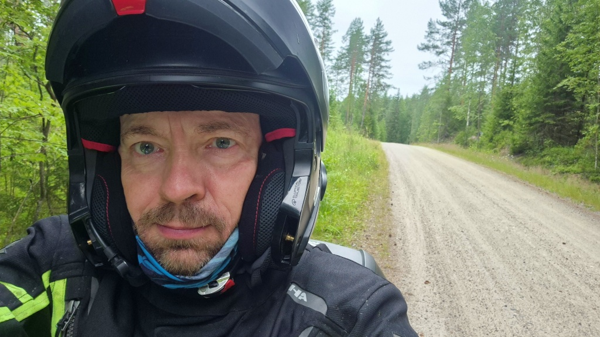

## Libelits och Rääkkylä

Först bar färden norrut längs med samma väg som dagen innan. Vi körde genom Libelits (fi: Liperi) centrum. Vi har förut åkt genom denna kommun längs huvudvägen, men nu såg vi centrum också. Det var redan en del folk igång lite före kl. 8.

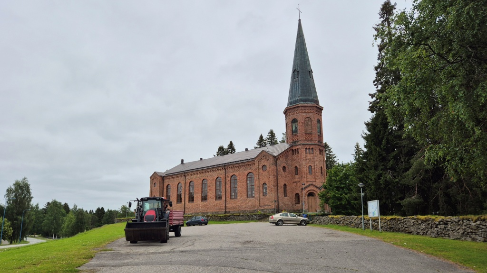

Från Libelits åkte vi vidare mot Rääkkylä (eller Bräkylä på svenska). På vägen åker man landsvägsfärja över [Arvinsalmi](https://sv.wikipedia.org/wiki/Arvinsalmif%C3%A4rjan) sund. När jag kom till färjfästet hade färjan precis lagt ut från andra sidan, så det blev att vänta några minuter. Och inte var det speciellt många fordon på [Nestori](https://ksloy.fi/sv/lauttaliikenne), en av Finlands största linfärjor. Nestori är för övrigt systerfartyg och närmast identisk med Vikare som trafikerar mellan Bredskäret i Korsnäs och Bergö i Malax, den har vi åkt på [förut](../2025-07-20-bergo/).

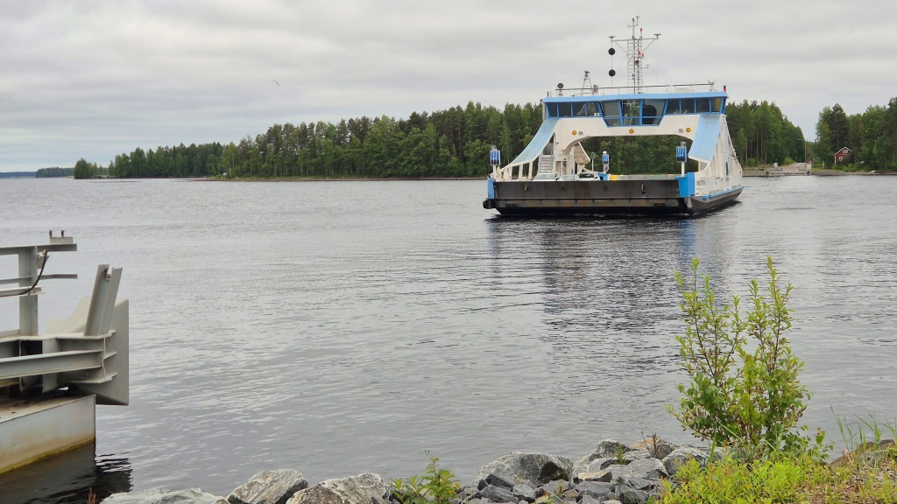

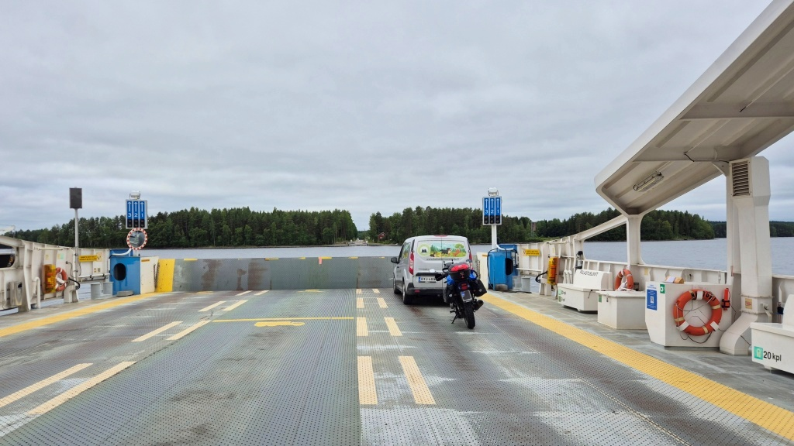

Rääkkylä kyrkby var inte speciellt stor, men kyrkan låg vackert uppe på en kulle. Nedanför kyrkan bärgade en jordbrukare gräs med en gammaldags liten ensilagehack och en vanlig enaxlad spannmålskärra. Jag trodde sådana små ekipage hörde till historien, nuförtiden ser man mest stora självgående monsterhackar åtföljda av en hel rad enorma traktorer med specialiserade gräsvagnar.

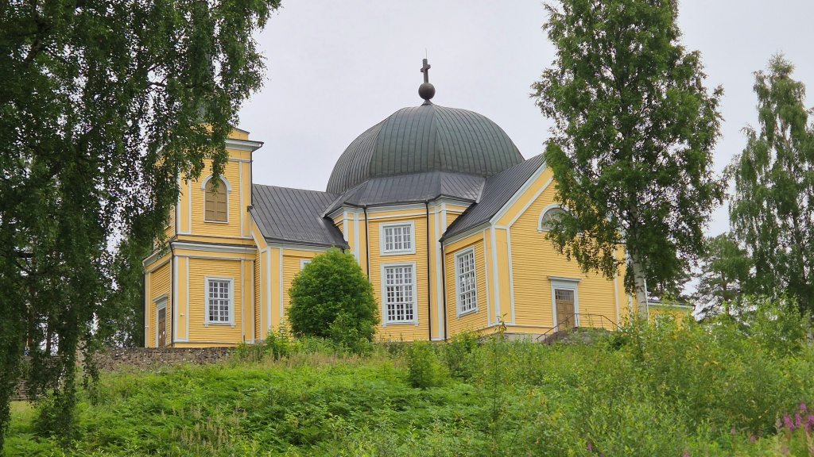

## Tohmajärvi och Kides

Vägen mot nästa mål, Tohmajärvi, gick längs smala och slingriga grusvägar. Nu började jag inse att en grusväg i ordentligt kuperad terräng i östra Finland är betydligt mer utmanande att köra än grusvägarna i plattlandet som jag är van vid. På sina ställen hade kraftigt regn runnit längs vägen och skapat ganska djupa erosionsrännor. Att köra ned i en sådan ränna skulle mycket väl kunna leda till en krasch. Så det gick ganska sakta. Som plåster på såret fick vi i varje fall köra förbi några riktigt vackra sjöar, och på några ställen gick vägen över höga kullar med fin utsikt över det omkringliggande landskapet.

I Tohmajärvi slogs jag av hur präktigt och välskött allt verkade. Jag hade nog väntat mig ett litet sömnigt ställe med söndrig asfalt och gamla stängda bybutiker. Istället möttes jag av breda och nyasfalterade vägar, cykelbanor, idrottsanläggningar och välskötta egnahemshus. Speciellt mycket att se fanns det kanske ändå inte inne i byn. Istället körde jag ut till kyrkan som ligger några kilometer utanför centrum, på stranden av sjön Tohmajärvi. Mycket vackert och fridfullt. Jag tog och kokade morgonkaffe där på parkeringen. Jag lyckades också fylla på mina tomma vattenflaskor nere vid kyrkans servicehus. Det tackar vi för.

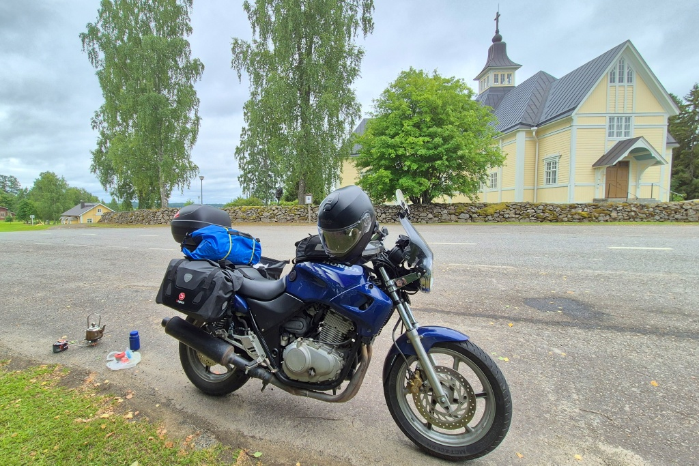

Från Tohmajärvi kyrka åkte vi vidare via [Saarios vattenkraftverk](https://fi.wikipedia.org/wiki/Saarion_voimalaitos). Där finns ett museum, men det var inte öppet och inte var det mycket att se utifrån. Sedan vidare till byn Värtsilä, tidigare en självständig kommun.

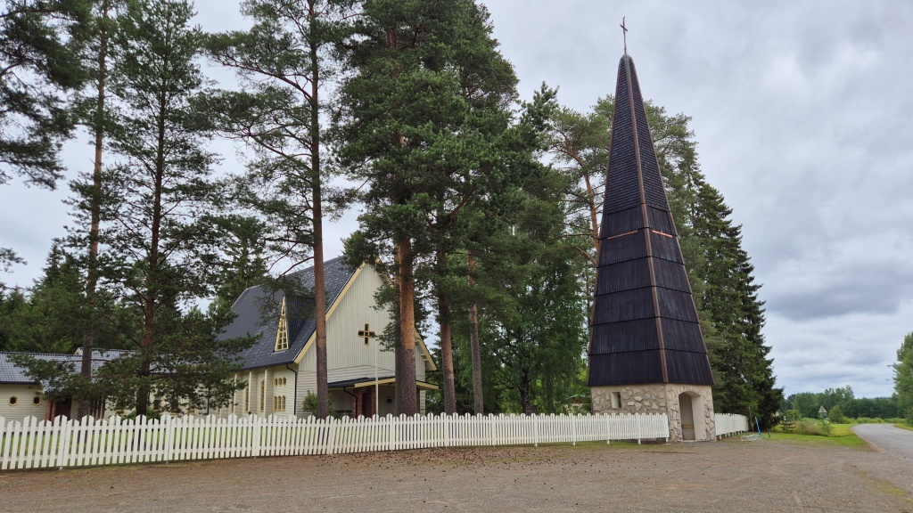

Största delen av Värtsilä, i synnerhet all industri, hamnade på andra sidan gränsen vid krigsslutet 1944. Och gränsen är väl det som präglar stället ännu i dag. Det nybyggda gränsstängslet syns tydligt från landsvägen (gränszonen börjar vid landsvägsdiket). Niirala gränsövergång är stängd och igenbommad med taggtråd. Vägskylten visar att det bara är 66 km till [Sordavala](https://sv.wikipedia.org/wiki/Sordavala), den gamla finska staden på sjön Ladogas strand, och ändå är den så oerhört fjärran.

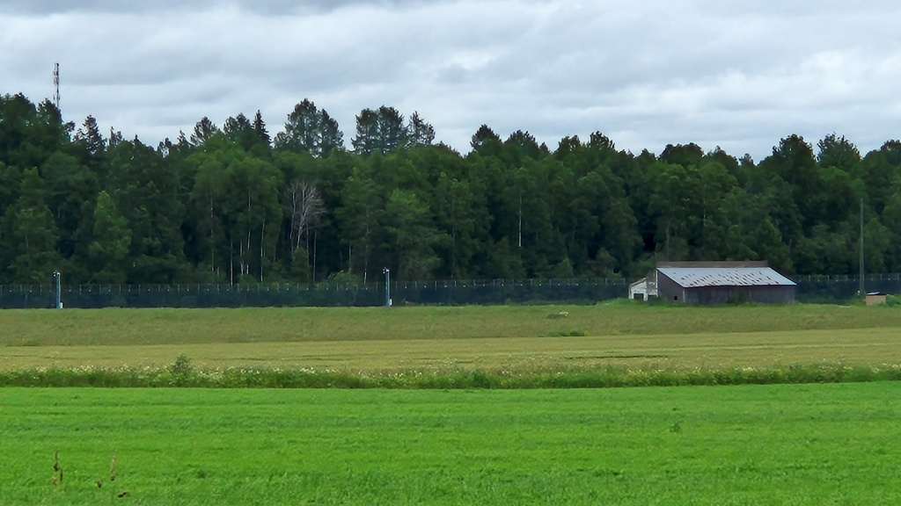

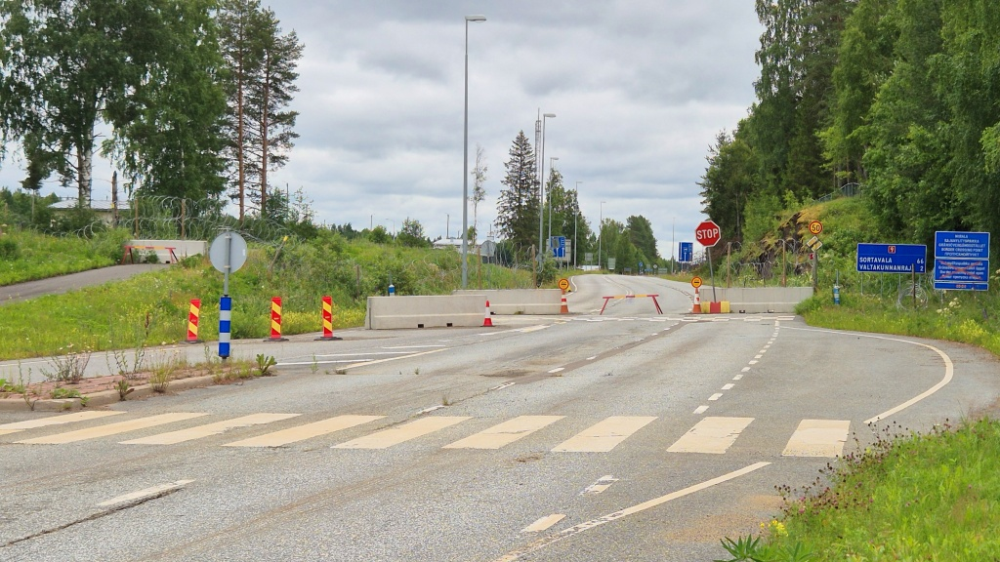

Från Värtsilä åkte vi vidare till Kides (fi: Kitee). Bandet [Nightwish](https://sv.wikipedia.org/wiki/Nightwish) grundades i Kides och här torde finnas ett Nightwish-museum. Tyvärr möjliggjorde inte öppettiderna ett besök, och inte heller såg jag den minsta skymt av reklamskyltar eller dylikt, trots att jag körde förbi där museet borde finnas. På det hela taget fanns inte så mycket att se i Kides centrum. Vi åkte vidare genom Puhos mot Kerimäki.

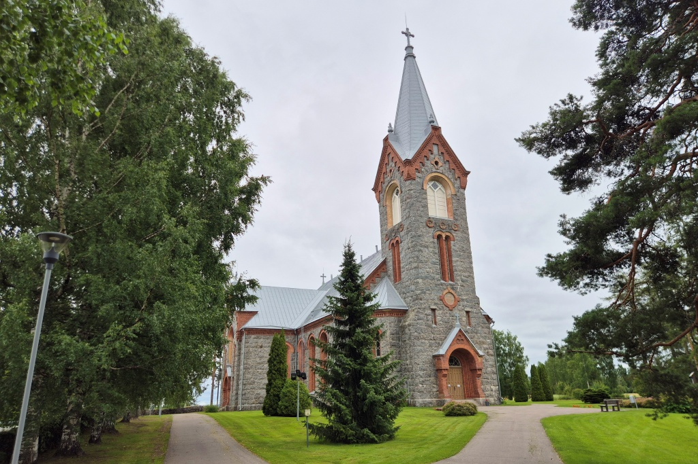

## Kerimäki och Punkaharju

Nästa anhalt var alltså Kerimäki, tidigare en självständig kommun men nuförtiden en del av Nyslott. Jag har visserligen besökt [Kerimäki kyrka](https://sv.wikipedia.org/wiki/Kerim%C3%A4ki_kyrka) förut, men det var kanske 25 år sedan, så jag såg fram emot ett nytt besök. Tyvärr var hela kyrkan med klockstapel och allt stängd för renovering. Jag hade visserligen läst att något sådant var på gång, men tänkte väl att man skulle kunna se något annat än en inplastad byggnad. Men så var alltså inte fallet. Istället tankade jag dyr bensin på ABC och hade ett kort samtal med en dam på S-Market-parkeringen, vars man körde mc. Hon hade precis varit med om en farlig omkörningssituation när en mc nästan blivit påkörd av en bil.

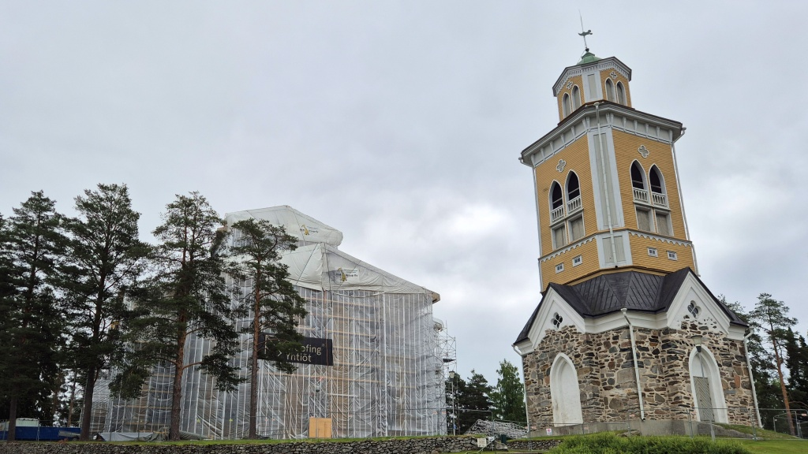

Efter att ha bunkrat upp med lite färskvaror fortsatte jag den korta biten till Punkaharjuåsen, där jag slog mig ned för att njuta av utsikten och någon slags lunch, bestående av termoskaffe som jag kokat i Tohmajärvi och [Lihalörtsy](https://fi.wikipedia.org/wiki/L%C3%B6rtsy) (fi), en slags köttpirog från Nyslottstrakten.

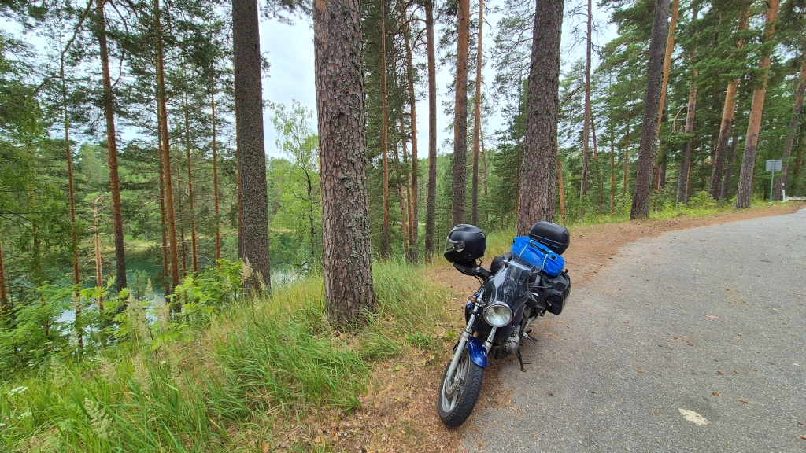

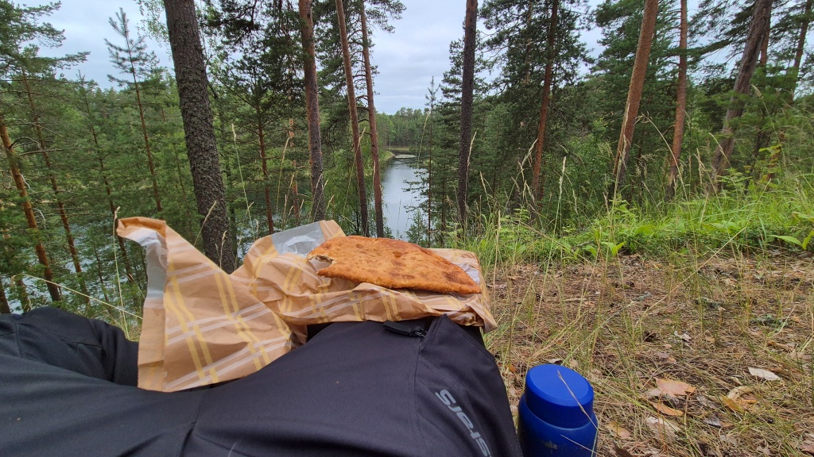

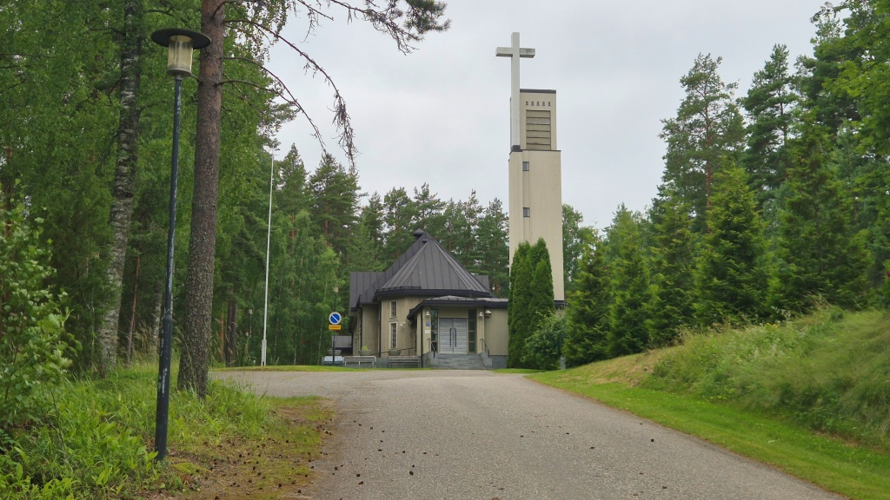

## Parikkala, Rautjärvi och Ruokolax

Från Punkaharju åkte vi vidare genom Parikkala centrum. Det går en järnväg genom byn som separerar bebyggelsen i två delar och det verkar inte finnas många ställen man kan ta sig från den ena sidan till den andra, åtminstone inte med bil. I övrigt lade jag inte märke till något speciellt. När man kör långa sträckor genom många orter börjar alla likna varandra efter ett tag. Mestadels låga hus, några butiker, en brandstation, kanske ett torg. Parikkalas kyrka ligger en kort bit utanför centrum i vad som kallas kyrkbyn.

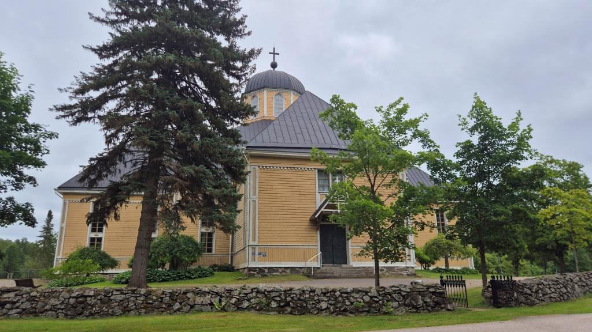

Väl ut på stora vägen (väg 6) söderut finns ett av få ställen där den ryska gränsen syns från en huvudväg. Vid Joukinsalmi är det bara några hundra meter till gränsen. Därifrån vidare till nästa by. Simpele var förut en egen kommun men slogs år 1973 ihop med grannkommunen Rautjärvi. Trots namnet är Simpele den sammanslagna kommunens centrum, medan byarna i gamla Rautjärvi kommun är betydligt mindre i storlek. Både gamla Simpele och gamla Rautjärvi förlorade stora arealer till ryssen år 1940.

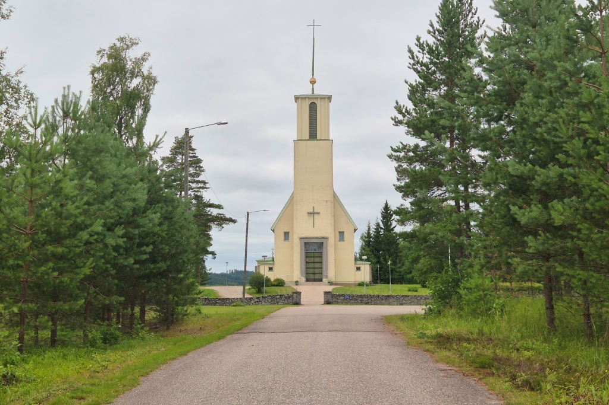

Efter Simpele bar det av ut på stora vägen igen och sedan svängde vi av på väg 3991 mot byn Miettilä (gamla Rautjärvis kommuncentrum fram till 1973). Denna väg var faktiskt en av dagens höjdpunkter. Kurvig, glest trafikerad och med tillräckligt bra asfalt bjöd den på 14 km riktigt rolig körning fram till Kollaa och Simo Häyhä-museet.

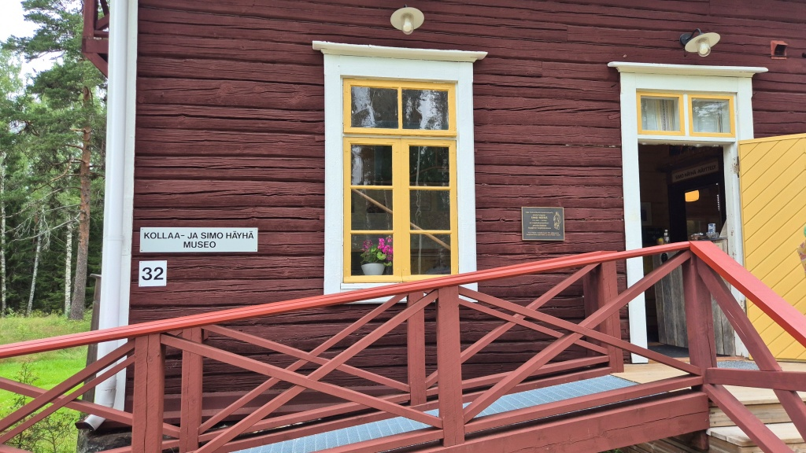

Kollaa och Simo Häyhä-museet berättade dels om [Kollaa-fronten 1939-1940](https://fi.wikipedia.org/wiki/Kollaan_taistelu) (fi) ([som höll](https://fi.wikipedia.org/wiki/Kollaa_kest%C3%A4%C3%A4) (fi)) under vinterkriget och dels om [Simo Häyhä](https://sv.wikipedia.org/wiki/Simo_H%C3%A4yh%C3%A4), känd som en av världens effektivaste prickskyttar. Visst var det intressant, men antalet föremål var egentligen ganska litet. Det man fick mest ut av var nog texterna, som säkert till stor del är tillgängliga på internet också.

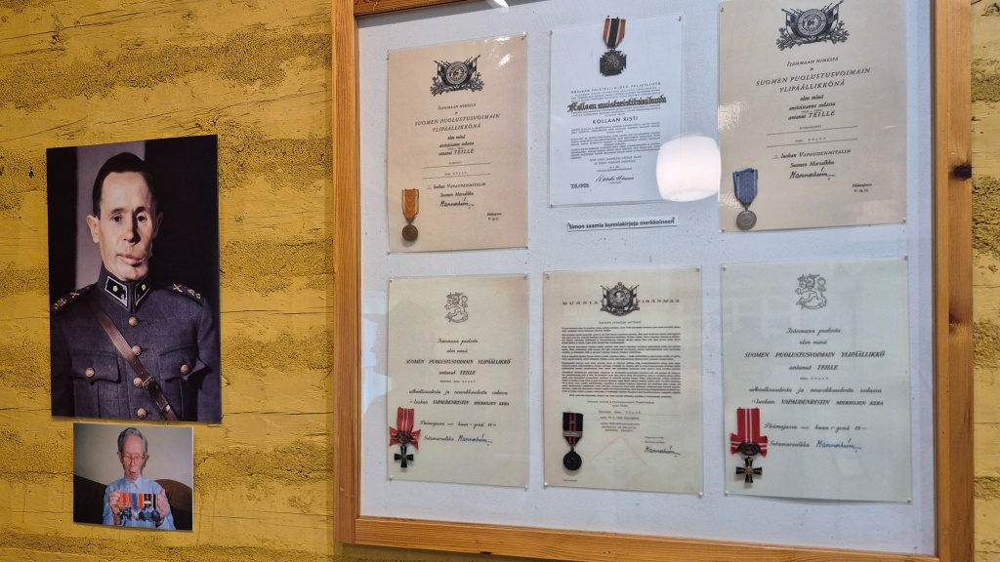

Från muséet körde jag vidare till Rautjärvis kyrka. Den gamla kyrkan brann ned på juldagen 2022, i vad som misstänks vara en anlagd brand. Stenfoten av den gamla kyrkan finns kvar. Den nya kyrkan byggdes strax intill, vackert belägen på stranden av sjön Rautjärvi.

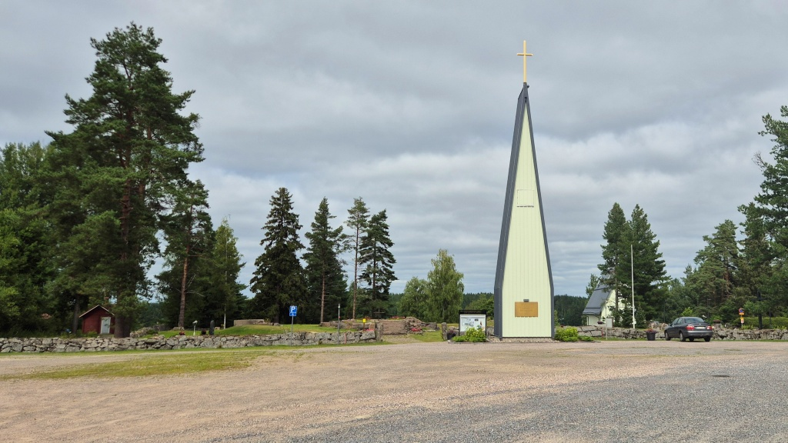

Jag passade även på att utnyttja faciliteterna i det moderna servicehuset. Sedan bar det vidare mot Ruokolax. Det skall väl medges att jag tog en extra sväng via Ruokolax bara för att besöka alla ställen, kommuncentrum ligger annars lite vid sidan av vägen mot Imatra och Villmanstrand. Och hade jag inte gjort den extra svängen hade jag missat den fantastiskt fina klockstapeln vid Ruokolax kyrka.

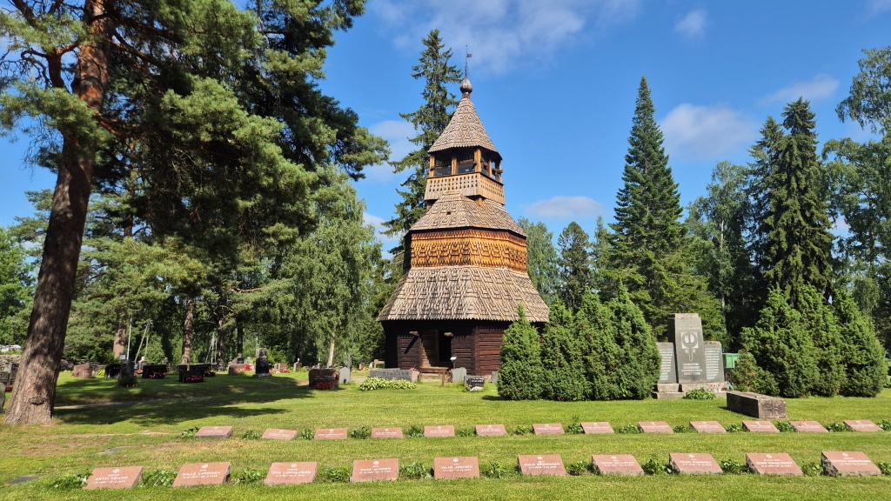

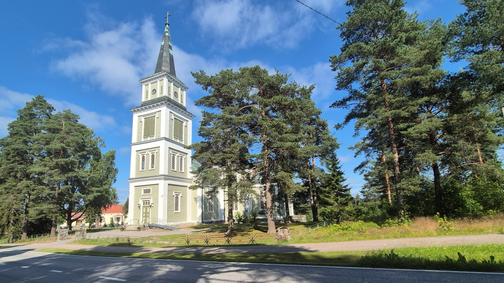

## Imatra

Riksväg 6 går rakt genom Imatra, men jag följde istället mindre vägar in mot staden, vilket förde mig till [De tre korsens kyrka](https://sv.wikipedia.org/wiki/De_tre_korsens_kyrka). Denna är en del av samlingsobjektet [Aalto Works](https://sv.wikipedia.org/wiki/Aalto_Works) på [Unescos världsarvslista](https://sv.wikipedia.org/wiki/V%C3%A4rldsarv). Tyvärr är kyrkan i dåligt skick och för tillfället ur bruk.

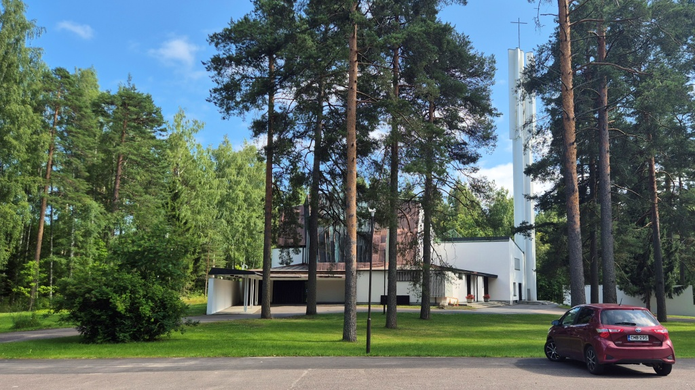

Jag kände nu lite tidspress, så jag åkte mer eller mindre rakt igenom Imatra. Jag åkte nog över Vuoksen vid Imatraforsen, men stannade inte för att flanera. Jag tog bara snabbt en bild av det legendariska [Imatra Statshotell](https://sv.wikipedia.org/wiki/Imatra_Statshotell) och åkte sedan vidare i riktning Villmanstrand.

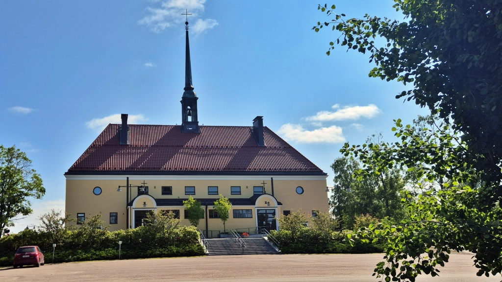

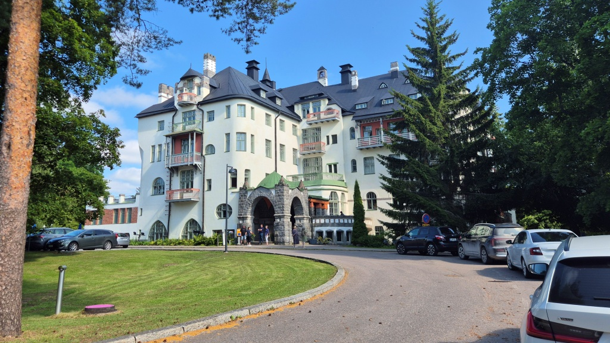

## Villmanstrand

För att inte vara tvungen att köra längs den tråkiga motorvägen alltför länge svängde jag upp till Joutseno och beundrade kyrkan och vattentornet. Joutseno var tidigare en egen kommun och senare stad, men är numera en del av Villmanstrand.

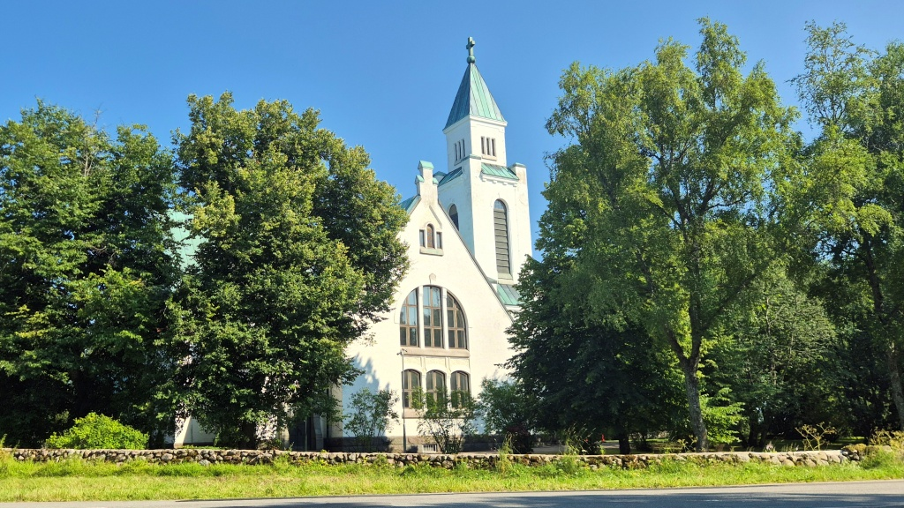

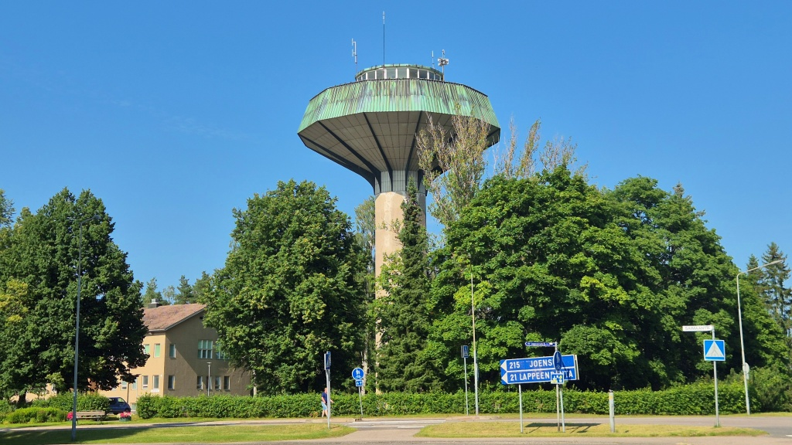

Efter Joutseno åkte vi ändå ut på motorvägen igen och raka spåret in till Villmanstrands centrum och [Villmanstrands fästning](https://fi.wikipedia.org/wiki/Lappeenrannan_linnoitus) (fi). Jag promenerade runt på området en stund.

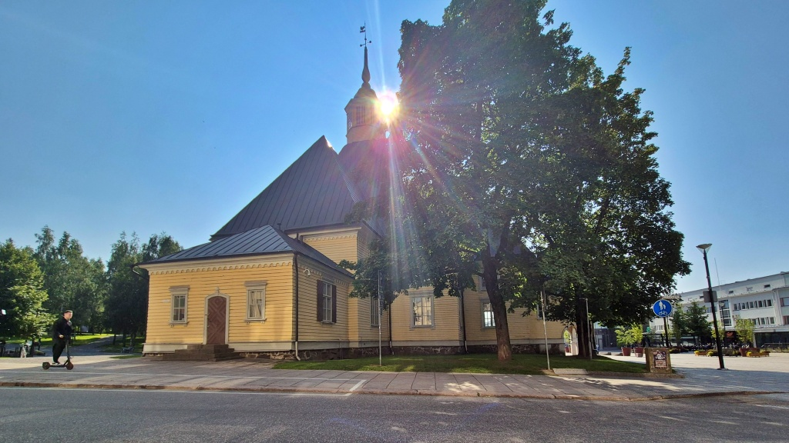

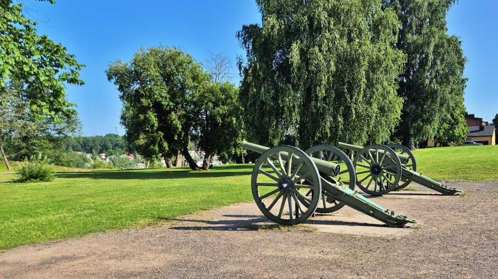

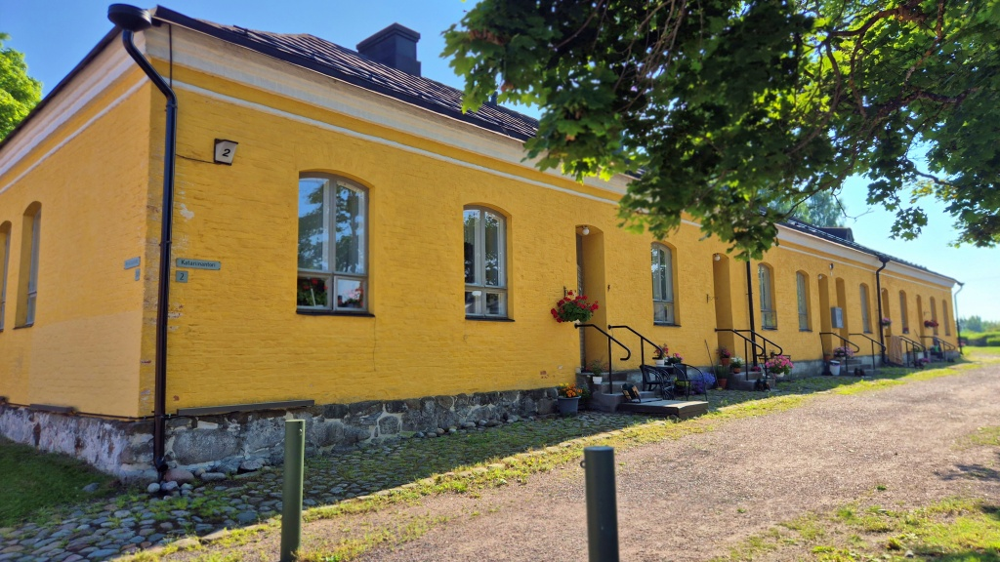

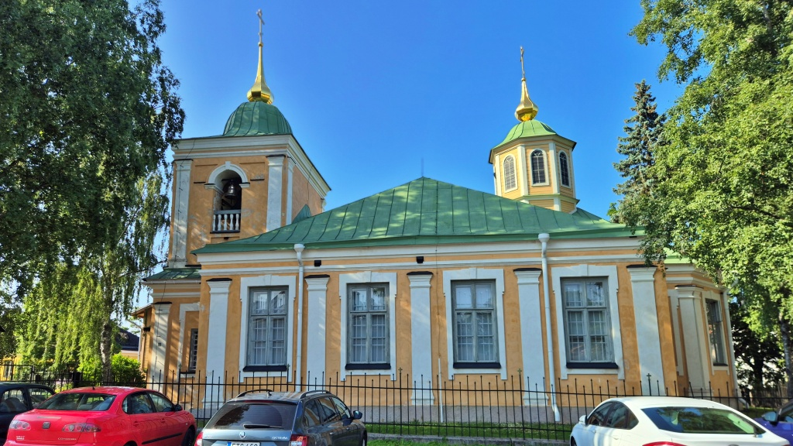

Nu kände jag mig hungrig, så jag rullade en kort bit ner mot stranden till Bistro Wanha Makasiini, strax nedanför fästningsmurarna. Detta blev dagens varma måltid och en riktigt avslappnande stund i solen. Efter maten tog jag en kort promenad till den årliga sandslottstävlingen och kikade på skapelserna där. Det framkom att de fuskar lite, de blandar trälim i sanden. Det är därför formerna håller i flera månader.

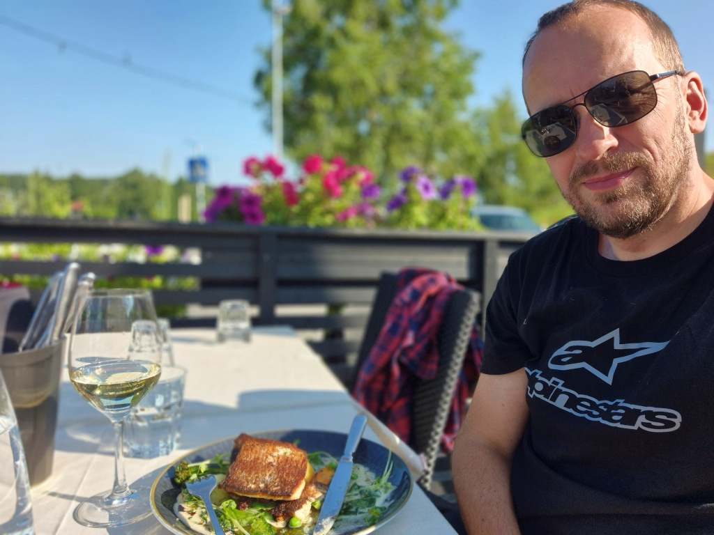

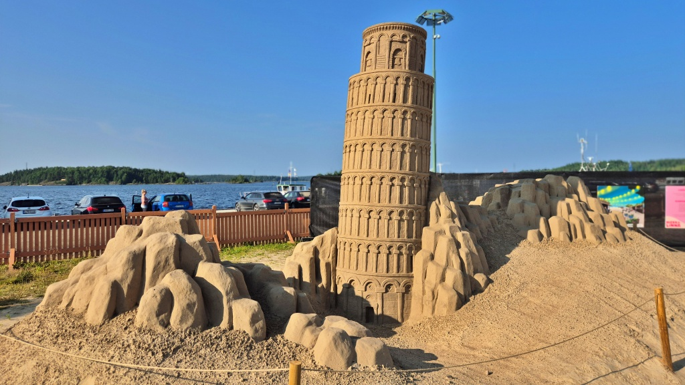

Nu var det också dags att besluta vart vi skulle sikta på att hitta övernattning. Det ena alternativet var campingen strax utanför staden. Det andra alternativet innebar nästan 200 km ytterligare körning. Jag kände mig i bra form, molnen hade gett plats åt en nästan molnfri himmel och klockan var bara 18, så jag beslöt att fortsätta. Vi åkte och tankade och sedan via [flygplatsen](https://sv.wikipedia.org/wiki/Villmanstrands_flygplats) mot nästa kommun, Lemi.

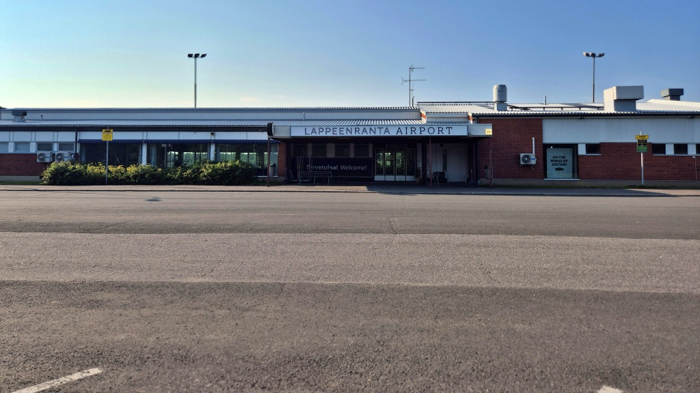

## Kring sydöstra delen av Saimen

Lemi (eller Klemis på svenska) är en liten kommun. Deras stora grej verkar vara den speciella maträtten [särä](https://fi.wikipedia.org/wiki/S%C3%A4r%C3%A4), en slags stuvning av lammkött och potatis. Det hade varit kul att testa, men det är inte en maträtt man bara går in och beställer från menyn. Man måste boka bord i god tid, vilket inte passar så bra för en mc-tur med osäker tidtabell.

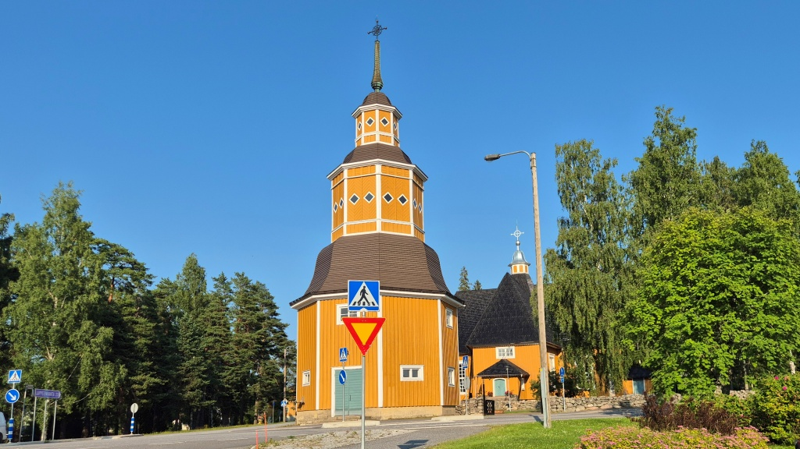

Från Lemi åkte vi vidare söderut mot kommunen Luumäki, nu åter längs fina, slingriga vägar. I Luumäki ligger [Kotkaniemi](https://fi.wikipedia.org/wiki/Kotkaniemi) (fi), president [P. E. Svinhufvuds](https://sv.wikipedia.org/wiki/Pehr_Evind_Svinhufvud) hem i många år. Det hade säkert varit värt ett besök, men var naturligtvis stängt så här dags på kvällen.

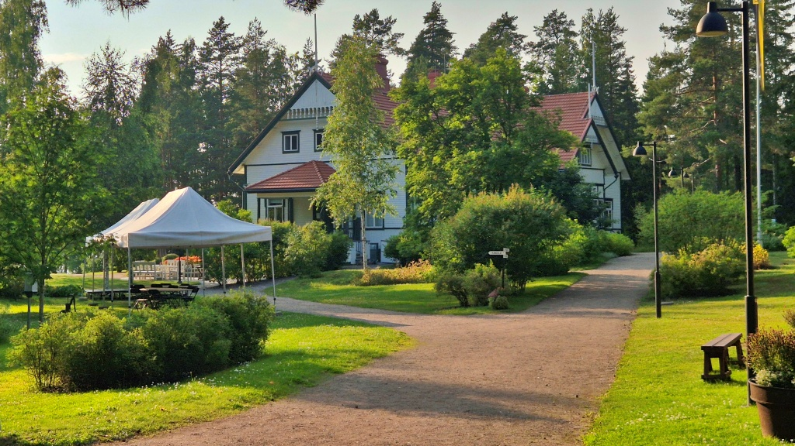

Jag körde sedan via Luumäkis kyrka till kommuncentret Davidsstad (fi: Taavetti), men jag tyckte mig inte ha tid att ta en promenad upp till [Davidsstads fästning](https://fi.wikipedia.org/wiki/Taavetin_linnoitus) (fi), så vi åkte istället vidare norrut mot Savitaipale.

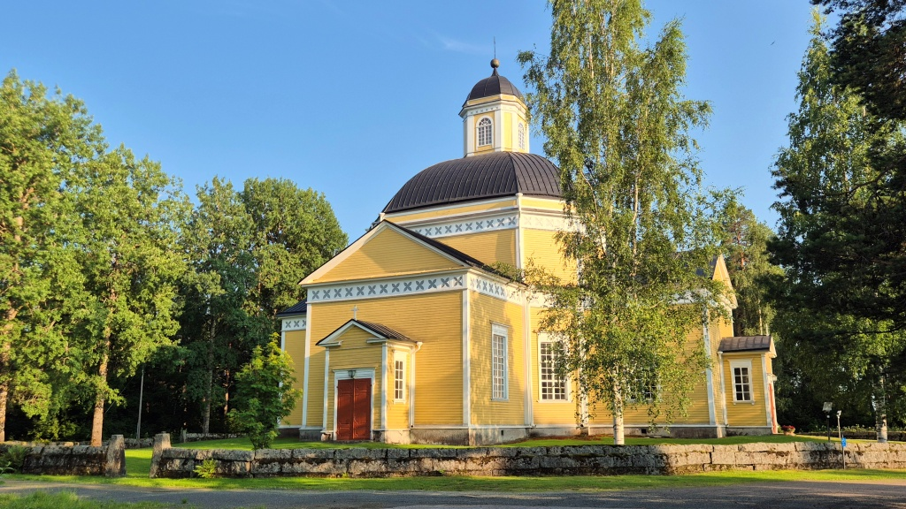

Savitaipale lämnade inga starka intryck. En liten kommun, som för all del såg helt trevlig ut. Vi åkte vidare mot Taipalsaari, och därmed lämnade vi också riksväg 13 mot S:t Michel och gav oss istället ut längs smala och krokiga småvägar. Och detta var faktiskt dagens bästa åkning, ungefär 25 km blev det från Savitaipale kyrka till Taipalsaari kyrka.

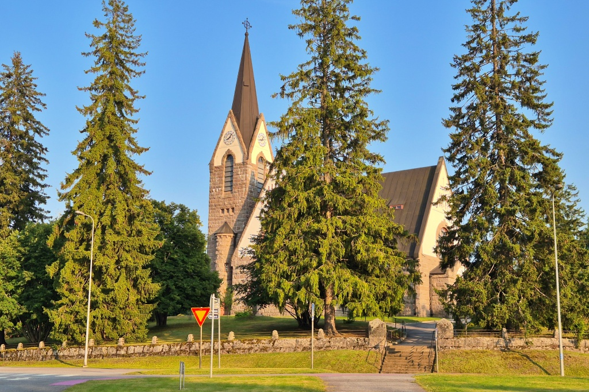

## Taipalsaari och nattläger i Päihäniemi friluftsområde

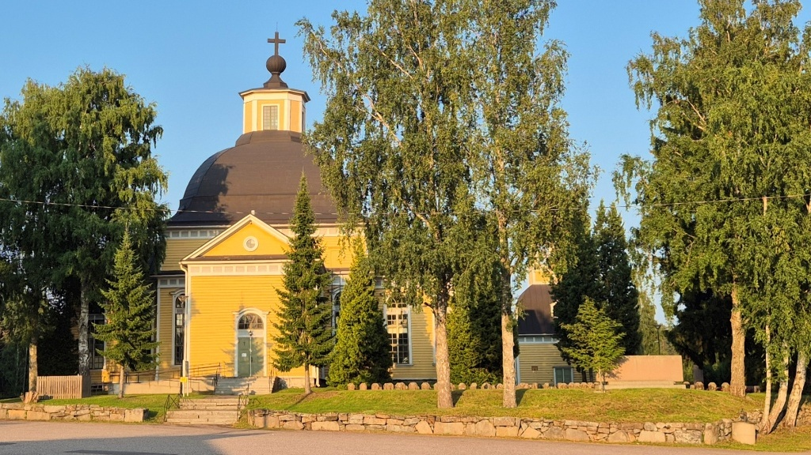

Från Taipalsaari kyrka i kommunens centrum var det ytterligare dryga 20 km till Päihäniemi friluftsområde. Vi kom fram klockan 21 och områdena som var till för camping var redan nästan fulla, trots att det inte är en officiell campingplats. Där var mest husbilar men också några tält och någon som tydligen övernattade i sin personbil. Jag slog upp mitt tält bland alla andra och tog sedan ett dopp i Saimen. Rätt varmt och skönt, trots att solen hade försvunnit bakom träden.

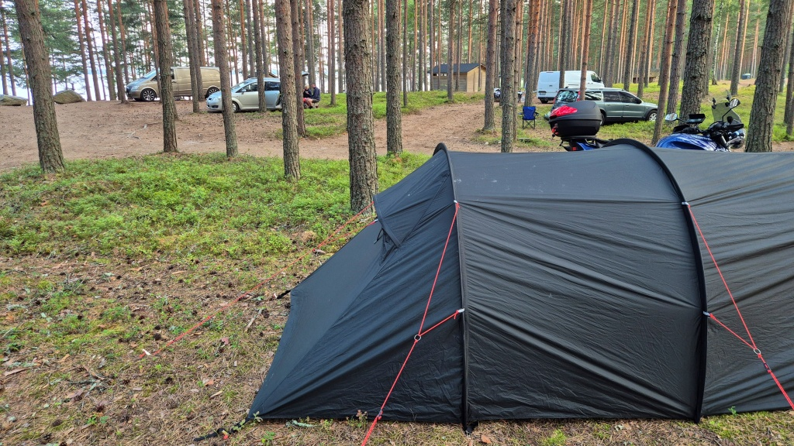

Efter doppet tog jag min tankväska på ryggen och gick ut på en kort promenad längs naturstigen. Jag passade samtidigt på att äta lite kvällsmat medan jag beundrade utsikten från åsen. Sedan kröp jag ner i sovsäcken, för en gångs skull redan före klockan 23. Tyvärr hade husbilsgrannarna sin tv ganska högt, det var VM-match på gång, så det tog ett tag att få fatt i sömnen. Nå, vänta bara, i morgon startar jag hojen kl. 07.00...

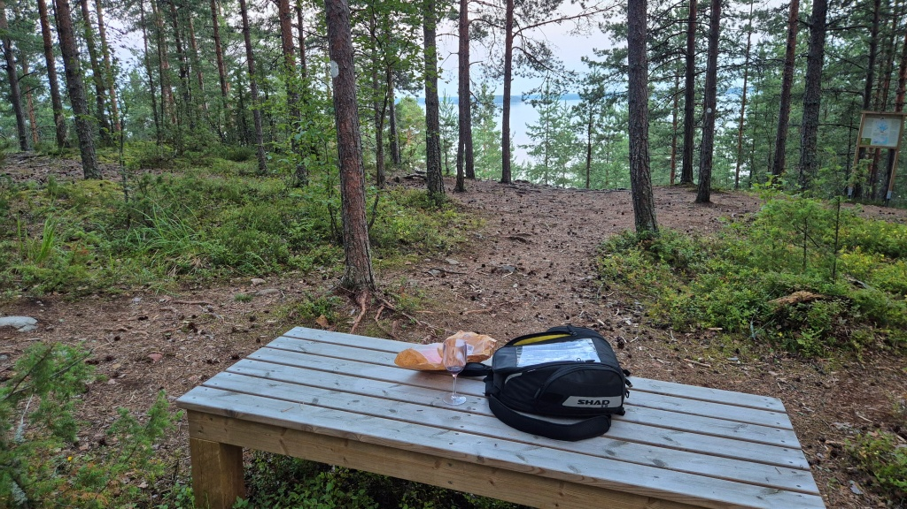

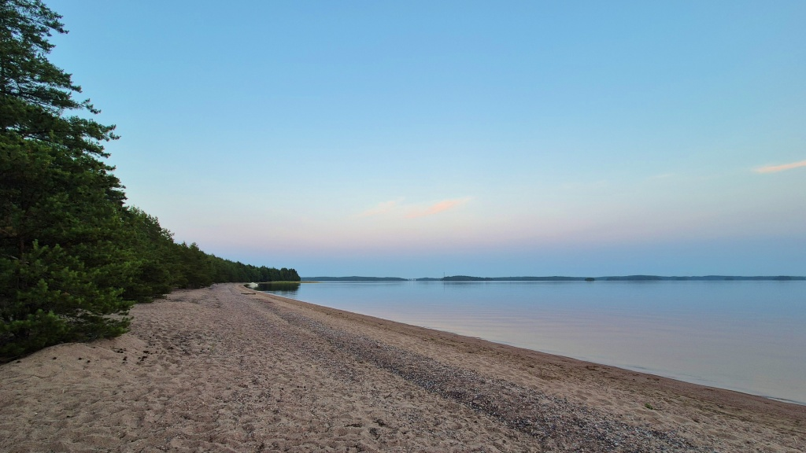

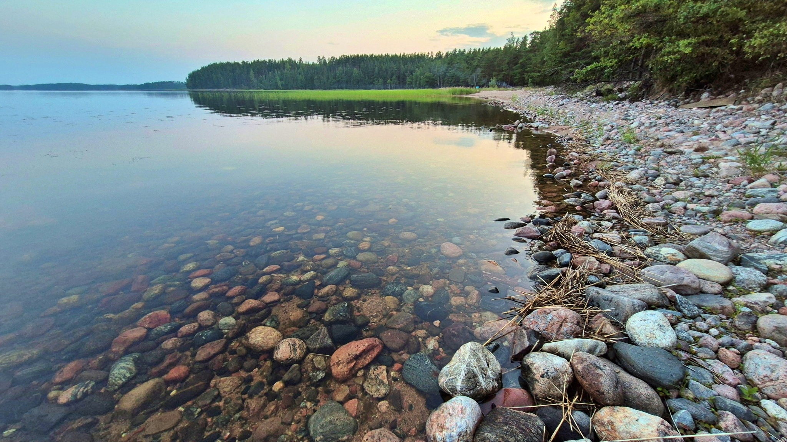

## Dagens rutt

I dag blev det en ganska passlig längd på rutten, 628 km. Visst blev det åter en lång dag, men ännu håller både kropp och knopp, och även motorcykeln. Jag skulle gärna ha haft lite mera tid i Imatra och lite grämer det mig att Kerimäki kyrka var stängd, men i övrigt känns det som en lyckad dag.

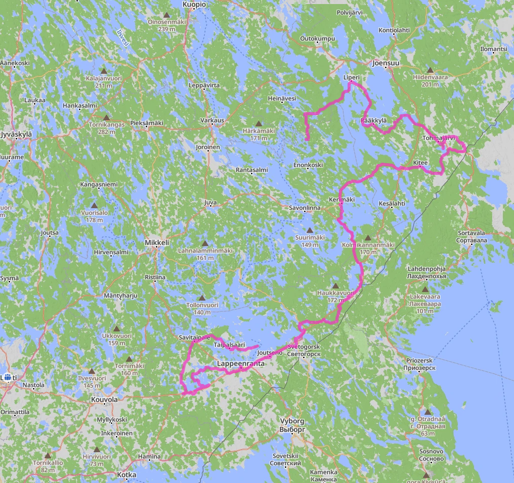

Mitt långsiktiga mål är att köra min mc Lilla Blue genom Finlands alla 308 kommuner. Denna dag lade jag 12 nya kommuner till listan över de besökta:

* Rääkkylä (sv. också Bräkylä) (Norra Karelen)
* Tohmajärvi (Norra Karelen)
* Kides (Norra Karelen)
* Parikkala (Södra Karelen)
* Rautjärvi (Södra Karelen)
* Ruokolax (Södra Karelen)
* Imatra (Södra Karelen)
* Villmanstrand (Södra Karelen)
* Lemi (sv. också Klemis) (Södra Karelen)
* Luumäki (Södra Karelen)
* Savitaipale (Södra Karelen)
* Taipalsaari (Södra Karelen)

Jag körde också genom centrum av Libelits (fi: Liperi; jag har tidigare kört längs stora vägen från Joensuu)

I och med detta har vi nu besökt alla 13 kommuner i landskapet Norra Karelen. En del besökte vi på vår tur i österled ifjol ([dag 1](../2025-07-07-osterled1/) och [dag 2](../2025-07-08-osterled2/)), en del [igår](../2026-07-13-sydost1/) och de sista idag. För Södra Karelens del är det några kvar ännu.
