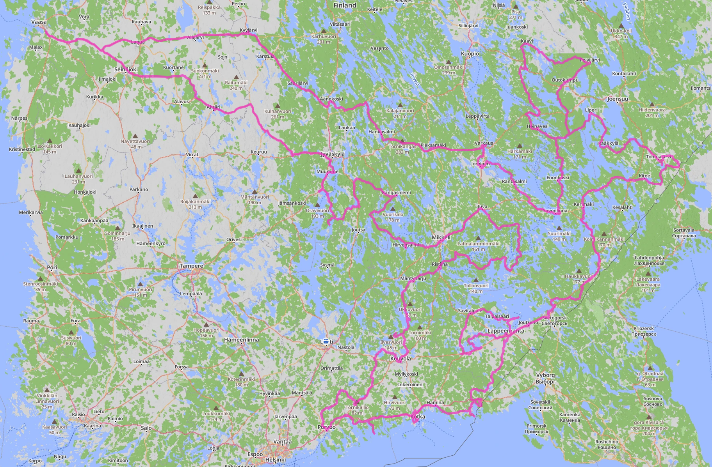
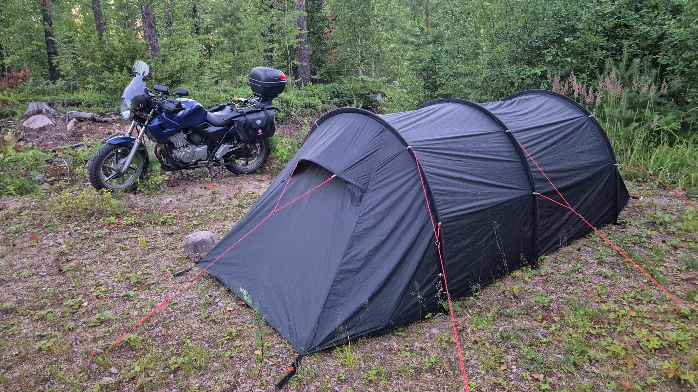
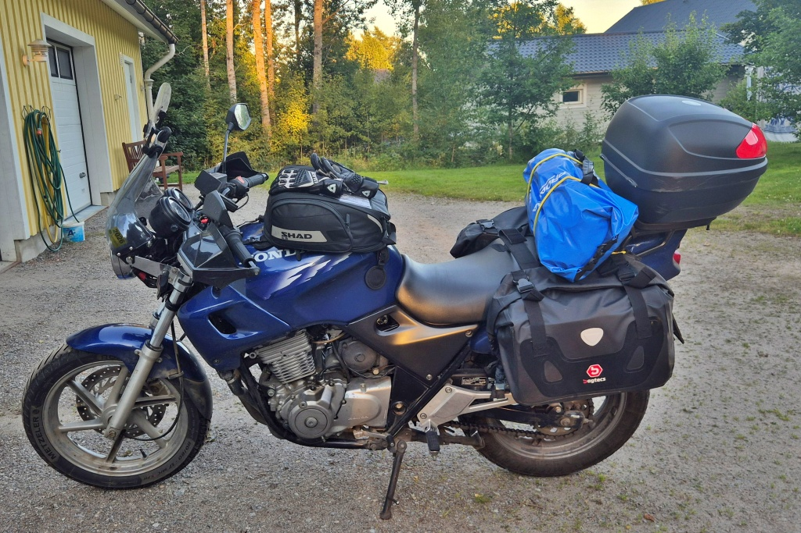
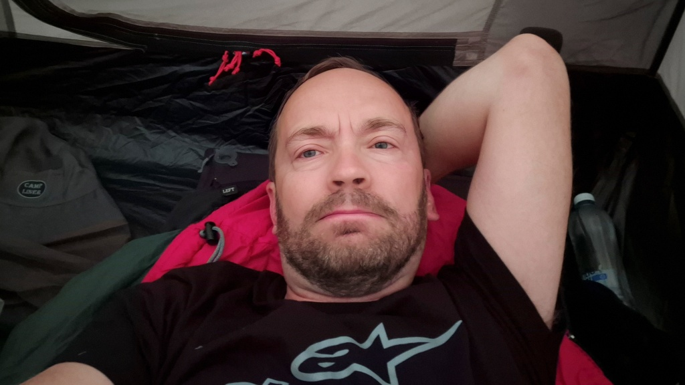

# Sammanfattning av resan

Idag har jag ingen ny tur att erbjuda och inte heller något meckande. Jag tänkte bara sammanfatta en del om den gångna resan till sydöst.

<!--more-->

## Rutt, distans och tidsplan

Jag hade gjort upp en detaljerad rutt och en ungefärlig tidsplan för resan. Den rutten följde vi till nästan 100% - totalt körde vi en sträcka av 2903 km, enligt Lilla Blues mätare.

* dag 1: 879 km
* dag 2: 628 km
* dag 3: 559 km
* dag 4: 837 km

Jag är ganska nöjd över rutten. Den var optimerad för att dels gå genom alla kommuners centrum och dels för att prioritera mindre (och förhoppningsvis roligare) belagda vägar framom huvudvägarna. Några tiotal kilometer motorväg blev det, Kotka - Borgå och kring S:t Michel. Men mycket av resan gick längs tre och fyrsiffriga vägar, alltså småvägar. Ett par ruttval ångrar jag. Det ena är vägen mellan Kristina och Puumala. Jag valde en grusväg från Kristina upp till Anttola istället för den belagda skärgårdsvägen till Hurissalo (då hade jag missat Anttola). Grusvägen gick enbart genom skog och var svårkörd med mycket löst rullgrus och många kurvor. Den andra vägen hade säkert varit mycket roligare och vackrare och Anttola var egentligen inte så spektakulärt.

Det andra mindre lyckade vägvalet var från Puumala upp till Sulkava. Istället för kortaste vägen (rakt norrut från Puumala), valde att korsa Puumala bro och ta av norrut efter det. Där valde jag vägen via Kietävälä färja. Denna väg var rätt tråkig och ospektakulär och dessutom var beläggningen i dåligt skick. Trots att den var aningen längre och långsammare hade det varit roligare att ta Rongonsalmi färja och istället följa Immola-Sulkava-vägen (väg 438). Längs den vägen finns mera vatten, en kanal och framförallt [Vekaransalmi bro](https://fi.wikipedia.org/wiki/Vekaransalmen_silta) (fi). Dessutom var säkert den vägen i bättre skick också.

Vägarnas skick var överlag kanske lite överraskande - många av de medelsmå och små vägarna var i dåligt eller riktigt dåligt skick. Till exempel stoltserade precis varenda väg längs med första dagens extra rutt (Heinävesi - Tuusniemi - Kaavi- Polvijärvi - Outokumpu) med en skylt som varnade för beläggningsskador. Jag hade trott att vägarna i Österbotten var speciellt dåliga, men det finns nog usla vägar på andra håll också.

På måndagen blev det start kl. 6 på morgonen och jag var tillbaka i Kolovesi från min extratur kl. 23:15 - det blen alltså nästan 17,5 timmar. Visserligen rymdes det ju med en del pauser från sadeln. Också de andra dagarna blev det kring 15 timmar från start till mål. Det lämnar kring 7 timmar till underhåll och vila. Detta är ju en takt som funkar några dagar men som definitivt inte är hållbar i längden. Det krävs mera vila - sömn helt enkelt - och också mera tid för service och att ta det lugnt. Vidare så funkar det ju bara om man är ensam. Är man flera blir det alltid en del extra tid att vänta på andra osv.

Denna resas mål var ju främst att åka motorcykel och sedan att besöka sydöstra Finlands kommuner. Själva sightseeingen kom på tredje plats. Men trots det, hade jag nog planerat ett allt för tajt tidsschema. Jag hade i och för sig planerat in möjligheter att korta av alla dagar (utom den sista), men väl i sadeln kunde jag inte låta bli att köra varje kilometer. Det blev lite av en tidspress, vilket ledde till att jag kortade av besöken i städerna och tiden ur sadeln och att jag skippade de flesta av de inplanerade restaurangbesöken. Vid övernattningarna blev det mest att sova, jag hade knappt någon tid att se mig runt.

Att känna tidspress gjorde att jag inte hade tid att njuta av att "bara vara". Jag uppskattar att flanera runt i en vacker stad, gå på en kort vandring i en nationalpark eller njuta av god mat, men nu blev det mindre sådant. Till en ny gång kanske jag får planera mindre körning och mera tid för besöken.

### Nya kommuner

Totalt besökte vi 46 nya kommuner på fyra dagar. Jag och Lilla Blue har nu tillsammans besökt 207 av Finlands 308 kommuner.

### Bränsle

Jag tankade 11 gånger (inklusive före resan), totalt 124,59 l för 261,73 €. Förmånligast på ABC automat Mannerheimvägen i Borgå för 1,884 €/l, dyrast 2,199 €/l på ABC Viipurinportti i Villmanstrand. Snittförbrukningen låg kring 4,15 l/100 km, vilket väl får sägas är mycket bra. Jag är dock lite osäker på om detta faktiskt stämmer. Dels mätte jag upp den lägsta förbrukningen per tank jag någonsin haft (3,69 l/100km - vilket knappast kan stämma) och dels har trippmätaren och den vanliga km-mätaren plötsligt börjat visa olika sträckor, vilket tyder på att det är något strul med mätaren.

## Val av lägerplats

* Första natten: Kolovesi nationalpark (tältplatsen var 250 m från parkeringen). 
* andra natten: Päihäniemi friluftsområde
* tredje natten: grusplanen framför en mobilmast nära Repovesi nationalpark

Jag gillar tanken på att besöka nationalparker med motorcykeln, men tyvärr har det visat sig vara lite krångligt. Mycket sällan är det möjligt att köra hela vägen fram till tältplatsen med mc:n, oftast krävs vandring. Det betyder att dels skall sadelväskor och annat monteras av hojen och dels skall allt bäras några hundra meter eller kanske någon kilometer. Om inte annat tar detta rätt mycket tid. Det är så mycket bekvämare att ha hojen med bagaget bredvid tältet. Sedan vet man ju heller inte om mc:n får vara ifred där borta för på parkeringsplatsen, även än nationalparker knappast är tjuvarnas ställe nummer ett.

Andra natten slog jag upp tältet på Päihänimi friluftsområda bland andra tält, husbilar och vanliga bilar som användes för övernattning. Stället var vackert, där fanns torrdass, eldplats och badstrand. Hojen parkerade jag bredvid tältet. I övrigt funkade det bra, men grannen i husbilen kollade på fotboll halva natten och det hördes rätt bra ut till mitt tält. Nåja, jag steg sedan upp kl. 6 och startade hojen och åkte iväg kl. 7 - kan tänka att mina grannar inte helt uppskattade detta uppvaknande heller. Ursprungligen hade jag tänkt ta in på campingen i Villmanstrand, men planerade om i sista stund. Upplevelsen var väl ungefär densamma - en del störande ljud nattetid. 

Den tredje natten hade jag planerat att spendera i Repovesi nationalpark, men tänkte om på grund av ovan nämna problem med avståndet mellan parkering och tältplats (i Repovesi skulle det ha varit nästan en km att vandra). Jag ville också komma iväg tidigt nästa dag, så att gå flera gånger med packning mellan tältplats och mc lockade inte. Som reservplats hade jag utsett Elfvings torn, bara en kort bit från nationalparken. Tyvärr var denna parkeringsplats redan upptagen av en husbil. Sedan kollade jag in en plats vid sidan av en skogsväg, men konstaterade att det dels var ojämnt och dels svårt att använda gasbrännaren på ett säkert sätt. Jag tittade ut en ny plats, enligt kartan borde där finnas ett vindskydd. Väl där visade det sig att det som på kartan såg ut som ett vindskydd bara var början på stigen som ledde till vindskyddet. Själva vindskyddet låg 1 km in skogen.

Nu började det bli sent och jag var så pass hungrig att jag började bli lite desperat. Bredvid platsen där vindskyddet borde ha funnits fanns en mobilmast med en liten grusplan framför. Jag beslöt att slå upp tältet där. Det var inte speciellt vackert, men underlaget var jämnt och det gick också att arrangera plats för gasbrännaren (ovanpå en liten flat sten). Jag lyckades också placera tält och mc så att de knappast syntes alls från grusvägen intill. En grusplan vid en telefonmast är inte direkt mysigt, men det gick snabbt att slå läger och laga kvällsmat. Och sedan var det ju oberoende dags att krypa ner i sovsäcken.

Jag vet inte rikgtigt hur jag skall välja lägerplatser i framtiden heller. Det är mycket svårt att hitta den där ideala platsen - ett vindskydd vid en sjö, där det inte heller finns andra campare. Också utan vindskydd är det svårt att hitta en sjöstrand - åtminstone i den södra delen av landet är så gott som varje sjöstrand med väg upptagen av en sommarstuga. Nationalparker är krångliga av ovan nämnda skäl. Friluftsområden som tillåter övernattning, typ Päihäniemi, finns det inte så många av. Så det blir väl att scouta noggrannt och sedan ändå vara beredd på att nöja sig med någon vändplan på en skogsbilväg i framtiden. 

## Utrustning

Jag använde samma upplägg som senast. I sadelväskorna packade jag kläder, sovsäck, liggunderlag, mat och matlagningsgrejer. I toppboxen placerade jag regnsställ, handskar, fleece och sedan var planen att där skall finnas lite utrymme för inhandlad mat och sånt. I tankväskan hade jag vatten, kaffetermos, laddare, batteribank, I-hjälpväska, vajerlås för hjälm och jacka, näsdukar och lite mellanmål. Sedan lade jag tältet i en vattentät väska som jag spännde fast på bönpallen, framför toppboxen. I denna väska fick också mina tofflor plats.

Överlag fungerade både upplägget och utrustningen riktigt bra. Tankväskan har extra axelremmar, så den fungerar samtidigt som utfärdryggsäck. Vid behov går det hyfsat bra att bära sadelväskorna över axlarna i några hundra meter (i Kolovesi nationalpark). Toppboxen är också bekväm att bära med sig.

När jag parkerade motorcykeln i någon stad och ville lämna hjälm och jacka, låste jag fast dem med vajerlås. Visserligen är det väl mest en symbolisk grej, men det är i varje fall inte utan krångel att nappa med sig grejerna när man går förbi.

Jag hade packat rätt mängd kläder och utrustning. Av kläderna var det bara en tskjorta och ett par strumpor som jag inte använde. Och tack och lov behövdes inte regnstället heller. 

Den nyligen inhandlade gasbrännaren kom till användning och fungerade alldeles utmärkt. Den senaste resan hade jag med mig spritkök, men ett sådant orkade jag helt enkelt inte gräva fram och mixtra med. Det tar länge att värma vatten och sedan skall spriten brännas ur för att det inte skall läcka osv. Gasköket däremot är snabbt, kompakt och lätt att packa undan igen. Jag tillredde flera måltider av den frystorkade maten jag hade med mig. Lätt att bara värma vatten. Jag kokade också kaffe och fyllde termosen på morgnarna. Däremot visade sig en del av den extra mat jag packat med (knäckebröd, mjukost på tub, nötter) vara onödig. Jag glömde liksom bort att jag hade detta käk.

Det enda riktiga klavertrampet? Jag hade en flaska myggmedel i tankväskan och denna eländiga flaska läckte, med påföljden att allt i tankväskan började stinka myggmedel. Det värsta är att precis samma sak hände senaste resa också. Om man inte lär sig av sina misstag... Hädanefter får den nog åka i en sadelväska, där den förhoppninsvis inte läcker.

## Service

Mc:n höll ihop. Visserligen var jag ett tag orolig att det var något problem med laddningen. Det tog en stund innan något hände när man tryckte på startknappen. Spänningsmätaren på USB-uttaget visade rätt låga värden (< 14V vid körning). Då slutade jag ladda telefon från USB-uttaget och använde batteribanken istället. Startproblemet blev mindre markant. Jag vet inte om detta bara var inbillning eller om regulatorn faktiskt ger för lite ström för att driva tändning, belysning Android-auto skärm och USB-laddare. Jag kom mig i varje fall hem och när jag pluggade i laddaren visade den inget speciellt.

Blinkers vänster bak krånglade återigen, tidvis. Tydligen höll min reparation inte. Sadelväskorna böjer blinkers-skaften, så detta var antagligen tillräckligt för att få lödningen att lossa.

En sak som blev ogjort var att smörja keden. Den skall helst smörjas varje 1000 km, så det borde jag nog ha gjort. Problemet är att jag har smörjmedelsburken och andra verktyg under sadeln. För att komma åt burken måste sadeln bort. Och för att komma åt att öppna sadeln måste sadelväskor och tält bort. Vilket ju är extra jobbigt.

## Sammanfattning

På det hela taget en mycket lyckad och rätt problemfri resa. Vädret var i det närmaste idealiskt, varken för kallt eller för varmt. Hojen höll. Och gubben höll, såväl att sitta i sadeln hela dagen, att hoppa över en och annan måltid som att sova i tält om nätterna.

Ont i bakänden eller behov att hållas bort från hojen har jag inte (var faktisk med hojen på en 114 km kort tur till närbutiken idag, hur kul som helst). Så gärna mera touring, snart igen!