# Världsarvet Kvarkens skärgård

Jag tog en kvällstur ut till det närmaste av Unescos världsarv, nämligen [Kvarkens skärgård](https://www.maailmanperinto.fi/sv/kvarken/). Tillsammans med Höga Kusten i Sverige bildar delar av Kvarkens skärgård ett gemensamt världsarv. Det är tills vidare det enda naturarvsobjektet i Finland. Det kanske bästa stället att beundra naturarvets egenheter och skönhet är Svedjehamn med sitt fina utsiktstorn [Saltkaret](https://korsholm.fi/kommun/turism/sevardheter/saltkaret-utsiktstorn).

<!--more-->

Det är så klart inte första gången jag besöker Svedjehamn, men hittills har jag aldrig lyckats komma i tid för ett café-besök på Salteriet. Inte heller idag lyckades det. Klockan var nästan 21 innan jag parkerade på den stora parkeringen (som kräver parkeringsavgift här ute på glesbygden!). Så det var bara att knata iväg till utsiktstornet för att beundra utsikten.

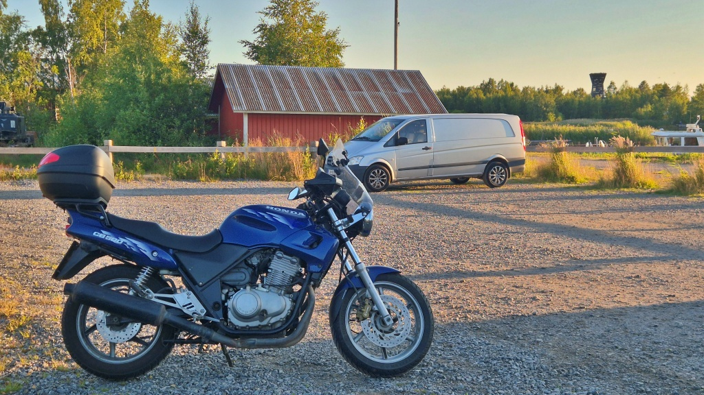

Det är en promenad på knappt tio minuter från parkeringen till utsiktstornet. Vägen är i bra skick, men av förståeliga skäl är fordonstrafiken begränsad, så att bara markägare får köra ut till båtskjulen. Det blåste lite grann, vilket höll de flesta myggorna borta. Men varmt blev det nog i de tjocka körbyxorna.

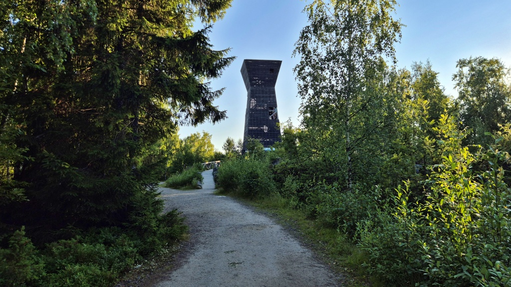

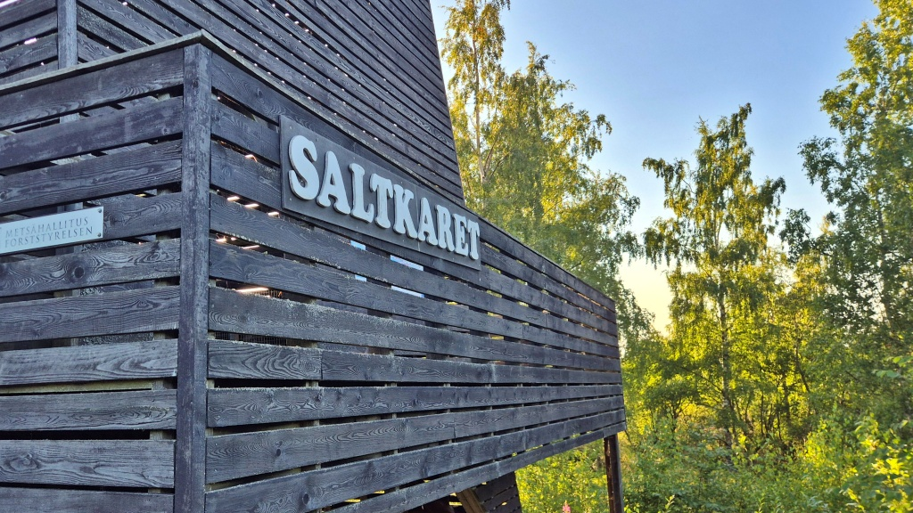

Det speciella med Kvarkens naturarv är att man här kan se landhöjningen pågå nästan i realtid. När inlandsisen låg som tyngst pressades jordskorpan ned, och än i dag fortsätter marken att resa sig när belastningen har försvunnit. I Kvarken handlar det om ungefär åtta millimeter per år, vilket gör att nya skär, holmar och strandängar långsamt stiger ur havet. Landskapet är alltså ovanligt ungt och dessutom ständigt under förändring.

Det andra riktigt särpräglade inslaget är de så kallade De Geer-moränerna. Det är långa, smala moränryggar som bildades vid iskanten under slutet av den senaste istiden. I området kring Svedjehamn ligger de som ett tvättbräde i landskapet och fortsätter ut i vattnet i nästan parallella rader. Just den här tydliga serien av moränryggar hör till det som gör Kvarken geologiskt så speciellt. De Geer-moränerna syns tydligast uppifrån utsiktstornet.

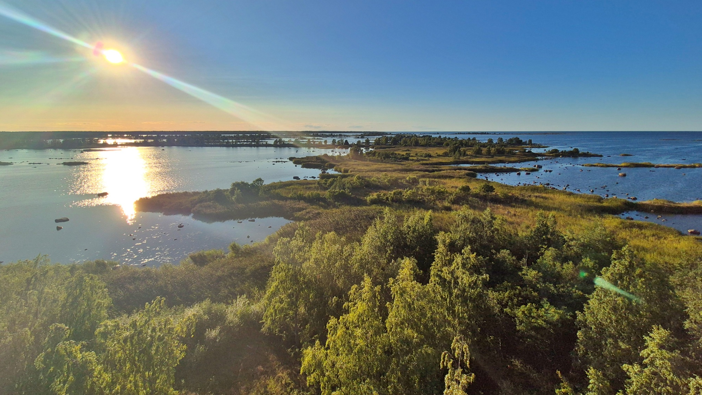

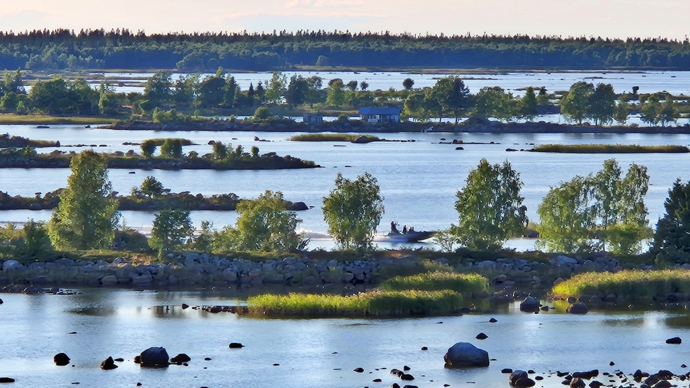

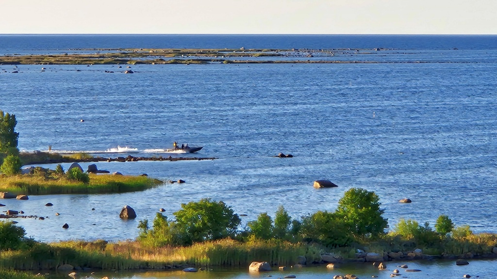

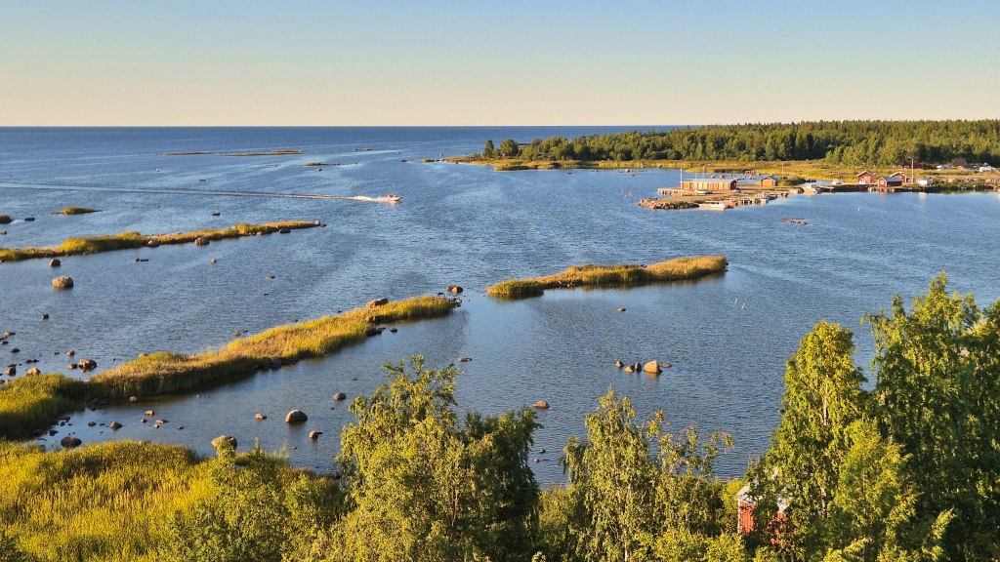

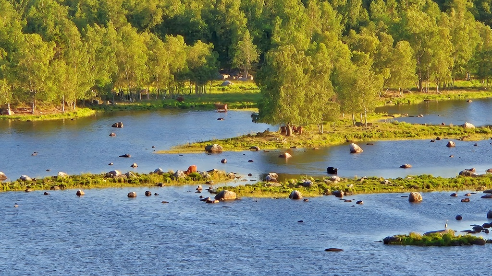

Efter att jag hade njutit av utsikten vandrade jag runt en stund bland båthusen i Svedjehamn. Människan för här en ständig kamp mot landhöjningen. Hamnar måste flyttas eller fördjupas med några tiotals års mellanrum. Ett båthus som för 100 år sedan stod vid strandkanten kan i dag stå en bra bit upp på land.

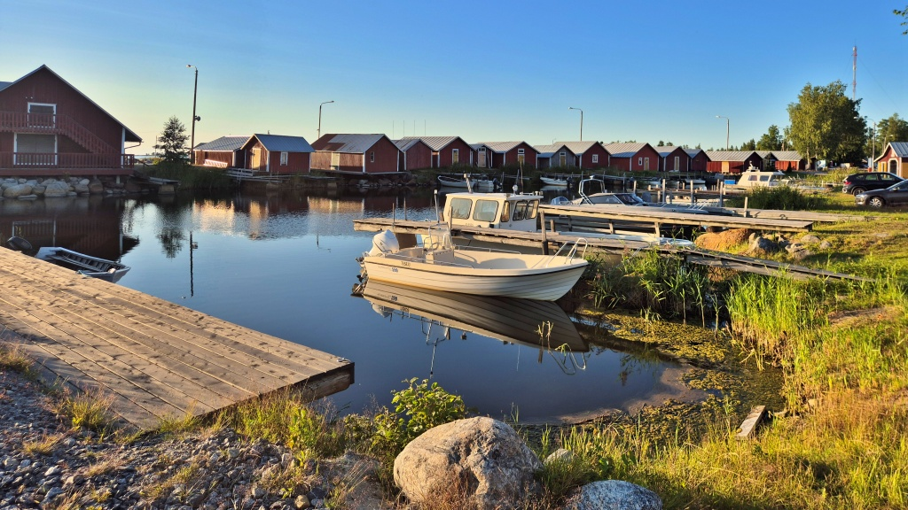

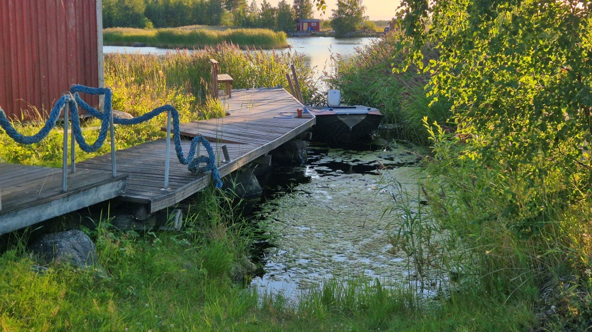

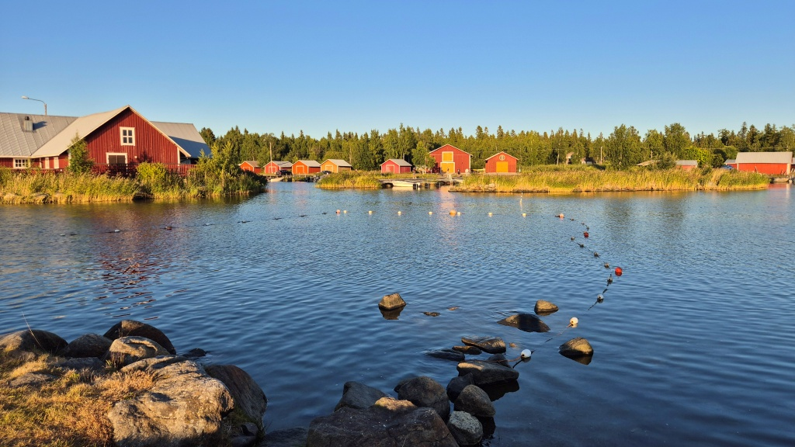

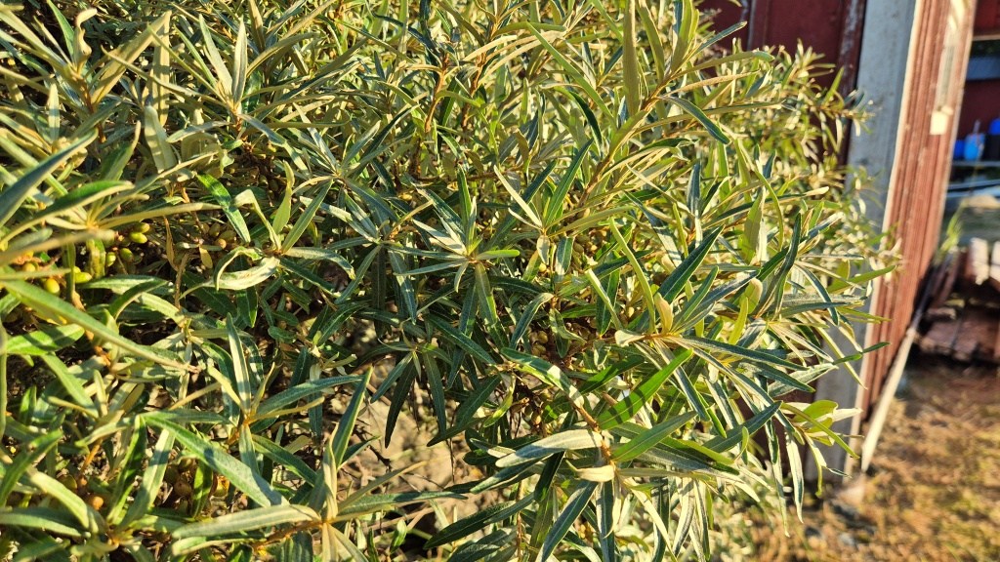

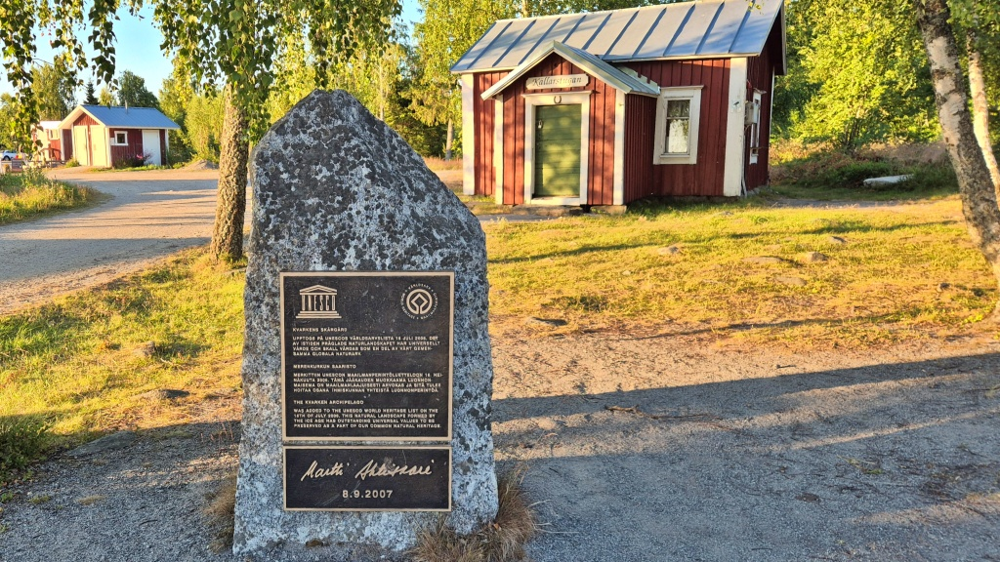

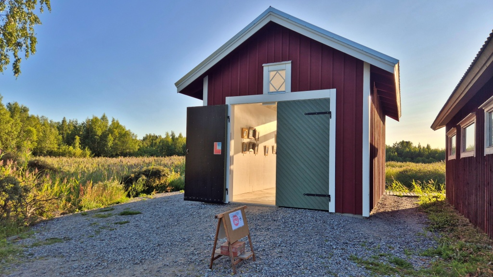

På väg hem tog jag en kort omväg via Björköby kyrka. En intressant sak i Björköby är deras vägnamn. En del vägnamn har efterleden _-ted_, som väl betyder ungefär _väg_. Denna benämning torde inte användas någon annanstans.

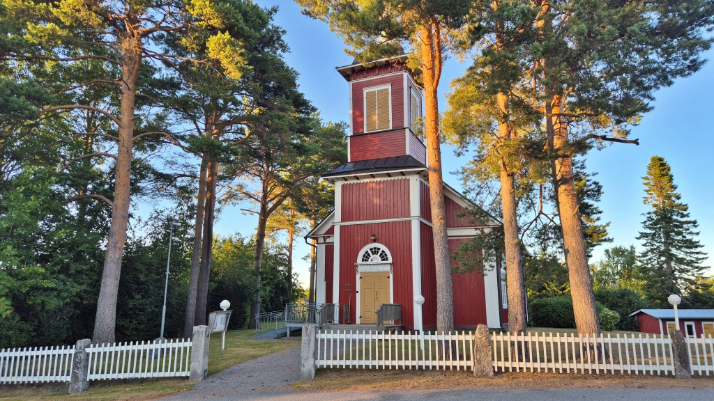

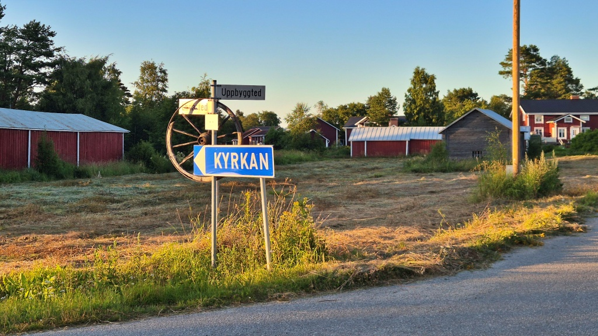

Björkö var länge ett samhälle utan landsväg till fastlandet. Alla förbindelser skedde med båt. Landsvägen till Replot togs i bruk först år 1954 när vägbanken över Skalörfjärden färdigställdes. Replot hade i sin tur fått regelbunden färjtrafik till fastlandet år 1952. Den fasta vägförbindelsen över [Replotbron](https://sv.wikipedia.org/wiki/Replotbron) togs i bruk år 1997 och ersatte då landsvägsfärjan för gott.

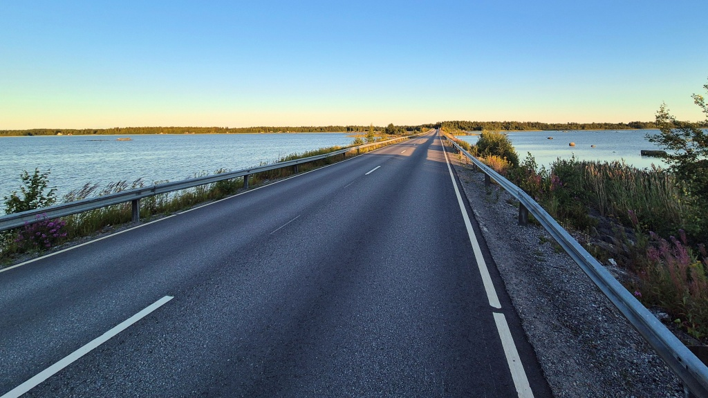

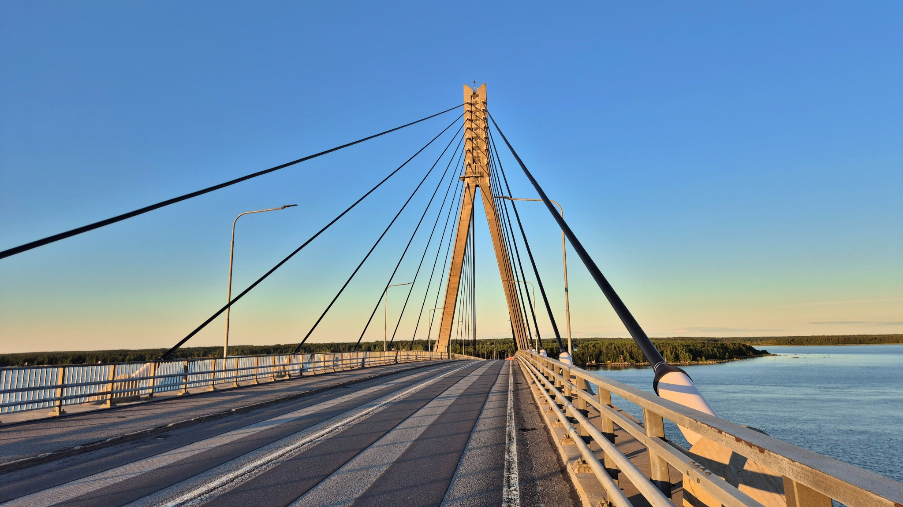

Slutligen tog jag väl inte den allra kortaste vägen hem. Vägen via Jungsund och Karperö är trevlig och sedan måste jag ta en tur via Kvevlax och Veikars också. Hemma var jag kring klockan 23 med 137 km på mätaren.
