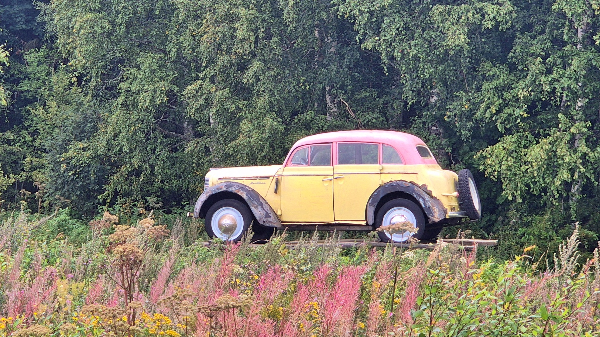
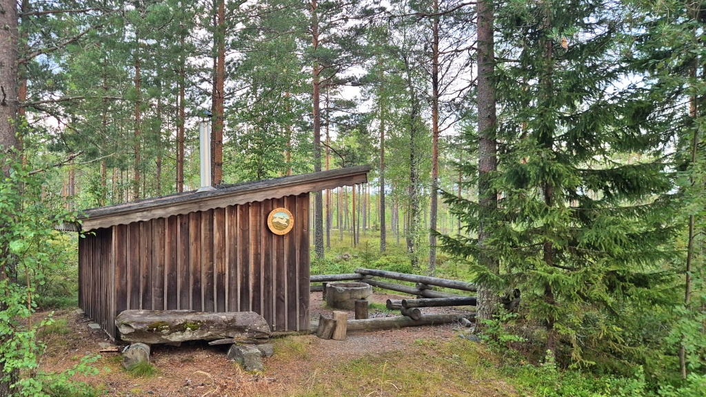
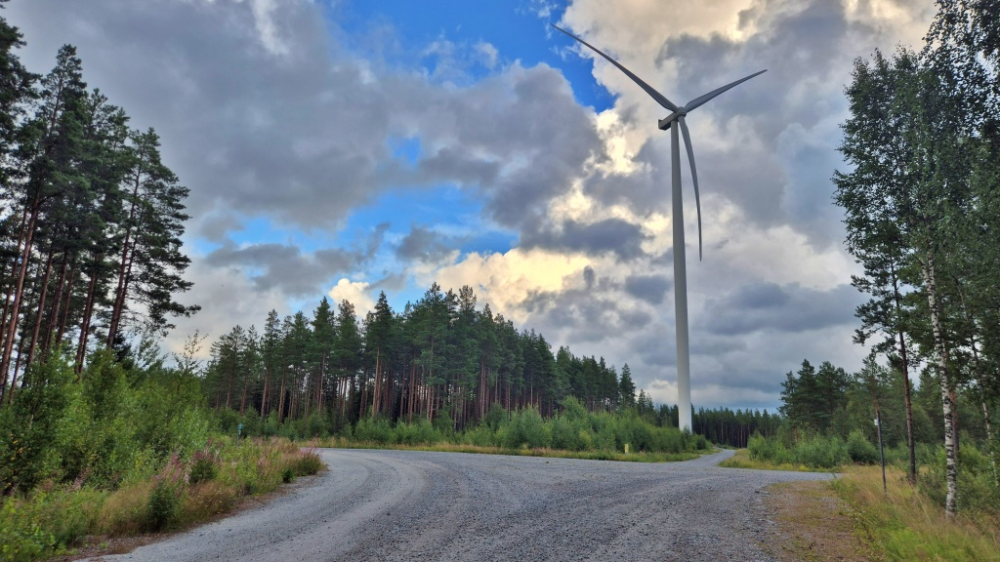
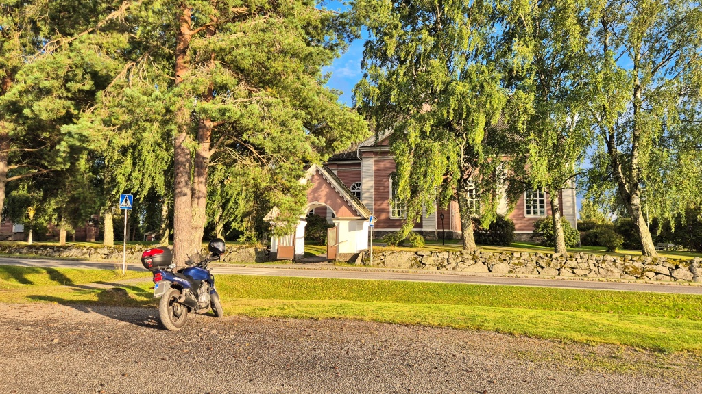
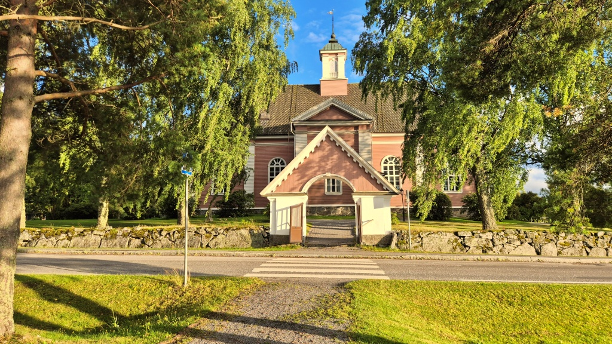
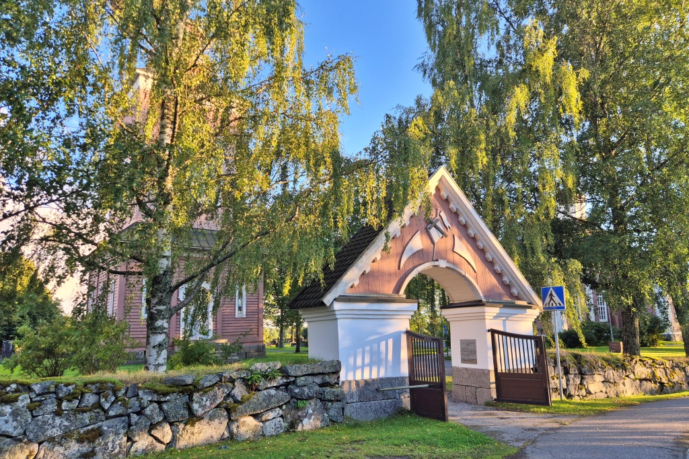
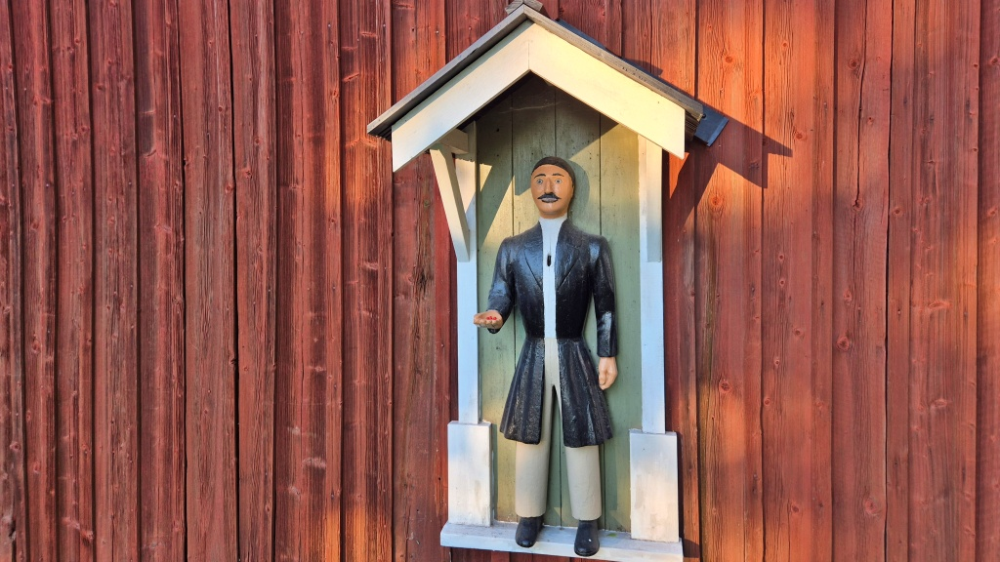

# Måndagsbommen i Ribäcken

Det är måndagskväll och dags för orienteringsträning. Som vanligt har jag sällskap av Lilla Blue. Idag blir det att köra grusvägar och på hemvägen ett besök vid Solfs kyrka.

<!--more-->

Denna gång går Måndagsbommen av stapeln i Ribäcken, Malax. Det hade regnat hårt ännu på eftermiddagen, men de långa grusvägarna i södra Malax var förvånansvärt torra och bra i skick. Inget större problem att undvika vattenpölarna. På väg till träningsstället mitt i skogen längs Ribäcksvägen stod en veteranbil på utställning.

Jag brukar vara på plats när det startar kl. 18, men denna gång anlände jag lite senare. Ändå var det inte så många bilar på plats. Dels verkar det inte finnas barnbanor och dels kanske vädret skrämt bort en del deltagare.

Det var en rätt svår bana, skogen är homogen, allt ser likadant ut och det fanns inga tydliga hållpunkter i terrängen. Jag bommade på de tre första kontrollerna, gav sedan upp att försöka läsa kartan och gick nästan bara på kompasskurs. Resten av kontrollerna hittade jag utan grövre missar, men långsamt gick det.

Efter orienteringen begav jag mig längs skogsbilvägar och småvägar tillbaks in mot Malax. Skogsbilvägarna är i bra skick, säkert dels för att de förbättrats när vindkraftverken byggdes. Kul att köra, men inte så mycket att se i skogen.

När jag kom ut till allmän väg var det mera grus som gällde. Och de allmänna vägarna var faktiskt överlag nästan i sämre skick än skogsbilvägarna, säkert beroende på mera trafik. Men oj vad det finns många vägar och småbyar här söder om Malax å. Långmossen, Bertlasmossa, Börängen och Kopparby. Och hela tiden vek diverse skogsbilvägar av söderut mot skogen.

Sedan kom jag på att jag ännu inte fotat Solfs kyrka, så jag tog ett stopp där. [Solf](https://sv.wikipedia.org/wiki/Solf) var tidigare en självständig kommun som även omfattade [Sundom](https://sv.wikipedia.org/wiki/Sundom,_Finland). År 1973 överfördes Sundom till Vasa, medan Solf tillsammans med Korsholm, Kvevlax, Replot och Björköby gick samman och bildade nuvarande [Korsholms kommun](https://sv.wikipedia.org/wiki/Korsholm).

Solfs kyrka invigdes 1786 och fick namnet Heliga Trefaldighetskyrkan. Denna kyrka ersatte en tidigare kyrkobyggnad från 1626, som stod strax intill. Platsen där den gamla kyrkan stod ligger precis på andra sidan vägen, i en staketomgärdad grandunge. I övrigt är Solf församlings lokaler samlade på ett väldigt kompakt område. Kyrkan, begravningsplatsen, prästgården och församlingshemmet ligger alla på samma område. Och strax intill ligger [Stundars friluftsmuseum](https://stundars.fi), men det får vi ta en annan dag.

