# Kvällstur och nya blinkers

Denna vecka blev det ingen tur efter måndagsorienteringen. Nu blev det istället en kort kvällstur på tisdag. Denna gång åkte vi inte längre än till Replot. På väg tillbaks stannade vi vid Fjärdskär och beundrade Replotbron. Väl hemma var det sedan dags att byta bakblinkers och göra lite service.

<!--more-->

## Prolog

Trots att det inte blev någon tur efter gårdagens orientering, finns det en kort story. Efter orienteringen åkte jag in till staden för att inhandla nya blinkers till Lilla Blue. På motorvägen står en motorcykelpolis parkerad längs den motkommande filen, tydligen beredd att fånga fortkörare. När han såg mig tyckte han tydligen att jag hade för hög fart. Han visade med handen att jag skulle lätta på gasen, han hade säkert ingen radar själv. Jag nickade och vinkade.

## Strömsö

Idag blev det istället en kvällstur på kort varsel. Dottern behövde leverans av glömda grejer till sin träning i Västervik, så jag hoppade på hojen och levererade. Väl där tyckte jag det var ett lämpligt tillfälle att ta en sväng förbi Strömsö och Västervik Marina.

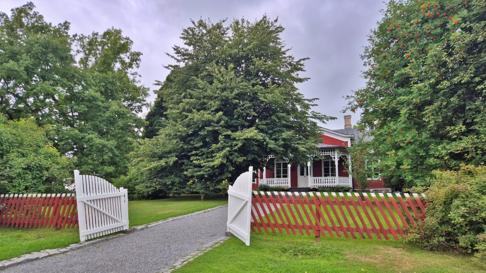

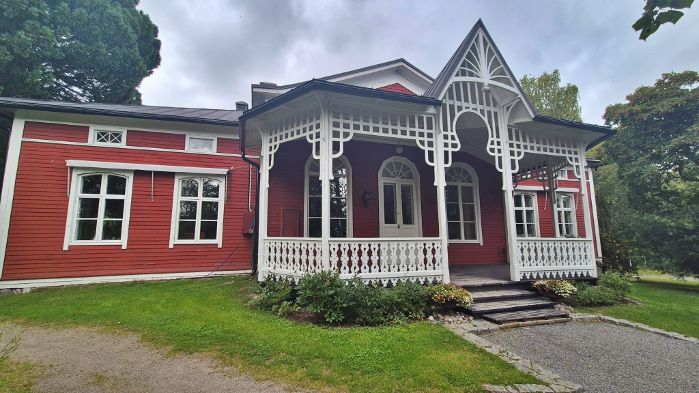

Finlands public service-bolag Yle har i många år sänt ett tv-program på svenska kallat [Strömsö](https://sv.wikipedia.org/wiki/Str%C3%B6ms%C3%B6). Det har under alla år spelats in precis vid Villa Strömsö i Västervik i Vasa. Det är en vacker gammal villa vars omgivning är öppen för besökare. Där finns också en allmän simstrand.

Uttrycket "Det gick inte som på Strömsö" refererar naturligtvis till tv-programmet. På tv verkar allt oftast lösa sig snyggt, lugnt, snabbt och genomtänkt, medan verkligheten ofta bjuder på missar, omtag och större eller mindre problem längs vägen. Uttrycket uppstod på finska ("Ei mennyt niin kuin Strömsössä") men spred sig också till svenskan.

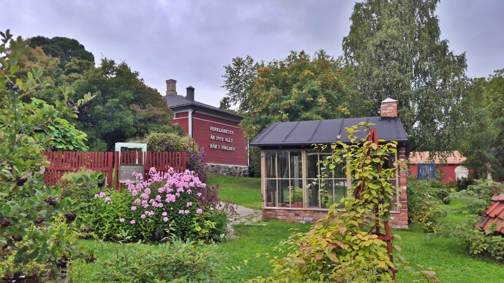

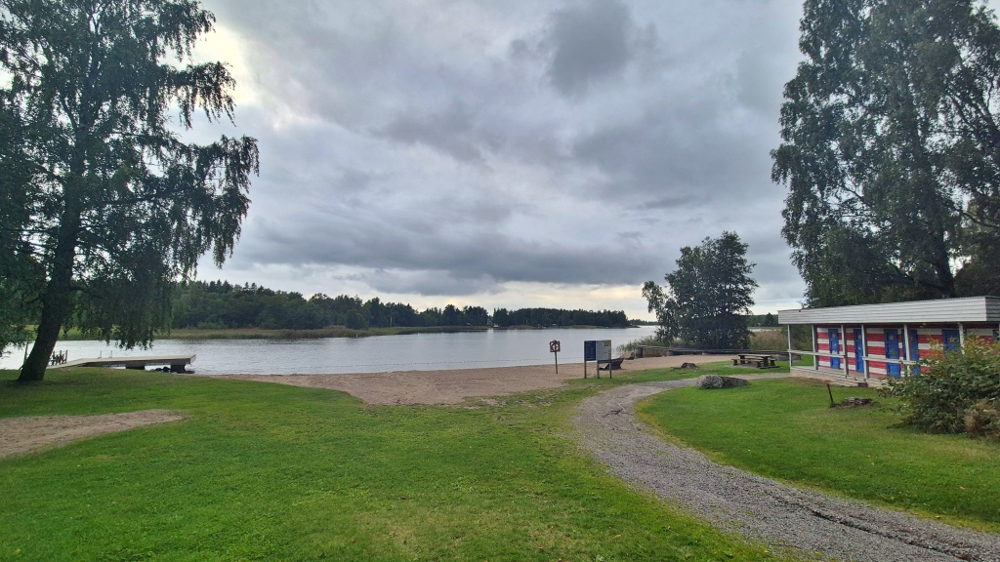

Båthamnen i Västervik, eller "Västervik Marina" ligger strax intill Strömsö.

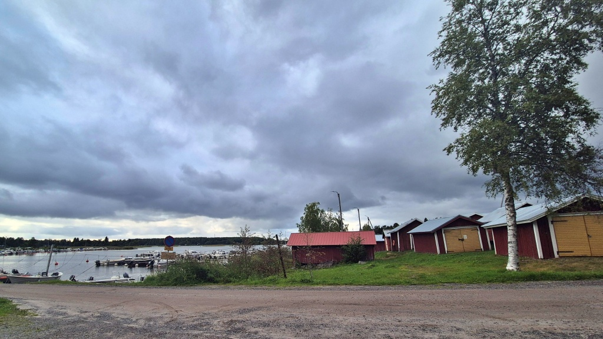

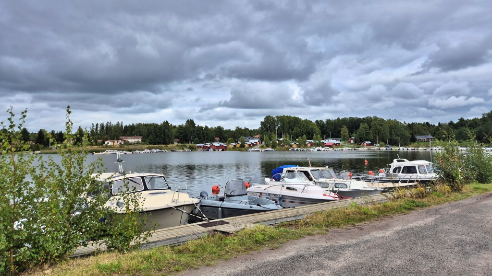

## Replot

Sedan tog vi en tur ut till Replot.

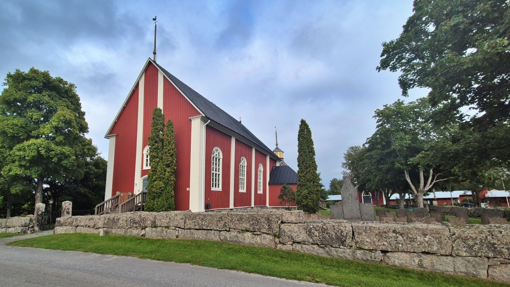

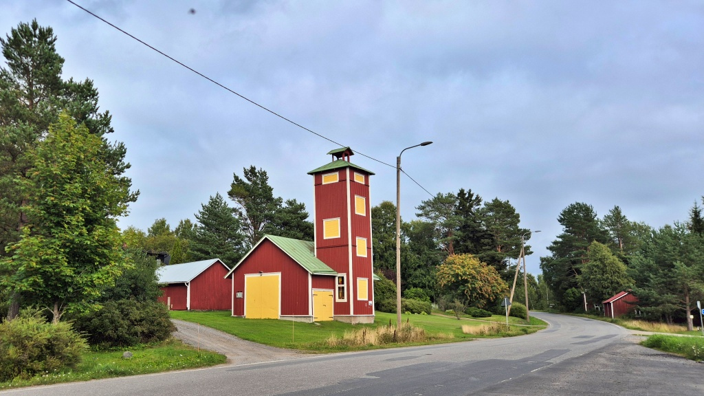

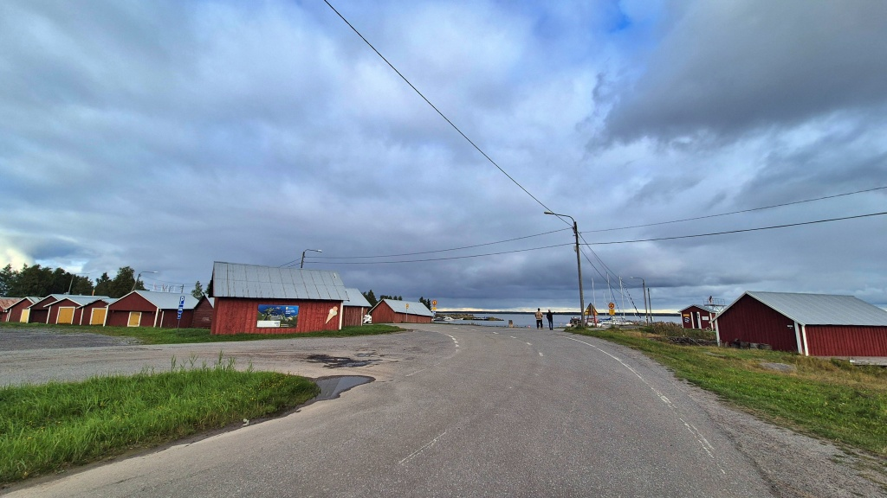

Replot och närliggande byar ligger på en ö. I äldre tider var skärgårdsbyarna rätt isolerade; man kunde bara ta sig till fastlandet med egen båt eller över isen när den höll. Den första reguljära trafiken till ön inleddes år 1907, då en båtlinje började trafikera mellan Vasa och Replot hamn. Passagerarbåten ersattes med landsvägsfärja år 1952, då man också hade byggt de vägförbindelser som krävdes, dels på landsidan fram till Alskat och dels från Replot by ut till det dåvarande färjfästet ungefär vid nuvarande Bernys. Landsvägsfärjans rutt var först 2,8 kilometer lång och känslig för isläge och väder. År 1975 färdigställdes en vägbank från Alskat ut till Fjärdskär, vilket förkortade färjeöverfarten till 750 meter. År 1997 ersattes färjan slutligen av [Replotbron](https://sv.wikipedia.org/wiki/Replotbron) från Fjärdskär till Bernys.

En minnessten vid Replot hamn påminner om färjtrafiken till Vasa mellan åren 1907-1946 (trots det senare årtalet torde nog trafiken ha pågått fram till 1952). I en annan vinkel syns Replotbron. Också landsvägsfärjorna syntes säkert bra från Replot hamn så länge de trafikerade.

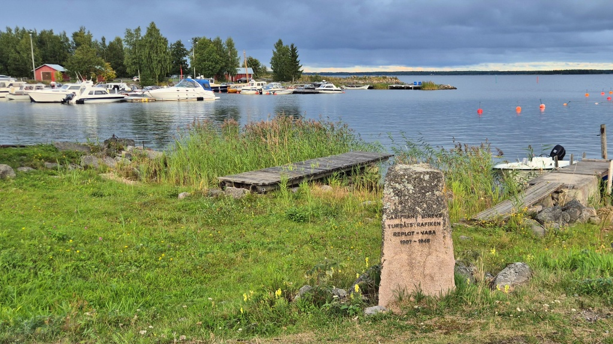

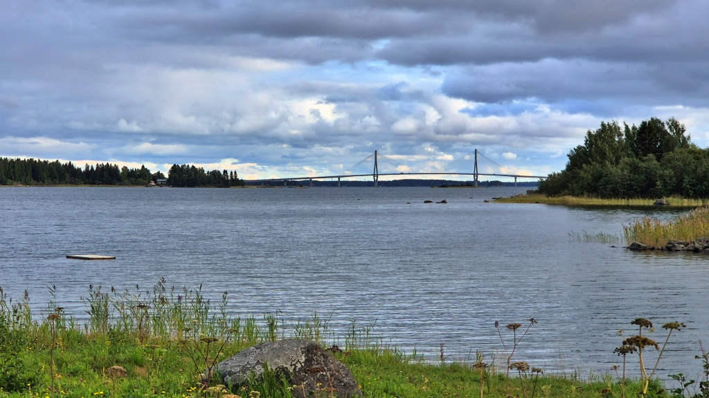

## Fjärdskär och Replotbron

På väg bort från Replot svängde vi in till rastplatsen på Fjärdskär, intill Replotbron. Det är ingen stor rastplats, men välutrustad. Ett stort kokskjul med utsiktstorn, toaletter, en kiosk (som var stängd) och en simstrand. Trots att det inte är en officiell campingplats finns det plats för ett antal husbilar och man kan antagligen också slå upp ett tält om det behövs.

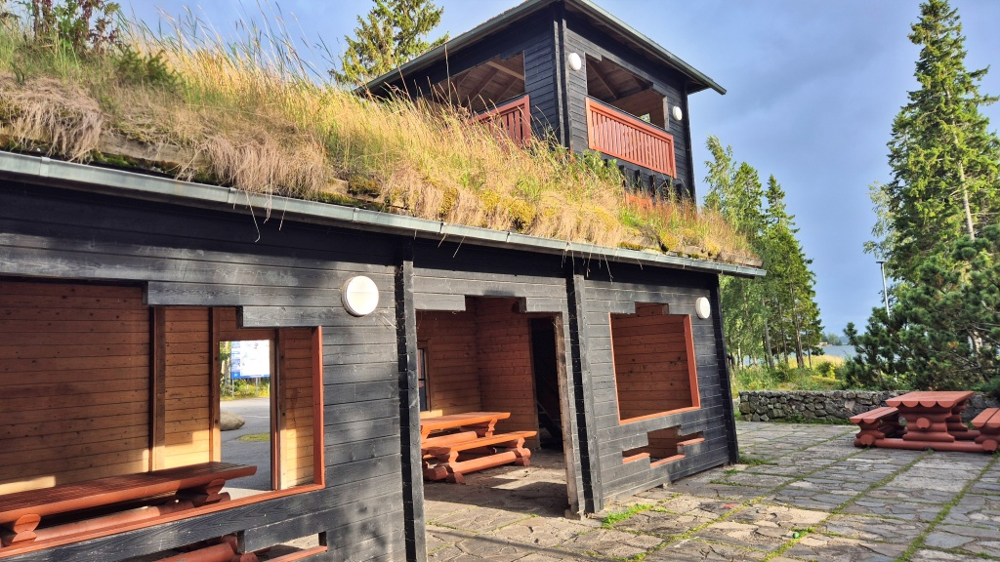

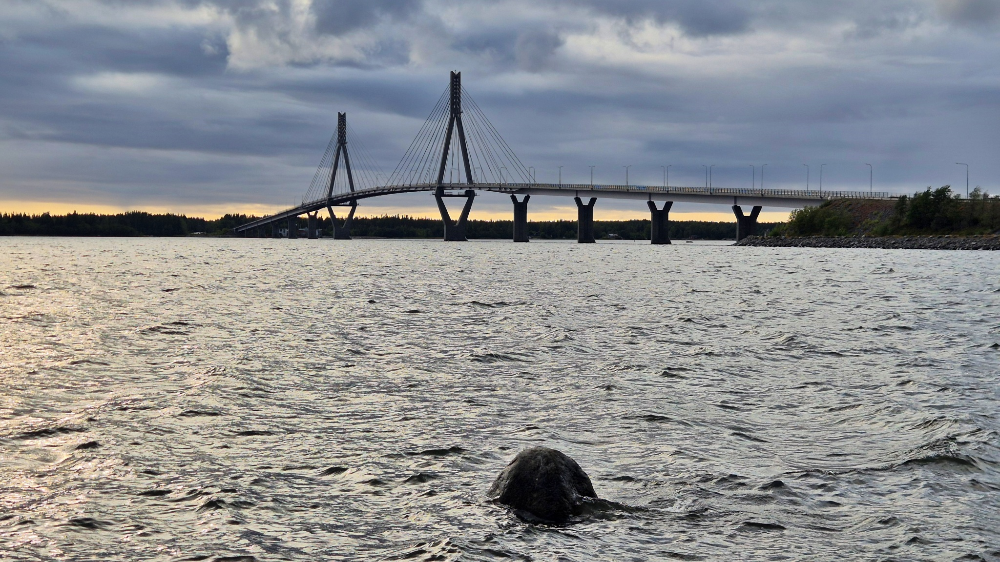

## På hemväg

Vi tog vår vanliga runda på väg hemåt, via Jungsund, Karperö och Smedsby. När jag körde förbi avtaget mot Botniahallen kom en motorcykelpolis körande ut därifrån. Antagligen var det samma polis som dagen före, den som nämndes i prologen. Denna gång hade jag inte för hög hastighet, men jag körde nog extra försiktigt i varje fall. Dels hade Blue trasiga blinkers och dels hade jag glömt körkortet hemma, så det var bäst att inte prata med polisen. Men han var nog mera ute efter mopedister och andra ungdomar och struntade i farbröder som åker gamla skrotmotorcyklar.

Jag tog en sväng förbi [Vasa flygplats](https://sv.wikipedia.org/wiki/Vasa_flygplats) och sedan fortsatte jag hem till verkstaden. Det blev 96 km körning av den lilla leveransturen.

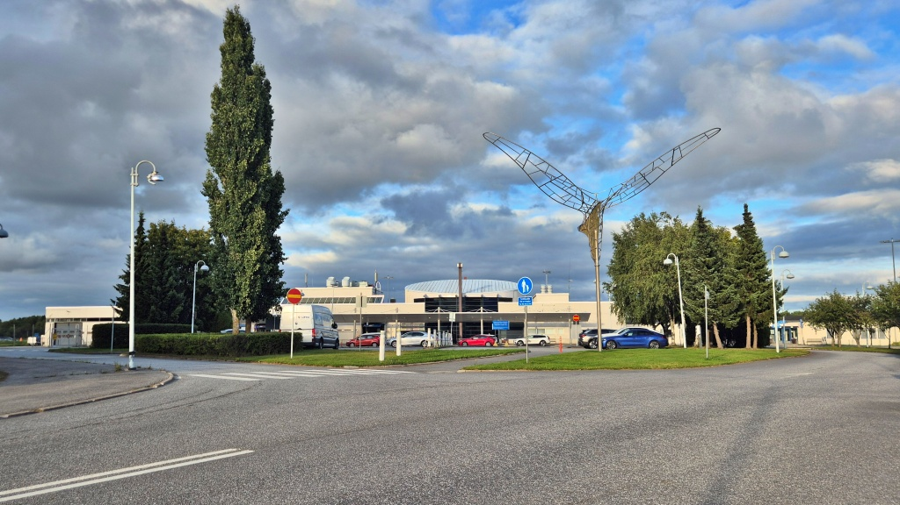

## Byta blinkers och annat smått och gott

Då var det dags att ta itu med kvällens mekande. Redan på söndag hade jag tvättat Lilla Blue och oljat kedjan. Därför var hon ganska ren och trevlig att jobba med. Jag försökte [reparera vänstra bakblinkljuset](../2026-06-24-blinker/) i juni. Reparationen höll ett tag, men det började strula igen under min resa mot sydost. Nu har blinkersen helt slutat fungera. Så nu har jag beslutat att montera nya blinkers där bak. Inget lödande och jox denna gång; nu har jag skaffat lämpliga rundstifthylsor.

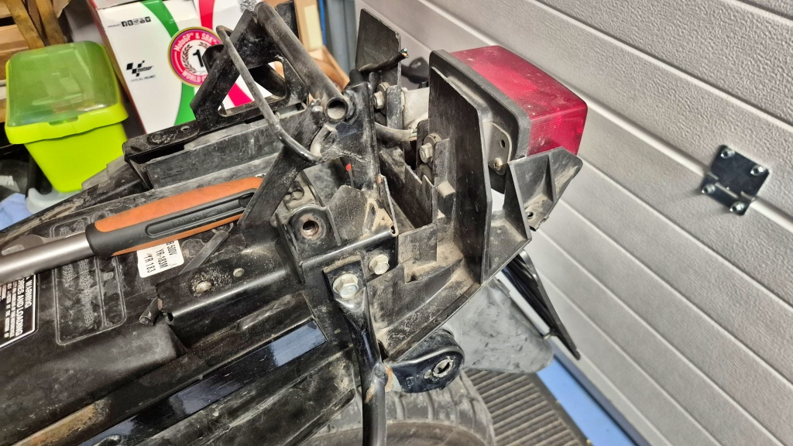

De inhandlade blinkersljusen från Motonet var olika för höger och vänster. Men då jag monterade enligt anvisning hamnade det lilla dräneringshålet uppåt. Så ska det väl inte vara? Jag bytte därför sida på dem så att hålet kommer nedåt. Jag kunde inte se några andra skillnader, och jag tror inte att ljusbilden är anpassad för höger och vänster. Så antingen är det någon finess med dräneringshålet som jag inte förstår (ska det vara uppåt?), eller så har dessa no-brand-blinkers helt enkelt packats fel.

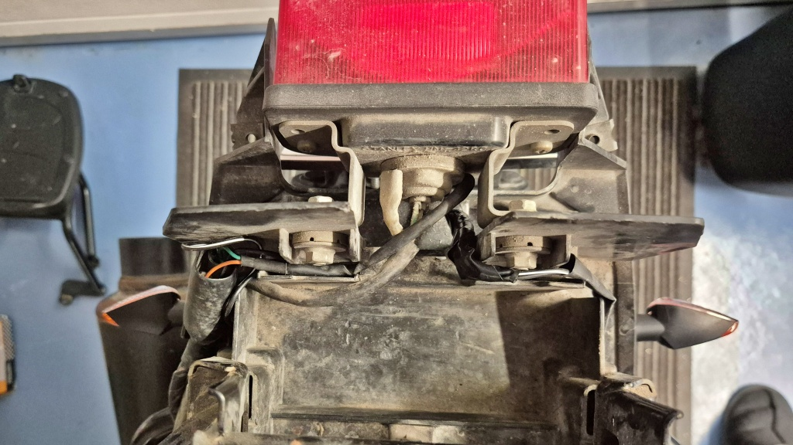

Jag köpte ganska små blinkers, betydligt mindre än de gamla. De gamla stack ut så långt att de böjdes när jag använde sadelväskorna. Jag hoppas att det blir mindre problem med de nya. Tyvärr ger kortare blinkers en sämre ljusbild bakåt, och andra trafikanter får svårare att se åt vilket håll jag tänker svänga. Men åtminstone är mellanrummet mellan ljusen fortfarande rejält över det lagstadgade minimimåttet på 18 cm.

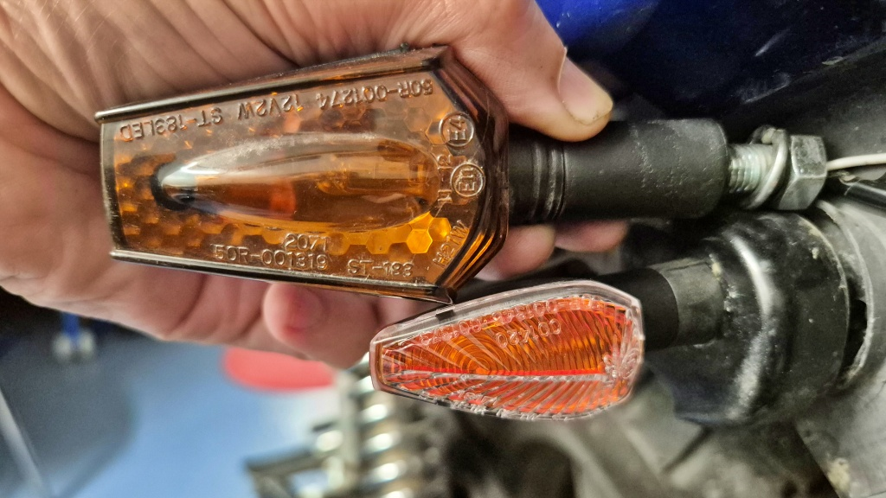

I övrigt gick bytet ganska smärtfritt. Nu hoppas jag på problemfritt signalerande under många kilometer framöver.

När hojen ändå stod i garaget passade jag på att göra diverse småjusteringar. Bland annat sänkte jag framlampans ljusstråle en aning; jag har märkt att den lyser ganska högt.
