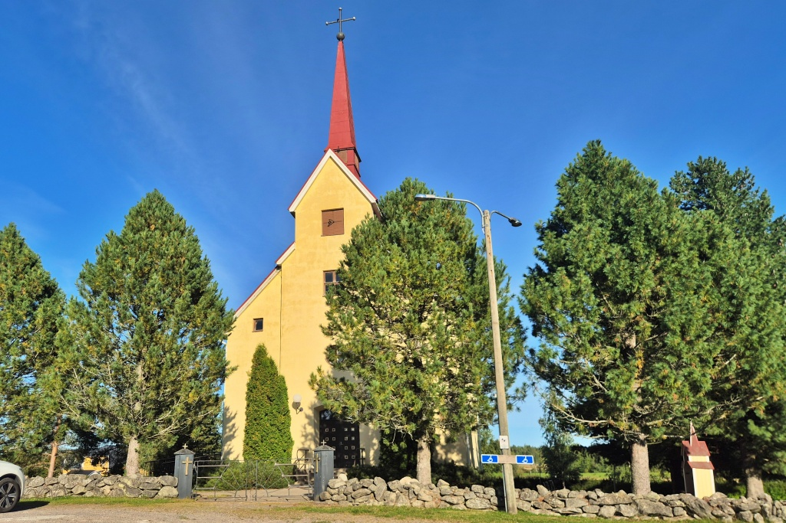
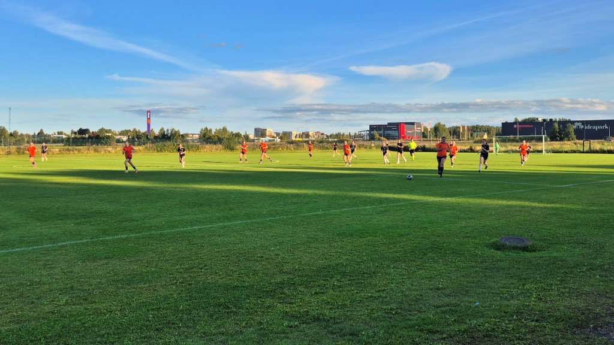
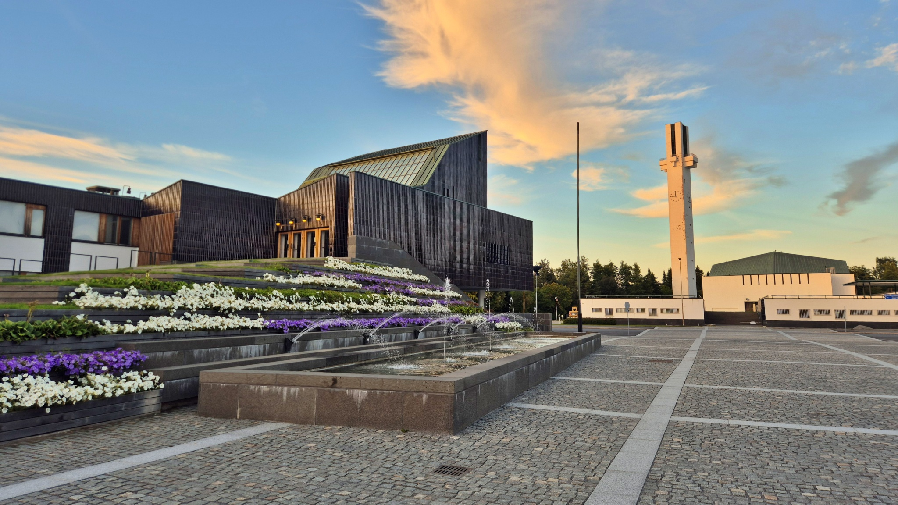
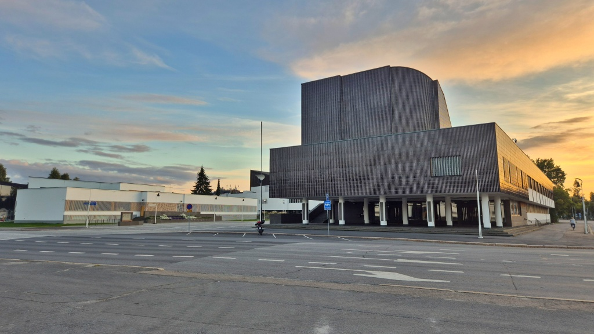
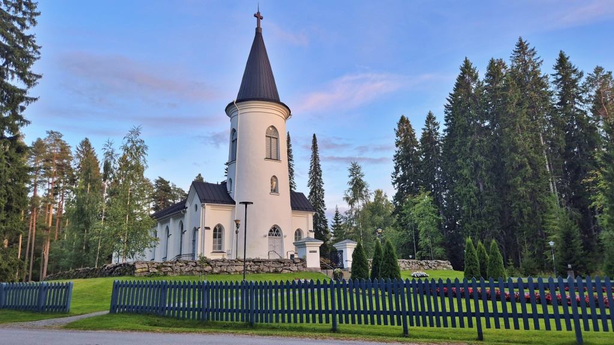
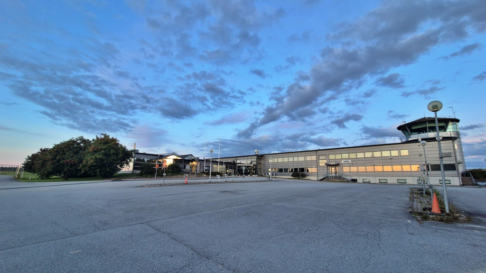
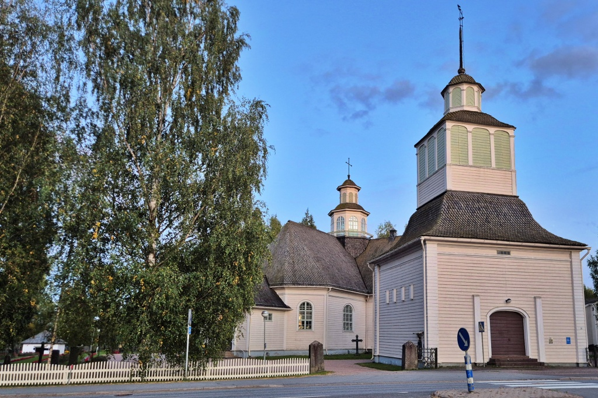
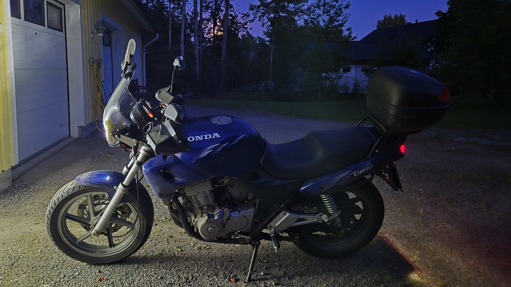

# Fotbollsmatch och kvällstur

Jag åkte till Seinäjoki för att titta på dotterns fotbollsmatch och passade samtidigt på att ta en kort extra tur genom Seinäjoki och Ilmola (fi: Ilmajoki). Denna resa bjöd även på lite av Unescos världsarv genom [Aaltocentret](https://sv.wikipedia.org/wiki/Aaltocentret) i Seinäjoki, en del av det nyligen godkända världsarvsobjektet [Aalto Works](https://sv.wikipedia.org/wiki/Aalto_Works).

<!--more-->

På väg till Seinäjoki lyckades jag hålla mig bort från stora vägen nästan helt och hållet. Först längs Kyro älv till Ylistaro. Här kom det som en liten besvikelse att vägen hade fått diverse lappningar. Visserligen var vägen rätt hålig och ojämn tidigare, men åtminstone med mc var det lättare att undvika de gamla ojämnheterna än de nya lapparna. Nu är det inte alls lika trevligt att köra denna väg längre.

Från Ylistaro följde jag nog stora vägen mot Lappo en bit, innan jag svängde av mot Kitinoja. Sedan genom byn och rakt över stora vägen mot Munakka och Ilmola. Från den vägen tog jag sedan av över Kyro älv mot Seinäjokibyarna Aunes och Niemistö. Helt nya ställen för mig. Det blev en kort bit på grus, men sedan åter asfalt in till Seinäjoki city. Den vägen går i tunnel under väg 67.

Matchen tog kanske lite längre än jag tänkt mig. När det var dags att åka vidare började det redan skymma. Jag beslöt ändå att ta turen genom Seinäjoki centrum och Ilmola, väl medveten om att det skulle betyda att det skulle vara mörkt innan jag var hemma.

Nog har jag ju besökt Seinäjoki en eller annan gång, men faktiskt aldrig förirrat mig till stadens förvaltningscentrum, det så kallade [Aaltocentret](https://sv.wikipedia.org/wiki/Aaltocentret). Här finns stadshus, statens ämbetsverk, bibliotek, teater och, kanske allra mest känt, kyrkan [Korset på slätten](https://sv.wikipedia.org/wiki/Korset_p%C3%A5_sl%C3%A4tten) (fi: Lakeuden risti). Både byggnaderna och området i sig självt är ritade och planerade av Alvar Aalto. Visst är det något speciellt med Aaltos byggnader. Trots att de är ganska enkla och strama är de estetiskt tilltalande. Hela detta Aaltocenter är alltså nu en del av Unescos världsarv [Aalto Works](https://sv.wikipedia.org/wiki/Aalto_Works).

.")

Från centrum fortsatte jag rakt söderut genom stadsdelen Törnävä ut till [Seinäjoki flygplats](https://sv.wikipedia.org/wiki/Sein%C3%A4joki_flygplats). Inga reguljärflyg trafikerar längre denna flygplats, knappast heller några charterflyg. Själva byggnaderna verkar vara i bruk hos Seinäjokis yrkesutbildningsenhet Sedu.

Från flygplatsen vände jag västerut mot Ilmola. Nu började det redan vara rejäl skymning. Ursprungligen hade jag tänkt åka hem via Koskenkorva och Jurva, men den tanken slopade jag nu och åkte istället hem längs stora vägen via Laihela.

Det var nog rätt mörkt när jag kom hem. Månen lyste bakom träden. En spännande fotbollsmatch och 202 km körning blev det denna kväll.

