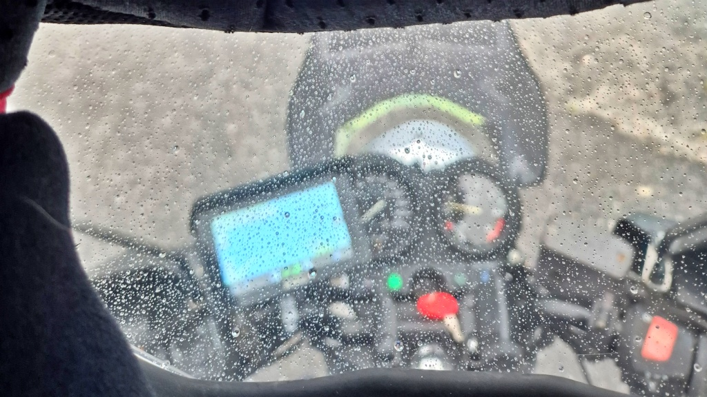
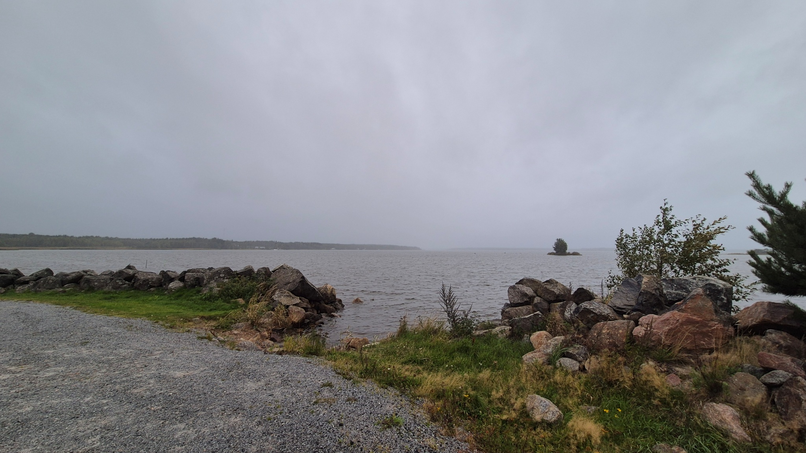

# Måndagsbommen och regntur

Orienteringsträning igen. Precis när jag började köra hemåt efter orienteringen började det regna. Trots regnet kunde jag inte låta bli att köra en liten extra runda.

<!--more-->

Egentligen inte så mycket att berätta. Orienteringen i Långåminne gick dels uselt, dels bra. Det usla i det hela var en sträckning i vaden. Jag sträckte vaden förra gången jag var och orienterade, för tre veckor sedan. Nu tänkte jag att vaden skulle vara återställd. Jag startade och det kändes jättebra att röra på sig igen. Sedan efter knappt 100 meter knäckte det till i vadmuskeln igen och så var smärtan tillbaka. Det var nog tyvärr mitt sista orienteringspass för i år, nu väntar minst en månads vila och sedan är det slut på säsongen.

Det goda i det hela då? Nå, jag promenerade ändå genom hela banan. Och gick i stort sett rakt på alla kontroller (en liten bom på en minut eller så). Dels var banan väldigt lätt, dels kanske man hinner läsa kartan lite bättre när man inte håller fart.

Det regnade inte så länge jag var i skogen. Precis när jag satte mig på hojen och åkte iväg började regnet. Inget hårt regn, men ett lugnt ihållande stril. Nu kunde jag ju ha vänt hemåt den kortaste vägen. Men så blev det ändå inte. Kanske är det något slags abstinensbesvär eller kanske är det någon liten felkoppling någonstans, men det blev en kort extra tur trots regnet. Riktigt skönt var det faktiskt - rätt varmt (kring +15°C) och mina körkläder klarade gott av en stund regnväder. Det blev en tur via Kråkbacken, Havras och Kyrkbacken i Malax och sedan ut till Åminne.

