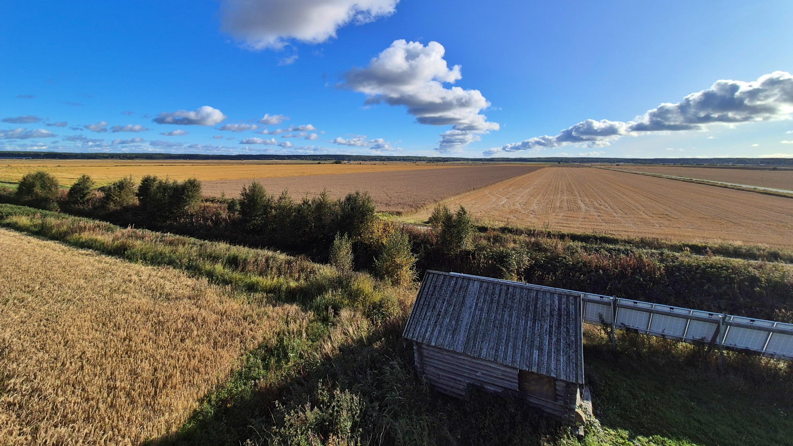
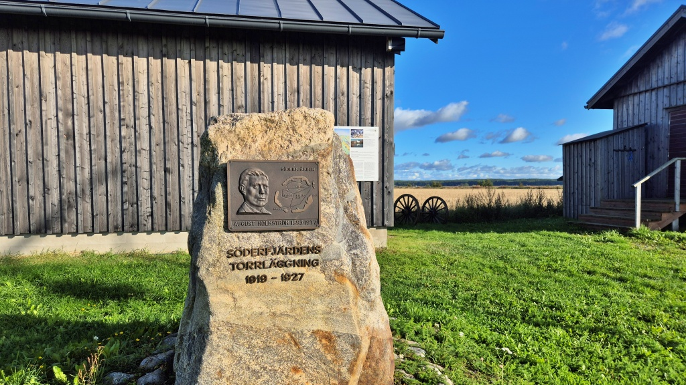
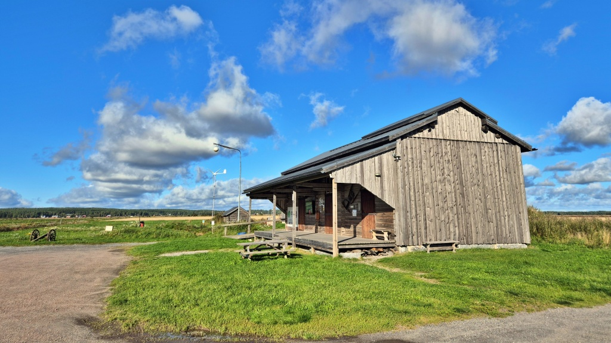
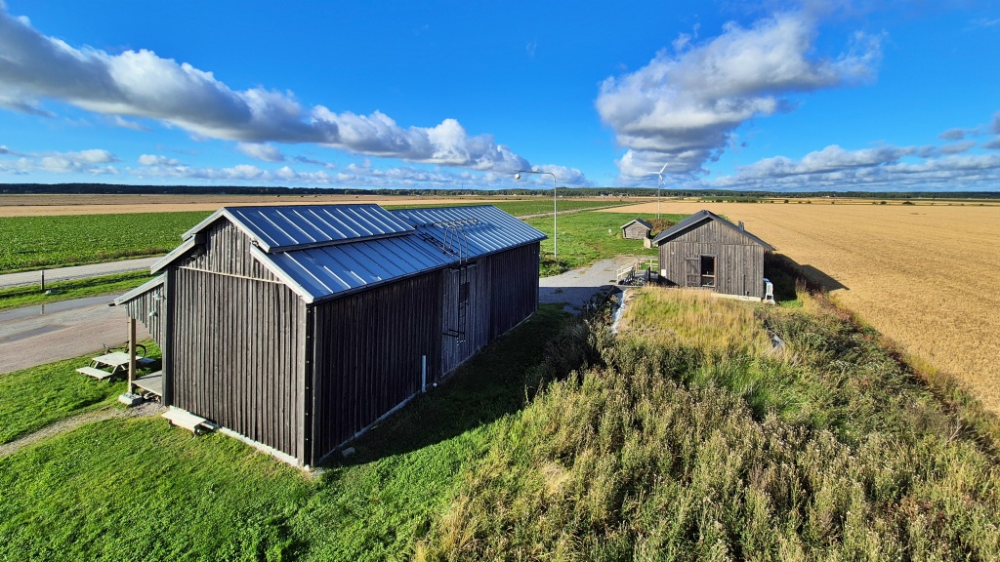
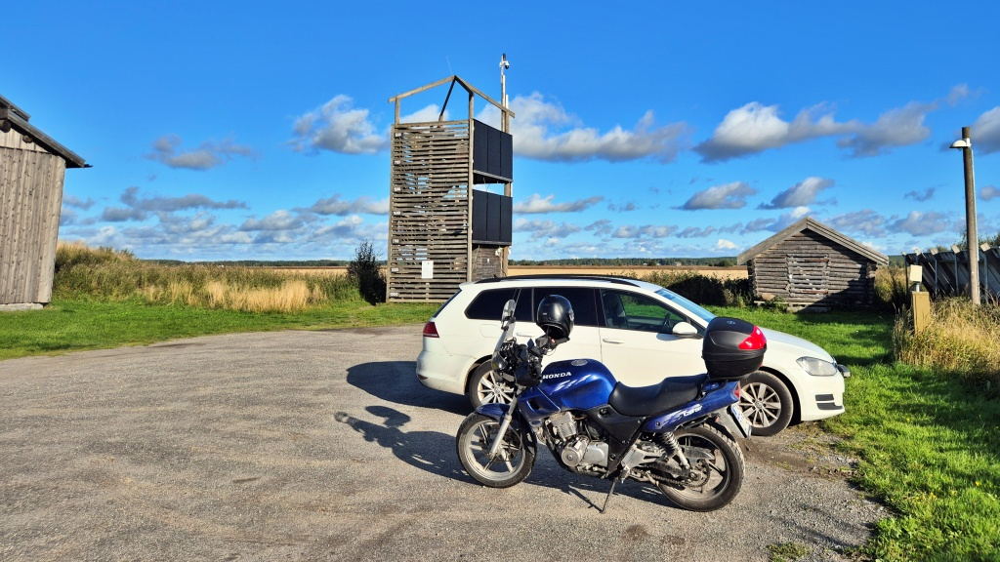
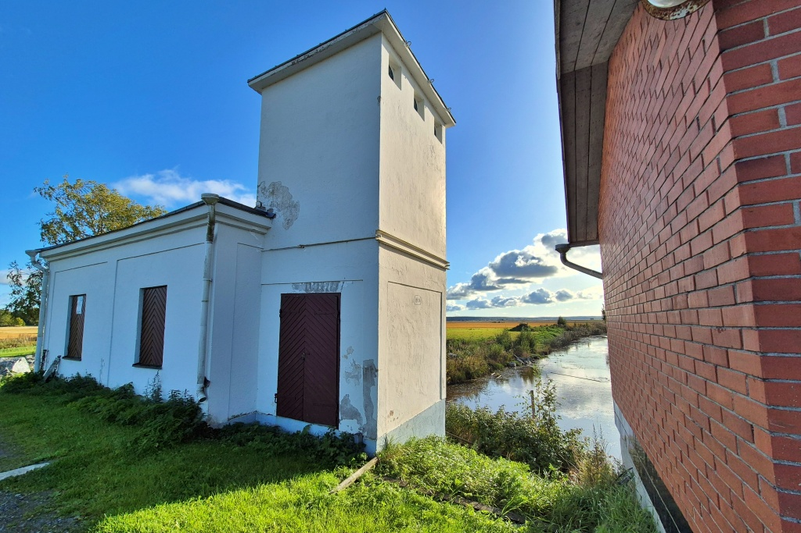
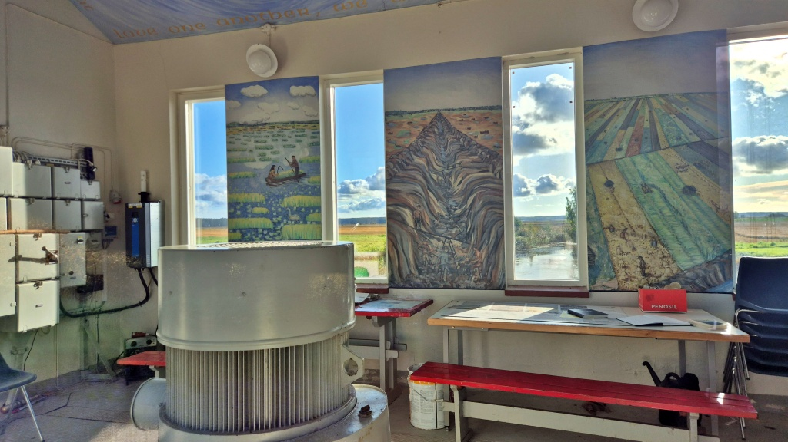
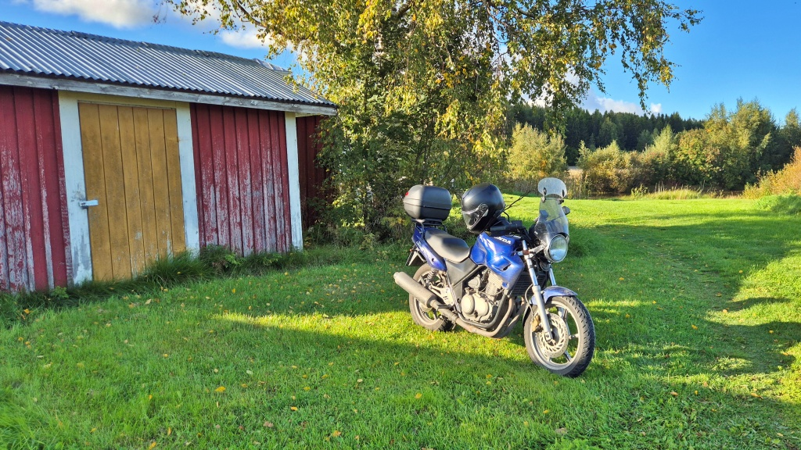
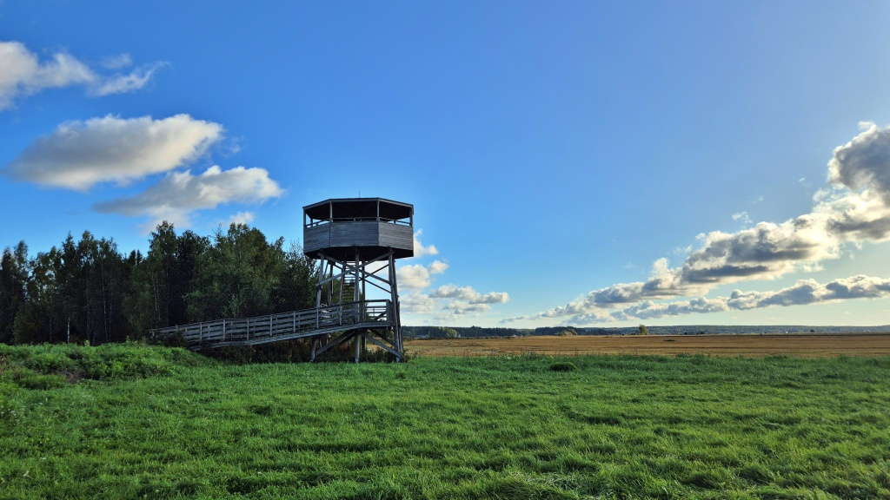
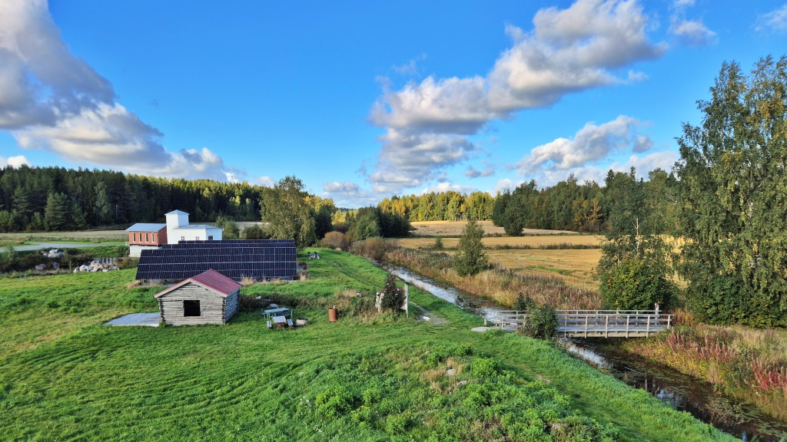

# En kort kvällstur efter jobbet

Det var fint väder, så jag passade på att ta en kort kvällstur efter jobbet. Vi körde ut till [Meteorian](https://meteoria.fi/sv/), mitt på [Söderfjärden](https://sv.wikipedia.org/wiki/S%C3%B6derfj%C3%A4rden), och sedan till pumpstationen i Munsmo.

<!--more-->

Söderfjärden är en meteoritkrater som bildades när en asteroid slog ner här för ungefär 520 miljoner år sedan. Kratern är i dag omkring fem till sex kilometer bred och har en nästan cirkelformad utbredning. För drygt hundra år sedan var den ännu en grund havsvik, men nu breder åkrarna ut sig över den gamla kraterbottnen.

Torrläggningen av Söderfjärden pågick 1919–1927 och var den största dräneringen i Nordeuropa på sin tid. Med spadar och handkraft grävdes vall, bassäng, diken och kanaler, och den första pumpstationen byggdes. Pumparna kunde startas under vårfloden 1926, och året därpå var arbetet klart. Då hade den öppna sjön förvandlats till 1 430 hektar ny odlingsmark.

### Meteorian

Meteorian är ett besökscentrum som öppnade 2008 mitt på Söderfjärden. Här finns utställningar om platsens och jordens historia, ett astronomiskt observatorium och ett fågeltorn med utomhusutställningar. Centret drivs av Meteoria-sektionen inom Sundom bygdeförening, medan observatoriet sköts av Vasa Andromeda.

### Söderfjärdens pumpstation

Det nya pumphuset i rött tegel byggdes 1964. Där samsas de stora eldrivna pumparna med konstverk. Eivor Holm från Solf, då 16 år, målade tre väggmålningar som skildrar våtmarkslandet på 1800-talet, torrläggningen på 1920-talet och kornboden på 1960-talet. Senare har byggnaden fått fler konstverk av lokala konstnärer, bland andra Paula Blåfield, Tapani Tammenpää, Nils Nygren, Lars Nedergård och Kaj Smeds.

