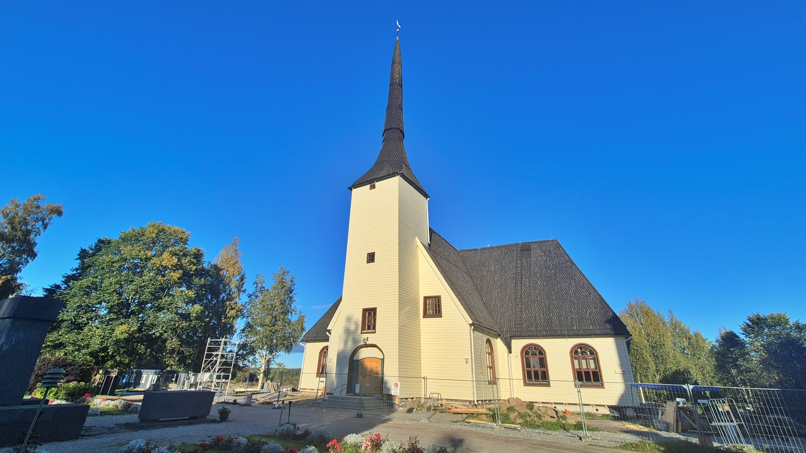
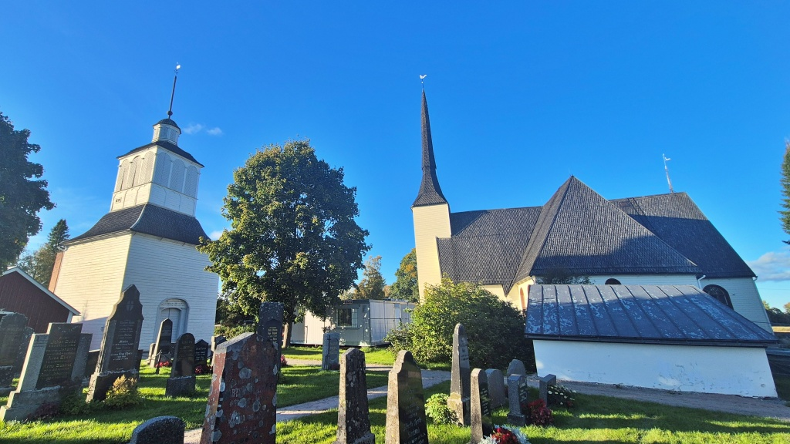
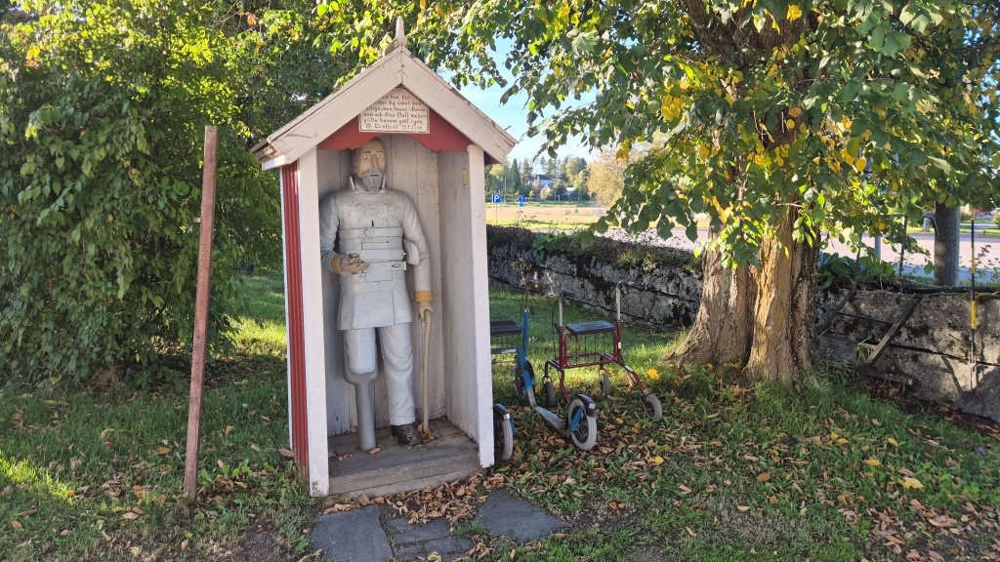
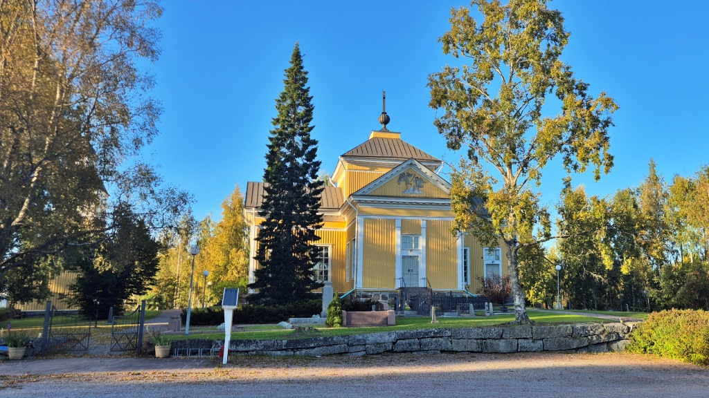
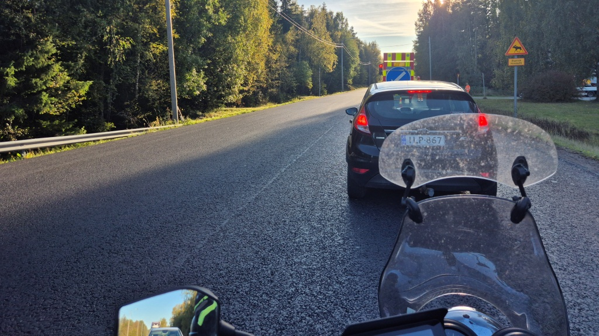

# Kvällstur inför fotbollsmatch

Dottern hade glömt lite utrustning hemma, så jag fick föra grejerna till uppvärmningen inför matchen. Istället för att vänta en dryg timme på att matchen skall börja, åkte jag på en liten tur. Det blev en kort bit längs Kyro älv upp till Lillkyro, sedan till Vörå och vidare till Maxmo. Frågan var bara om jag skulle hinna tillbaks innan matchen började?

<!--more-->

Vädret var vackert, kring +15°C och soligt. Vägen som går på norra sidan av Kyro älv har länge varit min favorit - en vacker väg som är rätt nära, det räcker med en timme för att ta en kort tur. Tyvärr blir beläggningen allt sämre med tiden, det blir allt jobbigare att styra mellan gropar och lappningar. I samma skick är vägen från Lillkyro upp till Vörå - ännu går det att åka, men för varje månad som går känns det som att fler ojämnheter stiger upp ur asfalten. Men som sagt, i vackert väder duger det för mig.

Vid [Vörå kyrka](https://sv.wikipedia.org/wiki/V%C3%B6r%C3%A5_kyrka) tog jag ett kort stopp, dels för att fota kyrkan till min fotosamling, dels för att besöka några gravar. De håller som bäst på att renovera kyrkan. Bland annat har de målat om utsidan i en något annan nyans. Den nya gräddvita nyansen med bruna fönsterkarmar gör faktiskt att den inte alls liknar sitt forna själv. Den tidigare nyansen var mera gråvit.

Den äldsta delen av kyrkan uppfördes på 1620-talet, vilket gör den till den äldsta bevarade träkyrkan i Finland. Kyrkan förstorades på 1770-talet och har också efter det byggts om och renoverats flera gånger. Och nu blir den alltså åter renoverad inför 400-årsjubileet som skall firas i oktober.

Fattiggubben står intill kyrkogårdsporten. Lägg också märke till den lilla järnstegen som leder över kyrkogårdsmuren. Nu leder stegen rakt in i ett träd, men jag minns att som barn var det roligt att klättra över den (det finns åtminstone en till på ett annat ställe). Jag är inte riktigt säker på varför dessa stegar byggdes. Traditionen säger att lik efter personer som begått självmord inte fick bäras genom själva kyrkogårdsporten utan måste fraktas över muren. Men kanske den riktiga orsaken ändå var att det var lättare att klättra över muren än att öppna en tung port. Och portarna till kyrkogården måste hållas stängda för att hålla betande boskap på utsidan.

Från Vörå åkte jag sedan vidare genom Lotlax ut till riksvägen i Palvis och sedan söderut mot Maxmo. Jag tog en sväng via [Maxmo kyrka](https://sv.wikipedia.org/wiki/Maxmo_kyrka) och fotade den också. Orgeln i kyrkan är för övrigt byggd av [Hans Heinrich](https://fi.wikipedia.org/wiki/Hans_Heinrich) (fi), som hade sin orgelfabrik just precis i Maxmo. Heinrich lade ner orgelfabriken år 2009 och flyttade till annan ort, men donerade det orgelmuseum han byggt upp till Maxmo Hembygdsförening.

Orgelmuseet finns vid [Klemetsgårdarna](https://maxmo.sou.fi/sv/klemetsgardarna/). Tyvärr är orgelutställningen bara öppen enligt beställning, så det kan vara lite knepigt att komma sig dit och kika. Klemetsgårdarna som helhet skulle i varje fall säkert vara värt ett besök. Nu är det stängt för denna säsong, men kanske nästa år?

Sedan var det dags att ta sikte på fotbollsmatchen i Korsnäståget, Vasa. Solen låg nu så pass lågt att det var jobbigt att köra i den ungefärliga riktningen söder. Annars skulle jag hemskt gärna tagit vägen via Vassor by, men vägen är smal och krokig, så med solen i ögonen är det inget större nöje. Det fick bli stora vägen istället.

Jag räknade att jag skulle hinna precis i tid till fotbollsmatchen. Men vid Tesses Café i Vassor stötte jag på ett hinder jag inte tagit i beaktande. Vägbeläggningsarbete på gång. Jag var tvungen att vänta på en följebil för att komma vidare. Det tog förvånansvärt länge, totalt blev det nog en försening på närmare tio minuter. Så jag missade inledningen av matchen.

Hösten är definitivt här. Eftersom det var en riktigt fin kväll klarade jag mig bra utan vinterfoder i körstället. Lite åt svalt var det att köra när vägen gick i skuggan av omgivande skog, men jag började aldrig frysa. Däremot var det ordentligt svalt under matchen, då åskådarläktaren hamnade i skuggan. Jag satt i full mc-mundering (ja, förutom hjälmen då), inklusive handskar, och det kändes ändå kyligt. Hemfärden var sedan så kort att jag inte hann börja frysa, men mycket längre hade inte gått. Det var väl kring +7°C när jag kom hem. Så nu är det nog så småningom dags att kränga på vinterfoder i både körbyxor och jacka.

Dagens tur blev 112 km, det var en fin tur. Jag leker med tanken på en lite längre dagstur ännu i höst, men blir lite tveksam. Dagarna blir så korta, i båda ändarna. Trots att vi har för årstiden fantastiskt väder, kryper termometern sakta men säkert neråt. En dagstur i under +10°C börjar redan bli utmanande. Dessutom går inte Blue riktigt bra. Dels är det fortfarande ganska mycket vibrationer (som jag inte tror beror på däcken). Dels känns gaspådraget fortfarande lite "motvilligt" - något är inte helt som det skall. Det blir nog att rengöra förgasare igen i vinter. Nå, vi får se om det blir någon till långtur. Det kräver om inte annat att det skall komma en regnfri och vacker lördag - någon annan tid finns inte att tillgå.