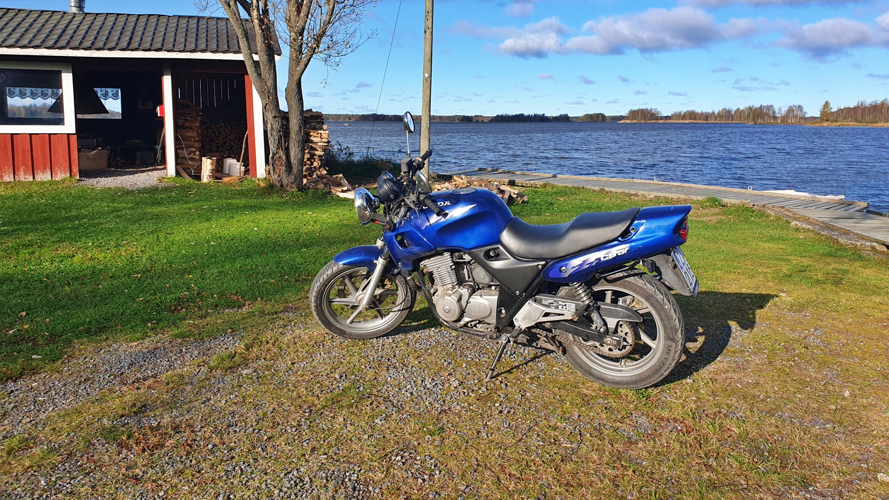
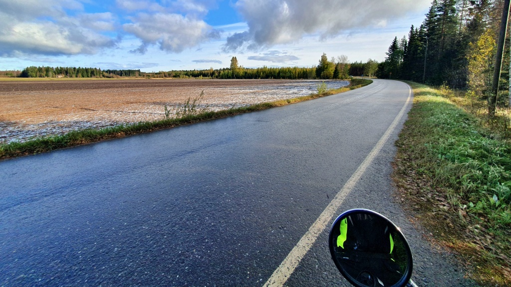
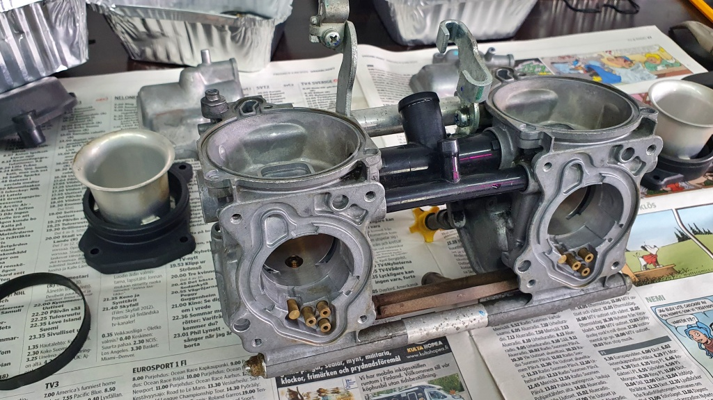
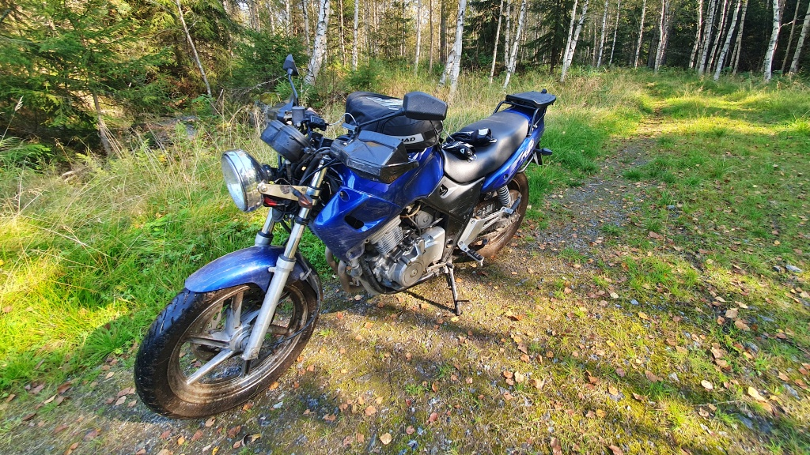
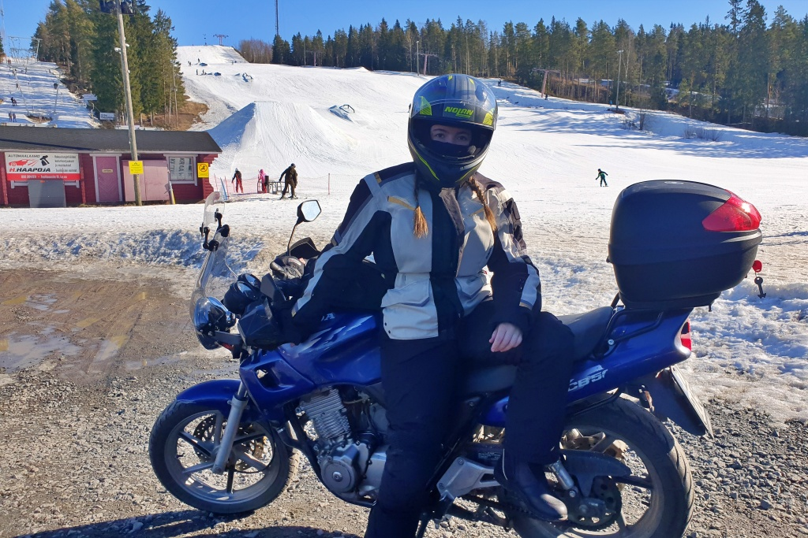
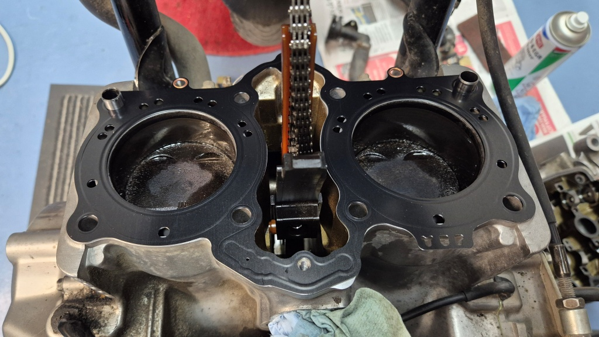
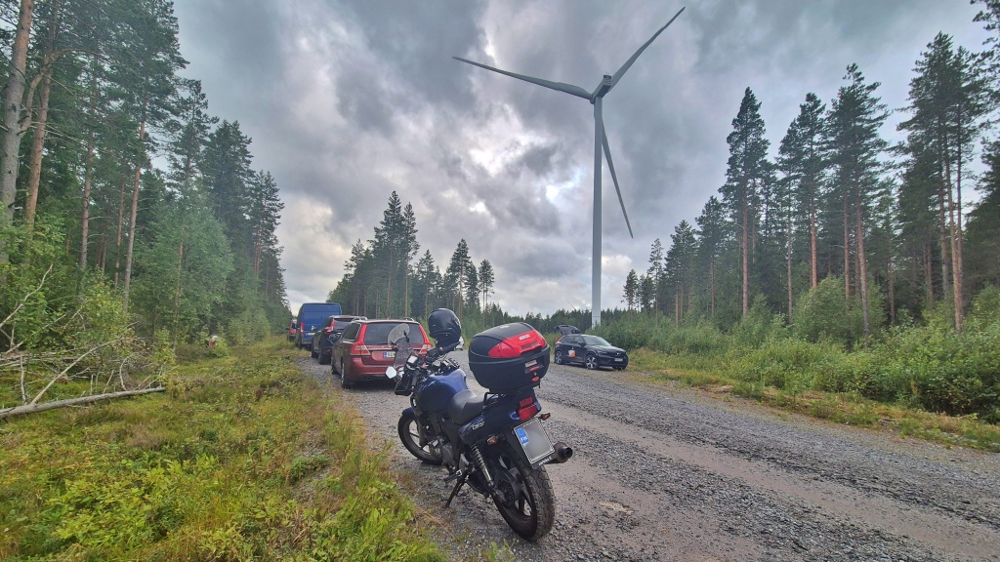
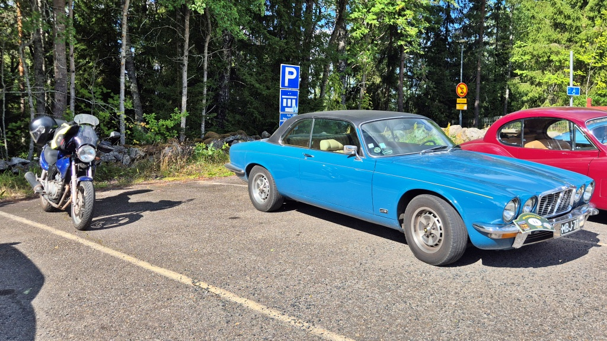
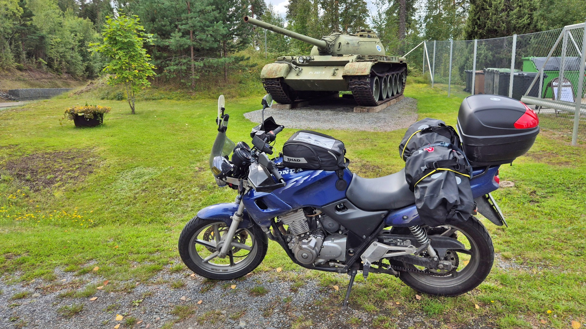

# En liten tillbakablick över 30 000 km mc-åkning

Någonstans längs Velkuantie på väg från Villnäs (fi: Askainen) mot Merimasku, nära kommungränsen mellan Masku och Nådendal, nådde Lilla Blue och jag en milstolpe. Vi har nu kört över 30 000 km tillsammans. På ett ungefär åtminstone. Mätarställningen vid dagens slut låg på 98 749 km. Det är nu vår fjärde körsäsong tillsammans, även om den första säsongen bara var drygt två veckor lång.

<!--more-->

### Säsong 2023

Jag köpte Lilla Blue den 30 september 2023, dagen efter att jag kört upp och fått mitt tillfälliga A-körkort. Sedan var vi ute så ofta jag bara hade möjlighet. Det blev en del körning i kallt väder, en gång till och med i snöslask. Vi hann uppleva köldstela fingrar, ösregn och mörkerkörning. Årets sista åktur blev den 14 oktober, därefter började det snöa. Första säsongen hann vi köra 1 030 km tillsammans.

### Säsong 2024

Säsongen 2024 inleddes sent, först i maj, eftersom allt skruvande jag hade planerat göra under vintern givetvis sköts upp tills solen började lysa och den bara asfalten började locka. Bland annat justerade jag ventilspelet och rengjorde förgasarna. Vi gjorde vår allra första långtur i början av juni, en [tvådagars tripp till Esbo](../2024-06-09-helsingfors/). Sedan blev det mest kortare turer och vardagskörning resten av säsongen. En lite längre tripp blev det, upp till [Småbönders](../2024-08-17-smabonders/) och tillbaka. Säsongen avslutades när det började bli alltför klottigt, så sent som den första november, efter 8 343 körda kilometer.

### Säsong 2025

Säsongen därpå började rekordtidigt. Asfalten torkade upp fast det låg snö kvar i drivorna. Första turen tog vi i mitten av mars. Under den andra åkturen hängde dottern med på en tur till [Simpsiö](../2025-03-22-simpsio/), där vi stod och såg på när skidåkarna susade ned för backen. Sedan fick jag själv se att våren inte kommer lika tidigt till [trakten kring Lappajärvi](../2025-03-23-tour-lappajarvi/) som till kusten - isiga och spåriga vägar var läskiga. En 350 km lång tur i mars är i varje fall inte illa. Under våren fick jag analysera och åtgärda [elproblem](../2025-05-23-charger/). Det blev flera dagsturer på mellan 400 och 700 km, bland annat till [Raumo](../2025-05-30-raumo/). Sommarens stora äventyr blev tredagarsturen till [Koli](../2025-07-07-osterled1/), [Virmajärvi](../2025-07-08-osterled2/) och [Tikkakoski](../2025-07-09-osterled3/) i början av juli, med tältövernattning och allt. I slutet av juli gjorde vi sedan vårt försök på [Iron Butt](../2025-07-31-ironbutt/), då vi körde 1 836 km på ett dygn. En sista lång dagstur till [Tammerfors](../2025-09-06-tour-tammerfors/) hann vi med i början av september. Sedan avslutades säsongen abrupt och snopet med motorhaveri den 11 september. Kylvätska rann ut på garagegolvet och det visade sig behövas [ny topplockspackning och vattenpump](../2026-03-29-topplockspackning/). År 2025 körde vi hela 11 103 km, ett rekord som antagligen står sig åtminstone tills det finns tid att göra en tur i utlandet.

### Säsong 2026

Precis som tidigare år var det svårt att få meckandet gjort under vintern, så även körsäsongen 2026 inleddes med skruvande på våren. Topplockspackningen och vattenpumpen var bytta i slutet av mars, men [första turen](../2026-04-12-sommarosund/) blev först den 12 april - då fanns inte mycket is och snö längre att hitta. Överlag blev det nästan mer meckande än körande i början av säsongen, bland annat med däck, blinkers, värmehandtag och framgafflar. De flesta åkturerna gick ut på att köra till [orienteringsträning](../2026-05-04-mandagsbommen/) och sedan åka en kort sväng efteråt. I mitten av juli bar det i varje fall av på denna sommars stora äventyr: 2 903 km under fyra dygn med tältövernattning i sydöstra Finland via bland annat [Nyslott](../2026-07-13-sydost1/), [Villmanstrand](../2026-07-14-sydost2/), [Fredrikshamn](../2026-07-15-sydost3/) och [Puumala](../2026-07-16-sydost4/). I början av augusti gjorde vi en lång dagstur genom [Egentliga Tavastland och Birkaland](../2026-08-08-natur-glas-bilar/). I slutet av augusti blev det en tredagarstur ner till Helsingfors, denna gång genom [Päijänne-Tavastland](../2026-08-20-hfors1/), [Nyland](../2026-08-21-hfors2/) och [Egentliga Tavastland](../2026-08-22-hfors3/). Årets sista långa dagstur blev nog turen till [Åbo](../2026-09-19-abo/), men hela säsongen är inte slut ännu. Det finns vissa planer, men de är ganska väderberoende så här sent på hösten. Hittills i år har vi kört 9 936 km, så 10 000 km skall vi nog nå upp till.

### Projekt Finland/308 och fortsättningen

Våren 2025 inledde jag projektet [Finland/308](/finland308/), att tillsammans med Lilla Blue besöka alla Finlands kommuner. Vi började inte helt från noll utan räknade nog de kommuner vi redan hade besökt under 2024. Under 2025 räknade vi varje kommun vi ens hade kört en meter i, men från och med 2026 justerade jag reglerna så att jag skall ha ett foto av något igenkännbart från varje kommun som vi har besökt. I praktiken är det lättaste objektet att fota en kyrka, för varje kommun har minst en kyrka. Jag håller på att sammanställa en sida med foton av kyrkor, men den är inte riktigt klar för publicering ännu.

Med 98 749 km på mätaren börjar nog Lilla Blue med sin lilla 500 cc-motor räknas som en gamling. I vinter eller på våren väntar en genomgång av bromsarna, byte av styrlagret, rengöring av förgasarna med mera. Vi får hoppas att hon orkar genom en säsong till. Just nu går motorn inte riktigt bra, men kanske vi kan få ordning på det hela. Om man ser på saken med en gnutta realism kan det nog hända att vi inte kommer att hinna slutföra vårt Finland/308-projekt innan hennes pension väntar. För att slutföra projektet krävs ännu flera riktigt långa turer för att nå de sista kommunerna vi har kvar att besöka: från Åland till Hangö och från Karlö till Kuhmo, Kuopio, Rovaniemi och framför allt de allra nordligaste delarna av Lappland. Allt det hinner vi knappast med nästa sommar och inte heller får vi det inklämt på 10 000 km till.